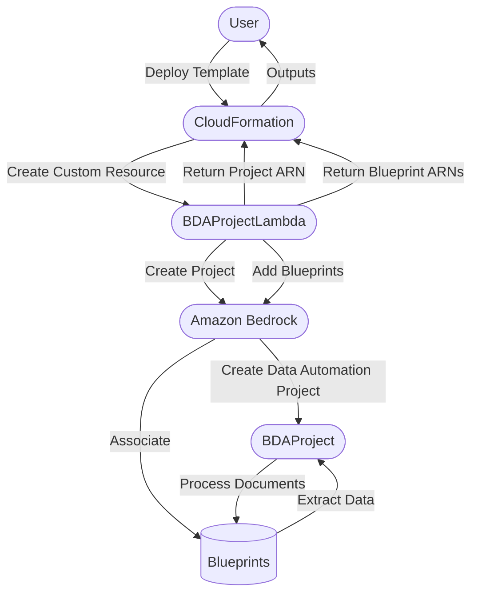

```mermaid
flowchart TD
    User([User])
    CFN([CloudFormation])
    BDALambda([BDAProjectLambda])
    BDAProject([BDAProject])
    Bedrock([Amazon Bedrock])
    Blueprints[(Blueprints)]
    
    User -->|Deploy Template| CFN
    CFN -->|Create Custom Resource| BDALambda
    BDALambda -->|Create Project| Bedrock
    BDALambda -->|Add Blueprints| Bedrock
    Bedrock -->|Create Data Automation Project| BDAProject
    Bedrock -->|Associate| Blueprints
    BDAProject -->|Process Documents| Blueprints
    Blueprints -->|Extract Data| BDAProject
    BDALambda -->|Return Project ARN| CFN
    BDALambda -->|Return Blueprint ARNs| CFN
    CFN -->|Outputs| User
```