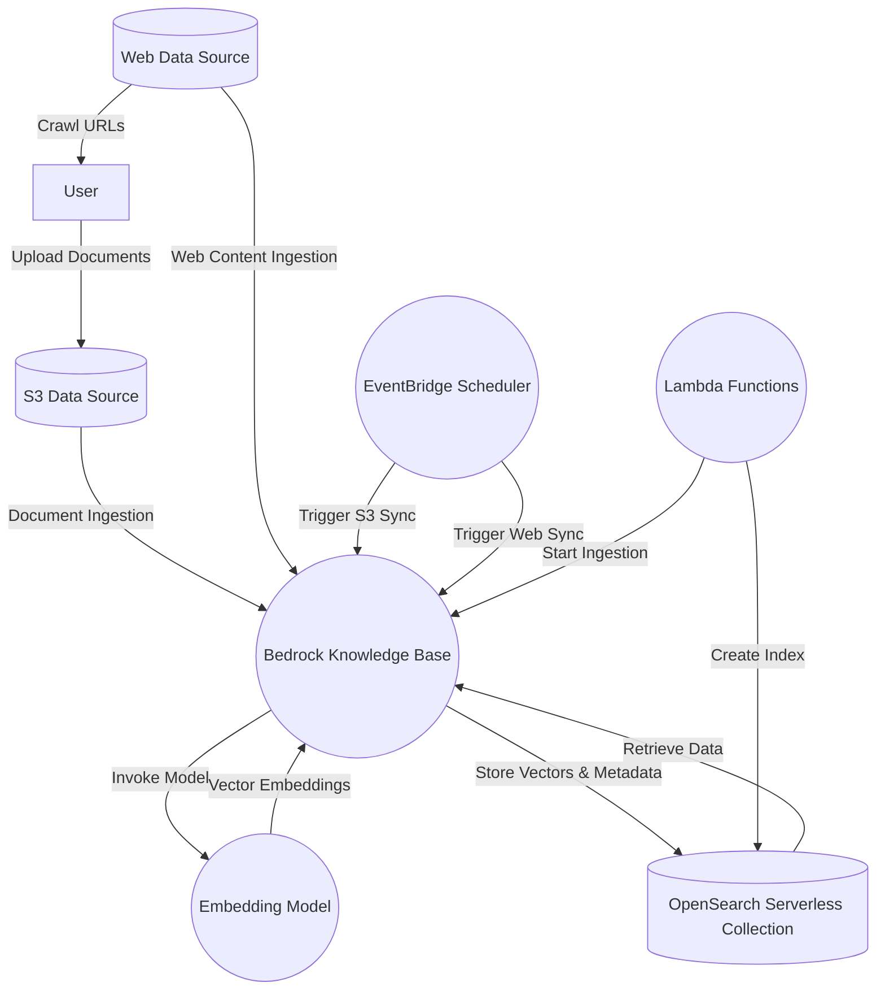

```mermaid
flowchart TD
    User[User]
    S3DS[(S3 Data Source)]
    WebDS[(Web Data Source)]
    BedrockKB((Bedrock Knowledge Base))
    OSS[(OpenSearch Serverless Collection)]
    EmbedModel((Embedding Model))
    Scheduler((EventBridge Scheduler))
    Lambda((Lambda Functions))
    
    User -->|Upload Documents| S3DS
    WebDS -->|Crawl URLs| User
    
    S3DS -->|Document Ingestion| BedrockKB
    WebDS -->|Web Content Ingestion| BedrockKB
    
    BedrockKB -->|Invoke Model| EmbedModel
    EmbedModel -->|Vector Embeddings| BedrockKB
    
    BedrockKB -->|Store Vectors & Metadata| OSS
    OSS -->|Retrieve Data| BedrockKB
    
    Scheduler -->|Trigger S3 Sync| BedrockKB
    Scheduler -->|Trigger Web Sync| BedrockKB
    
    Lambda -->|Create Index| OSS
    Lambda -->|Start Ingestion| BedrockKB
```