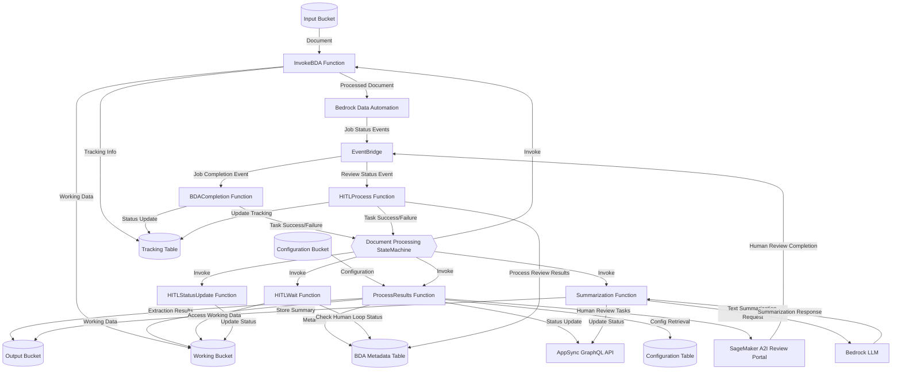

```mermaid
flowchart TD
    InputS3[(Input Bucket)]
    ConfigS3[(Configuration Bucket)]
    WorkingS3[(Working Bucket)]
    OutputS3[(Output Bucket)]
    TrackingDB[(Tracking Table)]
    ConfigDB[(Configuration Table)]
    BDAMetadataDB[(BDA Metadata Table)]
    
    DocProcessSM{{Document Processing StateMachine}}
    InvokeBDA[InvokeBDA Function]
    ProcessResults[ProcessResults Function]
    Summarization[Summarization Function]
    HITLWait[HITLWait Function]
    HITLStatusUpdate[HITLStatusUpdate Function]
    HITLProcess[HITLProcess Function]
    BDACompletion[BDACompletion Function]
    
    BedrockBDA[Bedrock Data Automation]
    BedrockLLM[Bedrock LLM]
    A2IPortal[SageMaker A2I Review Portal]
    AppSync[AppSync GraphQL API]
    EventBridge[EventBridge]
    
    InputS3 -->|Document| InvokeBDA
    ConfigS3 -->|Configuration| ProcessResults
    InvokeBDA -->|Processed Document| BedrockBDA
    InvokeBDA -->|Working Data| WorkingS3
    InvokeBDA -->|Tracking Info| TrackingDB
    
    BedrockBDA -->|Job Status Events| EventBridge
    EventBridge -->|Job Completion Event| BDACompletion
    BDACompletion -->|Status Update| TrackingDB
    BDACompletion -->|Task Success/Failure| DocProcessSM
    
    DocProcessSM -->|Invoke| InvokeBDA
    DocProcessSM -->|Invoke| ProcessResults
    DocProcessSM -->|Invoke| Summarization
    DocProcessSM -->|Invoke| HITLWait
    DocProcessSM -->|Invoke| HITLStatusUpdate
    
    ProcessResults -->|Extraction Results| OutputS3
    ProcessResults -->|Working Data| WorkingS3
    ProcessResults -->|Metadata| BDAMetadataDB
    ProcessResults -->|Status Update| AppSync
    ProcessResults -->|Config Retrieval| ConfigDB
    ProcessResults -->|Human Review Tasks| A2IPortal
    
    HITLWait -->|Check Human Loop Status| BDAMetadataDB
    HITLWait -->|Access Working Data| WorkingS3
    HITLStatusUpdate -->|Update Status| WorkingS3
    
    A2IPortal -->|Human Review Completion| EventBridge
    EventBridge -->|Review Status Event| HITLProcess
    HITLProcess -->|Process Review Results| BDAMetadataDB
    HITLProcess -->|Update Tracking| TrackingDB
    HITLProcess -->|Task Success/Failure| DocProcessSM
    
    Summarization -->|Text Summarization Request| BedrockLLM
    BedrockLLM -->|Summarization Response| Summarization
    Summarization -->|Store Summary| OutputS3
    Summarization -->|Update Status| AppSync
```