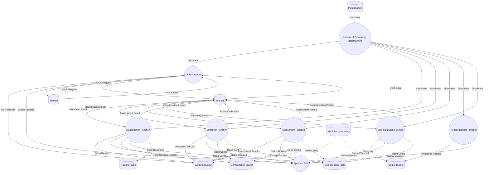

```mermaid
flowchart TD
    InputBucket[(Input Bucket)]
    ConfigBucket[(Configuration Bucket)]
    OutputBucket[(Output Bucket)]
    WorkingBucket[(Working Bucket)]
    ConfigTable[(Configuration Table)]
    TrackingTable[(Tracking Table)]
    
    AppSync((AppSync API))
    OCRFunction((OCR Function))
    ClassificationFunction((Classification Function))
    ExtractionFunction((Extraction Function))
    AssessmentFunction((Assessment Function))
    ProcessResultsFunction((Process Results Function))
    SummarizationFunction((Summarization Function))
    StateMachine((Document Processing StateMachine))
    
    Bedrock[(Bedrock)]
    Textract[(Textract)]
    KMS[(KMS Encryption Key)]
    
    InputBucket -->|Document| StateMachine
    StateMachine -->|Document| OCRFunction
    StateMachine -->|Document| ClassificationFunction
    StateMachine -->|Document| ExtractionFunction
    StateMachine -->|Document| AssessmentFunction
    StateMachine -->|Document| ProcessResultsFunction
    StateMachine -->|Document| SummarizationFunction
    
    OCRFunction -->|OCR Results| WorkingBucket
    OCRFunction -->|Status Updates| AppSync
    OCRFunction -->|OCR Request| Textract
    Textract -->|OCR Data| OCRFunction
    OCRFunction -->|OCR Request| Bedrock
    Bedrock -->|OCR Data| OCRFunction
    
    ClassificationFunction -->|Class Results| WorkingBucket
    ClassificationFunction -->|Status Updates| AppSync
    ClassificationFunction -->|Read Config| ConfigBucket
    ClassificationFunction -->|Read Config| ConfigTable
    ClassificationFunction -->|Classification Prompt| Bedrock
    Bedrock -->|Classification Result| ClassificationFunction
    ClassificationFunction -->|Track Document| TrackingTable
    
    ExtractionFunction -->|Extraction Results| WorkingBucket
    ExtractionFunction -->|Status Updates| AppSync
    ExtractionFunction -->|Read Config| ConfigBucket
    ExtractionFunction -->|Read Config| ConfigTable
    ExtractionFunction -->|Extraction Prompt| Bedrock
    Bedrock -->|Extraction Result| ExtractionFunction
    
    AssessmentFunction -->|Assessment Results| WorkingBucket
    AssessmentFunction -->|Status Updates| AppSync
    AssessmentFunction -->|Read Config| ConfigBucket
    AssessmentFunction -->|Read Config| ConfigTable
    AssessmentFunction -->|Assessment Prompt| Bedrock
    Bedrock -->|Assessment Result| AssessmentFunction
    
    ProcessResultsFunction -->|Processed Results| OutputBucket
    ProcessResultsFunction -->|Status Updates| AppSync
    
    SummarizationFunction -->|Summary| OutputBucket
    SummarizationFunction -->|Status Updates| AppSync
    SummarizationFunction -->|Read Config| ConfigTable
    SummarizationFunction -->|Summarization Prompt| Bedrock
    Bedrock -->|Summary Result| SummarizationFunction
    
    KMS -.->|Encrypt/Decrypt| WorkingBucket
    KMS -.->|Encrypt/Decrypt| OutputBucket
```