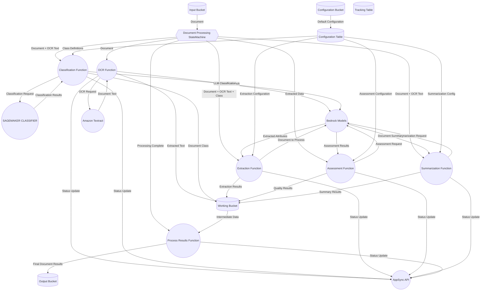

```mermaid
flowchart TD
    Input[(Input Bucket)]
    Working[(Working Bucket)]
    Output[(Output Bucket)]
    Config[(Configuration Bucket)]
    ConfigTable[(Configuration Table)]
    TrackingTable[(Tracking Table)]
    
    OCRFunction((OCR Function))
    ClassifyFunction((Classification Function))
    ExtractFunction((Extraction Function))
    AssessFunction((Assessment Function))
    SummarizeFunction((Summarization Function))
    ProcessResultsFunction((Process Results Function))
    
    SageMaker((SAGEMAKER CLASSIFIER))
    Bedrock((Bedrock Models))
    Textract((Amazon Textract))
    AppSync((AppSync API))
    
    StateMachine{{Document Processing StateMachine}}
    
    Input -->|Document| StateMachine
    StateMachine -->|Document| OCRFunction
    OCRFunction -->|Extracted Text| Working
    OCRFunction -->|OCR Request| Textract
    OCRFunction -->|OCR with Bedrock| Bedrock
    Textract -->|Document Text| OCRFunction
    OCRFunction -->|Status Update| AppSync
    
    StateMachine -->|Document + OCR Text| ClassifyFunction
    ClassifyFunction -->|Document Class| Working
    ClassifyFunction -->|Classification Request| SageMaker
    ClassifyFunction -->|LLM Classification| Bedrock
    ClassifyFunction -->|Status Update| AppSync
    SageMaker -->|Classification Results| ClassifyFunction
    ConfigTable -->|Class Definitions| ClassifyFunction
    
    StateMachine -->|Document + OCR Text + Class| ExtractFunction
    ExtractFunction -->|Document to Process| Bedrock
    Bedrock -->|Extracted Attributes| ExtractFunction
    ExtractFunction -->|Extraction Results| Working
    ExtractFunction -->|Status Update| AppSync
    ConfigTable -->|Extraction Configuration| ExtractFunction
    
    StateMachine -->|Extracted Data| AssessFunction
    AssessFunction -->|Assessment Request| Bedrock
    Bedrock -->|Assessment Results| AssessFunction
    AssessFunction -->|Quality Results| Working
    AssessFunction -->|Status Update| AppSync
    ConfigTable -->|Assessment Configuration| AssessFunction
    
    StateMachine -->|Document + OCR Text| SummarizeFunction
    SummarizeFunction -->|Summarization Request| Bedrock
    Bedrock -->|Document Summary| SummarizeFunction
    SummarizeFunction -->|Summary Results| Working
    SummarizeFunction -->|Status Update| AppSync
    ConfigTable -->|Summarization Config| SummarizeFunction
    
    StateMachine -->|Processing Complete| ProcessResultsFunction
    ProcessResultsFunction -->|Final Document Results| Output
    ProcessResultsFunction -->|Status Update| AppSync
    Working -->|Intermediate Data| ProcessResultsFunction
    
    Config -->|Default Configuration| ConfigTable
```