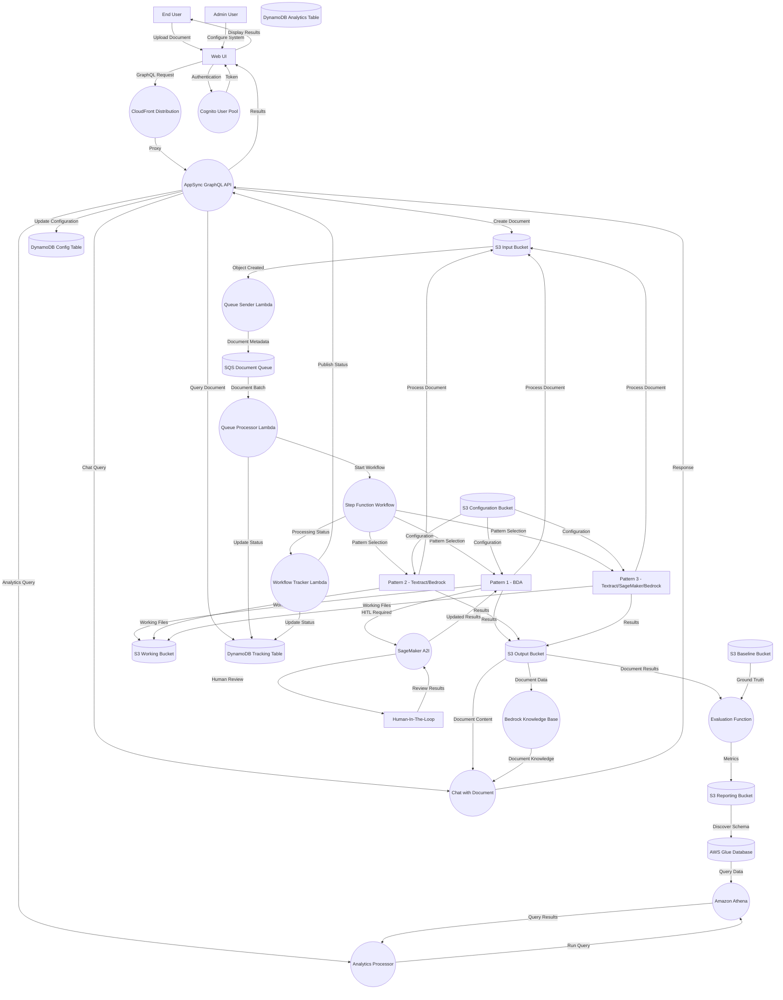

```mermaid
flowchart TD
    User[End User]
    AdminUser[Admin User]
    WebUI[Web UI]
    CloudFront((CloudFront Distribution))
    Cognito((Cognito User Pool))
    AppSync((AppSync GraphQL API))
    
    InputBucket[(S3 Input Bucket)]
    OutputBucket[(S3 Output Bucket)]
    ConfigBucket[(S3 Configuration Bucket)]
    BaselineBucket[(S3 Baseline Bucket)]
    ReportingBucket[(S3 Reporting Bucket)]
    WorkingBucket[(S3 Working Bucket)]
    
    TrackingTable[(DynamoDB Tracking Table)]
    AnalyticsTable[(DynamoDB Analytics Table)]
    ConfigTable[(DynamoDB Config Table)]
    
    QueueSender((Queue Sender Lambda))
    QueueProcessor((Queue Processor Lambda))
    DocumentQueue[(SQS Document Queue)]
    
    StateMachine((Step Function Workflow))
    WorkflowTracker((Workflow Tracker Lambda))
    
    Pattern1[Pattern 1 - BDA]
    Pattern2[Pattern 2 - Textract/Bedrock]
    Pattern3[Pattern 3 - Textract/SageMaker/Bedrock]
    
    KnowledgeBase((Bedrock Knowledge Base))
    EvaluationFunction((Evaluation Function))
    AnalyticsProcessor((Analytics Processor))
    
    Glue[(AWS Glue Database)]
    Athena((Amazon Athena))
    ChatWithDoc((Chat with Document))
    
    HITL[Human-In-The-Loop]
    A2I((SageMaker A2I))
    
    User -->|Upload Document| WebUI
    AdminUser -->|Configure System| WebUI
    WebUI -->|Authentication| Cognito
    Cognito -->|Token| WebUI
    
    WebUI -->|GraphQL Request| CloudFront
    CloudFront -->|Proxy| AppSync
    
    AppSync -->|Create Document| InputBucket
    AppSync -->|Query Document| TrackingTable
    AppSync -->|Update Configuration| ConfigTable
    AppSync -->|Chat Query| ChatWithDoc
    AppSync -->|Analytics Query| AnalyticsProcessor
    
    InputBucket -->|Object Created| QueueSender
    QueueSender -->|Document Metadata| DocumentQueue
    DocumentQueue -->|Document Batch| QueueProcessor
    QueueProcessor -->|Start Workflow| StateMachine
    QueueProcessor -->|Update Status| TrackingTable
    
    StateMachine -->|Processing Status| WorkflowTracker
    WorkflowTracker -->|Update Status| TrackingTable
    WorkflowTracker -->|Publish Status| AppSync
    
    StateMachine -->|Pattern Selection| Pattern1
    StateMachine -->|Pattern Selection| Pattern2
    StateMachine -->|Pattern Selection| Pattern3
    
    Pattern1 -->|Process Document| InputBucket
    Pattern2 -->|Process Document| InputBucket
    Pattern3 -->|Process Document| InputBucket
    
    Pattern1 -->|Working Files| WorkingBucket
    Pattern2 -->|Working Files| WorkingBucket
    Pattern3 -->|Working Files| WorkingBucket
    
    Pattern1 -->|Results| OutputBucket
    Pattern2 -->|Results| OutputBucket
    Pattern3 -->|Results| OutputBucket
    
    Pattern1 -->|HITL Required| A2I
    A2I -->|Human Review| HITL
    HITL -->|Review Results| A2I
    A2I -->|Updated Results| Pattern1
    
    OutputBucket -->|Document Data| KnowledgeBase
    OutputBucket -->|Document Results| EvaluationFunction
    BaselineBucket -->|Ground Truth| EvaluationFunction
    
    EvaluationFunction -->|Metrics| ReportingBucket
    ReportingBucket -->|Discover Schema| Glue
    Glue -->|Query Data| Athena
    AnalyticsProcessor -->|Run Query| Athena
    Athena -->|Query Results| AnalyticsProcessor
    
    OutputBucket -->|Document Content| ChatWithDoc
    KnowledgeBase -->|Document Knowledge| ChatWithDoc
    ChatWithDoc -->|Response| AppSync
    
    ConfigBucket -->|Configuration| Pattern1
    ConfigBucket -->|Configuration| Pattern2
    ConfigBucket -->|Configuration| Pattern3
    
    AppSync -->|Results| WebUI
    WebUI -->|Display Results| User
```