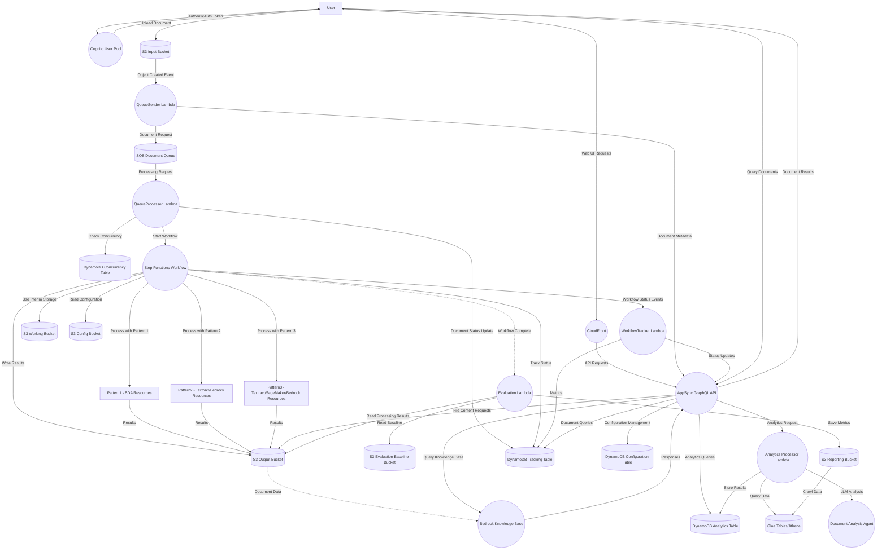

```mermaid
flowchart TD
    User[User]
    CloudFront((CloudFront))
    CognitoPool((Cognito User Pool))
    GraphQLApi((AppSync GraphQL API))
    InputBucket[(S3 Input Bucket)]
    OutputBucket[(S3 Output Bucket)]
    WorkingBucket[(S3 Working Bucket)]
    ConfigBucket[(S3 Config Bucket)]
    BaselineBucket[(S3 Evaluation Baseline Bucket)]
    ReportingBucket[(S3 Reporting Bucket)]
    
    QueueSender((QueueSender Lambda))
    DocumentQueue[(SQS Document Queue)]
    QueueProcessor((QueueProcessor Lambda))
    
    TrackingTable[(DynamoDB Tracking Table)]
    ConcurrencyTable[(DynamoDB Concurrency Table)]
    ConfigTable[(DynamoDB Configuration Table)]
    AnalyticsTable[(DynamoDB Analytics Table)]
    
    StateMachine((Step Functions Workflow))
    WorkflowTracker((WorkflowTracker Lambda))
    
    Pattern1[Pattern1 - BDA Resources]
    Pattern2[Pattern2 - Textract/Bedrock Resources]
    Pattern3[Pattern3 - Textract/SageMaker/Bedrock Resources]
    
    EvaluationFunction((Evaluation Lambda))
    KnowledgeBase((Bedrock Knowledge Base))
    AnalyticsProcessor((Analytics Processor Lambda))
    
    GlueTables[(Glue Tables/Athena)]
    
    DocumentAnalysis((Document Analysis Agent))
    
    User -->|Authentication| CognitoPool
    CognitoPool -->|Auth Token| User
    
    User -->|Web UI Requests| CloudFront
    CloudFront -->|API Requests| GraphQLApi
    
    User -->|Upload Document| InputBucket
    
    InputBucket -->|Object Created Event| QueueSender
    QueueSender -->|Document Metadata| GraphQLApi
    QueueSender -->|Document Request| DocumentQueue
    
    DocumentQueue -->|Processing Request| QueueProcessor
    QueueProcessor -->|Check Concurrency| ConcurrencyTable
    QueueProcessor -->|Document Status Update| TrackingTable
    QueueProcessor -->|Start Workflow| StateMachine
    
    StateMachine -->|Process with Pattern 1| Pattern1
    StateMachine -->|Process with Pattern 2| Pattern2
    StateMachine -->|Process with Pattern 3| Pattern3
    StateMachine -->|Write Results| OutputBucket
    StateMachine -->|Use Interim Storage| WorkingBucket
    StateMachine -->|Read Configuration| ConfigBucket
    StateMachine -->|Track Status| TrackingTable
    
    Pattern1 -->|Results| OutputBucket
    Pattern2 -->|Results| OutputBucket
    Pattern3 -->|Results| OutputBucket
    
    StateMachine -->|Workflow Status Events| WorkflowTracker
    WorkflowTracker -->|Status Updates| GraphQLApi
    WorkflowTracker -->|Metrics| TrackingTable
    
    GraphQLApi -->|Document Queries| TrackingTable
    GraphQLApi -->|File Content Requests| OutputBucket
    GraphQLApi -->|Configuration Management| ConfigTable
    GraphQLApi -->|Analytics Queries| AnalyticsTable
    
    StateMachine -.->|Workflow Complete| EvaluationFunction
    EvaluationFunction -->|Read Baseline| BaselineBucket
    EvaluationFunction -->|Read Processing Results| OutputBucket
    EvaluationFunction -->|Save Metrics| ReportingBucket
    
    OutputBucket -.->|Document Data| KnowledgeBase
    
    GraphQLApi -->|Analytics Request| AnalyticsProcessor
    AnalyticsProcessor -->|Query Data| GlueTables
    AnalyticsProcessor -->|LLM Analysis| DocumentAnalysis
    AnalyticsProcessor -->|Store Results| AnalyticsTable
    
    ReportingBucket -->|Crawl Data| GlueTables
    
    User -->|Query Documents| GraphQLApi
    GraphQLApi -->|Document Results| User
    GraphQLApi -->|Query Knowledge Base| KnowledgeBase
    KnowledgeBase -->|Responses| GraphQLApi
```