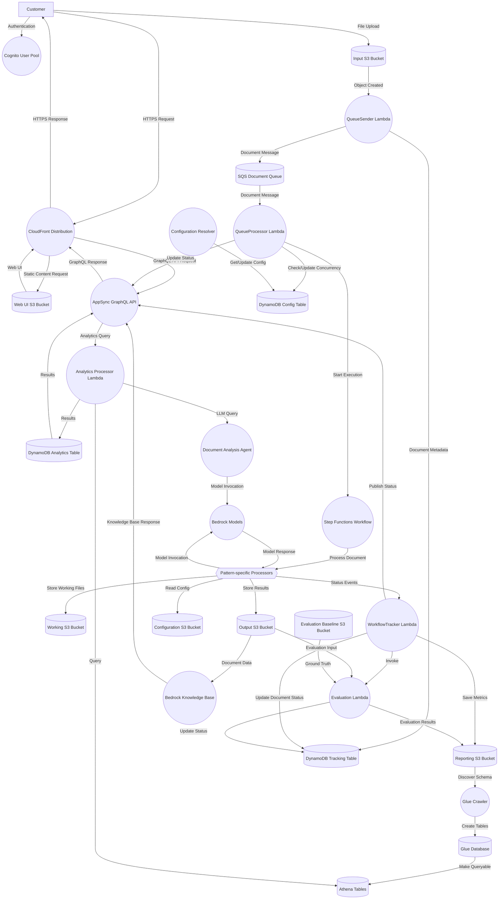

```mermaid
flowchart TD
    User[Customer]
    CloudFront((CloudFront Distribution))
    WebUIBucket[(Web UI S3 Bucket)]
    Cognito((Cognito User Pool))
    AppSync((AppSync GraphQL API))
    
    InputBucket[(Input S3 Bucket)]
    WorkingBucket[(Working S3 Bucket)]
    OutputBucket[(Output S3 Bucket)]
    BaselineBucket[(Evaluation Baseline S3 Bucket)]
    ReportingBucket[(Reporting S3 Bucket)]
    ConfigBucket[(Configuration S3 Bucket)]
    
    SQSQueue[(SQS Document Queue)]
    TrackingTable[(DynamoDB Tracking Table)]
    ConfigTable[(DynamoDB Config Table)]
    AnalyticsTable[(DynamoDB Analytics Table)]
    
    QueueSender((QueueSender Lambda))
    QueueProcessor((QueueProcessor Lambda))
    WorkflowTracker((WorkflowTracker Lambda))
    EvaluationFunction((Evaluation Lambda))
    ConfigResolver((Configuration Resolver))
    AnalyticsProcessor((Analytics Processor Lambda))
    
    StateMachine((Step Functions Workflow))
    
    BedrockKB((Bedrock Knowledge Base))
    DocumentAnalysisAgent((Document Analysis Agent))
    Bedrock((Bedrock Models))
    
    GlueCrawler((Glue Crawler))
    GlueDB[(Glue Database)]
    AthenaTables[(Athena Tables)]
    
    PatternProcessor{{Pattern-specific Processors}}
    
    User -->|Authentication| Cognito
    User -->|HTTPS Request| CloudFront
    CloudFront -->|Static Content Request| WebUIBucket
    WebUIBucket -->|Web UI| CloudFront
    CloudFront -->|GraphQL API Request| AppSync
    
    User -->|File Upload| InputBucket
    InputBucket -->|Object Created| QueueSender
    QueueSender -->|Document Metadata| TrackingTable
    QueueSender -->|Document Message| SQSQueue
    
    SQSQueue -->|Document Message| QueueProcessor
    QueueProcessor -->|Check/Update Concurrency| ConfigTable
    QueueProcessor -->|Start Execution| StateMachine
    QueueProcessor -->|Update Status| AppSync
    
    StateMachine -->|Process Document| PatternProcessor
    PatternProcessor -->|Store Working Files| WorkingBucket
    PatternProcessor -->|Read Config| ConfigBucket
    PatternProcessor -->|Store Results| OutputBucket
    PatternProcessor -->|Status Events| WorkflowTracker
    
    PatternProcessor -->|Model Invocation| Bedrock
    Bedrock -->|Model Response| PatternProcessor
    
    WorkflowTracker -->|Update Document Status| TrackingTable
    WorkflowTracker -->|Publish Status| AppSync
    WorkflowTracker -->|Save Metrics| ReportingBucket
    WorkflowTracker -->|Invoke| EvaluationFunction
    
    OutputBucket -->|Evaluation Input| EvaluationFunction
    BaselineBucket -->|Ground Truth| EvaluationFunction
    EvaluationFunction -->|Evaluation Results| ReportingBucket
    EvaluationFunction -->|Update Status| TrackingTable
    
    OutputBucket -->|Document Data| BedrockKB
    BedrockKB -->|Knowledge Base Response| AppSync
    
    ReportingBucket -->|Discover Schema| GlueCrawler
    GlueCrawler -->|Create Tables| GlueDB
    GlueDB -->|Make Queryable| AthenaTables
    
    AppSync -->|Analytics Query| AnalyticsProcessor
    AnalyticsProcessor -->|Query| AthenaTables
    AnalyticsProcessor -->|LLM Query| DocumentAnalysisAgent
    DocumentAnalysisAgent -->|Model Invocation| Bedrock
    AnalyticsProcessor -->|Results| AnalyticsTable
    AnalyticsTable -->|Results| AppSync
    
    ConfigResolver -->|Get/Update Config| ConfigTable
    
    AppSync -->|GraphQL Response| CloudFront
    CloudFront -->|HTTPS Response| User
```