## .aws-sam-build-BDASAMPLEPROJECT-template

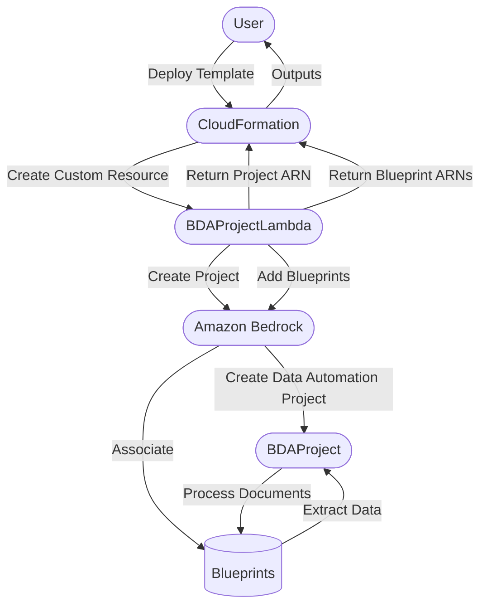
```mermaid
flowchart TD
    User([User])
    CFN([CloudFormation])
    BDALambda([BDAProjectLambda])
    BDAProject([BDAProject])
    Bedrock([Amazon Bedrock])
    Blueprints[(Blueprints)]
    
    User -->|Deploy Template| CFN
    CFN -->|Create Custom Resource| BDALambda
    BDALambda -->|Create Project| Bedrock
    BDALambda -->|Add Blueprints| Bedrock
    Bedrock -->|Create Data Automation Project| BDAProject
    Bedrock -->|Associate| Blueprints
    BDAProject -->|Process Documents| Blueprints
    Blueprints -->|Extract Data| BDAProject
    BDALambda -->|Return Project ARN| CFN
    BDALambda -->|Return Blueprint ARNs| CFN
    CFN -->|Outputs| User
```

## .aws-sam-build-DOCUMENTBEDROCKKB-template

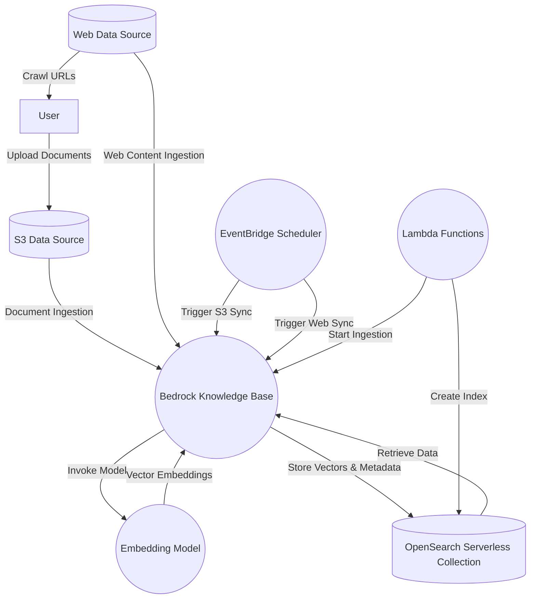
```mermaid
flowchart TD
    User[User]
    S3DS[(S3 Data Source)]
    WebDS[(Web Data Source)]
    BedrockKB((Bedrock Knowledge Base))
    OSS[(OpenSearch Serverless Collection)]
    EmbedModel((Embedding Model))
    Scheduler((EventBridge Scheduler))
    Lambda((Lambda Functions))
    
    User -->|Upload Documents| S3DS
    WebDS -->|Crawl URLs| User
    
    S3DS -->|Document Ingestion| BedrockKB
    WebDS -->|Web Content Ingestion| BedrockKB
    
    BedrockKB -->|Invoke Model| EmbedModel
    EmbedModel -->|Vector Embeddings| BedrockKB
    
    BedrockKB -->|Store Vectors & Metadata| OSS
    OSS -->|Retrieve Data| BedrockKB
    
    Scheduler -->|Trigger S3 Sync| BedrockKB
    Scheduler -->|Trigger Web Sync| BedrockKB
    
    Lambda -->|Create Index| OSS
    Lambda -->|Start Ingestion| BedrockKB
```

## .aws-sam-build-PATTERN1STACK-template

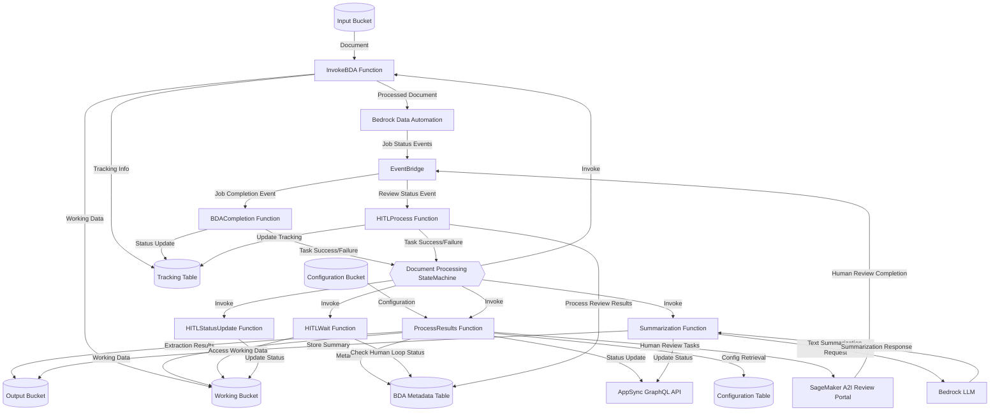
```mermaid
flowchart TD
    InputS3[(Input Bucket)]
    ConfigS3[(Configuration Bucket)]
    WorkingS3[(Working Bucket)]
    OutputS3[(Output Bucket)]
    TrackingDB[(Tracking Table)]
    ConfigDB[(Configuration Table)]
    BDAMetadataDB[(BDA Metadata Table)]
    
    DocProcessSM{{Document Processing StateMachine}}
    InvokeBDA[InvokeBDA Function]
    ProcessResults[ProcessResults Function]
    Summarization[Summarization Function]
    HITLWait[HITLWait Function]
    HITLStatusUpdate[HITLStatusUpdate Function]
    HITLProcess[HITLProcess Function]
    BDACompletion[BDACompletion Function]
    
    BedrockBDA[Bedrock Data Automation]
    BedrockLLM[Bedrock LLM]
    A2IPortal[SageMaker A2I Review Portal]
    AppSync[AppSync GraphQL API]
    EventBridge[EventBridge]
    
    InputS3 -->|Document| InvokeBDA
    ConfigS3 -->|Configuration| ProcessResults
    InvokeBDA -->|Processed Document| BedrockBDA
    InvokeBDA -->|Working Data| WorkingS3
    InvokeBDA -->|Tracking Info| TrackingDB
    
    BedrockBDA -->|Job Status Events| EventBridge
    EventBridge -->|Job Completion Event| BDACompletion
    BDACompletion -->|Status Update| TrackingDB
    BDACompletion -->|Task Success/Failure| DocProcessSM
    
    DocProcessSM -->|Invoke| InvokeBDA
    DocProcessSM -->|Invoke| ProcessResults
    DocProcessSM -->|Invoke| Summarization
    DocProcessSM -->|Invoke| HITLWait
    DocProcessSM -->|Invoke| HITLStatusUpdate
    
    ProcessResults -->|Extraction Results| OutputS3
    ProcessResults -->|Working Data| WorkingS3
    ProcessResults -->|Metadata| BDAMetadataDB
    ProcessResults -->|Status Update| AppSync
    ProcessResults -->|Config Retrieval| ConfigDB
    ProcessResults -->|Human Review Tasks| A2IPortal
    
    HITLWait -->|Check Human Loop Status| BDAMetadataDB
    HITLWait -->|Access Working Data| WorkingS3
    HITLStatusUpdate -->|Update Status| WorkingS3
    
    A2IPortal -->|Human Review Completion| EventBridge
    EventBridge -->|Review Status Event| HITLProcess
    HITLProcess -->|Process Review Results| BDAMetadataDB
    HITLProcess -->|Update Tracking| TrackingDB
    HITLProcess -->|Task Success/Failure| DocProcessSM
    
    Summarization -->|Text Summarization Request| BedrockLLM
    BedrockLLM -->|Summarization Response| Summarization
    Summarization -->|Store Summary| OutputS3
    Summarization -->|Update Status| AppSync
```

## .aws-sam-build-PATTERN2STACK-template

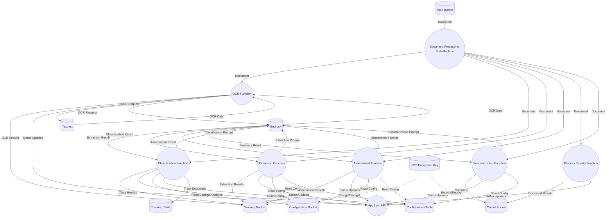
```mermaid
flowchart TD
    InputBucket[(Input Bucket)]
    ConfigBucket[(Configuration Bucket)]
    OutputBucket[(Output Bucket)]
    WorkingBucket[(Working Bucket)]
    ConfigTable[(Configuration Table)]
    TrackingTable[(Tracking Table)]
    
    AppSync((AppSync API))
    OCRFunction((OCR Function))
    ClassificationFunction((Classification Function))
    ExtractionFunction((Extraction Function))
    AssessmentFunction((Assessment Function))
    ProcessResultsFunction((Process Results Function))
    SummarizationFunction((Summarization Function))
    StateMachine((Document Processing StateMachine))
    
    Bedrock[(Bedrock)]
    Textract[(Textract)]
    KMS[(KMS Encryption Key)]
    
    InputBucket -->|Document| StateMachine
    StateMachine -->|Document| OCRFunction
    StateMachine -->|Document| ClassificationFunction
    StateMachine -->|Document| ExtractionFunction
    StateMachine -->|Document| AssessmentFunction
    StateMachine -->|Document| ProcessResultsFunction
    StateMachine -->|Document| SummarizationFunction
    
    OCRFunction -->|OCR Results| WorkingBucket
    OCRFunction -->|Status Updates| AppSync
    OCRFunction -->|OCR Request| Textract
    Textract -->|OCR Data| OCRFunction
    OCRFunction -->|OCR Request| Bedrock
    Bedrock -->|OCR Data| OCRFunction
    
    ClassificationFunction -->|Class Results| WorkingBucket
    ClassificationFunction -->|Status Updates| AppSync
    ClassificationFunction -->|Read Config| ConfigBucket
    ClassificationFunction -->|Read Config| ConfigTable
    ClassificationFunction -->|Classification Prompt| Bedrock
    Bedrock -->|Classification Result| ClassificationFunction
    ClassificationFunction -->|Track Document| TrackingTable
    
    ExtractionFunction -->|Extraction Results| WorkingBucket
    ExtractionFunction -->|Status Updates| AppSync
    ExtractionFunction -->|Read Config| ConfigBucket
    ExtractionFunction -->|Read Config| ConfigTable
    ExtractionFunction -->|Extraction Prompt| Bedrock
    Bedrock -->|Extraction Result| ExtractionFunction
    
    AssessmentFunction -->|Assessment Results| WorkingBucket
    AssessmentFunction -->|Status Updates| AppSync
    AssessmentFunction -->|Read Config| ConfigBucket
    AssessmentFunction -->|Read Config| ConfigTable
    AssessmentFunction -->|Assessment Prompt| Bedrock
    Bedrock -->|Assessment Result| AssessmentFunction
    
    ProcessResultsFunction -->|Processed Results| OutputBucket
    ProcessResultsFunction -->|Status Updates| AppSync
    
    SummarizationFunction -->|Summary| OutputBucket
    SummarizationFunction -->|Status Updates| AppSync
    SummarizationFunction -->|Read Config| ConfigTable
    SummarizationFunction -->|Summarization Prompt| Bedrock
    Bedrock -->|Summary Result| SummarizationFunction
    
    KMS -.->|Encrypt/Decrypt| WorkingBucket
    KMS -.->|Encrypt/Decrypt| OutputBucket
```

## .aws-sam-build-PATTERN3STACK-template

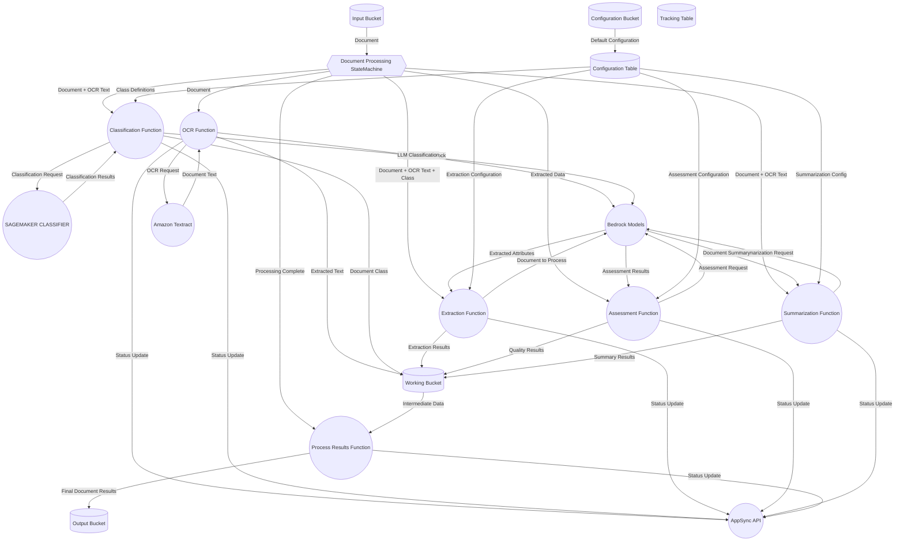
```mermaid
flowchart TD
    Input[(Input Bucket)]
    Working[(Working Bucket)]
    Output[(Output Bucket)]
    Config[(Configuration Bucket)]
    ConfigTable[(Configuration Table)]
    TrackingTable[(Tracking Table)]
    
    OCRFunction((OCR Function))
    ClassifyFunction((Classification Function))
    ExtractFunction((Extraction Function))
    AssessFunction((Assessment Function))
    SummarizeFunction((Summarization Function))
    ProcessResultsFunction((Process Results Function))
    
    SageMaker((SAGEMAKER CLASSIFIER))
    Bedrock((Bedrock Models))
    Textract((Amazon Textract))
    AppSync((AppSync API))
    
    StateMachine{{Document Processing StateMachine}}
    
    Input -->|Document| StateMachine
    StateMachine -->|Document| OCRFunction
    OCRFunction -->|Extracted Text| Working
    OCRFunction -->|OCR Request| Textract
    OCRFunction -->|OCR with Bedrock| Bedrock
    Textract -->|Document Text| OCRFunction
    OCRFunction -->|Status Update| AppSync
    
    StateMachine -->|Document + OCR Text| ClassifyFunction
    ClassifyFunction -->|Document Class| Working
    ClassifyFunction -->|Classification Request| SageMaker
    ClassifyFunction -->|LLM Classification| Bedrock
    ClassifyFunction -->|Status Update| AppSync
    SageMaker -->|Classification Results| ClassifyFunction
    ConfigTable -->|Class Definitions| ClassifyFunction
    
    StateMachine -->|Document + OCR Text + Class| ExtractFunction
    ExtractFunction -->|Document to Process| Bedrock
    Bedrock -->|Extracted Attributes| ExtractFunction
    ExtractFunction -->|Extraction Results| Working
    ExtractFunction -->|Status Update| AppSync
    ConfigTable -->|Extraction Configuration| ExtractFunction
    
    StateMachine -->|Extracted Data| AssessFunction
    AssessFunction -->|Assessment Request| Bedrock
    Bedrock -->|Assessment Results| AssessFunction
    AssessFunction -->|Quality Results| Working
    AssessFunction -->|Status Update| AppSync
    ConfigTable -->|Assessment Configuration| AssessFunction
    
    StateMachine -->|Document + OCR Text| SummarizeFunction
    SummarizeFunction -->|Summarization Request| Bedrock
    Bedrock -->|Document Summary| SummarizeFunction
    SummarizeFunction -->|Summary Results| Working
    SummarizeFunction -->|Status Update| AppSync
    ConfigTable -->|Summarization Config| SummarizeFunction
    
    StateMachine -->|Processing Complete| ProcessResultsFunction
    ProcessResultsFunction -->|Final Document Results| Output
    ProcessResultsFunction -->|Status Update| AppSync
    Working -->|Intermediate Data| ProcessResultsFunction
    
    Config -->|Default Configuration| ConfigTable
```

## .aws-sam-build-template

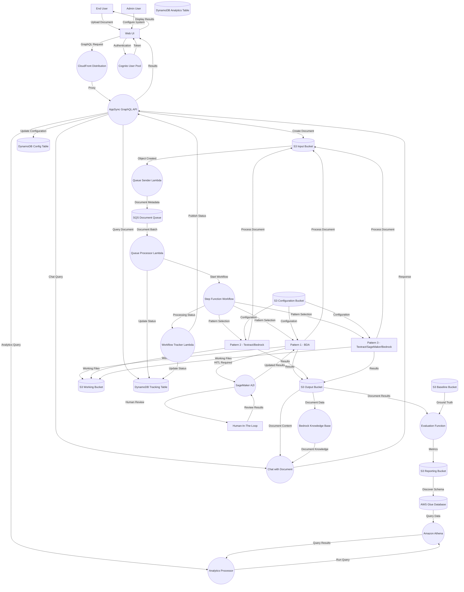
```mermaid
flowchart TD
    User[End User]
    AdminUser[Admin User]
    WebUI[Web UI]
    CloudFront((CloudFront Distribution))
    Cognito((Cognito User Pool))
    AppSync((AppSync GraphQL API))
    
    InputBucket[(S3 Input Bucket)]
    OutputBucket[(S3 Output Bucket)]
    ConfigBucket[(S3 Configuration Bucket)]
    BaselineBucket[(S3 Baseline Bucket)]
    ReportingBucket[(S3 Reporting Bucket)]
    WorkingBucket[(S3 Working Bucket)]
    
    TrackingTable[(DynamoDB Tracking Table)]
    AnalyticsTable[(DynamoDB Analytics Table)]
    ConfigTable[(DynamoDB Config Table)]
    
    QueueSender((Queue Sender Lambda))
    QueueProcessor((Queue Processor Lambda))
    DocumentQueue[(SQS Document Queue)]
    
    StateMachine((Step Function Workflow))
    WorkflowTracker((Workflow Tracker Lambda))
    
    Pattern1[Pattern 1 - BDA]
    Pattern2[Pattern 2 - Textract/Bedrock]
    Pattern3[Pattern 3 - Textract/SageMaker/Bedrock]
    
    KnowledgeBase((Bedrock Knowledge Base))
    EvaluationFunction((Evaluation Function))
    AnalyticsProcessor((Analytics Processor))
    
    Glue[(AWS Glue Database)]
    Athena((Amazon Athena))
    ChatWithDoc((Chat with Document))
    
    HITL[Human-In-The-Loop]
    A2I((SageMaker A2I))
    
    User -->|Upload Document| WebUI
    AdminUser -->|Configure System| WebUI
    WebUI -->|Authentication| Cognito
    Cognito -->|Token| WebUI
    
    WebUI -->|GraphQL Request| CloudFront
    CloudFront -->|Proxy| AppSync
    
    AppSync -->|Create Document| InputBucket
    AppSync -->|Query Document| TrackingTable
    AppSync -->|Update Configuration| ConfigTable
    AppSync -->|Chat Query| ChatWithDoc
    AppSync -->|Analytics Query| AnalyticsProcessor
    
    InputBucket -->|Object Created| QueueSender
    QueueSender -->|Document Metadata| DocumentQueue
    DocumentQueue -->|Document Batch| QueueProcessor
    QueueProcessor -->|Start Workflow| StateMachine
    QueueProcessor -->|Update Status| TrackingTable
    
    StateMachine -->|Processing Status| WorkflowTracker
    WorkflowTracker -->|Update Status| TrackingTable
    WorkflowTracker -->|Publish Status| AppSync
    
    StateMachine -->|Pattern Selection| Pattern1
    StateMachine -->|Pattern Selection| Pattern2
    StateMachine -->|Pattern Selection| Pattern3
    
    Pattern1 -->|Process Document| InputBucket
    Pattern2 -->|Process Document| InputBucket
    Pattern3 -->|Process Document| InputBucket
    
    Pattern1 -->|Working Files| WorkingBucket
    Pattern2 -->|Working Files| WorkingBucket
    Pattern3 -->|Working Files| WorkingBucket
    
    Pattern1 -->|Results| OutputBucket
    Pattern2 -->|Results| OutputBucket
    Pattern3 -->|Results| OutputBucket
    
    Pattern1 -->|HITL Required| A2I
    A2I -->|Human Review| HITL
    HITL -->|Review Results| A2I
    A2I -->|Updated Results| Pattern1
    
    OutputBucket -->|Document Data| KnowledgeBase
    OutputBucket -->|Document Results| EvaluationFunction
    BaselineBucket -->|Ground Truth| EvaluationFunction
    
    EvaluationFunction -->|Metrics| ReportingBucket
    ReportingBucket -->|Discover Schema| Glue
    Glue -->|Query Data| Athena
    AnalyticsProcessor -->|Run Query| Athena
    Athena -->|Query Results| AnalyticsProcessor
    
    OutputBucket -->|Document Content| ChatWithDoc
    KnowledgeBase -->|Document Knowledge| ChatWithDoc
    ChatWithDoc -->|Response| AppSync
    
    ConfigBucket -->|Configuration| Pattern1
    ConfigBucket -->|Configuration| Pattern2
    ConfigBucket -->|Configuration| Pattern3
    
    AppSync -->|Results| WebUI
    WebUI -->|Display Results| User
```

## .aws-sam-idp-main

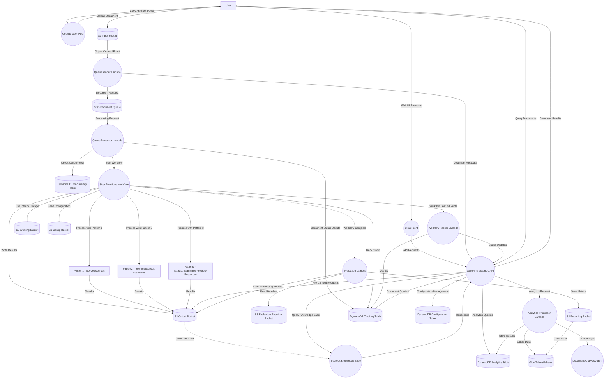
```mermaid
flowchart TD
    User[User]
    CloudFront((CloudFront))
    CognitoPool((Cognito User Pool))
    GraphQLApi((AppSync GraphQL API))
    InputBucket[(S3 Input Bucket)]
    OutputBucket[(S3 Output Bucket)]
    WorkingBucket[(S3 Working Bucket)]
    ConfigBucket[(S3 Config Bucket)]
    BaselineBucket[(S3 Evaluation Baseline Bucket)]
    ReportingBucket[(S3 Reporting Bucket)]
    
    QueueSender((QueueSender Lambda))
    DocumentQueue[(SQS Document Queue)]
    QueueProcessor((QueueProcessor Lambda))
    
    TrackingTable[(DynamoDB Tracking Table)]
    ConcurrencyTable[(DynamoDB Concurrency Table)]
    ConfigTable[(DynamoDB Configuration Table)]
    AnalyticsTable[(DynamoDB Analytics Table)]
    
    StateMachine((Step Functions Workflow))
    WorkflowTracker((WorkflowTracker Lambda))
    
    Pattern1[Pattern1 - BDA Resources]
    Pattern2[Pattern2 - Textract/Bedrock Resources]
    Pattern3[Pattern3 - Textract/SageMaker/Bedrock Resources]
    
    EvaluationFunction((Evaluation Lambda))
    KnowledgeBase((Bedrock Knowledge Base))
    AnalyticsProcessor((Analytics Processor Lambda))
    
    GlueTables[(Glue Tables/Athena)]
    
    DocumentAnalysis((Document Analysis Agent))
    
    User -->|Authentication| CognitoPool
    CognitoPool -->|Auth Token| User
    
    User -->|Web UI Requests| CloudFront
    CloudFront -->|API Requests| GraphQLApi
    
    User -->|Upload Document| InputBucket
    
    InputBucket -->|Object Created Event| QueueSender
    QueueSender -->|Document Metadata| GraphQLApi
    QueueSender -->|Document Request| DocumentQueue
    
    DocumentQueue -->|Processing Request| QueueProcessor
    QueueProcessor -->|Check Concurrency| ConcurrencyTable
    QueueProcessor -->|Document Status Update| TrackingTable
    QueueProcessor -->|Start Workflow| StateMachine
    
    StateMachine -->|Process with Pattern 1| Pattern1
    StateMachine -->|Process with Pattern 2| Pattern2
    StateMachine -->|Process with Pattern 3| Pattern3
    StateMachine -->|Write Results| OutputBucket
    StateMachine -->|Use Interim Storage| WorkingBucket
    StateMachine -->|Read Configuration| ConfigBucket
    StateMachine -->|Track Status| TrackingTable
    
    Pattern1 -->|Results| OutputBucket
    Pattern2 -->|Results| OutputBucket
    Pattern3 -->|Results| OutputBucket
    
    StateMachine -->|Workflow Status Events| WorkflowTracker
    WorkflowTracker -->|Status Updates| GraphQLApi
    WorkflowTracker -->|Metrics| TrackingTable
    
    GraphQLApi -->|Document Queries| TrackingTable
    GraphQLApi -->|File Content Requests| OutputBucket
    GraphQLApi -->|Configuration Management| ConfigTable
    GraphQLApi -->|Analytics Queries| AnalyticsTable
    
    StateMachine -.->|Workflow Complete| EvaluationFunction
    EvaluationFunction -->|Read Baseline| BaselineBucket
    EvaluationFunction -->|Read Processing Results| OutputBucket
    EvaluationFunction -->|Save Metrics| ReportingBucket
    
    OutputBucket -.->|Document Data| KnowledgeBase
    
    GraphQLApi -->|Analytics Request| AnalyticsProcessor
    AnalyticsProcessor -->|Query Data| GlueTables
    AnalyticsProcessor -->|LLM Analysis| DocumentAnalysis
    AnalyticsProcessor -->|Store Results| AnalyticsTable
    
    ReportingBucket -->|Crawl Data| GlueTables
    
    User -->|Query Documents| GraphQLApi
    GraphQLApi -->|Document Results| User
    GraphQLApi -->|Query Knowledge Base| KnowledgeBase
    KnowledgeBase -->|Responses| GraphQLApi
```

## .aws-sam-packaged

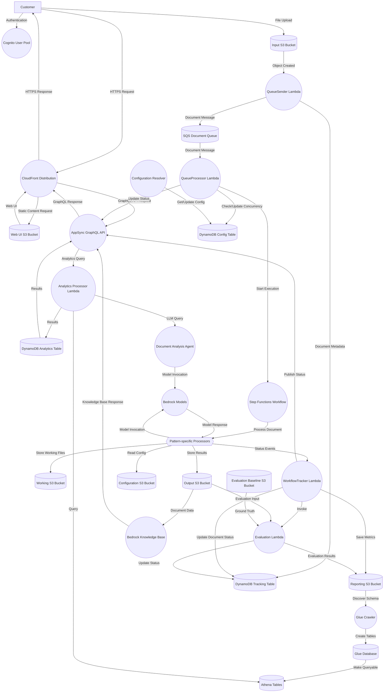
```mermaid
flowchart TD
    User[Customer]
    CloudFront((CloudFront Distribution))
    WebUIBucket[(Web UI S3 Bucket)]
    Cognito((Cognito User Pool))
    AppSync((AppSync GraphQL API))
    
    InputBucket[(Input S3 Bucket)]
    WorkingBucket[(Working S3 Bucket)]
    OutputBucket[(Output S3 Bucket)]
    BaselineBucket[(Evaluation Baseline S3 Bucket)]
    ReportingBucket[(Reporting S3 Bucket)]
    ConfigBucket[(Configuration S3 Bucket)]
    
    SQSQueue[(SQS Document Queue)]
    TrackingTable[(DynamoDB Tracking Table)]
    ConfigTable[(DynamoDB Config Table)]
    AnalyticsTable[(DynamoDB Analytics Table)]
    
    QueueSender((QueueSender Lambda))
    QueueProcessor((QueueProcessor Lambda))
    WorkflowTracker((WorkflowTracker Lambda))
    EvaluationFunction((Evaluation Lambda))
    ConfigResolver((Configuration Resolver))
    AnalyticsProcessor((Analytics Processor Lambda))
    
    StateMachine((Step Functions Workflow))
    
    BedrockKB((Bedrock Knowledge Base))
    DocumentAnalysisAgent((Document Analysis Agent))
    Bedrock((Bedrock Models))
    
    GlueCrawler((Glue Crawler))
    GlueDB[(Glue Database)]
    AthenaTables[(Athena Tables)]
    
    PatternProcessor{{Pattern-specific Processors}}
    
    User -->|Authentication| Cognito
    User -->|HTTPS Request| CloudFront
    CloudFront -->|Static Content Request| WebUIBucket
    WebUIBucket -->|Web UI| CloudFront
    CloudFront -->|GraphQL API Request| AppSync
    
    User -->|File Upload| InputBucket
    InputBucket -->|Object Created| QueueSender
    QueueSender -->|Document Metadata| TrackingTable
    QueueSender -->|Document Message| SQSQueue
    
    SQSQueue -->|Document Message| QueueProcessor
    QueueProcessor -->|Check/Update Concurrency| ConfigTable
    QueueProcessor -->|Start Execution| StateMachine
    QueueProcessor -->|Update Status| AppSync
    
    StateMachine -->|Process Document| PatternProcessor
    PatternProcessor -->|Store Working Files| WorkingBucket
    PatternProcessor -->|Read Config| ConfigBucket
    PatternProcessor -->|Store Results| OutputBucket
    PatternProcessor -->|Status Events| WorkflowTracker
    
    PatternProcessor -->|Model Invocation| Bedrock
    Bedrock -->|Model Response| PatternProcessor
    
    WorkflowTracker -->|Update Document Status| TrackingTable
    WorkflowTracker -->|Publish Status| AppSync
    WorkflowTracker -->|Save Metrics| ReportingBucket
    WorkflowTracker -->|Invoke| EvaluationFunction
    
    OutputBucket -->|Evaluation Input| EvaluationFunction
    BaselineBucket -->|Ground Truth| EvaluationFunction
    EvaluationFunction -->|Evaluation Results| ReportingBucket
    EvaluationFunction -->|Update Status| TrackingTable
    
    OutputBucket -->|Document Data| BedrockKB
    BedrockKB -->|Knowledge Base Response| AppSync
    
    ReportingBucket -->|Discover Schema| GlueCrawler
    GlueCrawler -->|Create Tables| GlueDB
    GlueDB -->|Make Queryable| AthenaTables
    
    AppSync -->|Analytics Query| AnalyticsProcessor
    AnalyticsProcessor -->|Query| AthenaTables
    AnalyticsProcessor -->|LLM Query| DocumentAnalysisAgent
    DocumentAnalysisAgent -->|Model Invocation| Bedrock
    AnalyticsProcessor -->|Results| AnalyticsTable
    AnalyticsTable -->|Results| AppSync
    
    ConfigResolver -->|Get/Update Config| ConfigTable
    
    AppSync -->|GraphQL Response| CloudFront
    CloudFront -->|HTTPS Response| User
```

## notebooks-misc-bda-cfn-bda-project

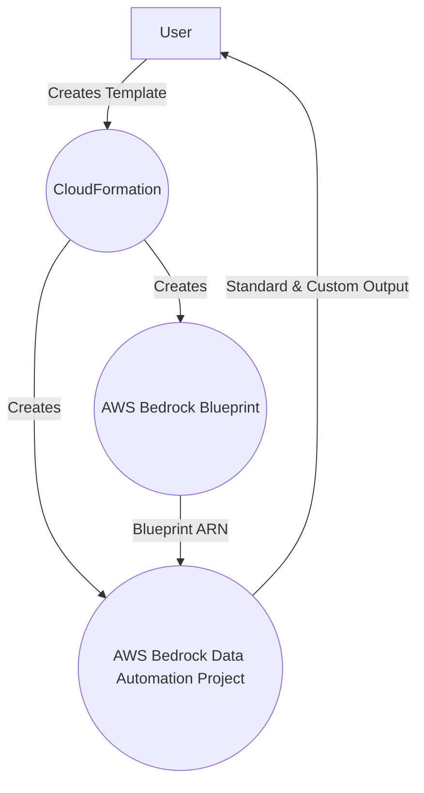
```mermaid
flowchart TD
    User[User]
    CloudFormation((CloudFormation))
    BedrockBlueprint((AWS Bedrock Blueprint))
    BedRockDataAutomationProject((AWS Bedrock Data Automation Project))
    
    User -->|Creates Template| CloudFormation
    CloudFormation -->|Creates| BedrockBlueprint
    CloudFormation -->|Creates| BedRockDataAutomationProject
    BedrockBlueprint -->|Blueprint ARN| BedRockDataAutomationProject
    BedRockDataAutomationProject -->|Standard & Custom Output| User
```

## options-bda-lending-project-.aws-sam-build-template

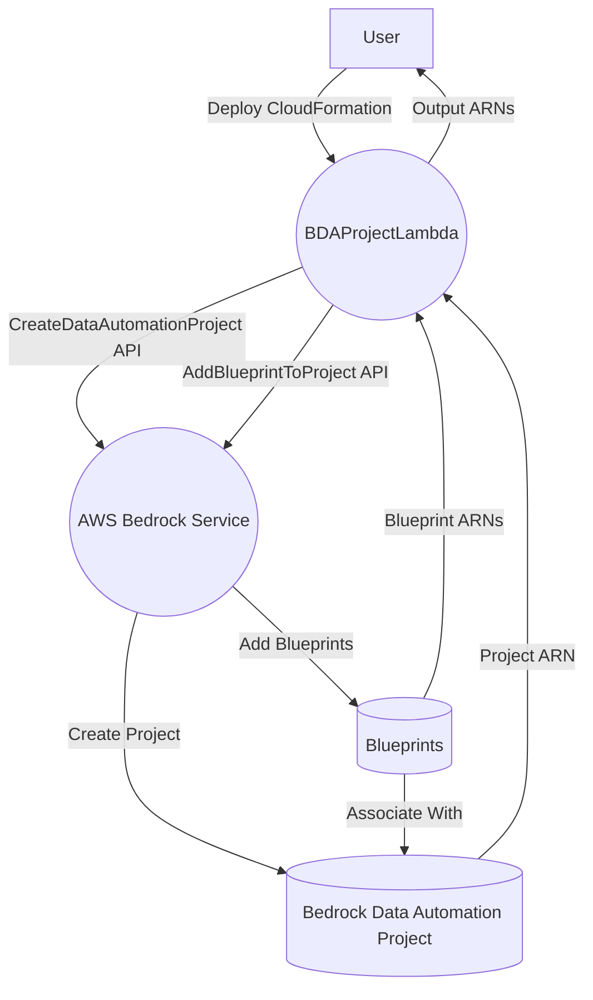
```mermaid
flowchart TD
    User[User]
    BDAProjectLambda((BDAProjectLambda))
    BedrockService((AWS Bedrock Service))
    BDAProject[(Bedrock Data Automation Project)]
    Blueprints[(Blueprints)]
    
    User -->|Deploy CloudFormation| BDAProjectLambda
    BDAProjectLambda -->|CreateDataAutomationProject API| BedrockService
    BDAProjectLambda -->|AddBlueprintToProject API| BedrockService
    BedrockService -->|Create Project| BDAProject
    BedrockService -->|Add Blueprints| Blueprints
    Blueprints -->|Associate With| BDAProject
    BDAProject -->|Project ARN| BDAProjectLambda
    Blueprints -->|Blueprint ARNs| BDAProjectLambda
    BDAProjectLambda -->|Output ARNs| User
```

## options-bda-lending-project-.aws-sam-packaged

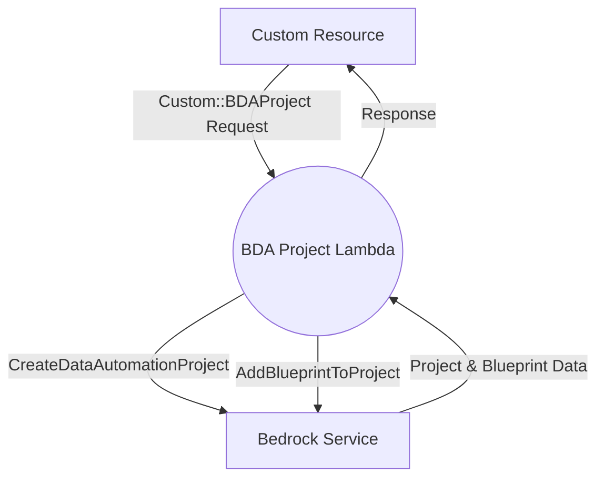
```mermaid
flowchart TD
    CustomResource[Custom Resource]
    BDAProjectLambda((BDA Project Lambda))
    BedrockService[Bedrock Service]
    
    CustomResource -->|Custom::BDAProject Request| BDAProjectLambda
    BDAProjectLambda -->|CreateDataAutomationProject| BedrockService
    BDAProjectLambda -->|AddBlueprintToProject| BedrockService
    BedrockService -->|Project & Blueprint Data| BDAProjectLambda
    BDAProjectLambda -->|Response| CustomResource
```

## options-bda-lending-project-template

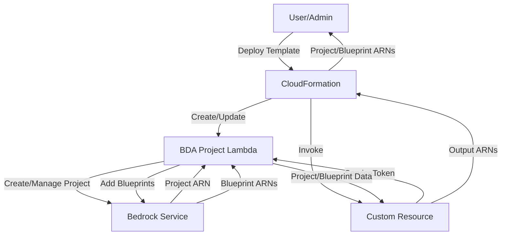
```mermaid
flowchart TD
    User[User/Admin]
    CFN[CloudFormation]
    CustomResource[Custom Resource]
    BDAProjectLambda[BDA Project Lambda]
    BedrockService[Bedrock Service]
    
    User -->|Deploy Template| CFN
    CFN -->|Create/Update| BDAProjectLambda
    CFN -->|Invoke| CustomResource
    CustomResource -->|ServiceToken| BDAProjectLambda
    BDAProjectLambda -->|Create/Manage Project| BedrockService
    BDAProjectLambda -->|Add Blueprints| BedrockService
    BedrockService -->|Project ARN| BDAProjectLambda
    BedrockService -->|Blueprint ARNs| BDAProjectLambda
    BDAProjectLambda -->|Project/Blueprint Data| CustomResource
    CustomResource -->|Output ARNs| CFN
    CFN -->|Project/Blueprint ARNs| User
```

## options-bedrockkb-.aws-sam-build-template

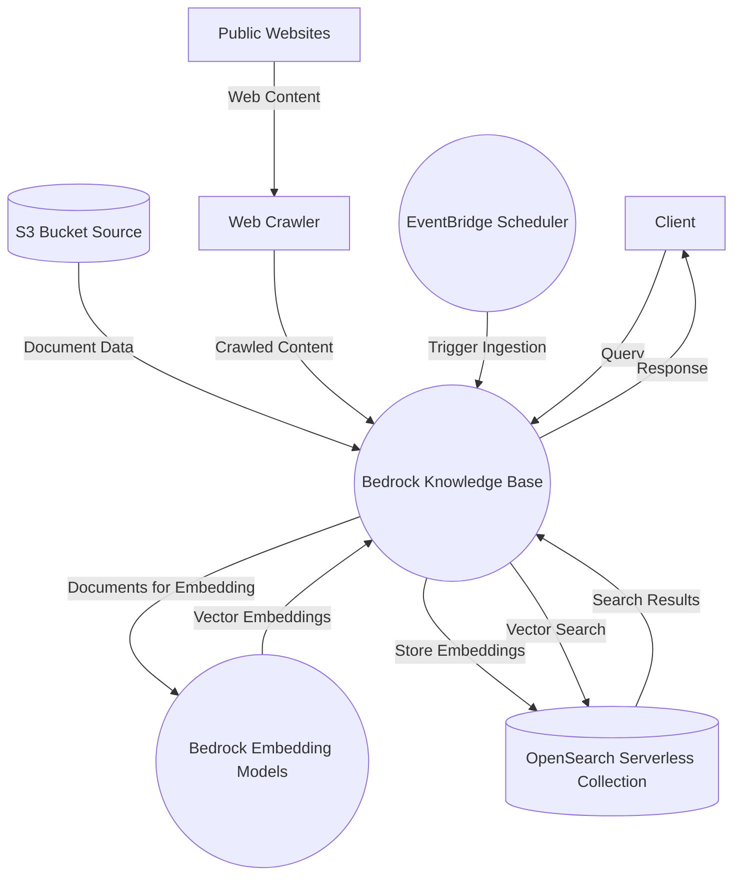
```mermaid
flowchart TD
    Client[Client]
    S3Source[(S3 Bucket Source)]
    WebCrawler[Web Crawler]
    PublicWebsites[Public Websites]
    KnowledgeBase((Bedrock Knowledge Base))
    OSSCollection[(OpenSearch Serverless Collection)]
    BedrockEmbed((Bedrock Embedding Models))
    
    %% Data flows for S3 source
    S3Source -->|Document Data| KnowledgeBase
    
    %% Data flows for Web crawler
    PublicWebsites -->|Web Content| WebCrawler
    WebCrawler -->|Crawled Content| KnowledgeBase
    
    %% Knowledge Base processing
    KnowledgeBase -->|Documents for Embedding| BedrockEmbed
    BedrockEmbed -->|Vector Embeddings| KnowledgeBase
    KnowledgeBase -->|Store Embeddings| OSSCollection
    
    %% Scheduled ingestion
    EventBridge((EventBridge Scheduler)) -->|Trigger Ingestion| KnowledgeBase
    
    %% Client access flows
    Client -->|Query| KnowledgeBase
    KnowledgeBase -->|Vector Search| OSSCollection
    OSSCollection -->|Search Results| KnowledgeBase
    KnowledgeBase -->|Response| Client
```

## options-bedrockkb-.aws-sam-packaged

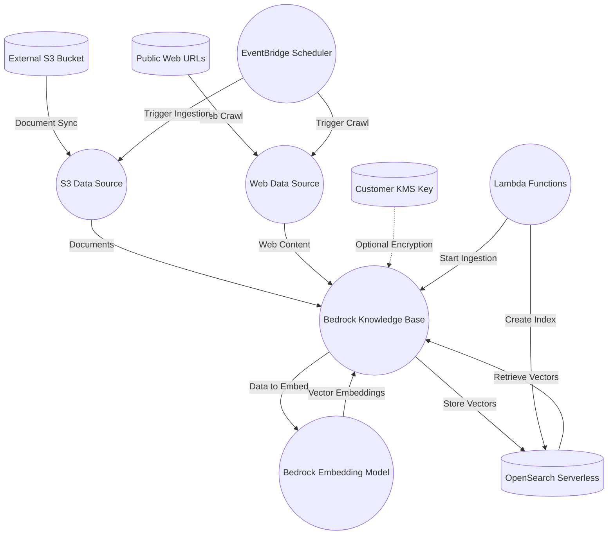
```mermaid
flowchart TD
    ExtS3[(External S3 Bucket)]
    ExtWeb[(Public Web URLs)]
    KB((Bedrock Knowledge Base))
    OSS[(OpenSearch Serverless)]
    BedrockEmbed((Bedrock Embedding Model))
    S3DS((S3 Data Source))
    WebDS((Web Data Source))
    Scheduler((EventBridge Scheduler))
    Lambda((Lambda Functions))
    CustomKMS[(Customer KMS Key)]
    
    ExtS3 -->|Document Sync| S3DS
    ExtWeb -->|Web Crawl| WebDS
    S3DS -->|Documents| KB
    WebDS -->|Web Content| KB
    KB -->|Data to Embed| BedrockEmbed
    BedrockEmbed -->|Vector Embeddings| KB
    KB -->|Store Vectors| OSS
    OSS -->|Retrieve Vectors| KB
    CustomKMS -.->|Optional Encryption| KB
    Scheduler -->|Trigger Ingestion| S3DS
    Scheduler -->|Trigger Crawl| WebDS
    Lambda -->|Create Index| OSS
    Lambda -->|Start Ingestion| KB
```

## options-bedrockkb-template

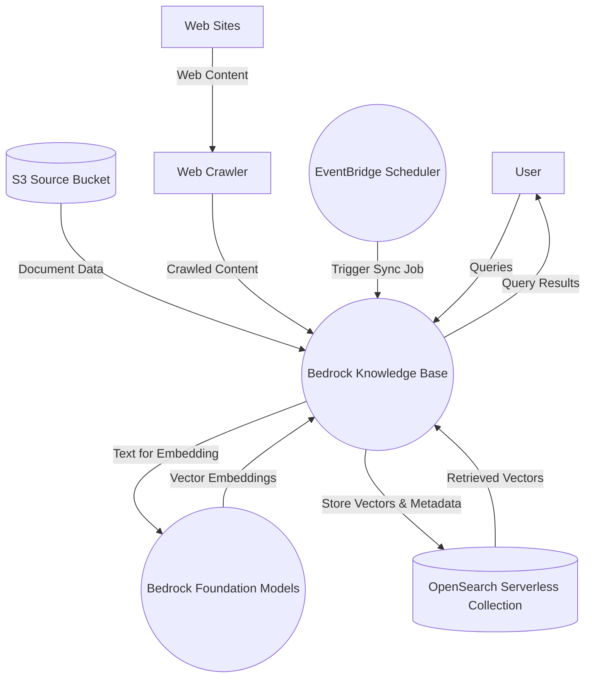
```mermaid
flowchart TD
    User[User]
    S3Source[(S3 Source Bucket)]
    WebCrawler[Web Crawler]
    WebSites[Web Sites]
    KnowledgeBase((Bedrock Knowledge Base))
    BedrockModels((Bedrock Foundation Models))
    OpenSearch[(OpenSearch Serverless Collection)]
    EventBridge((EventBridge Scheduler))
    
    S3Source -->|Document Data| KnowledgeBase
    WebSites -->|Web Content| WebCrawler
    WebCrawler -->|Crawled Content| KnowledgeBase
    KnowledgeBase -->|Text for Embedding| BedrockModels
    BedrockModels -->|Vector Embeddings| KnowledgeBase
    KnowledgeBase -->|Store Vectors & Metadata| OpenSearch
    OpenSearch -->|Retrieved Vectors| KnowledgeBase
    EventBridge -->|Trigger Sync Job| KnowledgeBase
    User -->|Queries| KnowledgeBase
    KnowledgeBase -->|Query Results| User
```

## patterns-pattern-1-.aws-sam-build-template

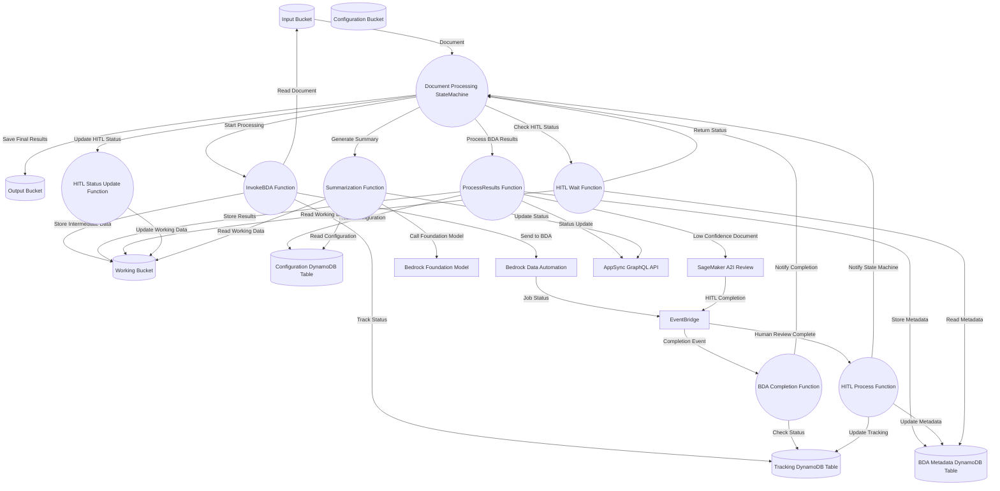
```mermaid
flowchart TD
    InputBucket[(Input Bucket)]
    ConfigBucket[(Configuration Bucket)]
    WorkingBucket[(Working Bucket)]
    OutputBucket[(Output Bucket)]
    TrackingTable[(Tracking DynamoDB Table)]
    BDAMetadataTable[(BDA Metadata DynamoDB Table)]
    ConfigTable[(Configuration DynamoDB Table)]
    
    StateMachine((Document Processing StateMachine))
    InvokeBDA((InvokeBDA Function))
    ProcessResults((ProcessResults Function))
    Summarization((Summarization Function))
    HITLWait((HITL Wait Function))
    HITLStatus((HITL Status Update Function))
    HITLProcess((HITL Process Function))
    BDACompletion((BDA Completion Function))
    
    BedrockDataAutomation[Bedrock Data Automation]
    BedrockModel[Bedrock Foundation Model]
    SageMakerA2I[SageMaker A2I Review]
    EventBridge[EventBridge]
    AppSync[AppSync GraphQL API]
    
    InputBucket -->|Document| StateMachine
    StateMachine -->|Start Processing| InvokeBDA
    InvokeBDA -->|Read Document| InputBucket
    InvokeBDA -->|Track Status| TrackingTable
    InvokeBDA -->|Store Intermediate Data| WorkingBucket
    InvokeBDA -->|Send to BDA| BedrockDataAutomation
    
    BedrockDataAutomation -->|Job Status| EventBridge
    EventBridge -->|Completion Event| BDACompletion
    BDACompletion -->|Check Status| TrackingTable
    BDACompletion -->|Notify Completion| StateMachine
    
    StateMachine -->|Process BDA Results| ProcessResults
    ProcessResults -->|Read Configuration| ConfigTable
    ProcessResults -->|Store Metadata| BDAMetadataTable
    ProcessResults -->|Status Update| AppSync
    ProcessResults -->|Store Results| WorkingBucket
    
    ProcessResults -->|Low Confidence Document| SageMakerA2I
    SageMakerA2I -->|HITL Completion| EventBridge
    EventBridge -->|Human Review Complete| HITLProcess
    HITLProcess -->|Update Metadata| BDAMetadataTable
    HITLProcess -->|Update Tracking| TrackingTable
    HITLProcess -->|Notify State Machine| StateMachine
    
    StateMachine -->|Check HITL Status| HITLWait
    HITLWait -->|Read Metadata| BDAMetadataTable
    HITLWait -->|Read Working Data| WorkingBucket
    HITLWait -->|Return Status| StateMachine
    
    StateMachine -->|Update HITL Status| HITLStatus
    HITLStatus -->|Update Working Data| WorkingBucket
    
    StateMachine -->|Generate Summary| Summarization
    Summarization -->|Read Working Data| WorkingBucket
    Summarization -->|Read Configuration| ConfigTable
    Summarization -->|Call Foundation Model| BedrockModel
    Summarization -->|Update Status| AppSync
    
    StateMachine -->|Save Final Results| OutputBucket
```

## patterns-pattern-1-.aws-sam-packaged

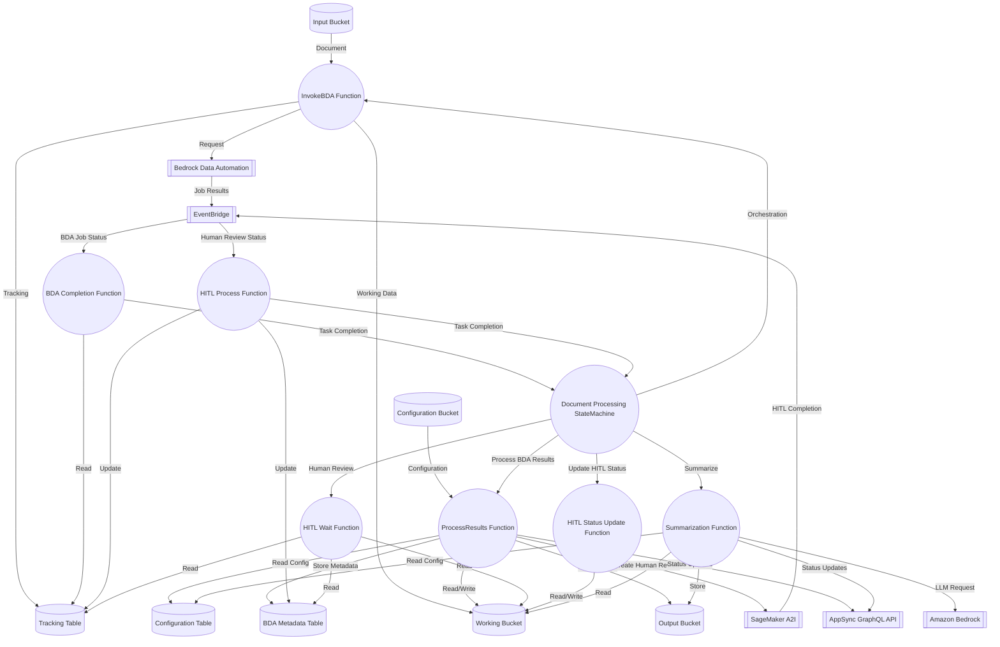
```mermaid
flowchart TD
    InputBucket[(Input Bucket)]
    ConfigBucket[(Configuration Bucket)]
    WorkingBucket[(Working Bucket)]
    OutputBucket[(Output Bucket)]
    TrackingTable[(Tracking Table)]
    ConfigTable[(Configuration Table)]
    BDAMetadataTable[(BDA Metadata Table)]
    
    StateMachine((Document Processing StateMachine))
    InvokeBDA((InvokeBDA Function))
    ProcessResults((ProcessResults Function))
    Summarization((Summarization Function))
    HITLWait((HITL Wait Function))
    HITLStatusUpdate((HITL Status Update Function))
    HITLProcess((HITL Process Function))
    BDACompletion((BDA Completion Function))
    
    AppSync[[AppSync GraphQL API]]
    SageMakerA2I[[SageMaker A2I]]
    EventBridge[[EventBridge]]
    BedDockAuto[[Bedrock Data Automation]]
    Bedrock[[Amazon Bedrock]]
    
    InputBucket -->|Document| InvokeBDA
    ConfigBucket -->|Configuration| ProcessResults
    
    InvokeBDA -->|Request| BedDockAuto
    InvokeBDA -->|Tracking| TrackingTable
    InvokeBDA -->|Working Data| WorkingBucket
    
    BedDockAuto -->|Job Results| EventBridge
    EventBridge -->|BDA Job Status| BDACompletion
    BDACompletion -->|Read| TrackingTable
    BDACompletion -->|Task Completion| StateMachine
    
    StateMachine -->|Orchestration| InvokeBDA
    StateMachine -->|Process BDA Results| ProcessResults
    StateMachine -->|Summarize| Summarization
    StateMachine -->|Human Review| HITLWait
    StateMachine -->|Update HITL Status| HITLStatusUpdate
    
    ProcessResults -->|Read Config| ConfigTable
    ProcessResults -->|Store Metadata| BDAMetadataTable
    ProcessResults -->|Read/Write| WorkingBucket
    ProcessResults -->|Store Results| OutputBucket
    ProcessResults -->|Create Human Review| SageMakerA2I
    ProcessResults -->|Status Updates| AppSync
    
    SageMakerA2I -->|HITL Completion| EventBridge
    EventBridge -->|Human Review Status| HITLProcess
    HITLProcess -->|Update| BDAMetadataTable
    HITLProcess -->|Update| TrackingTable
    HITLProcess -->|Task Completion| StateMachine
    
    HITLWait -->|Read| TrackingTable
    HITLWait -->|Read| BDAMetadataTable
    HITLWait -->|Read| WorkingBucket
    
    HITLStatusUpdate -->|Read/Write| WorkingBucket
    
    Summarization -->|Read Config| ConfigTable
    Summarization -->|Read| WorkingBucket
    Summarization -->|Store| OutputBucket
    Summarization -->|LLM Request| Bedrock
    Summarization -->|Status Updates| AppSync
```

## patterns-pattern-1-template

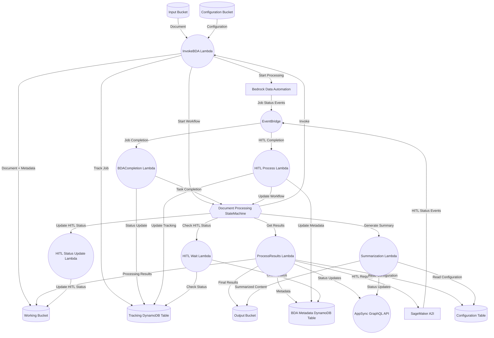
```mermaid
flowchart TD
    InputBucket[(Input Bucket)]
    ConfigBucket[(Configuration Bucket)]
    WorkingBucket[(Working Bucket)]
    OutputBucket[(Output Bucket)]
    TrackingTable[(Tracking DynamoDB Table)]
    BDAMetadataTable[(BDA Metadata DynamoDB Table)]
    ConfigTable[(Configuration Table)]
    
    InvokeBDAFunction((InvokeBDA Lambda))
    BDACompletionFunction((BDACompletion Lambda))
    ProcessResultsFunction((ProcessResults Lambda))
    SummarizationFunction((Summarization Lambda))
    HITLProcessFunction((HITL Process Lambda))
    HITLWaitFunction((HITL Wait Lambda))
    HITLStatusUpdateFunction((HITL Status Update Lambda))
    
    StateMachine{{Document Processing StateMachine}}
    BDA[Bedrock Data Automation]
    EventBridge((EventBridge))
    AppSync((AppSync GraphQL API))
    SageMakerA2I[SageMaker A2I]
    
    InputBucket -->|Document| InvokeBDAFunction
    ConfigBucket -->|Configuration| InvokeBDAFunction
    
    InvokeBDAFunction -->|Document + Metadata| WorkingBucket
    InvokeBDAFunction -->|Track Job| TrackingTable
    InvokeBDAFunction -->|Start Processing| BDA
    InvokeBDAFunction -->|Start Workflow| StateMachine
    
    StateMachine -->|Invoke| InvokeBDAFunction
    StateMachine -->|Get Results| ProcessResultsFunction
    StateMachine -->|Check HITL Status| HITLWaitFunction
    StateMachine -->|Update HITL Status| HITLStatusUpdateFunction
    StateMachine -->|Generate Summary| SummarizationFunction
    
    BDA -->|Job Status Events| EventBridge
    EventBridge -->|Job Completion| BDACompletionFunction
    
    BDACompletionFunction -->|Status Update| TrackingTable
    BDACompletionFunction -->|Task Completion| StateMachine
    
    ProcessResultsFunction -->|Processing Results| WorkingBucket
    ProcessResultsFunction -->|Final Results| OutputBucket
    ProcessResultsFunction -->|Metadata| BDAMetadataTable
    ProcessResultsFunction -->|Status Updates| AppSync
    ProcessResultsFunction -->|HITL Request| SageMakerA2I
    ProcessResultsFunction -->|Read Configuration| ConfigTable
    
    SummarizationFunction -->|Summarized Content| OutputBucket
    SummarizationFunction -->|Read Configuration| ConfigTable
    SummarizationFunction -->|Status Updates| AppSync
    
    SageMakerA2I -->|HITL Status Events| EventBridge
    EventBridge -->|HITL Completion| HITLProcessFunction
    
    HITLProcessFunction -->|Update Workflow| StateMachine
    HITLProcessFunction -->|Update Tracking| TrackingTable
    HITLProcessFunction -->|Update Metadata| BDAMetadataTable
    
    HITLWaitFunction -->|Check Status| BDAMetadataTable
    HITLWaitFunction -->|Check Status| TrackingTable
    
    HITLStatusUpdateFunction -->|Update HITL Status| WorkingBucket
```

## patterns-pattern-2-.aws-sam-build-template

```mermaid
flowchart TD
    InputBucket[(S3 Input Bucket)]
    ConfigBucket[(S3 Configuration Bucket)]
    WorkingBucket[(S3 Working Bucket)]
    OutputBucket[(S3 Output Bucket)]
    TrackingTable[(DynamoDB Tracking Table)]
    ConfigTable[(DynamoDB Configuration Table)]
    
    AppSyncAPI((AppSync API))
    
    OCRFunction((OCR Function))
    ClassificationFunction((Classification Function))
    ExtractionFunction((Extraction Function))
    AssessmentFunction((Assessment Function))
    ProcessResultsFunction((Process Results Function))
    SummarizationFunction((Summarization Function))
    
    Textract{{AWS Textract}}
    Bedrock{{AWS Bedrock}}
    
    StateMachine{{Document Processing StateMachine}}
    
    InputBucket -->|Document Data| StateMachine
    StateMachine -->|OCR Request| OCRFunction
    OCRFunction -->|Read Document| InputBucket
    OCRFunction -->|Store OCR Results| WorkingBucket
    OCRFunction -->|OCR Processing| Textract
    OCRFunction -->|LLM-based OCR| Bedrock
    OCRFunction -->|Status Updates| AppSyncAPI
    
    StateMachine -->|Classification Request| ClassificationFunction
    ClassificationFunction -->|Get OCR Results| WorkingBucket
    ClassificationFunction -->|Get Configuration| ConfigTable
    ClassificationFunction -->|LLM Classification| Bedrock
    ClassificationFunction -->|Store Classification Results| WorkingBucket
    ClassificationFunction -->|Status Updates| AppSyncAPI
    
    StateMachine -->|Extraction Request| ExtractionFunction
    ExtractionFunction -->|Get Classification Results| WorkingBucket
    ExtractionFunction -->|Get Configuration| ConfigTable
    ExtractionFunction -->|LLM Extraction| Bedrock
    ExtractionFunction -->|Store Extraction Results| WorkingBucket
    ExtractionFunction -->|Status Updates| AppSyncAPI
    
    StateMachine -->|Assessment Request| AssessmentFunction
    AssessmentFunction -->|Get Extraction Results| WorkingBucket
    AssessmentFunction -->|Get Configuration| ConfigTable
    AssessmentFunction -->|LLM Assessment| Bedrock
    AssessmentFunction -->|Store Assessment Results| WorkingBucket
    AssessmentFunction -->|Status Updates| AppSyncAPI
    
    StateMachine -->|Summarization Request| SummarizationFunction
    SummarizationFunction -->|Get Document Data| WorkingBucket
    SummarizationFunction -->|Get Configuration| ConfigTable
    SummarizationFunction -->|LLM Summarization| Bedrock
    SummarizationFunction -->|Store Summary Results| WorkingBucket
    SummarizationFunction -->|Status Updates| AppSyncAPI
    
    StateMachine -->|Process Results Request| ProcessResultsFunction
    ProcessResultsFunction -->|Get All Processing Results| WorkingBucket
    ProcessResultsFunction -->|Store Final Results| OutputBucket
    ProcessResultsFunction -->|Status Updates| AppSyncAPI
    
    ConfigBucket -->|Class Examples & Configuration| ConfigTable
```

## patterns-pattern-2-.aws-sam-packaged

```mermaid
flowchart TD
    InputBucket[(Input S3 Bucket)]
    ConfigBucket[(Configuration S3 Bucket)]
    WorkingBucket[(Working S3 Bucket)]
    OutputBucket[(Output S3 Bucket)]
    TrackingTable[(Tracking DynamoDB)]
    ConfigTable[(Configuration DynamoDB)]
    
    StateMachine((DocumentProcessing StateMachine))
    OCR((OCR Function))
    Classification((Classification Function))
    Extraction((Extraction Function))
    Assessment((Assessment Function))
    ProcessResults((ProcessResults Function))
    Summarization((Summarization Function))
    
    Bedrock((AWS Bedrock))
    Textract((AWS Textract))
    AppSync((AppSync API))
    
    InputBucket -->|Document| StateMachine
    StateMachine -->|Document| OCR
    
    OCR -->|Document| Textract
    OCR -->|Image| Bedrock
    OCR -->|OCR Results| WorkingBucket
    OCR -->|Status Update| AppSync
    OCR -->|Configuration Query| ConfigTable
    
    StateMachine -->|OCR Results| Classification
    Classification -->|Document Class| WorkingBucket
    Classification -->|Status Update| AppSync
    Classification -->|LLM Request| Bedrock
    Classification -->|Configuration Query| ConfigTable
    Classification -->|Example Data| ConfigBucket
    Classification -->|Track Document| TrackingTable
    
    StateMachine -->|Document Class| Extraction
    Extraction -->|LLM Request| Bedrock
    Extraction -->|Extracted Data| WorkingBucket
    Extraction -->|Status Update| AppSync
    Extraction -->|Configuration Query| ConfigTable
    Extraction -->|Example Data| ConfigBucket
    
    StateMachine -->|Extracted Data| Assessment
    Assessment -->|LLM Request| Bedrock
    Assessment -->|Assessment Results| WorkingBucket
    Assessment -->|Status Update| AppSync
    Assessment -->|Configuration Query| ConfigTable
    
    StateMachine -->|Assessment Results| Summarization
    Summarization -->|LLM Request| Bedrock
    Summarization -->|Document Summary| WorkingBucket
    Summarization -->|Status Update| AppSync
    Summarization -->|Configuration Query| ConfigTable
    
    StateMachine -->|Processing Results| ProcessResults
    ProcessResults -->|Final Document| OutputBucket
    ProcessResults -->|Status Update| AppSync
    ProcessResults -->|Working Data| WorkingBucket
```

## patterns-pattern-2-template

```mermaid
flowchart TD
    InputBucket[(Input S3 Bucket)]
    ConfigBucket[(Config S3 Bucket)]
    OutputBucket[(Output S3 Bucket)]
    WorkingBucket[(Working S3 Bucket)]
    TrackingTable[(DynamoDB TrackingTable)]
    ConfigTable[(DynamoDB ConfigurationTable)]
    AppSync((AppSync API))
    
    StateMachine((DocumentProcessingStateMachine))
    OCR[[OCR Function]]
    Classification[[Classification Function]]
    Extraction[[Extraction Function]]
    Assessment[[Assessment Function]]
    ProcessResults[[ProcessResults Function]]
    Summarization[[Summarization Function]]
    
    Textract[[AWS Textract]]
    Bedrock[[AWS Bedrock]]
    
    InputBucket -->|Document| StateMachine
    StateMachine -->|Trigger OCR| OCR
    OCR -->|Read Document| InputBucket
    OCR -->|Extract Text| Textract
    OCR -->|Store OCR Results| WorkingBucket
    OCR -->|Status Update| AppSync
    OCR -->|Get Config| ConfigTable
    
    StateMachine -->|Trigger Classification| Classification
    Classification -->|Read Document| WorkingBucket
    Classification -->|Read Config| ConfigBucket
    Classification -->|Get Config| ConfigTable
    Classification -->|Store Tracking Data| TrackingTable
    Classification -->|Document Class| Bedrock
    Classification -->|Store Classification Results| WorkingBucket
    Classification -->|Status Update| AppSync
    
    StateMachine -->|Trigger Extraction| Extraction
    Extraction -->|Read Document| WorkingBucket
    Extraction -->|Read Config| ConfigBucket
    Extraction -->|Get Config| ConfigTable
    Extraction -->|Extract Attributes| Bedrock
    Extraction -->|Store Extraction Results| WorkingBucket
    Extraction -->|Status Update| AppSync
    
    StateMachine -->|Trigger Assessment| Assessment
    Assessment -->|Read Document| WorkingBucket
    Assessment -->|Read Config| ConfigBucket
    Assessment -->|Get Config| ConfigTable
    Assessment -->|Assess Extraction Quality| Bedrock
    Assessment -->|Store Assessment Results| WorkingBucket
    Assessment -->|Status Update| AppSync
    
    StateMachine -->|Trigger Summarization| Summarization
    Summarization -->|Read Document| InputBucket
    Summarization -->|Read Processing Results| WorkingBucket
    Summarization -->|Get Config| ConfigTable
    Summarization -->|Generate Summary| Bedrock
    Summarization -->|Store Summarization Results| WorkingBucket
    Summarization -->|Status Update| AppSync
    
    StateMachine -->|Trigger ProcessResults| ProcessResults
    ProcessResults -->|Read Original Document| InputBucket
    ProcessResults -->|Read Processing Results| WorkingBucket
    ProcessResults -->|Store Final Results| OutputBucket
    ProcessResults -->|Status Update| AppSync
```

## patterns-pattern-3-.aws-sam-build-SAGEMAKERCLASSIFIERSTACK-template

```mermaid
flowchart TD
    User[User]
    S3[(S3 Bucket)]
    SageMakerModel((SageMaker Model))
    SageMakerEndpoint((SageMaker Endpoint))
    AutoScaling((Application AutoScaling))
    
    User -->|Inference Request| SageMakerEndpoint
    S3 -->|Model Artifacts| SageMakerModel
    SageMakerModel -->|Model Definition| SageMakerEndpoint
    AutoScaling -->|Scale In/Out| SageMakerEndpoint
    SageMakerEndpoint -->|Inference Response| User
    SageMakerEndpoint -->|Metrics| AutoScaling
```

## patterns-pattern-3-.aws-sam-build-template

```mermaid
flowchart TD
    InputS3[(InputBucket)]
    ConfigS3[(ConfigurationBucket)]
    OutputS3[(OutputBucket)]
    WorkingS3[(WorkingBucket)]
    TrackingDDB[(TrackingTable)]
    ConfigDDB[(ConfigurationTable)]
    AppSync((AppSyncAPI))
    SM((DocumentProcessing StateMachine))
    OCR((OCRFunction))
    Class((ClassificationFunction))
    Extr((ExtractionFunction))
    Assess((AssessmentFunction))
    Process((ProcessResultsFunction))
    Summary((SummarizationFunction))
    SageMaker((SageMaker Classifier))
    Bedrock((Amazon Bedrock))
    Textract((Amazon Textract))

    InputS3 -->|Document| SM
    SM -->|Start OCR| OCR
    OCR -->|Read Document| InputS3
    OCR -->|Store OCR Results| WorkingS3
    OCR -->|Status Update| AppSync
    SM -->|Start Classification| Class
    Class -->|Read OCR Results| WorkingS3
    Class -->|Read Config| ConfigDDB
    Class -->|Invoke Model| SageMaker
    Class -->|Update Status| TrackingDDB
    Class -->|Store Classification| WorkingS3
    Class -->|Status Update| AppSync
    SM -->|Start Extraction| Extr
    Extr -->|Read OCR Results| WorkingS3
    Extr -->|Read Classification| WorkingS3
    Extr -->|Read Config| ConfigDDB
    Extr -->|LLM API Call| Bedrock
    Extr -->|Store Extraction Results| WorkingS3
    Extr -->|Status Update| AppSync
    SM -->|Start Assessment| Assess
    Assess -->|Read Extraction Results| WorkingS3
    Assess -->|Read Config| ConfigDDB
    Assess -->|LLM API Call| Bedrock
    Assess -->|Store Assessment Results| WorkingS3
    Assess -->|Status Update| AppSync
    SM -->|Start Summarization| Summary
    Summary -->|Read OCR Results| WorkingS3
    Summary -->|Read Config| ConfigDDB
    Summary -->|LLM API Call| Bedrock
    Summary -->|Store Summary| WorkingS3
    Summary -->|Status Update| AppSync
    SM -->|Process Results| Process
    Process -->|Read All Results| WorkingS3
    Process -->|Final Output| OutputS3
    Process -->|Status Update| AppSync
    OCR -->|OCR Request| Textract
    Textract -->|OCR Results| OCR
    ConfigS3 -->|Configuration Data| ConfigDDB
```

## patterns-pattern-3-.aws-sam-packaged

```mermaid
flowchart TD
    InputBucket[(Input Bucket)]
    ConfigBucket[(Configuration Bucket)]
    OutputBucket[(Output Bucket)]
    WorkingBucket[(Working Bucket)]
    TrackingTable[(DynamoDB Tracking Table)]
    ConfigTable[(DynamoDB Configuration Table)]
    
    AppSyncAPI((AppSync API))
    StateMachine((Document Processing StateMachine))
    
    OCRFunction((OCR Function))
    ClassificationFunction((Classification Function))
    ExtractionFunction((Extraction Function))
    AssessmentFunction((Assessment Function))
    ProcessResultsFunction((Process Results Function))
    SummarizationFunction((Summarization Function))
    
    SagemakerEndpoint((SageMaker Classifier Endpoint))
    BedrockAPI((Amazon Bedrock))
    TextractAPI((Amazon Textract))
    
    StateMachine -->|Orchestrate Document Flow| OCRFunction
    InputBucket -->|Raw Documents| OCRFunction
    OCRFunction -->|Document Pages| TextractAPI
    TextractAPI -->|OCR Results| OCRFunction
    OCRFunction -->|OCR Data| WorkingBucket
    OCRFunction -->|Status Updates| AppSyncAPI
    
    StateMachine -->|Next Step| ClassificationFunction
    WorkingBucket -->|OCR Data| ClassificationFunction
    ClassificationFunction -->|Document Features| SagemakerEndpoint
    SagemakerEndpoint -->|Classification Results| ClassificationFunction
    ConfigTable -->|Class Definitions| ClassificationFunction
    ClassificationFunction -->|Classification Results| WorkingBucket
    ClassificationFunction -->|Status Updates| AppSyncAPI
    
    StateMachine -->|Next Step| ExtractionFunction
    WorkingBucket -->|Document & Classification| ExtractionFunction
    ConfigTable -->|Extraction Config| ExtractionFunction
    ExtractionFunction -->|Extraction Prompt| BedrockAPI
    BedrockAPI -->|Extraction Results| ExtractionFunction
    ExtractionFunction -->|Extracted Data| WorkingBucket
    ExtractionFunction -->|Status Updates| AppSyncAPI
    
    StateMachine -->|Next Step| AssessmentFunction
    WorkingBucket -->|Extracted Data| AssessmentFunction
    ConfigTable -->|Assessment Config| AssessmentFunction
    AssessmentFunction -->|Assessment Prompt| BedrockAPI
    BedrockAPI -->|Assessment Results| AssessmentFunction
    AssessmentFunction -->|Assessment Data| WorkingBucket
    AssessmentFunction -->|Status Updates| AppSyncAPI
    
    StateMachine -->|Next Step| SummarizationFunction
    WorkingBucket -->|Document & Extracted Data| SummarizationFunction
    ConfigTable -->|Summarization Config| SummarizationFunction
    SummarizationFunction -->|Summarization Prompt| BedrockAPI
    BedrockAPI -->|Summary| SummarizationFunction
    SummarizationFunction -->|Summary Data| WorkingBucket
    SummarizationFunction -->|Status Updates| AppSyncAPI
    
    StateMachine -->|Final Step| ProcessResultsFunction
    WorkingBucket -->|Processing Results| ProcessResultsFunction
    ProcessResultsFunction -->|Final Results| OutputBucket
    ProcessResultsFunction -->|Status Updates| AppSyncAPI
```

## patterns-pattern-3-sagemaker_classifier_endpoint

```mermaid
flowchart TD
    User[User]
    SageMakerEndpoint((SageMaker Endpoint))
    SageMakerModel((SageMaker Model))
    S3[(S3 Bucket)]
    AutoScaling((ApplicationAutoScaling))
    
    User -->|Inference Request| SageMakerEndpoint
    SageMakerEndpoint -->|Request| SageMakerModel
    SageMakerModel -->|Load Model Artifacts| S3
    S3 -->|Model Data| SageMakerModel
    SageMakerModel -->|Inference Results| SageMakerEndpoint
    SageMakerEndpoint -->|Response| User
    
    AutoScaling -->|Scale Instances| SageMakerEndpoint
    SageMakerEndpoint -->|Metrics| AutoScaling
```

## patterns-pattern-3-template

```mermaid
flowchart TD
    InputBucket[(Input Bucket)]
    WorkingBucket[(Working Bucket)]
    ConfigBucket[(Configuration Bucket)]
    OutputBucket[(Output Bucket)]
    TrackingTable[(Tracking DynamoDB Table)]
    ConfigTable[(Configuration DynamoDB Table)]
    AppSync((AppSync API))

    OCRFunction((OCR Function))
    ClassificationFunction((Classification Function))
    ExtractionFunction((Extraction Function))
    AssessmentFunction((Assessment Function))
    ProcessResultsFunction((Process Results Function))
    SummarizationFunction((Summarization Function))
    SagemakerEndpoint((UDOP SageMaker Endpoint))
    
    StateMachine((Document Processing StateMachine))
    Bedrock((Amazon Bedrock))
    Textract((Amazon Textract))

    InputBucket -->|Document| StateMachine
    StateMachine -->|Document Processing Request| OCRFunction
    
    OCRFunction -->|Document| Textract
    Textract -->|OCR Results| OCRFunction
    OCRFunction -->|OCR Data| WorkingBucket
    OCRFunction -->|Status Update| AppSync
    
    StateMachine -->|Classification Request| ClassificationFunction
    ClassificationFunction -->|Working Data| WorkingBucket
    ClassificationFunction -->|Document Image| SagemakerEndpoint
    SagemakerEndpoint -->|Classification Results| ClassificationFunction
    ClassificationFunction -->|Document Class| TrackingTable
    ClassificationFunction -->|Status Update| AppSync
    
    StateMachine -->|Extraction Request| ExtractionFunction
    ExtractionFunction -->|Document Data| WorkingBucket
    ExtractionFunction -->|Extraction Prompt| Bedrock
    Bedrock -->|Extraction Results| ExtractionFunction
    ExtractionFunction -->|Extracted Data| WorkingBucket
    ExtractionFunction -->|Status Update| AppSync
    
    StateMachine -->|Assessment Request| AssessmentFunction
    AssessmentFunction -->|Document Data| WorkingBucket
    AssessmentFunction -->|Assessment Prompt| Bedrock
    Bedrock -->|Assessment Results| AssessmentFunction
    AssessmentFunction -->|Assessment Data| WorkingBucket
    AssessmentFunction -->|Status Update| AppSync
    
    StateMachine -->|Summarization Request| SummarizationFunction
    SummarizationFunction -->|Document Data| WorkingBucket
    SummarizationFunction -->|Summarization Prompt| Bedrock
    Bedrock -->|Summary| SummarizationFunction
    SummarizationFunction -->|Summary Data| WorkingBucket
    SummarizationFunction -->|Status Update| AppSync
    
    StateMachine -->|Results Processing| ProcessResultsFunction
    ProcessResultsFunction -->|Working Data| WorkingBucket
    ProcessResultsFunction -->|Final Results| OutputBucket
    ProcessResultsFunction -->|Status Update| AppSync
    
    ConfigBucket -->|Configuration Data| OCRFunction
    ConfigBucket -->|Configuration Data| ClassificationFunction
    ConfigBucket -->|Configuration Data| ExtractionFunction
    ConfigBucket -->|Configuration Data| AssessmentFunction
    ConfigBucket -->|Configuration Data| SummarizationFunction
    
    ConfigTable -->|Settings| OCRFunction
    ConfigTable -->|Settings| ClassificationFunction
    ConfigTable -->|Settings| ExtractionFunction
    ConfigTable -->|Settings| AssessmentFunction
    ConfigTable -->|Settings| SummarizationFunction
```

## scripts-sdlc-cfn-codepipeline-s3

```mermaid
flowchart TD
    S3Source[(Source S3 Bucket)]
    CodePipeline{{CodePipeline}}
    CodeBuild((CodeBuild Project))
    ArtifactS3[(Artifact S3 Bucket)]
    AWSServices[AWS Services]
    
    S3Source -->|Source Code| CodePipeline
    CodePipeline -->|Source Artifact| ArtifactS3
    ArtifactS3 -->|Build Input| CodeBuild
    CodeBuild -->|Build Output| ArtifactS3
    CodeBuild -->|Read/Write Access| AWSServices
    CodeBuild -->|Deployment Commands| AWSServices
    ArtifactS3 -->|Artifact Storage| CodePipeline
```

## scripts-sdlc-cfn-credential-vendor

```mermaid
flowchart TD
    GitLab[GitLab]
    GitLabRunners[GitLab Runners]
    GitLabRole((IAM Role: GitLab))
    S3[(Source Code Bucket)]
    CodePipeline((AWS CodePipeline))
    CodeBuild((AWS CodeBuild))
    CloudWatchLogs[(CloudWatch Logs)]
    
    GitLab -->|Triggers| GitLabRunners
    GitLabRunners -->|Assumes Role with Tags| GitLabRole
    GitLabRole -->|PutObject| S3
    GitLabRole -->|Monitor Pipeline State| CodePipeline
    GitLabRole -->|Get Build Info| CodeBuild
    GitLabRole -->|Access Logs| CloudWatchLogs
    S3 -->|Deployment Package| CodePipeline
    CodePipeline -->|Triggers| CodeBuild
    CodeBuild -->|Logs| CloudWatchLogs
```

## scripts-sdlc-cfn-s3-sourcecode

```mermaid
flowchart TD
    User[User/Deployer]
    S3[(S3 Bucket<br>idp-sdlc-sourcecode)]
    
    User -->|Upload Deployment Artifacts| S3
    User -->|Access Versioned Objects| S3
    
    classDef storage fill:#3b78cf,stroke:#333,stroke-width:2px;
    classDef user fill:#f96,stroke:#333,stroke-width:2px;
    
    class S3 storage;
    class User user;
```

## scripts-sdlc-cfn-sdlc-iam-role

```mermaid
flowchart TD
    EC2[EC2 Instance]
    CodeBuild[CodeBuild]
    CloudFormation[CloudFormation]
    BuilderRole((idp-sdlc-role))
    IAMPolicy[[LimitedIAMAccess Policy]]
    PowerUserPolicy[[PowerUserAccess Policy]]
    IAMResources[(IAM Resources)]
    
    EC2 -->|Assume Role| BuilderRole
    CodeBuild -->|Assume Role| BuilderRole
    CloudFormation -->|Assume Role| BuilderRole
    
    BuilderRole -->|Attached Policy| IAMPolicy
    BuilderRole -->|Attached Policy| PowerUserPolicy
    
    IAMPolicy -->|Limited IAM Permissions| BuilderRole
    PowerUserPolicy -->|PowerUser Permissions| BuilderRole
    
    BuilderRole -->|Create/Modify/Delete| IAMResources
    BuilderRole -->|Pass Role| IAMResources
    BuilderRole -->|Tag/Untag| IAMResources
```

## template

```mermaid
flowchart TD
    User[End User]
    CloudFront((CloudFront Distribution))
    WebUIBucket[(Web UI Bucket)]
    CognitoUserPool((Cognito User Pool))
    APIGateway((AppSync GraphQL API))
    
    InputBucket[(Input Bucket)]
    ConfigBucket[(Configuration Bucket)]
    OutputBucket[(Output Bucket)]
    ReportingBucket[(Reporting Bucket)]
    BaselineBucket[(Evaluation Baseline Bucket)]
    
    QueueSender((Queue Sender Lambda))
    DocumentQueue[(SQS Queue)]
    QueueProcessor((Queue Processor Lambda))
    
    StateMachine((Step Functions Workflow))
    WorkflowTracker((Workflow Tracker Lambda))
    
    TrackingTable[(DynamoDB Tracking Table)]
    ConfigTable[(DynamoDB Config Table)]
    ConcurrencyTable[(DynamoDB Concurrency Table)]
    AnalyticsTable[(DynamoDB Analytics Table)]
    
    EvaluationFunction((Evaluation Function))
    AnalyticsProcessor((Analytics Processor))
    BedrockKB((Bedrock Knowledge Base))
    
    Pattern1[Pattern 1 Processing]
    Pattern2[Pattern 2 Processing]
    Pattern3[Pattern 3 Processing]
    
    BDA[(Bedrock Data Automation)]
    Textract[(Amazon Textract)]
    Bedrock[(Amazon Bedrock)]
    SageMaker[(SageMaker/UDOP)]
    HITL[(Human-in-the-Loop)]

    User -->|Authentication| CognitoUserPool
    User -->|HTTPS| CloudFront
    CloudFront -->|Static Content| WebUIBucket
    CloudFront -->|API Requests| APIGateway
    User -->|Direct Upload| InputBucket

    APIGateway -->|CRUD Operations| TrackingTable
    APIGateway -->|Config Operations| ConfigTable
    APIGateway -->|Analytics Queries| AnalyticsTable
    APIGateway -->|KB Queries| BedrockKB
    APIGateway -->|Upload URLs| InputBucket
    APIGateway -->|File Access| OutputBucket
    APIGateway -->|Copy| BaselineBucket
    
    InputBucket -->|Object Created Event| QueueSender
    QueueSender -->|Document Metadata| APIGateway
    QueueSender -->|Enqueue Document| DocumentQueue
    QueueProcessor -->|Dequeue Document| DocumentQueue
    QueueProcessor -->|Check Concurrency| ConcurrencyTable
    QueueProcessor -->|Start Workflow| StateMachine
    QueueProcessor -->|Update Status| TrackingTable
    QueueProcessor -->|Publish Update| APIGateway
    
    StateMachine -->|Pattern Selection| Pattern1
    StateMachine -->|Pattern Selection| Pattern2
    StateMachine -->|Pattern Selection| Pattern3
    
    Pattern1 -->|Document Processing| BDA
    Pattern1 -->|Human Review| HITL
    Pattern2 -->|Document Processing| Textract
    Pattern2 -->|Analysis| Bedrock
    Pattern3 -->|Document Processing| Textract
    Pattern3 -->|Document Understanding| SageMaker
    Pattern3 -->|Analysis| Bedrock
    
    Pattern1 -->|Results| OutputBucket
    Pattern2 -->|Results| OutputBucket
    Pattern3 -->|Results| OutputBucket
    
    StateMachine -->|Completion Event| WorkflowTracker
    WorkflowTracker -->|Update Status| TrackingTable
    WorkflowTracker -->|Update Concurrency| ConcurrencyTable
    WorkflowTracker -->|Publish Update| APIGateway
    
    StateMachine -->|Workflow Complete| EvaluationFunction
    EvaluationFunction -->|Compare Results| BaselineBucket
    EvaluationFunction -->|Save Metrics| ReportingBucket
    EvaluationFunction -->|Save Results| OutputBucket
    
    APIGateway -->|Analysis Request| AnalyticsProcessor
    AnalyticsProcessor -->|Query Data| ReportingBucket
    AnalyticsProcessor -->|Store Results| AnalyticsTable
    
    OutputBucket -->|Document Content| BedrockKB
```

