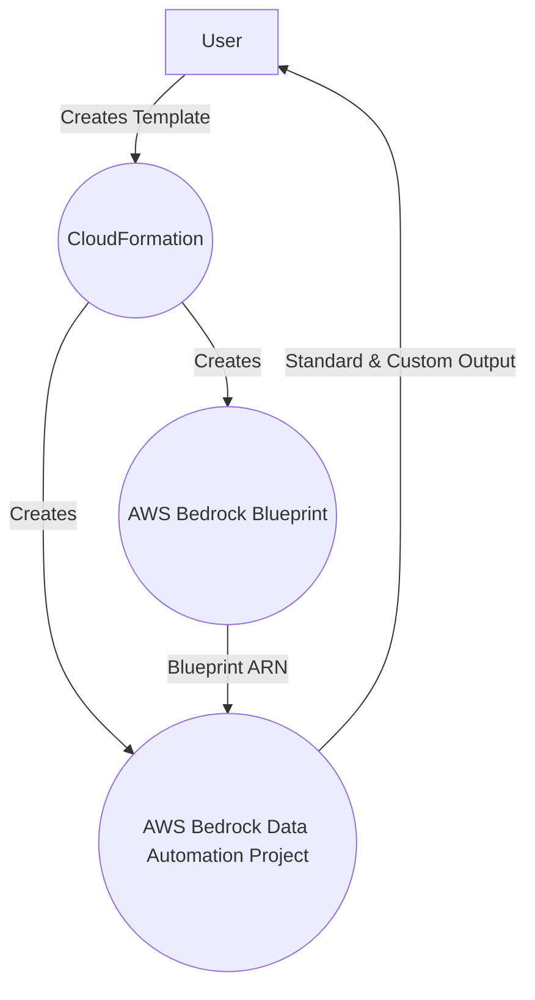

```mermaid
flowchart TD
    User[User]
    CloudFormation((CloudFormation))
    BedrockBlueprint((AWS Bedrock Blueprint))
    BedRockDataAutomationProject((AWS Bedrock Data Automation Project))
    
    User -->|Creates Template| CloudFormation
    CloudFormation -->|Creates| BedrockBlueprint
    CloudFormation -->|Creates| BedRockDataAutomationProject
    BedrockBlueprint -->|Blueprint ARN| BedRockDataAutomationProject
    BedRockDataAutomationProject -->|Standard & Custom Output| User
```