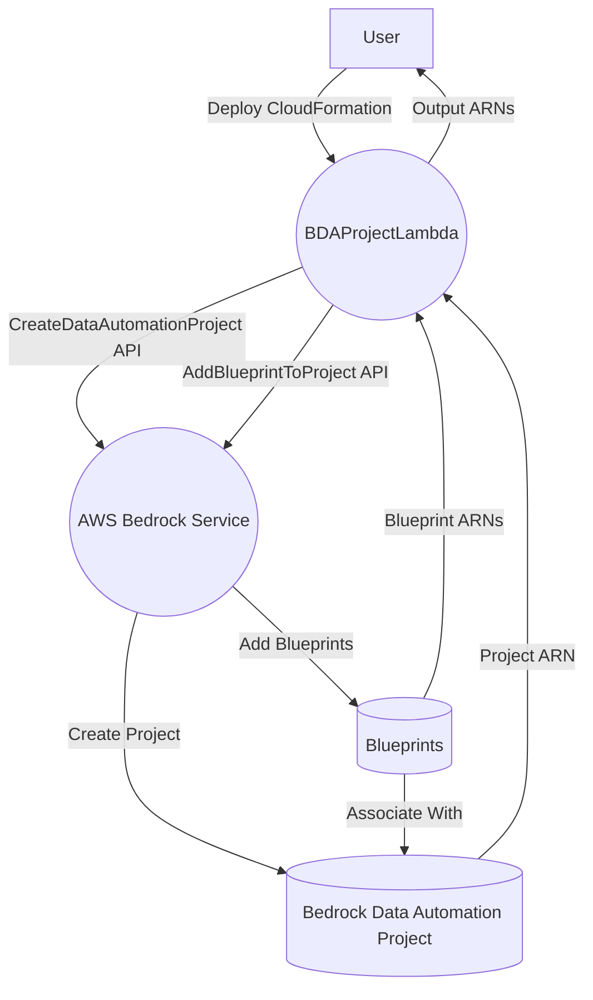

```mermaid
flowchart TD
    User[User]
    BDAProjectLambda((BDAProjectLambda))
    BedrockService((AWS Bedrock Service))
    BDAProject[(Bedrock Data Automation Project)]
    Blueprints[(Blueprints)]
    
    User -->|Deploy CloudFormation| BDAProjectLambda
    BDAProjectLambda -->|CreateDataAutomationProject API| BedrockService
    BDAProjectLambda -->|AddBlueprintToProject API| BedrockService
    BedrockService -->|Create Project| BDAProject
    BedrockService -->|Add Blueprints| Blueprints
    Blueprints -->|Associate With| BDAProject
    BDAProject -->|Project ARN| BDAProjectLambda
    Blueprints -->|Blueprint ARNs| BDAProjectLambda
    BDAProjectLambda -->|Output ARNs| User
```