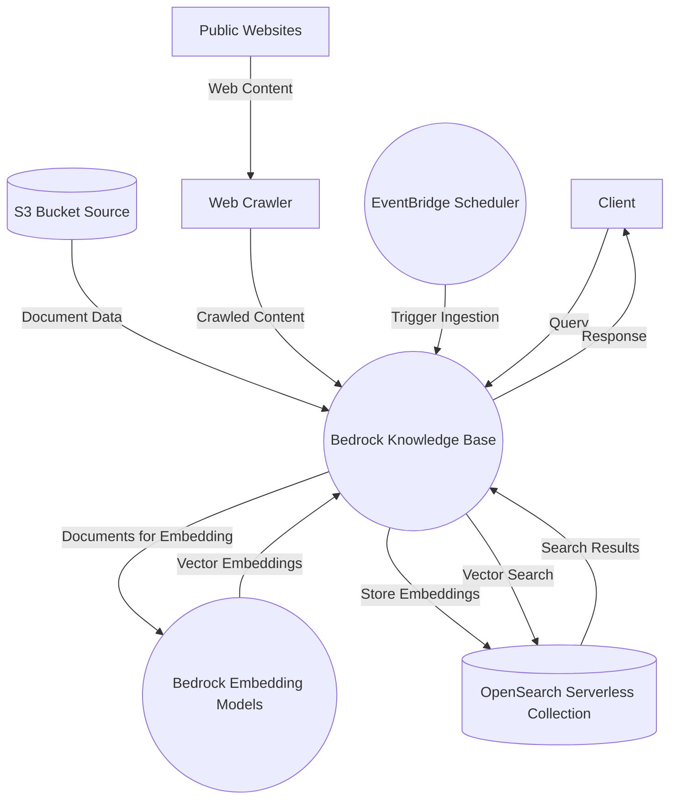

```mermaid
flowchart TD
    Client[Client]
    S3Source[(S3 Bucket Source)]
    WebCrawler[Web Crawler]
    PublicWebsites[Public Websites]
    KnowledgeBase((Bedrock Knowledge Base))
    OSSCollection[(OpenSearch Serverless Collection)]
    BedrockEmbed((Bedrock Embedding Models))
    
    %% Data flows for S3 source
    S3Source -->|Document Data| KnowledgeBase
    
    %% Data flows for Web crawler
    PublicWebsites -->|Web Content| WebCrawler
    WebCrawler -->|Crawled Content| KnowledgeBase
    
    %% Knowledge Base processing
    KnowledgeBase -->|Documents for Embedding| BedrockEmbed
    BedrockEmbed -->|Vector Embeddings| KnowledgeBase
    KnowledgeBase -->|Store Embeddings| OSSCollection
    
    %% Scheduled ingestion
    EventBridge((EventBridge Scheduler)) -->|Trigger Ingestion| KnowledgeBase
    
    %% Client access flows
    Client -->|Query| KnowledgeBase
    KnowledgeBase -->|Vector Search| OSSCollection
    OSSCollection -->|Search Results| KnowledgeBase
    KnowledgeBase -->|Response| Client
```