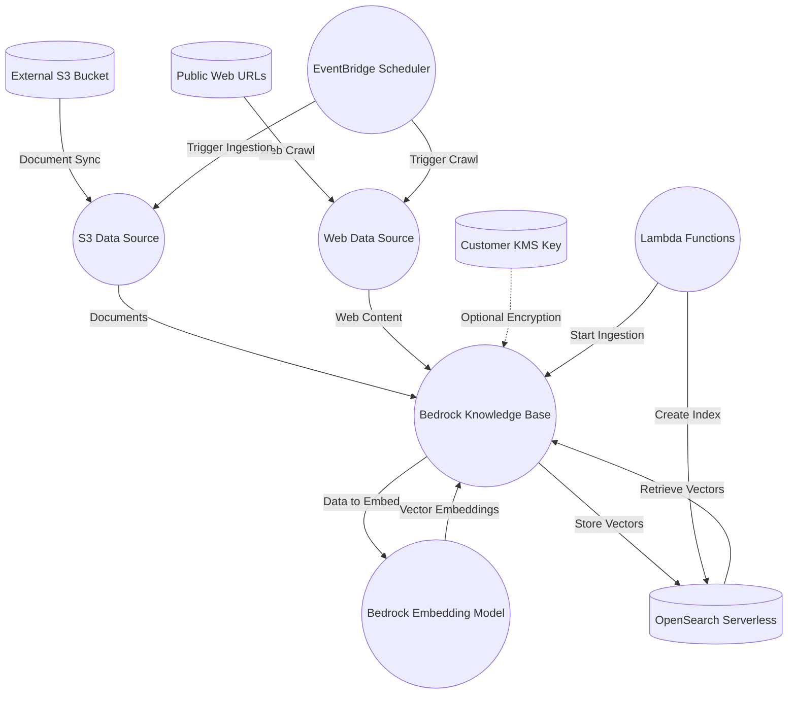

```mermaid
flowchart TD
    ExtS3[(External S3 Bucket)]
    ExtWeb[(Public Web URLs)]
    KB((Bedrock Knowledge Base))
    OSS[(OpenSearch Serverless)]
    BedrockEmbed((Bedrock Embedding Model))
    S3DS((S3 Data Source))
    WebDS((Web Data Source))
    Scheduler((EventBridge Scheduler))
    Lambda((Lambda Functions))
    CustomKMS[(Customer KMS Key)]
    
    ExtS3 -->|Document Sync| S3DS
    ExtWeb -->|Web Crawl| WebDS
    S3DS -->|Documents| KB
    WebDS -->|Web Content| KB
    KB -->|Data to Embed| BedrockEmbed
    BedrockEmbed -->|Vector Embeddings| KB
    KB -->|Store Vectors| OSS
    OSS -->|Retrieve Vectors| KB
    CustomKMS -.->|Optional Encryption| KB
    Scheduler -->|Trigger Ingestion| S3DS
    Scheduler -->|Trigger Crawl| WebDS
    Lambda -->|Create Index| OSS
    Lambda -->|Start Ingestion| KB
```