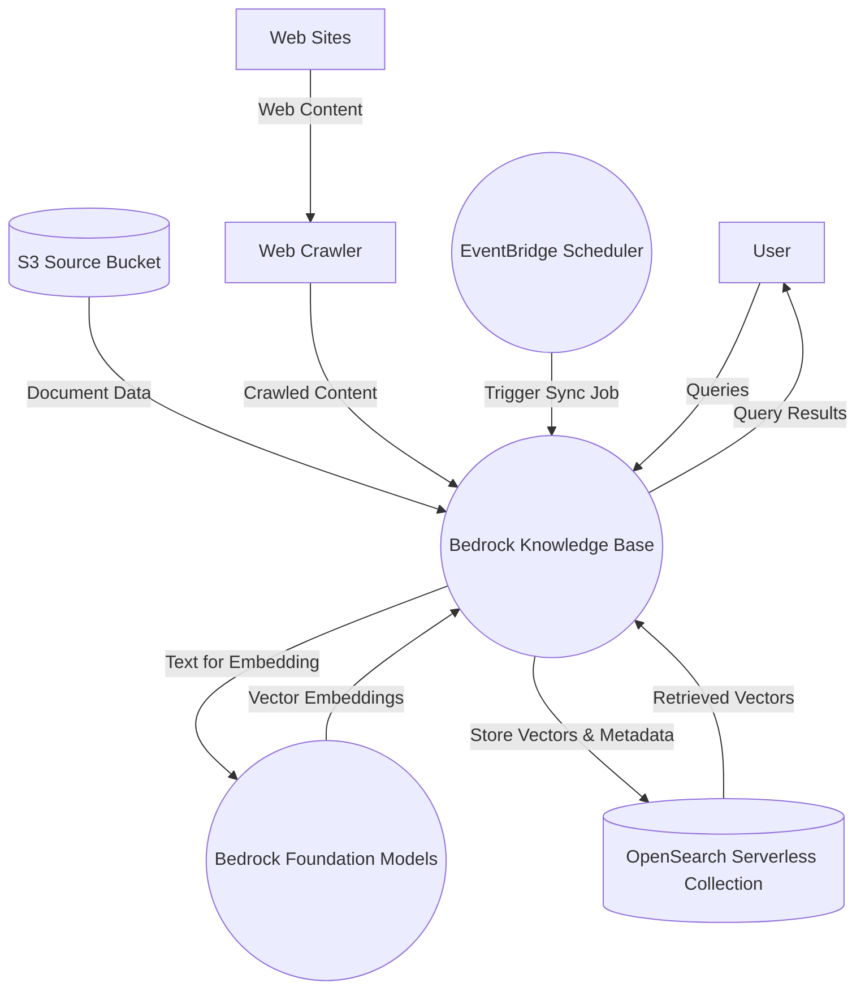

```mermaid
flowchart TD
    User[User]
    S3Source[(S3 Source Bucket)]
    WebCrawler[Web Crawler]
    WebSites[Web Sites]
    KnowledgeBase((Bedrock Knowledge Base))
    BedrockModels((Bedrock Foundation Models))
    OpenSearch[(OpenSearch Serverless Collection)]
    EventBridge((EventBridge Scheduler))
    
    S3Source -->|Document Data| KnowledgeBase
    WebSites -->|Web Content| WebCrawler
    WebCrawler -->|Crawled Content| KnowledgeBase
    KnowledgeBase -->|Text for Embedding| BedrockModels
    BedrockModels -->|Vector Embeddings| KnowledgeBase
    KnowledgeBase -->|Store Vectors & Metadata| OpenSearch
    OpenSearch -->|Retrieved Vectors| KnowledgeBase
    EventBridge -->|Trigger Sync Job| KnowledgeBase
    User -->|Queries| KnowledgeBase
    KnowledgeBase -->|Query Results| User
```