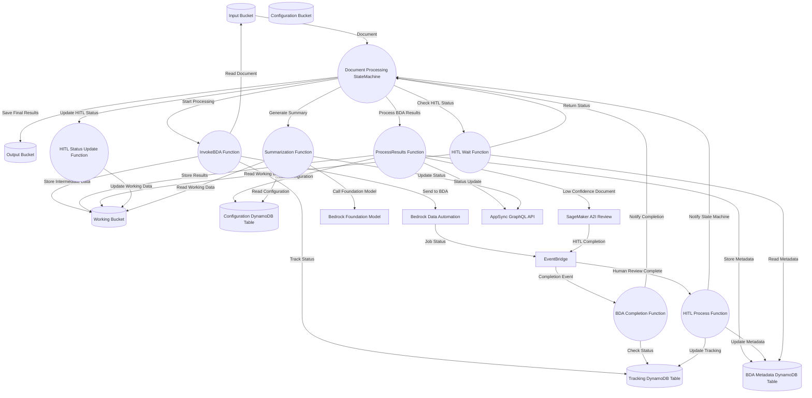

```mermaid
flowchart TD
    InputBucket[(Input Bucket)]
    ConfigBucket[(Configuration Bucket)]
    WorkingBucket[(Working Bucket)]
    OutputBucket[(Output Bucket)]
    TrackingTable[(Tracking DynamoDB Table)]
    BDAMetadataTable[(BDA Metadata DynamoDB Table)]
    ConfigTable[(Configuration DynamoDB Table)]
    
    StateMachine((Document Processing StateMachine))
    InvokeBDA((InvokeBDA Function))
    ProcessResults((ProcessResults Function))
    Summarization((Summarization Function))
    HITLWait((HITL Wait Function))
    HITLStatus((HITL Status Update Function))
    HITLProcess((HITL Process Function))
    BDACompletion((BDA Completion Function))
    
    BedrockDataAutomation[Bedrock Data Automation]
    BedrockModel[Bedrock Foundation Model]
    SageMakerA2I[SageMaker A2I Review]
    EventBridge[EventBridge]
    AppSync[AppSync GraphQL API]
    
    InputBucket -->|Document| StateMachine
    StateMachine -->|Start Processing| InvokeBDA
    InvokeBDA -->|Read Document| InputBucket
    InvokeBDA -->|Track Status| TrackingTable
    InvokeBDA -->|Store Intermediate Data| WorkingBucket
    InvokeBDA -->|Send to BDA| BedrockDataAutomation
    
    BedrockDataAutomation -->|Job Status| EventBridge
    EventBridge -->|Completion Event| BDACompletion
    BDACompletion -->|Check Status| TrackingTable
    BDACompletion -->|Notify Completion| StateMachine
    
    StateMachine -->|Process BDA Results| ProcessResults
    ProcessResults -->|Read Configuration| ConfigTable
    ProcessResults -->|Store Metadata| BDAMetadataTable
    ProcessResults -->|Status Update| AppSync
    ProcessResults -->|Store Results| WorkingBucket
    
    ProcessResults -->|Low Confidence Document| SageMakerA2I
    SageMakerA2I -->|HITL Completion| EventBridge
    EventBridge -->|Human Review Complete| HITLProcess
    HITLProcess -->|Update Metadata| BDAMetadataTable
    HITLProcess -->|Update Tracking| TrackingTable
    HITLProcess -->|Notify State Machine| StateMachine
    
    StateMachine -->|Check HITL Status| HITLWait
    HITLWait -->|Read Metadata| BDAMetadataTable
    HITLWait -->|Read Working Data| WorkingBucket
    HITLWait -->|Return Status| StateMachine
    
    StateMachine -->|Update HITL Status| HITLStatus
    HITLStatus -->|Update Working Data| WorkingBucket
    
    StateMachine -->|Generate Summary| Summarization
    Summarization -->|Read Working Data| WorkingBucket
    Summarization -->|Read Configuration| ConfigTable
    Summarization -->|Call Foundation Model| BedrockModel
    Summarization -->|Update Status| AppSync
    
    StateMachine -->|Save Final Results| OutputBucket
```