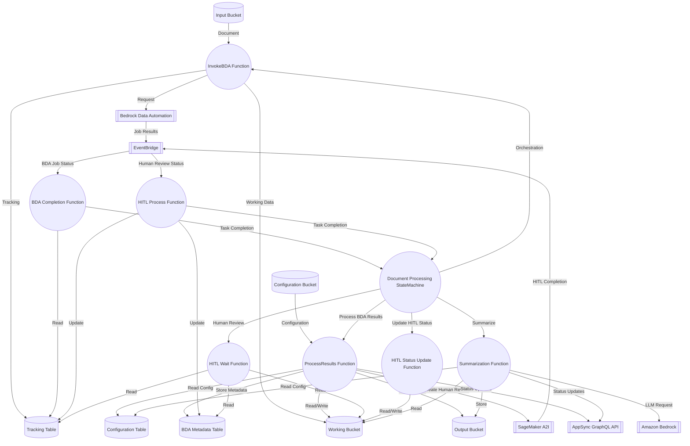

```mermaid
flowchart TD
    InputBucket[(Input Bucket)]
    ConfigBucket[(Configuration Bucket)]
    WorkingBucket[(Working Bucket)]
    OutputBucket[(Output Bucket)]
    TrackingTable[(Tracking Table)]
    ConfigTable[(Configuration Table)]
    BDAMetadataTable[(BDA Metadata Table)]
    
    StateMachine((Document Processing StateMachine))
    InvokeBDA((InvokeBDA Function))
    ProcessResults((ProcessResults Function))
    Summarization((Summarization Function))
    HITLWait((HITL Wait Function))
    HITLStatusUpdate((HITL Status Update Function))
    HITLProcess((HITL Process Function))
    BDACompletion((BDA Completion Function))
    
    AppSync[[AppSync GraphQL API]]
    SageMakerA2I[[SageMaker A2I]]
    EventBridge[[EventBridge]]
    BedDockAuto[[Bedrock Data Automation]]
    Bedrock[[Amazon Bedrock]]
    
    InputBucket -->|Document| InvokeBDA
    ConfigBucket -->|Configuration| ProcessResults
    
    InvokeBDA -->|Request| BedDockAuto
    InvokeBDA -->|Tracking| TrackingTable
    InvokeBDA -->|Working Data| WorkingBucket
    
    BedDockAuto -->|Job Results| EventBridge
    EventBridge -->|BDA Job Status| BDACompletion
    BDACompletion -->|Read| TrackingTable
    BDACompletion -->|Task Completion| StateMachine
    
    StateMachine -->|Orchestration| InvokeBDA
    StateMachine -->|Process BDA Results| ProcessResults
    StateMachine -->|Summarize| Summarization
    StateMachine -->|Human Review| HITLWait
    StateMachine -->|Update HITL Status| HITLStatusUpdate
    
    ProcessResults -->|Read Config| ConfigTable
    ProcessResults -->|Store Metadata| BDAMetadataTable
    ProcessResults -->|Read/Write| WorkingBucket
    ProcessResults -->|Store Results| OutputBucket
    ProcessResults -->|Create Human Review| SageMakerA2I
    ProcessResults -->|Status Updates| AppSync
    
    SageMakerA2I -->|HITL Completion| EventBridge
    EventBridge -->|Human Review Status| HITLProcess
    HITLProcess -->|Update| BDAMetadataTable
    HITLProcess -->|Update| TrackingTable
    HITLProcess -->|Task Completion| StateMachine
    
    HITLWait -->|Read| TrackingTable
    HITLWait -->|Read| BDAMetadataTable
    HITLWait -->|Read| WorkingBucket
    
    HITLStatusUpdate -->|Read/Write| WorkingBucket
    
    Summarization -->|Read Config| ConfigTable
    Summarization -->|Read| WorkingBucket
    Summarization -->|Store| OutputBucket
    Summarization -->|LLM Request| Bedrock
    Summarization -->|Status Updates| AppSync
```