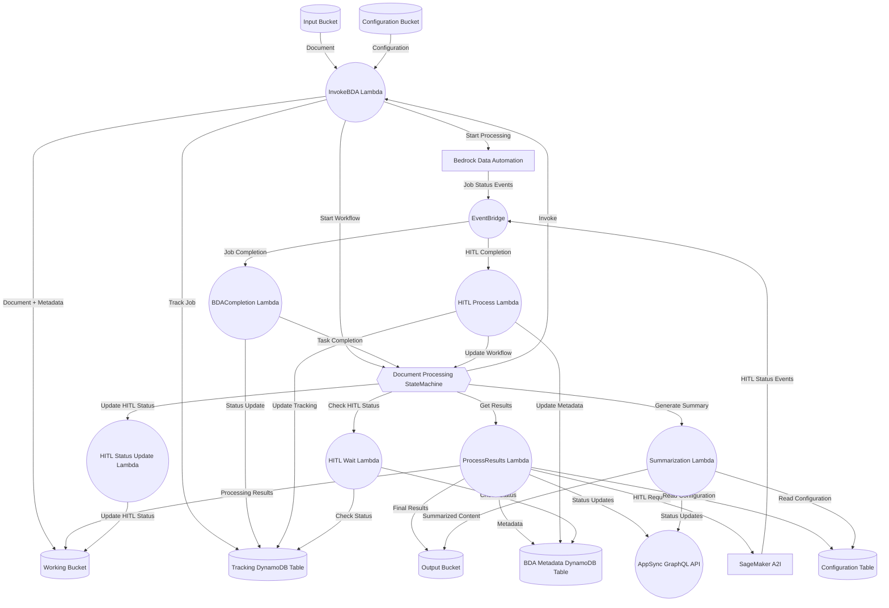

```mermaid
flowchart TD
    InputBucket[(Input Bucket)]
    ConfigBucket[(Configuration Bucket)]
    WorkingBucket[(Working Bucket)]
    OutputBucket[(Output Bucket)]
    TrackingTable[(Tracking DynamoDB Table)]
    BDAMetadataTable[(BDA Metadata DynamoDB Table)]
    ConfigTable[(Configuration Table)]
    
    InvokeBDAFunction((InvokeBDA Lambda))
    BDACompletionFunction((BDACompletion Lambda))
    ProcessResultsFunction((ProcessResults Lambda))
    SummarizationFunction((Summarization Lambda))
    HITLProcessFunction((HITL Process Lambda))
    HITLWaitFunction((HITL Wait Lambda))
    HITLStatusUpdateFunction((HITL Status Update Lambda))
    
    StateMachine{{Document Processing StateMachine}}
    BDA[Bedrock Data Automation]
    EventBridge((EventBridge))
    AppSync((AppSync GraphQL API))
    SageMakerA2I[SageMaker A2I]
    
    InputBucket -->|Document| InvokeBDAFunction
    ConfigBucket -->|Configuration| InvokeBDAFunction
    
    InvokeBDAFunction -->|Document + Metadata| WorkingBucket
    InvokeBDAFunction -->|Track Job| TrackingTable
    InvokeBDAFunction -->|Start Processing| BDA
    InvokeBDAFunction -->|Start Workflow| StateMachine
    
    StateMachine -->|Invoke| InvokeBDAFunction
    StateMachine -->|Get Results| ProcessResultsFunction
    StateMachine -->|Check HITL Status| HITLWaitFunction
    StateMachine -->|Update HITL Status| HITLStatusUpdateFunction
    StateMachine -->|Generate Summary| SummarizationFunction
    
    BDA -->|Job Status Events| EventBridge
    EventBridge -->|Job Completion| BDACompletionFunction
    
    BDACompletionFunction -->|Status Update| TrackingTable
    BDACompletionFunction -->|Task Completion| StateMachine
    
    ProcessResultsFunction -->|Processing Results| WorkingBucket
    ProcessResultsFunction -->|Final Results| OutputBucket
    ProcessResultsFunction -->|Metadata| BDAMetadataTable
    ProcessResultsFunction -->|Status Updates| AppSync
    ProcessResultsFunction -->|HITL Request| SageMakerA2I
    ProcessResultsFunction -->|Read Configuration| ConfigTable
    
    SummarizationFunction -->|Summarized Content| OutputBucket
    SummarizationFunction -->|Read Configuration| ConfigTable
    SummarizationFunction -->|Status Updates| AppSync
    
    SageMakerA2I -->|HITL Status Events| EventBridge
    EventBridge -->|HITL Completion| HITLProcessFunction
    
    HITLProcessFunction -->|Update Workflow| StateMachine
    HITLProcessFunction -->|Update Tracking| TrackingTable
    HITLProcessFunction -->|Update Metadata| BDAMetadataTable
    
    HITLWaitFunction -->|Check Status| BDAMetadataTable
    HITLWaitFunction -->|Check Status| TrackingTable
    
    HITLStatusUpdateFunction -->|Update HITL Status| WorkingBucket
```