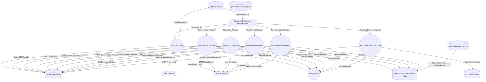

```mermaid
flowchart TD
    InputBucket[(S3 Input Bucket)]
    ConfigBucket[(S3 Configuration Bucket)]
    WorkingBucket[(S3 Working Bucket)]
    OutputBucket[(S3 Output Bucket)]
    TrackingTable[(DynamoDB Tracking Table)]
    ConfigTable[(DynamoDB Configuration Table)]
    
    AppSyncAPI((AppSync API))
    
    OCRFunction((OCR Function))
    ClassificationFunction((Classification Function))
    ExtractionFunction((Extraction Function))
    AssessmentFunction((Assessment Function))
    ProcessResultsFunction((Process Results Function))
    SummarizationFunction((Summarization Function))
    
    Textract{{AWS Textract}}
    Bedrock{{AWS Bedrock}}
    
    StateMachine{{Document Processing StateMachine}}
    
    InputBucket -->|Document Data| StateMachine
    StateMachine -->|OCR Request| OCRFunction
    OCRFunction -->|Read Document| InputBucket
    OCRFunction -->|Store OCR Results| WorkingBucket
    OCRFunction -->|OCR Processing| Textract
    OCRFunction -->|LLM-based OCR| Bedrock
    OCRFunction -->|Status Updates| AppSyncAPI
    
    StateMachine -->|Classification Request| ClassificationFunction
    ClassificationFunction -->|Get OCR Results| WorkingBucket
    ClassificationFunction -->|Get Configuration| ConfigTable
    ClassificationFunction -->|LLM Classification| Bedrock
    ClassificationFunction -->|Store Classification Results| WorkingBucket
    ClassificationFunction -->|Status Updates| AppSyncAPI
    
    StateMachine -->|Extraction Request| ExtractionFunction
    ExtractionFunction -->|Get Classification Results| WorkingBucket
    ExtractionFunction -->|Get Configuration| ConfigTable
    ExtractionFunction -->|LLM Extraction| Bedrock
    ExtractionFunction -->|Store Extraction Results| WorkingBucket
    ExtractionFunction -->|Status Updates| AppSyncAPI
    
    StateMachine -->|Assessment Request| AssessmentFunction
    AssessmentFunction -->|Get Extraction Results| WorkingBucket
    AssessmentFunction -->|Get Configuration| ConfigTable
    AssessmentFunction -->|LLM Assessment| Bedrock
    AssessmentFunction -->|Store Assessment Results| WorkingBucket
    AssessmentFunction -->|Status Updates| AppSyncAPI
    
    StateMachine -->|Summarization Request| SummarizationFunction
    SummarizationFunction -->|Get Document Data| WorkingBucket
    SummarizationFunction -->|Get Configuration| ConfigTable
    SummarizationFunction -->|LLM Summarization| Bedrock
    SummarizationFunction -->|Store Summary Results| WorkingBucket
    SummarizationFunction -->|Status Updates| AppSyncAPI
    
    StateMachine -->|Process Results Request| ProcessResultsFunction
    ProcessResultsFunction -->|Get All Processing Results| WorkingBucket
    ProcessResultsFunction -->|Store Final Results| OutputBucket
    ProcessResultsFunction -->|Status Updates| AppSyncAPI
    
    ConfigBucket -->|Class Examples & Configuration| ConfigTable
```