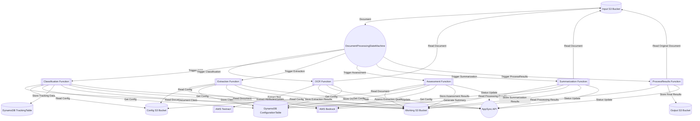

```mermaid
flowchart TD
    InputBucket[(Input S3 Bucket)]
    ConfigBucket[(Config S3 Bucket)]
    OutputBucket[(Output S3 Bucket)]
    WorkingBucket[(Working S3 Bucket)]
    TrackingTable[(DynamoDB TrackingTable)]
    ConfigTable[(DynamoDB ConfigurationTable)]
    AppSync((AppSync API))
    
    StateMachine((DocumentProcessingStateMachine))
    OCR[[OCR Function]]
    Classification[[Classification Function]]
    Extraction[[Extraction Function]]
    Assessment[[Assessment Function]]
    ProcessResults[[ProcessResults Function]]
    Summarization[[Summarization Function]]
    
    Textract[[AWS Textract]]
    Bedrock[[AWS Bedrock]]
    
    InputBucket -->|Document| StateMachine
    StateMachine -->|Trigger OCR| OCR
    OCR -->|Read Document| InputBucket
    OCR -->|Extract Text| Textract
    OCR -->|Store OCR Results| WorkingBucket
    OCR -->|Status Update| AppSync
    OCR -->|Get Config| ConfigTable
    
    StateMachine -->|Trigger Classification| Classification
    Classification -->|Read Document| WorkingBucket
    Classification -->|Read Config| ConfigBucket
    Classification -->|Get Config| ConfigTable
    Classification -->|Store Tracking Data| TrackingTable
    Classification -->|Document Class| Bedrock
    Classification -->|Store Classification Results| WorkingBucket
    Classification -->|Status Update| AppSync
    
    StateMachine -->|Trigger Extraction| Extraction
    Extraction -->|Read Document| WorkingBucket
    Extraction -->|Read Config| ConfigBucket
    Extraction -->|Get Config| ConfigTable
    Extraction -->|Extract Attributes| Bedrock
    Extraction -->|Store Extraction Results| WorkingBucket
    Extraction -->|Status Update| AppSync
    
    StateMachine -->|Trigger Assessment| Assessment
    Assessment -->|Read Document| WorkingBucket
    Assessment -->|Read Config| ConfigBucket
    Assessment -->|Get Config| ConfigTable
    Assessment -->|Assess Extraction Quality| Bedrock
    Assessment -->|Store Assessment Results| WorkingBucket
    Assessment -->|Status Update| AppSync
    
    StateMachine -->|Trigger Summarization| Summarization
    Summarization -->|Read Document| InputBucket
    Summarization -->|Read Processing Results| WorkingBucket
    Summarization -->|Get Config| ConfigTable
    Summarization -->|Generate Summary| Bedrock
    Summarization -->|Store Summarization Results| WorkingBucket
    Summarization -->|Status Update| AppSync
    
    StateMachine -->|Trigger ProcessResults| ProcessResults
    ProcessResults -->|Read Original Document| InputBucket
    ProcessResults -->|Read Processing Results| WorkingBucket
    ProcessResults -->|Store Final Results| OutputBucket
    ProcessResults -->|Status Update| AppSync
```