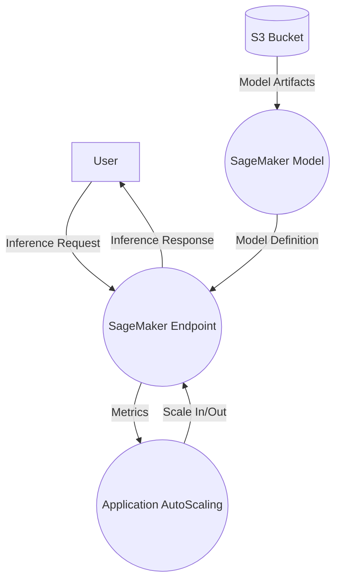

```mermaid
flowchart TD
    User[User]
    S3[(S3 Bucket)]
    SageMakerModel((SageMaker Model))
    SageMakerEndpoint((SageMaker Endpoint))
    AutoScaling((Application AutoScaling))
    
    User -->|Inference Request| SageMakerEndpoint
    S3 -->|Model Artifacts| SageMakerModel
    SageMakerModel -->|Model Definition| SageMakerEndpoint
    AutoScaling -->|Scale In/Out| SageMakerEndpoint
    SageMakerEndpoint -->|Inference Response| User
    SageMakerEndpoint -->|Metrics| AutoScaling
```