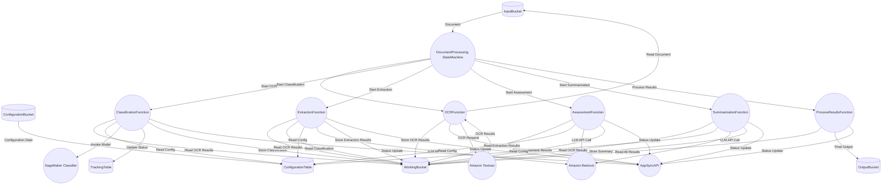

```mermaid
flowchart TD
    InputS3[(InputBucket)]
    ConfigS3[(ConfigurationBucket)]
    OutputS3[(OutputBucket)]
    WorkingS3[(WorkingBucket)]
    TrackingDDB[(TrackingTable)]
    ConfigDDB[(ConfigurationTable)]
    AppSync((AppSyncAPI))
    SM((DocumentProcessing StateMachine))
    OCR((OCRFunction))
    Class((ClassificationFunction))
    Extr((ExtractionFunction))
    Assess((AssessmentFunction))
    Process((ProcessResultsFunction))
    Summary((SummarizationFunction))
    SageMaker((SageMaker Classifier))
    Bedrock((Amazon Bedrock))
    Textract((Amazon Textract))

    InputS3 -->|Document| SM
    SM -->|Start OCR| OCR
    OCR -->|Read Document| InputS3
    OCR -->|Store OCR Results| WorkingS3
    OCR -->|Status Update| AppSync
    SM -->|Start Classification| Class
    Class -->|Read OCR Results| WorkingS3
    Class -->|Read Config| ConfigDDB
    Class -->|Invoke Model| SageMaker
    Class -->|Update Status| TrackingDDB
    Class -->|Store Classification| WorkingS3
    Class -->|Status Update| AppSync
    SM -->|Start Extraction| Extr
    Extr -->|Read OCR Results| WorkingS3
    Extr -->|Read Classification| WorkingS3
    Extr -->|Read Config| ConfigDDB
    Extr -->|LLM API Call| Bedrock
    Extr -->|Store Extraction Results| WorkingS3
    Extr -->|Status Update| AppSync
    SM -->|Start Assessment| Assess
    Assess -->|Read Extraction Results| WorkingS3
    Assess -->|Read Config| ConfigDDB
    Assess -->|LLM API Call| Bedrock
    Assess -->|Store Assessment Results| WorkingS3
    Assess -->|Status Update| AppSync
    SM -->|Start Summarization| Summary
    Summary -->|Read OCR Results| WorkingS3
    Summary -->|Read Config| ConfigDDB
    Summary -->|LLM API Call| Bedrock
    Summary -->|Store Summary| WorkingS3
    Summary -->|Status Update| AppSync
    SM -->|Process Results| Process
    Process -->|Read All Results| WorkingS3
    Process -->|Final Output| OutputS3
    Process -->|Status Update| AppSync
    OCR -->|OCR Request| Textract
    Textract -->|OCR Results| OCR
    ConfigS3 -->|Configuration Data| ConfigDDB
```