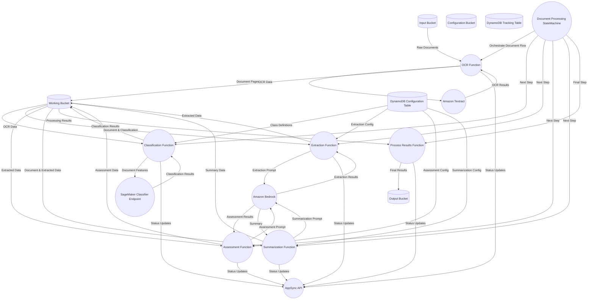

```mermaid
flowchart TD
    InputBucket[(Input Bucket)]
    ConfigBucket[(Configuration Bucket)]
    OutputBucket[(Output Bucket)]
    WorkingBucket[(Working Bucket)]
    TrackingTable[(DynamoDB Tracking Table)]
    ConfigTable[(DynamoDB Configuration Table)]
    
    AppSyncAPI((AppSync API))
    StateMachine((Document Processing StateMachine))
    
    OCRFunction((OCR Function))
    ClassificationFunction((Classification Function))
    ExtractionFunction((Extraction Function))
    AssessmentFunction((Assessment Function))
    ProcessResultsFunction((Process Results Function))
    SummarizationFunction((Summarization Function))
    
    SagemakerEndpoint((SageMaker Classifier Endpoint))
    BedrockAPI((Amazon Bedrock))
    TextractAPI((Amazon Textract))
    
    StateMachine -->|Orchestrate Document Flow| OCRFunction
    InputBucket -->|Raw Documents| OCRFunction
    OCRFunction -->|Document Pages| TextractAPI
    TextractAPI -->|OCR Results| OCRFunction
    OCRFunction -->|OCR Data| WorkingBucket
    OCRFunction -->|Status Updates| AppSyncAPI
    
    StateMachine -->|Next Step| ClassificationFunction
    WorkingBucket -->|OCR Data| ClassificationFunction
    ClassificationFunction -->|Document Features| SagemakerEndpoint
    SagemakerEndpoint -->|Classification Results| ClassificationFunction
    ConfigTable -->|Class Definitions| ClassificationFunction
    ClassificationFunction -->|Classification Results| WorkingBucket
    ClassificationFunction -->|Status Updates| AppSyncAPI
    
    StateMachine -->|Next Step| ExtractionFunction
    WorkingBucket -->|Document & Classification| ExtractionFunction
    ConfigTable -->|Extraction Config| ExtractionFunction
    ExtractionFunction -->|Extraction Prompt| BedrockAPI
    BedrockAPI -->|Extraction Results| ExtractionFunction
    ExtractionFunction -->|Extracted Data| WorkingBucket
    ExtractionFunction -->|Status Updates| AppSyncAPI
    
    StateMachine -->|Next Step| AssessmentFunction
    WorkingBucket -->|Extracted Data| AssessmentFunction
    ConfigTable -->|Assessment Config| AssessmentFunction
    AssessmentFunction -->|Assessment Prompt| BedrockAPI
    BedrockAPI -->|Assessment Results| AssessmentFunction
    AssessmentFunction -->|Assessment Data| WorkingBucket
    AssessmentFunction -->|Status Updates| AppSyncAPI
    
    StateMachine -->|Next Step| SummarizationFunction
    WorkingBucket -->|Document & Extracted Data| SummarizationFunction
    ConfigTable -->|Summarization Config| SummarizationFunction
    SummarizationFunction -->|Summarization Prompt| BedrockAPI
    BedrockAPI -->|Summary| SummarizationFunction
    SummarizationFunction -->|Summary Data| WorkingBucket
    SummarizationFunction -->|Status Updates| AppSyncAPI
    
    StateMachine -->|Final Step| ProcessResultsFunction
    WorkingBucket -->|Processing Results| ProcessResultsFunction
    ProcessResultsFunction -->|Final Results| OutputBucket
    ProcessResultsFunction -->|Status Updates| AppSyncAPI
```