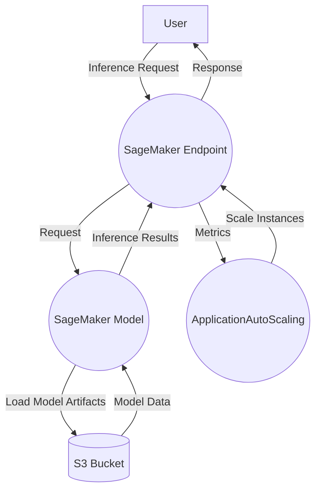

```mermaid
flowchart TD
    User[User]
    SageMakerEndpoint((SageMaker Endpoint))
    SageMakerModel((SageMaker Model))
    S3[(S3 Bucket)]
    AutoScaling((ApplicationAutoScaling))
    
    User -->|Inference Request| SageMakerEndpoint
    SageMakerEndpoint -->|Request| SageMakerModel
    SageMakerModel -->|Load Model Artifacts| S3
    S3 -->|Model Data| SageMakerModel
    SageMakerModel -->|Inference Results| SageMakerEndpoint
    SageMakerEndpoint -->|Response| User
    
    AutoScaling -->|Scale Instances| SageMakerEndpoint
    SageMakerEndpoint -->|Metrics| AutoScaling
```