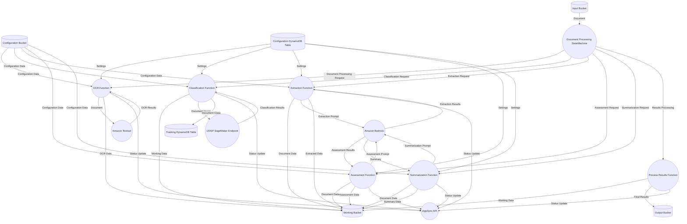

```mermaid
flowchart TD
    InputBucket[(Input Bucket)]
    WorkingBucket[(Working Bucket)]
    ConfigBucket[(Configuration Bucket)]
    OutputBucket[(Output Bucket)]
    TrackingTable[(Tracking DynamoDB Table)]
    ConfigTable[(Configuration DynamoDB Table)]
    AppSync((AppSync API))

    OCRFunction((OCR Function))
    ClassificationFunction((Classification Function))
    ExtractionFunction((Extraction Function))
    AssessmentFunction((Assessment Function))
    ProcessResultsFunction((Process Results Function))
    SummarizationFunction((Summarization Function))
    SagemakerEndpoint((UDOP SageMaker Endpoint))
    
    StateMachine((Document Processing StateMachine))
    Bedrock((Amazon Bedrock))
    Textract((Amazon Textract))

    InputBucket -->|Document| StateMachine
    StateMachine -->|Document Processing Request| OCRFunction
    
    OCRFunction -->|Document| Textract
    Textract -->|OCR Results| OCRFunction
    OCRFunction -->|OCR Data| WorkingBucket
    OCRFunction -->|Status Update| AppSync
    
    StateMachine -->|Classification Request| ClassificationFunction
    ClassificationFunction -->|Working Data| WorkingBucket
    ClassificationFunction -->|Document Image| SagemakerEndpoint
    SagemakerEndpoint -->|Classification Results| ClassificationFunction
    ClassificationFunction -->|Document Class| TrackingTable
    ClassificationFunction -->|Status Update| AppSync
    
    StateMachine -->|Extraction Request| ExtractionFunction
    ExtractionFunction -->|Document Data| WorkingBucket
    ExtractionFunction -->|Extraction Prompt| Bedrock
    Bedrock -->|Extraction Results| ExtractionFunction
    ExtractionFunction -->|Extracted Data| WorkingBucket
    ExtractionFunction -->|Status Update| AppSync
    
    StateMachine -->|Assessment Request| AssessmentFunction
    AssessmentFunction -->|Document Data| WorkingBucket
    AssessmentFunction -->|Assessment Prompt| Bedrock
    Bedrock -->|Assessment Results| AssessmentFunction
    AssessmentFunction -->|Assessment Data| WorkingBucket
    AssessmentFunction -->|Status Update| AppSync
    
    StateMachine -->|Summarization Request| SummarizationFunction
    SummarizationFunction -->|Document Data| WorkingBucket
    SummarizationFunction -->|Summarization Prompt| Bedrock
    Bedrock -->|Summary| SummarizationFunction
    SummarizationFunction -->|Summary Data| WorkingBucket
    SummarizationFunction -->|Status Update| AppSync
    
    StateMachine -->|Results Processing| ProcessResultsFunction
    ProcessResultsFunction -->|Working Data| WorkingBucket
    ProcessResultsFunction -->|Final Results| OutputBucket
    ProcessResultsFunction -->|Status Update| AppSync
    
    ConfigBucket -->|Configuration Data| OCRFunction
    ConfigBucket -->|Configuration Data| ClassificationFunction
    ConfigBucket -->|Configuration Data| ExtractionFunction
    ConfigBucket -->|Configuration Data| AssessmentFunction
    ConfigBucket -->|Configuration Data| SummarizationFunction
    
    ConfigTable -->|Settings| OCRFunction
    ConfigTable -->|Settings| ClassificationFunction
    ConfigTable -->|Settings| ExtractionFunction
    ConfigTable -->|Settings| AssessmentFunction
    ConfigTable -->|Settings| SummarizationFunction
```