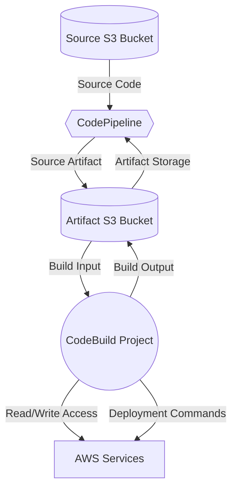

```mermaid
flowchart TD
    S3Source[(Source S3 Bucket)]
    CodePipeline{{CodePipeline}}
    CodeBuild((CodeBuild Project))
    ArtifactS3[(Artifact S3 Bucket)]
    AWSServices[AWS Services]
    
    S3Source -->|Source Code| CodePipeline
    CodePipeline -->|Source Artifact| ArtifactS3
    ArtifactS3 -->|Build Input| CodeBuild
    CodeBuild -->|Build Output| ArtifactS3
    CodeBuild -->|Read/Write Access| AWSServices
    CodeBuild -->|Deployment Commands| AWSServices
    ArtifactS3 -->|Artifact Storage| CodePipeline
```