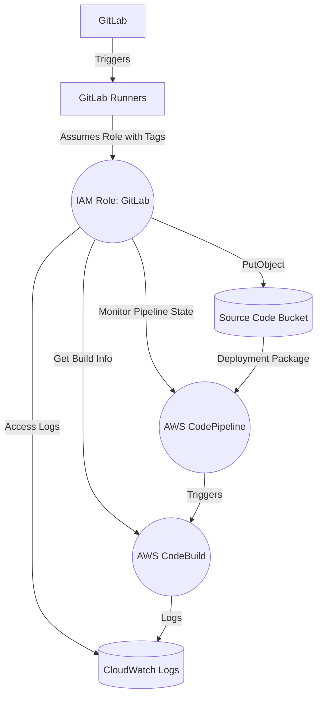

```mermaid
flowchart TD
    GitLab[GitLab]
    GitLabRunners[GitLab Runners]
    GitLabRole((IAM Role: GitLab))
    S3[(Source Code Bucket)]
    CodePipeline((AWS CodePipeline))
    CodeBuild((AWS CodeBuild))
    CloudWatchLogs[(CloudWatch Logs)]
    
    GitLab -->|Triggers| GitLabRunners
    GitLabRunners -->|Assumes Role with Tags| GitLabRole
    GitLabRole -->|PutObject| S3
    GitLabRole -->|Monitor Pipeline State| CodePipeline
    GitLabRole -->|Get Build Info| CodeBuild
    GitLabRole -->|Access Logs| CloudWatchLogs
    S3 -->|Deployment Package| CodePipeline
    CodePipeline -->|Triggers| CodeBuild
    CodeBuild -->|Logs| CloudWatchLogs
```