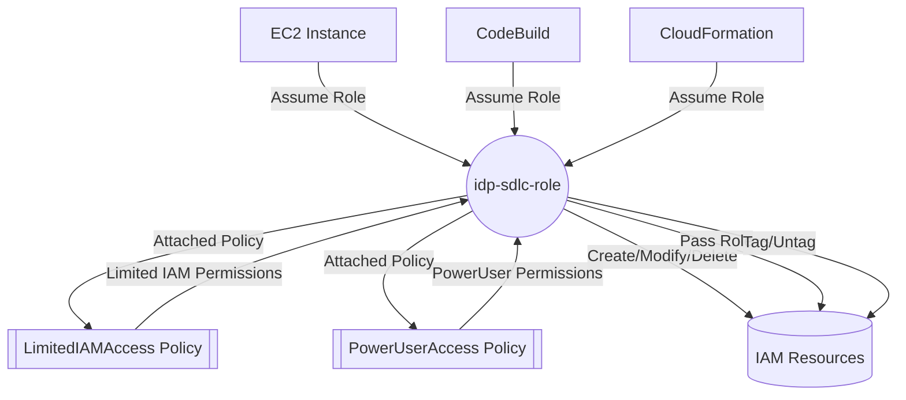

```mermaid
flowchart TD
    EC2[EC2 Instance]
    CodeBuild[CodeBuild]
    CloudFormation[CloudFormation]
    BuilderRole((idp-sdlc-role))
    IAMPolicy[[LimitedIAMAccess Policy]]
    PowerUserPolicy[[PowerUserAccess Policy]]
    IAMResources[(IAM Resources)]
    
    EC2 -->|Assume Role| BuilderRole
    CodeBuild -->|Assume Role| BuilderRole
    CloudFormation -->|Assume Role| BuilderRole
    
    BuilderRole -->|Attached Policy| IAMPolicy
    BuilderRole -->|Attached Policy| PowerUserPolicy
    
    IAMPolicy -->|Limited IAM Permissions| BuilderRole
    PowerUserPolicy -->|PowerUser Permissions| BuilderRole
    
    BuilderRole -->|Create/Modify/Delete| IAMResources
    BuilderRole -->|Pass Role| IAMResources
    BuilderRole -->|Tag/Untag| IAMResources
```