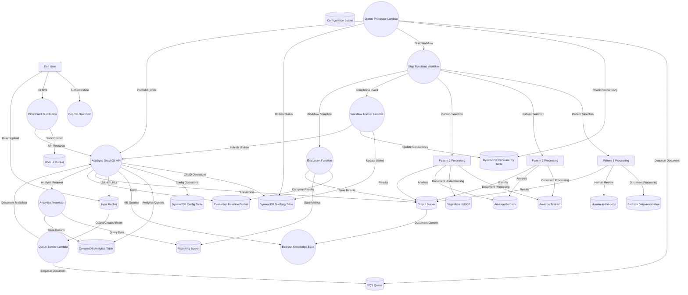

```mermaid
flowchart TD
    User[End User]
    CloudFront((CloudFront Distribution))
    WebUIBucket[(Web UI Bucket)]
    CognitoUserPool((Cognito User Pool))
    APIGateway((AppSync GraphQL API))
    
    InputBucket[(Input Bucket)]
    ConfigBucket[(Configuration Bucket)]
    OutputBucket[(Output Bucket)]
    ReportingBucket[(Reporting Bucket)]
    BaselineBucket[(Evaluation Baseline Bucket)]
    
    QueueSender((Queue Sender Lambda))
    DocumentQueue[(SQS Queue)]
    QueueProcessor((Queue Processor Lambda))
    
    StateMachine((Step Functions Workflow))
    WorkflowTracker((Workflow Tracker Lambda))
    
    TrackingTable[(DynamoDB Tracking Table)]
    ConfigTable[(DynamoDB Config Table)]
    ConcurrencyTable[(DynamoDB Concurrency Table)]
    AnalyticsTable[(DynamoDB Analytics Table)]
    
    EvaluationFunction((Evaluation Function))
    AnalyticsProcessor((Analytics Processor))
    BedrockKB((Bedrock Knowledge Base))
    
    Pattern1[Pattern 1 Processing]
    Pattern2[Pattern 2 Processing]
    Pattern3[Pattern 3 Processing]
    
    BDA[(Bedrock Data Automation)]
    Textract[(Amazon Textract)]
    Bedrock[(Amazon Bedrock)]
    SageMaker[(SageMaker/UDOP)]
    HITL[(Human-in-the-Loop)]

    User -->|Authentication| CognitoUserPool
    User -->|HTTPS| CloudFront
    CloudFront -->|Static Content| WebUIBucket
    CloudFront -->|API Requests| APIGateway
    User -->|Direct Upload| InputBucket

    APIGateway -->|CRUD Operations| TrackingTable
    APIGateway -->|Config Operations| ConfigTable
    APIGateway -->|Analytics Queries| AnalyticsTable
    APIGateway -->|KB Queries| BedrockKB
    APIGateway -->|Upload URLs| InputBucket
    APIGateway -->|File Access| OutputBucket
    APIGateway -->|Copy| BaselineBucket
    
    InputBucket -->|Object Created Event| QueueSender
    QueueSender -->|Document Metadata| APIGateway
    QueueSender -->|Enqueue Document| DocumentQueue
    QueueProcessor -->|Dequeue Document| DocumentQueue
    QueueProcessor -->|Check Concurrency| ConcurrencyTable
    QueueProcessor -->|Start Workflow| StateMachine
    QueueProcessor -->|Update Status| TrackingTable
    QueueProcessor -->|Publish Update| APIGateway
    
    StateMachine -->|Pattern Selection| Pattern1
    StateMachine -->|Pattern Selection| Pattern2
    StateMachine -->|Pattern Selection| Pattern3
    
    Pattern1 -->|Document Processing| BDA
    Pattern1 -->|Human Review| HITL
    Pattern2 -->|Document Processing| Textract
    Pattern2 -->|Analysis| Bedrock
    Pattern3 -->|Document Processing| Textract
    Pattern3 -->|Document Understanding| SageMaker
    Pattern3 -->|Analysis| Bedrock
    
    Pattern1 -->|Results| OutputBucket
    Pattern2 -->|Results| OutputBucket
    Pattern3 -->|Results| OutputBucket
    
    StateMachine -->|Completion Event| WorkflowTracker
    WorkflowTracker -->|Update Status| TrackingTable
    WorkflowTracker -->|Update Concurrency| ConcurrencyTable
    WorkflowTracker -->|Publish Update| APIGateway
    
    StateMachine -->|Workflow Complete| EvaluationFunction
    EvaluationFunction -->|Compare Results| BaselineBucket
    EvaluationFunction -->|Save Metrics| ReportingBucket
    EvaluationFunction -->|Save Results| OutputBucket
    
    APIGateway -->|Analysis Request| AnalyticsProcessor
    AnalyticsProcessor -->|Query Data| ReportingBucket
    AnalyticsProcessor -->|Store Results| AnalyticsTable
    
    OutputBucket -->|Document Content| BedrockKB
```