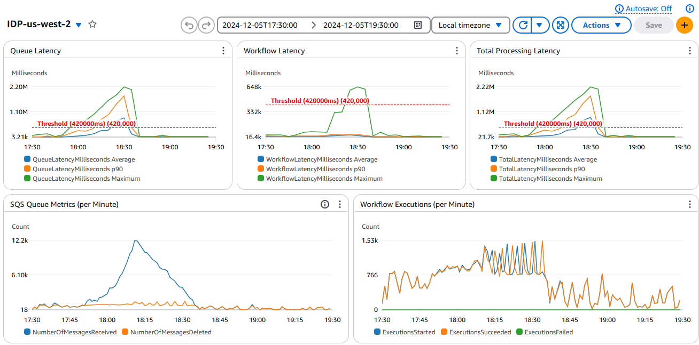
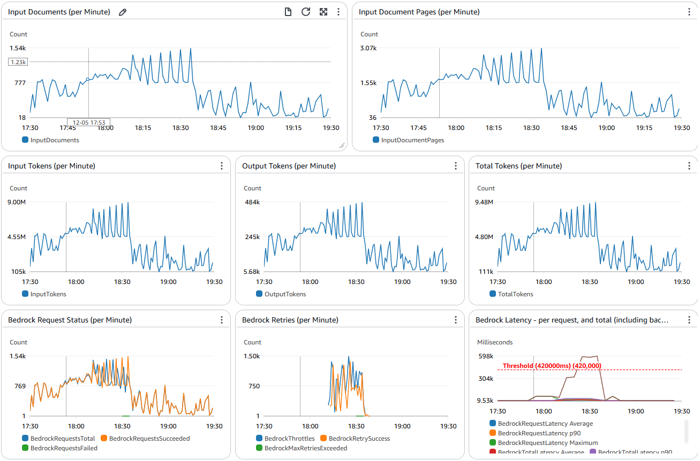
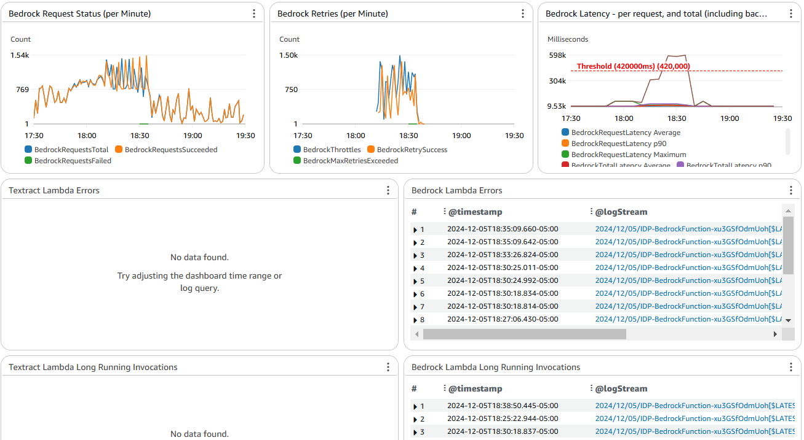

# Intelligent Document Processing (IDP) Pipeline

Copyright © Amazon.com and Affiliates: This deliverable is considered Developed Content as defined in the AWS Service Terms and the SOW between the parties

## Table of Contents

## Table of Contents

- [Introduction](#introduction)
  - [Key Features](#key-features)
  - [Use Cases](#use-cases)
- [Build, Publish, Deploy, Test](#build-publish-deploy-test)
  - [Dependencies](#dependencies)
  - [Build and Publish the solution](#build-and-publish-the-solution)
  - [Test the solution](#test-the-solution)
    - [Testing individual lambda functions locally](#testing-individual-lambda-functions-locally)
    - [Steady state volume testing using load simulator script](#steady-state-volume-testing-using-load-simulator-script)
    - [Variable volume testing using dynamic load simulator script](#variable-volume-testing-using-dynamic-load-simulator-script)
- [Architecture](#architecture)
  - [Flow Overview](#flow-overview)
  - [Components](#components)
  - [Modular Design Overview](#modular-design-overview)
  - [Stack Structure](#stack-structure)
    - [Main Stack (template.yaml)](#main-stack-templateyaml)
    - [Pattern Stacks (patterns/*)](#pattern-stacks-patterns)
  - [Pattern Selection and Deployment](#pattern-selection-and-deployment)
  - [Integrated Monitoring](#integrated-monitoring)
  - [Adding New Patterns](#adding-new-patterns)
- [Concurrency and Throttling Management](#concurrency-and-throttling-management)
  - [Throttling and Retry (Bedrock and/or SageMaker)](#throttling-and-retry-bedrock-andor-sagemaker)
  - [Step Functions Retry Configuration](#step-functions-retry-configuration)
  - [Concurrency Control](#concurrency-control)
- [Monitoring and Logging](#monitoring-and-logging)
  - [CloudWatch Dashboard](#cloudwatch-dashboard)
    - [Latency Metrics](#latency-metrics)
    - [Throughput Metrics](#throughput-metrics)
    - [Error Tracking](#error-tracking)
  - [Log Groups](#log-groups)
- [Document Status Lookup](#document-status-lookup)
  - [Using the Lookup Script](#using-the-lookup-script)
  - [Response Format](#response-format)
- [Additional scripts / utilities](#additional-scripts--utilities)
- [Configuration / Customization](#configuration--customization)
  - [Stack Parameters](#stack-parameters)
  - [Request Service Quota Limits for high volume processing](#request-service-quota-limits-for-high-volume-processing)
- [Customizing Extraction](#customizing-extraction)
  - [Extraction Prompts](#extraction-prompts)
  - [Extraction Attributes](#extraction-attributes)
- [Troubleshooting Guide](#troubleshooting-guide)
- [Performance Considerations](#performance-considerations)


## Introduction

A scalable, serverless solution for automated document processing and information extraction using AWS services. This system combines OCR capabilities with generative AI to convert unstructured documents into structured data at scale.

### Key Features

- **Serverless Architecture**: Built entirely on AWS serverless technologies including Lambda, Step Functions, SQS, and DynamoDB, eliminating infrastructure management overhead
- **Intelligent Extraction**: Combines Amazon Textract for OCR with Anthropic's Claude (via Amazon Bedrock) for advanced information extraction and understanding
- **High Throughput Processing**: Handles large volumes of documents through intelligent queuing and concurrency management
- **Built-in Resilience**: Features comprehensive error handling, automatic retries, and throttling management
- **Cost Optimization**: Pay-per-use pricing model with built-in controls to manage service quotas
- **Comprehensive Monitoring**: Rich CloudWatch dashboard with detailed metrics, logs, and alerts for end-to-end visibility
- **Easy Document Tracking**: Built-in tracking system to monitor document status and processing times
- **Secure by Design**: Implements encryption at rest, access controls, and secure communication between services

### Use Cases

- Processing invoices, purchase orders, applications, and other document types
- Extracting information from forms and applications
- Automating document-heavy workflows
- Converting legacy paper documents into structured digital data
- Real-time document processing pipelines

The system is designed to handle various document types and can be customized for specific extraction needs through configuration of the extraction prompts and attributes.


## Build, Publish, Deploy, Test

### Dependencies

You need to have the following packages installed on your computer:

1. bash shell (Linux, MacOS, Windows-WSL)
2. aws (AWS CLI)
3. sam (AWS SAM)
4. python 3.11 or later

Copy the repo to your computer. Either:
- use the git command to clone the repo, if you have access
- OR, download and expand the ZIP file for the repo, or use the ZIP file that has been shared with you.

### Build and Publish the solution

To build and publish your own template, to your own S3 bucket, so that others can easily deploy a stack from your templates, in your preferred region, here's how.

Navigate into the project root directory and, in a bash shell, run:

`./publish.sh <cfn_bucket_basename> <cfn_prefix> <region e.g. us-east-1>`.  
  This:
    - checks your system dependendencies for required packages (see Dependencies above)
    - creates CloudFormation templates and asset zip files
    - publishes the templates and required assets to an S3 bucket in your account called `<cfn_bucket_basename>-<region>` (it creates the bucket if it doesn't already exist)
    - optionally add a final parameter `public` if you want to make the templates public. Note: your bucket and account must be configured not to Block Public Access using new ACLs.

That's it! There's just one step.
  
When completed, it displays the CloudFormation templates S3 URLs, 1-click URLs for launching the stack creation in CloudFormation console, and a command to deploy from the CLI:
```
OUTPUTS
Template URL: https://s3.us-east-1.amazonaws.com/bobs-artifacts-us-east-1/transflo-idp/packaged.yaml
CF Launch URL: https://us-east-1.console.aws.amazon.com/cloudformation/home?region=us-east-1#/stacks/create/review?templateURL=https://s3.us-east-1.amazonaws.com/bobs-artifacts-us-east-1/transflo-idp/packaged.yaml&stackName=IDP
CLI Deploy: aws cloudformation deploy --region us-east-1 --template-file /tmp/1132557/packaged.yaml --capabilities CAPABILITY_NAMED_IAM CAPABILITY_AUTO_EXPAND --stack-name <your_stack_name>>
Done
```

After you have deployed the stack, check the Outputs tab to inspect names and links to the dashboards, buckets, workflows and other solution resources.

### Test the solution

Open the `S3InputBucketConsoleURL` and `S3OutputBucketConsoleURL` using the links in the stack Resources tab.
Open the `StateMachineConsoleURL` using the link in the stack Resources tab.

Upload a filled PDF form to the `InputBucket` - there's an example in the `./samples` folder.

Example - to copy the sample file `insurance-bundle.pdf` N times, do:
```
$ n=10
$ for i in `seq 1 $n`; do aws s3 cp ./samples/insurance-claim-form.png s3://idp-inputbucket-kmsxxxxxxxxx/insurance-claim-form-$i.png; done
```

The StepFunctions StateMachine should start executing. Open the `Running` execution page to observe the steps in the workflow, trace inputs/outputs, check Lambda code and logs, etc.

When/if the execution sucessfully finishes, check the `OutputBucket` for the structured data JSON file with extracted fields.

### Testing individual lambda functions locally

For example, to test any lambda function locally:
- change directory to the folder that has the template.yaml for the function you want to test
- create a file containing the input event for your function.. some functions have templates in the ./testing folder 
- verify `./testing/env.json` and change region if necessary
- run `sam build` to package the function(s)
- use `sam local` to run the function locally in a container, e.g.:
``` 
sam local invoke OCRFunction -e testing/OCRFunction-event.json --env-vars testing/env.json
```

Follow similar process to test other lambda functions locally.


#### Steady state volume testing using load simulator script

Use `./scripts/simulate_load.py` to simulate heavy incoming document rates over time. It copies a specified source document from an S3 bucket, many times in parallel, to the designated `InputBucket`. Example - to simulate incoming document rate of 500 docs per minute for 10 minutes, do:
```
$ python ./scripts/simulate_load.py -s source_bucket -k prefix/exampledoc.pdf -d idp-kmsxxxxxxxxx -r 500 -t 10
```

#### Variable volume testing using dynamic load simulator script

Use `./scripts/simulate_dynamic_load.py` to simulate variable document rates over time. The rate of copying is determined by a CSV schedule file - e.g. [dynamic_schedule.csv](./scripts/dynamic_schedule.csv). It copies a specified source document from an S3 bucket, many times in parallel, to the designated `InputBucket`. Example - to simulate incoming documents based on the minute by minute rates in the schedule, do:
```
$ python ./scripts/simulate_load.py -s source_bucket -k prefix/exampledoc.pdf -d idp-kmsxxxxxxxxx -f schedule.csv
```


## Architecture


### Flow Overview
1. Documents uploaded to Input S3 bucket trigger EventBridge events
2. Queue Sender Lambda records event in tracking table and sends to SQS
3. Queue Processor Lambda:
   - Picks up messages in batches
   - Manages workflow concurrency using DynamoDB counter
   - Starts Step Functions executions
4. Step Functions workflow runs the steps defined in the sleected pattern to process the document, and generate output in th eOutput S3 bucket.
5. Workflow completion events update tracking and metrics

### Components
- **Storage**: S3 buckets for input documents and JSON output
- **Message Queue**: Standard SQS queue for high throughput
- **Functions**: Lambda functions for queue operations
- **Step Functions**: Document processing workflow orchestration
- **DynamoDB**: Tracking and concurrency management
- **CloudWatch**: Comprehensive monitoring and logging

### Modular Design Overview

The solution uses a modular architecture with nested CloudFormation stacks to support multiple document processing patterns while maintaining a common infrastructure for queueing, tracking, and monitoring. This design enables:

- Support for multiple processing patterns without duplicating core infrastructure
- Easy addition of new processing patterns without modifying existing code
- Centralized monitoring and management across all patterns
- Pattern-specific optimizations and configurations

### Stack Structure

#### Main Stack (template.yaml)
The main template handles all pattern-agnostic resources and infrastructure:

- S3 Buckets (Input, Working, Output)
- SQS Queues and Dead Letter Queues
- DynamoDB Tables (Execution Tracking, Concurrency)
- Lambda Functions for:
  - Queue Processing
  - Queue Sending
  - Workflow Tracking
  - Document Status Lookup
- CloudWatch Alarms and Dashboard
- SNS Topics for Alerts

#### Pattern Stacks (patterns/*)
Each pattern is implemented as a nested stack that contains pattern-specific resources:

- Step Functions State Machine
- Pattern-specific Lambda Functions:
  - OCR Processing
  - Classification
  - Extraction
- Pattern-specific CloudWatch Dashboard
- Model Endpoints and Configurations

Current patterns include:
- Pattern 1: OCR → UDOP Classification → Bedrock Extraction  ([README](./patterns/pattern-1/README.md))
- Pattern 2: OCR → Bedrock Classification → Bedrock Extraction ([README](./patterns/pattern-2/README.md))

### Pattern Selection and Deployment

The pattern is selected at deployment time using the `IDPPattern` parameter:

```yaml
IDPPattern:
  Type: String
  Default: Pattern1
  AllowedValues:
    - Pattern1
    - Pattern2
  Description: Choose from built-in IDP workflow patterns
```

When deployed, the main stack uses conditions to create the appropriate nested stack:

```yaml
Conditions:
  IsPattern1: !Equals [!Ref IDPPattern, "Pattern1"]
  IsPattern2: !Equals [!Ref IDPPattern, "Pattern2"]

Resources:
  PATTERN1STACK:
    Type: AWS::CloudFormation::Stack
    Condition: IsPattern1
    Properties:
      TemplateURL: ./patterns/pattern-1/.aws-sam/packaged.yaml
      Parameters:
        # Pattern-specific parameters...

  PATTERN2STACK:
    Type: AWS::CloudFormation::Stack
    Condition: IsPattern2
    Properties:
      TemplateURL: ./patterns/pattern-2/.aws-sam/packaged.yaml
      Parameters:
        # Pattern-specific parameters...
```

### Integrated Monitoring

The solution creates an integrated CloudWatch dashboard that combines metrics from both the main stack and the selected pattern stack:

1. The main stack creates a dashboard with core metrics:
   - Queue performance
   - Overall workflow statistics
   - General error tracking
   - Resource utilization

2. Each pattern stack creates its own dashboard with pattern-specific metrics:
   - OCR performance
   - Classification accuracy
   - Extraction stats
   - Model-specific metrics

3. The `DashboardMerger` Lambda function combines these dashboards:
   ```yaml
   DashboardMergerFunction:
     Type: AWS::Serverless::Function
     Properties:
       Handler: index.handler
       Environment:
         Variables:
           STACK_NAME: !Ref AWS::StackName

   MergedDashboard:
     Type: Custom::DashboardMerger
     Properties:
       ServiceToken: !GetAtt DashboardMergerFunction.Arn
       Dashboard1Name: !Ref MainTemplateSubsetDashboard
       Dashboard2Name: !If 
         - IsPattern1
         - !GetAtt PATTERN1STACK.Outputs.DashboardName
         - !GetAtt PATTERN2STACK.Outputs.DashboardName
       MergedDashboardName: !Sub "${AWS::StackName}-Integrated-${AWS::Region}"
   ```

The merger function:
- Reads the widgets from both dashboards
- Arranges them logically by type (time series, tables, etc.)
- Creates a new dashboard with the combined widgets
- Updates the integrated dashboard whenever either source dashboard changes

### Adding New Patterns

To add a new processing pattern:

1. Create a new directory under `patterns/`
2. Implement the pattern-specific resources in a CloudFormation template
3. Add the pattern to the `IDPPattern` parameter's allowed values
4. Add pattern-specific parameters to the main template
5. Create a new condition and nested stack resource for the pattern

The new pattern will automatically inherit all the core infrastructure and monitoring capabilities while maintaining its own specific processing logic and metrics.

## Concurrency and Throttling Management

### Throttling and Retry (Bedrock and/or SageMaker)
The Classification and Extraction Lambda functions implement exponential backoff:
```python
MAX_RETRIES = 8
INITIAL_BACKOFF = 2  # seconds
MAX_BACKOFF = 600   # 10 minutes

def calculate_backoff(attempt):
    backoff = min(MAX_BACKOFF, INITIAL_BACKOFF * (2 ** attempt))
    jitter = random.uniform(0, 0.1 * backoff)
    return backoff + jitter
```

Retry behavior:
- Up to 8 retry attempts
- Exponential backoff starting at 2 seconds
- Maximum backoff of 10 minutes
- 10% random jitter to prevent thundering herd
- Metrics tracking for retries and failures

### Step Functions Retry Configuration
Each Lambda invocation includes retry settings:
```json
"Retry": [
  {
    "ErrorEquals": [
      "States.TaskFailed",
      "Lambda.ServiceException",
      "Lambda.AWSLambdaException",
      "Lambda.SdkClientException"
    ],
    "IntervalSeconds": 2,
    "MaxAttempts": 10,
    "BackoffRate": 2
  }
]
```

### Concurrency Control
- DynamoDB counter tracks active workflows
- Queue Processor enforces maximum concurrent executions (default 800)
- SQS retains messages when concurrency limit reached
- Batch processing for improved throughput

Reduce maximum concurrency to limit throughput for less time sensitive workloads (smooth demand peaks)
Increase maximum concurrency to maximise throughput for time sensitive workloads, until you see Bedrock retries due to quota limits. 

## Monitoring and Logging

### CloudWatch Dashboard
Access via CloudWatch > Dashboards > `${StackName}-${Region}`

  

  




#### Latency Metrics
- Queue Latency
- Workflow Latency
- Total Processing Latency
All include average, p90, and maximum values

#### Throughput Metrics
- Document and Page counts
- LLM Tokens processed 
- SQS Queue metrics (received/deleted)
- Step Functions execution counts
- Lambda function invocations and durations

#### Error Tracking
- Long-running invocations
- Lambda function errors
- Failed Step Functions executions

### Log Groups
```
/${StackName}/lambda/*
/aws/vendedlogs/states/${StackName}-workflow
```

## Document Status Lookup

### Using the Lookup Script
```bash
# Check document status
./scripts/lookup_file_status.sh "path/to/document.pdf" stack-name

# Format output with jq
./scripts/lookup_file_status.sh "document.pdf" stack-name | jq

# Check just status
./scripts/lookup_file_status.sh "document.pdf" stack-name | jq -r '.status'

# Calculate processing time
./scripts/lookup_file_status.sh "document.pdf" stack-name | jq -r '.timing'
```

### Response Format
```json
{
  "found": true,
  "status": "COMPLETED",
  "timing": {
    "queue_time_ms": 234,
    "workflow_time_ms": 15678,
    "total_time_ms": 15912
  },
  "execution": {
    "arn": "arn:aws:states:...",
    "status": "SUCCEEDED",
    "input": { ... },
    "output": { ... }
  }
}
```

## Additional scripts / utilities

`stop_workflows.sh <stack-name>:` _The Andon Chord! Purges all pending message from the SQS Document Queue, and stops all running State machine executions._
  
`compare_json_files.py [-h] [--output-dir OUTPUT_DIR] [--debug] bucket folder1 folder2:` _Handy tool to compare JSON files in different folders. Use it to assess, for example, the effects of using different models or prompts for extraction. Includes an AI summary of the key differences in the outputs._ 

## Configuration / Customization

### Stack Parameters
```bash
# Main Stack Parameters
MaxConcurrentWorkflows=800                          # Maximum parallel workflows
LogRetentionDays=30                                 # CloudWatch log retention
ErrorThreshold=1                                    # Errors before alerting
ExecutionTimeThresholdMs=30000                      # Duration threshold in millisecs
IDPPattern='Pattern1'                               # Choose processing pattern to deploy

# Pattern 1 Parameters (when selected)
Pattern1UDOPModelArtifactPath='s3://bucket/...'     # UDOP model for classification
Pattern1ExtractionModel='claude-3-sonnet...'        # Bedrock model for extraction

# Pattern 2 Parameters (when selected) 
Pattern2ClassificationModel='nova-pro...'           # Model for classification
Pattern2ExtractionModel='claude-3-sonnet...'        # Model for extraction
```
Each pattern has its own set of parameters that are only required when that pattern is selected via IDPPattern. The main stack parameters apply regardless of the chosen pattern.


### Request Service Quota Limits for high volume processing

Consider requesting raised quotas for the following services, to avoid throttling errors:
- Amazon Textract -> DetectDocumentText throttle limit in transactions per second 
- Amazon Bedrock -> On-demand InvokeModel tokens per minute for Anthropic Claude 3.5 Sonnet V2
- Amazon Bedrock -> On-demand InvokeModel requests per minute for Anthropic Claude 3.5 Sonnet V2
- AWS Lambda -> Concurrent executions
- Amazon CloudWatch - Rate of PutMetricData requests

Use the CloudWatch Dashboard to check errors reported by Lambda functions during scale testing, to check for these, or other, service quota limit exceptions.

## Customizing Extraction

The system uses a combination of prompt engineering and predefined attributes to extract information from documents. You can customize both to match your specific document types and extraction needs.

### Extraction Prompts

The main extraction prompts are defined in `src/bedrock_function/prompt_catalog.py`:

```python
DEFAULT_SYSTEM_PROMPT = "You are a document assistant. Respond only with JSON..."
BASELINE_PROMPT = """
<background>
You are an expert in bill of ladings...
</background>
...
```
To modify the extraction behavior:

1. Edit the `DEFAULT_SYSTEM_PROMPT` to change the AI assistant's basic behavior
1. Customize the BASELINE_PROMPT to:
- Provide domain expertise for your document types
- Add specific instructions for handling edge cases
- Modify output formatting requirements


### Extraction Attributes
Attributes to be extracted are defined in `src/bedrock_function/attributes.json`. Each attribute has:
- Field name
- Description
- List of aliases (alternate names for the field)

Example attribute definition:
```json
{
    "Field": "BOL Number",
    "Description": "A unique number assigned to the Bill of Lading for tracking purposes",
    "Alias": "Shipment ID, Load ID, Waybill Number, B/L Number"
}
```
To customize attributes:
1. Add, remove, or modify attributes in attributes.json
2. For each attribute, provide clear descriptions and comprehensive aliases
3. Deploy the updated function to apply changes

Note: Changes to prompts or attributes require redeployment of the Bedrock Lambda function.


## Troubleshooting Guide

1. **Document Not Processing**
   - Check SQS queue metrics for backup
   - Verify concurrency limit hasn't been reached
   - Look for Lambda errors in dashboard

2. **Slow Processing**
   - Monitor latency metrics in dashboard
   - Check Bedrock throttling and retry counts
   - Review long-running invocations

3. **Failed Processing**
   - Check Step Functions execution errors
   - Review Lambda error logs
   - Verify input document format
   - Check Dead Letter SQS Queues for evidence of any unprocessed events

## Performance Considerations

1. **Concurrency**
   - Controlled via DynamoDB counter
   - Default limit of 800 concurrent workflows
   - Adjustable to max throughput based on Bedrock quotas

2. **SQS Batch Processing**
   - SQS configured for batch size of 50, max delay of 1s.
   - Reduces Lambda invocation overhead
   - Maintains reasonable processing order

3. **SQS Queue Management**
   - Standard queue for higher throughput
   - Visibility timeout matches workflow duration
   - Built-in retry for failed messages