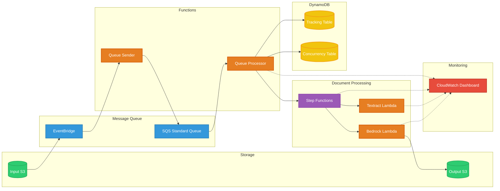

# transflo-idp

## Build, Publish, Deploy

### 1. Dependencies

You need to have the following packages installed on your computer:

1. bash shell (Linux, MacOS, Windows-WSL)
2. aws (AWS CLI)
3. sam (AWS SAM)

Copy the GitLab repo to your computer. Either:
- use the git command: git clone git@ssh.gitlab.aws.dev:genaiic-reusable-assets/transflo-idp.git
- OR, download and expand the ZIP file from the GitLab page: https://gitlab.aws.dev/genaiic-reusable-assets/transflo-idp/-/archive/main/transflo-idp-main.zip

## Build and Publish the solution

To build and publish your own template, to your own S3 bucket, so that others can easily deploy a stack from your templates, in your preferred region, here's how.

Navigate into the project root directory and, in a bash shell, run:

1. `./publish.sh <cfn_bucket_basename> <cfn_prefix> <region e.g. us-east-1>`.  
  This:
    - checks your system dependendencies for required packages (see Dependencies above)
    - creates CloudFormation templates and asset zip files
    - publishes the templates and required assets to an S3 bucket in your account called `<cfn_bucket_basename>-<region>` (it creates the bucket if it doesn't already exist)
    - optionally add a final parameter `public` if you want to make the templates public. Note: your bucket and account must be configured not to Block Public Access using new ACLs.

That's it! There's just one step.
  
When completed, it displays the CloudFormation templates S3 URLs, 1-click URLs for launching the stack creation in CloudFormation console, and a command to deploy from the CLI:
```
OUTPUTS
Template URL: https://s3.us-east-1.amazonaws.com/bobs-artifacts-us-east-1/transflo-idp/packaged.yaml
CF Launch URL: https://us-east-1.console.aws.amazon.com/cloudformation/home?region=us-east-1#/stacks/create/review?templateURL=https://s3.us-east-1.amazonaws.com/bobs-artifacts-us-east-1/transflo-idp/packaged.yaml&stackName=IDP
CLI Deploy: aws cloudformation deploy --region us-east-1 --template-file /tmp/1132557/packaged.yaml --capabilities CAPABILITY_NAMED_IAM CAPABILITY_AUTO_EXPAND --stack-name IDP
Done
```

## Test the solution

Open the `S3InputBucketConsoleURL` and `S3OutputBucketConsoleURL` using the links in the stack Resources tab.
Open the `StateMachineConsoleURL` using the link in the stack Resources tab.

Upload a filled PNG or PDF form to the `InputBucket` - there's an example in the `./samples` folder.

Example - to copy the sample file `insurance-claim-form.png` N times, do:
```
$ n=50
$ for i in `seq 1 $n`; do aws s3 cp ./samples/insurance-claim-form.png s3://idp-inputbucket-kmsxxxxxxxxx/insurance-claim-form-$i.png; done
```

The StepFunctions StateMachine should start executing. Open the `Running` execution page to observe the steps in the workflow, trace inputs/outputs, check Lambda code and logs, etc.

When/if the execution sucessfully finishes, check the `OutputBucket` for the structured data JSON file with extracted fields.

### Volume testing using load simulator script

Use `./scripts/simulate_load.py` to simulate heavy incoming document rates over time. It copies a specified source document from an S3 bucket, many times in parallel, to the designated `InputBucket`. Example - to simulate incoming document rate of 500 docs per minute for 10 minutes, do:
```
$ python ./scripts/simulate_load.py -s source_bucket -k prefix/exampledoc.pdf -d idp-kmsxxxxxxxxx -r 500 -t 10
```

# Document Processing Pipeline

## Architecture Overview



### Flow Overview
1. Documents uploaded to Input S3 bucket trigger EventBridge events
2. Queue Sender Lambda records event in tracking table and sends to SQS
3. Queue Processor Lambda:
   - Picks up messages in batches
   - Manages workflow concurrency using DynamoDB counter
   - Starts Step Functions executions
4. Step Functions workflow:
   - Extracts text using Textract
   - Processes text using Bedrock/Claude
   - Writes results to Output S3
5. Workflow completion events update tracking and metrics

### Components
- **Storage**: S3 buckets for input documents and JSON output
- **Message Queue**: Standard SQS queue for high throughput
- **Functions**: Lambda functions for queue operations
- **Step Functions**: Document processing workflow orchestration
- **DynamoDB**: Tracking and concurrency management
- **CloudWatch**: Comprehensive monitoring and logging

## Concurrency and Throttling Management

### Bedrock Throttling and Retry
The Bedrock Lambda function implements exponential backoff:
```python
MAX_RETRIES = 10
INITIAL_BACKOFF = 2  # seconds
MAX_BACKOFF = 600   # 10 minutes

def calculate_backoff(attempt):
    backoff = min(MAX_BACKOFF, INITIAL_BACKOFF * (2 ** attempt))
    jitter = random.uniform(0, 0.1 * backoff)
    return backoff + jitter
```

Retry behavior:
- Up to 10 retry attempts
- Exponential backoff starting at 2 seconds
- Maximum backoff of 10 minutes
- 10% random jitter to prevent thundering herd
- Metrics tracking for retries and failures

### Step Functions Retry Configuration
Each Lambda invocation includes retry settings:
```json
"Retry": [
  {
    "ErrorEquals": [
      "States.TaskFailed",
      "Lambda.ServiceException",
      "Lambda.AWSLambdaException",
      "Lambda.SdkClientException"
    ],
    "IntervalSeconds": 2,
    "MaxAttempts": 10,
    "BackoffRate": 2
  }
]
```

### Concurrency Control
- DynamoDB counter tracks active workflows
- Queue Processor enforces maximum concurrent executions
- SQS retains messages when concurrency limit reached
- Batch processing for improved throughput

## Monitoring and Logging

### CloudWatch Dashboard
Access via CloudWatch > Dashboards > `${StackName}-${Region}`

#### Latency Metrics
- Queue Latency
- Workflow Latency
- Total Processing Latency
All include average, p90, and maximum values

#### Throughput Metrics
- SQS Queue metrics (received/deleted)
- Step Functions execution counts
- Textract and Bedrock invocations

#### Error Tracking
- Failed Step Functions executions
- Lambda function errors
- Long-running invocations

### Log Groups
```
/${StackName}/lambda/textract
/${StackName}/lambda/bedrock
/${StackName}/lambda/queue-sender
/${StackName}/lambda/queue-processor
/aws/vendedlogs/states/${StackName}-workflow
```

## Document Status Lookup

### Using the Lookup Script
```bash
# Check document status
./scripts/lookup_file_status.sh "path/to/document.pdf" stack-name

# Format output with jq
./scripts/lookup_file_status.sh "document.pdf" stack-name | jq

# Check just status
./scripts/lookup_file_status.sh "document.pdf" stack-name | jq -r '.status'

# Calculate processing time
./scripts/lookup_file_status.sh "document.pdf" stack-name | jq -r '.timing'
```

### Response Format
```json
{
  "found": true,
  "status": "COMPLETED",
  "timing": {
    "queue_time_ms": 234,
    "workflow_time_ms": 15678,
    "total_time_ms": 15912
  },
  "execution": {
    "arn": "arn:aws:states:...",
    "status": "SUCCEEDED",
    "input": { ... },
    "output": { ... }
  }
}
```

## Configuration Parameters

### Stack Parameters
```bash
sam deploy --guided \
  --parameter-overrides \
  MaxConcurrentWorkflows=100 \    # Maximum parallel workflows
  LogRetentionDays=30 \          # CloudWatch log retention
  ErrorThreshold=1 \             # Errors before alerting
  ExecutionTimeThresholdMs=30000 # Duration threshold
```

### Monitoring Thresholds
- Execution Time: Configurable threshold for long-running operations
- Error Count: Number of errors that triggers alerts
- Log Retention: How long to keep CloudWatch logs

## Troubleshooting Guide

1. **Document Not Processing**
   - Check SQS queue metrics for backup
   - Verify concurrency limit hasn't been reached
   - Look for Lambda errors in dashboard

2. **Slow Processing**
   - Monitor latency metrics in dashboard
   - Check Bedrock throttling and retry counts
   - Review long-running invocations

3. **Failed Processing**
   - Check Step Functions execution errors
   - Review Lambda error logs
   - Verify input document format

## Performance Considerations

1. **Batch Processing**
   - SQS configured for batch size of 10
   - Reduces Lambda invocation overhead
   - Maintains reasonable processing order

2. **Concurrency**
   - Controlled via DynamoDB counter
   - Default limit of 100 concurrent workflows
   - Adjustable based on Bedrock quotas

3. **Queue Management**
   - Standard queue for higher throughput
   - Visibility timeout matches workflow duration
   - Built-in retry for failed messages