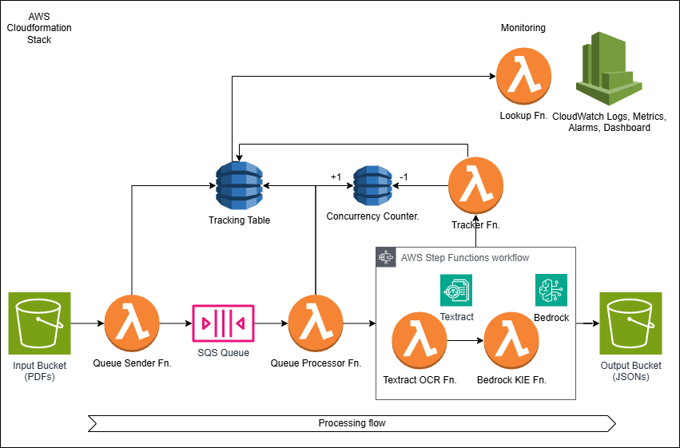

# Gen AI Intelligent Document Processing (GenAIIDP)

Copyright Amazon.com, Inc. or its affiliates. All Rights Reserved.
SPDX-License-Identifier: MIT-0

## Table of Contents

- [Introduction](#introduction)
- [Key Features](#key-features)
- [Architecture Overview](#architecture-overview)
- [Quick Start](#quick-start)
  - [Processing Your First Document](#processing-your-first-document)
- [Updating an Existing Deployment](#updating-an-existing-deployment)
- [Detailed Documentation](#detailed-documentation)
  - [Core Documentation](#core-documentation)
  - [Processing Patterns](#processing-patterns)
  - [Python Development](#python-development)
  - [Planning & Operations](#planning--operations)
- [Contributing](#contributing)
- [License](#license)

## Introduction

A scalable, serverless solution for automated document processing and information extraction using AWS services. This system combines OCR capabilities with generative AI to convert unstructured documents into structured data at scale.

## Key Features

- **Serverless Architecture**: Built entirely on AWS serverless technologies including Lambda, Step Functions, SQS, and DynamoDB
- **Modular, pluggable patterns**: Pre-built processing patterns using state-of-the-art models and AWS services
- **Advanced Classification**: Support for page-level and holistic document packet classification
- **Few Shot Example Support**: Improve accuracy through example-based prompting
- **High Throughput Processing**: Handles large volumes of documents through intelligent queuing
- **Built-in Resilience**: Comprehensive error handling, retries, and throttling management
- **Cost Optimization**: Pay-per-use pricing model with built-in controls
- **Comprehensive Monitoring**: Rich CloudWatch dashboard with detailed metrics and logs
- **Web User Interface**: Modern UI for inspecting document workflow status and results
- **AI-Powered Evaluation**: Framework to assess accuracy against baseline data
- **Extraction Confidence Assessment**: LLM-powered assessment of extraction confidence with multimodal document analysis
- **Document Knowledge Base Query**: Ask questions about your processed documents

## Architecture Overview

The solution uses a modular architecture with nested CloudFormation stacks to support multiple document processing patterns while maintaining common infrastructure for queueing, tracking, and monitoring.

Current patterns include:
- Pattern 1: Packet or Media processing with Bedrock Data Automation (BDA)
- Pattern 2: OCR → Bedrock Classification (page-level or holistic) → Bedrock Extraction
- Pattern 3: OCR → UDOP Classification (SageMaker) → Bedrock Extraction

## Quick Start

To quickly deploy the GenAI-IDP solution in your AWS account:

1. Log into the [AWS console](https://console.aws.amazon.com/)
2. Choose the **Launch Stack** button below for your desired region:

| Region name           | Region code | Launch                                                                                                                                                                                                                                                                                                                                                                      |
| --------------------- | ----------- | --------------------------------------------------------------------------------------------------------------------------------------------------------------------------------------------------------------------------------------------------------------------------------------------------------------------------------------------------------------------------- |
| US West (Oregon)      | us-west-2   |  |

3. When the stack deploys for the first time, you'll receive an email with a temporary password to access the web UI
4. Use this temporary password for your first login to set up a permanent password

### Processing Your First Document

After deployment, you can quickly process a document and view results:

1. **Upload a Document**:
   - **Via Web UI**: Open the Web UI URL from the CloudFormation stack's Outputs tab, log in, and click "Upload Document"
   - **Via S3**: Upload directly to the S3 input bucket (find the bucket URL in CloudFormation stack Outputs)

2. **Use Sample Documents**:
   - For Pattern 1 (BDA): Use [samples/lending_package.pdf](./samples/lending_package.pdf)
   - For Patterns 2 and 3: Use [samples/rvl_cdip_package.pdf](./samples/rvl_cdip_package.pdf) 

3. **Monitor Processing**:
   - **Via Web UI**: Track document status on the dashboard
   - **Via Step Functions**: Open the StateMachine URL from CloudFormation stack Outputs to observe workflow execution

4. **View Results**:
   - **Via Web UI**: Access processing results through the document details page
   - **Via S3**: Check the output bucket for structured JSON files with extracted data

See the [Deployment Guide](./docs/deployment.md#testing-the-solution) for more detailed testing instructions.

IMPORTANT: If you have not previously done so, you must [request access](https://docs.aws.amazon.com/bedrock/latest/userguide/model-access.html) to the following Amazon Bedrock models:
- Amazon: All Nova models, plus Titan Text Embeddings V2
- Anthropic: Claude 3.x models, Claude 4.x models

## Updating an Existing Deployment

To update an existing GenAIIDP stack to a new version:

1. Navigate to CloudFormation in the AWS Management Console
2. Select your existing stack
3. Click "Update"
4. Select "Replace current template"
5. Enter the template URL: `https://s3.us-west-2.amazonaws.com/aws-ml-blog-us-west-2/artifacts/genai-idp/idp-main.yaml`
6. Follow the prompts to update your stack, reviewing any parameter changes
7. For detailed instructions, see the [Deployment Guide](./docs/deployment.md#updating-an-existing-stack)

For testing, use these sample files:
- Pattern-1 BDA default project: `samples/lending_package.pdf`
- Patterns 2 and 3 default configurations: `samples/rvl_cdip_package.pdf`

For detailed deployment and testing instructions, see the [Deployment Guide](./docs/deployment.md).

## Detailed Documentation

### Core Documentation

- [Architecture](./docs/architecture.md) - Detailed component architecture and data flow
- [Deployment](./docs/deployment.md) - Build, publish, deploy, and test instructions
- [Web UI](./docs/web-ui.md) - Web interface features and usage
- [Configuration](./docs/configuration.md) - Configuration and customization options
- [Classification](./docs/classification.md) - Customizing document classification
- [Extraction](./docs/extraction.md) - Customizing information extraction
- [Assessment](./docs/assessment.md) - Extraction confidence evaluation using LLMs
- [Evaluation Framework](./docs/evaluation.md) - Accuracy assessment system with analytics database and reporting
- [Knowledge Base](./docs/knowledge-base.md) - Document knowledge base query feature
- [Monitoring](./docs/monitoring.md) - Monitoring and logging capabilities
- [Troubleshooting](./docs/troubleshooting.md) - Troubleshooting and performance guides

### Processing Patterns

- [Pattern 1: BDA](./docs/pattern-1.md) - Packet or Media processing with Bedrock Data Automation (BDA)
- [Pattern 2: Textract + Bedrock](./docs/pattern-2.md) - OCR with Textract and generative AI with Bedrock
- [Pattern 3: Textract + UDOP + Bedrock](./docs/pattern-3.md) - OCR with Textract, UDOP Classification, and Bedrock extraction
- [Few-Shot Examples](./docs/few-shot-examples.md) - Implementing few-shot examples for improved accuracy

### Python Development

- [Using Notebooks with IDP Common Library](./docs/using-notebooks-with-idp-common.md) - Guide for using and creating Jupyter notebooks to experiment with the IDP Common Library
- [IDP Common Package](./lib/idp_common_pkg/README.md) - Documentation for the core library powering the accelerator

### Planning & Operations

- [Well-Architected Framework Assessment](./docs/well-architected.md) - Analysis based on AWS Well-Architected Framework
- [AWS Services & IAM Roles](./docs/aws-services-and-roles.md) - AWS services used and IAM role requirements
- [Cost Calculator](./docs/cost-calculator.md) - Framework for estimating solution costs

## Contributing

We welcome contributions to the GenAI Intelligent Document Processing accelerator! Whether you're fixing bugs, improving documentation, or proposing new features, your contributions are appreciated.

Please refer to our [Contributing Guide](./CONTRIBUTING.md) for detailed information on:

- Setting up your development environment
- Project structure
- Making and testing changes
- Pull request process
- Coding standards
  - Python code uses `ruff` for linting
  - UI code uses ESLint (`npm run lint` to verify)
- Documentation requirements
- Issue reporting guidelines

Thank you to everyone who has contributed to making this project better!

## License

This project is licensed under the terms specified in the LICENSE file.
