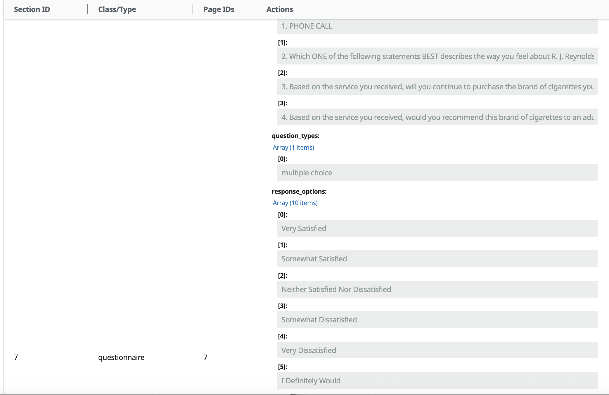
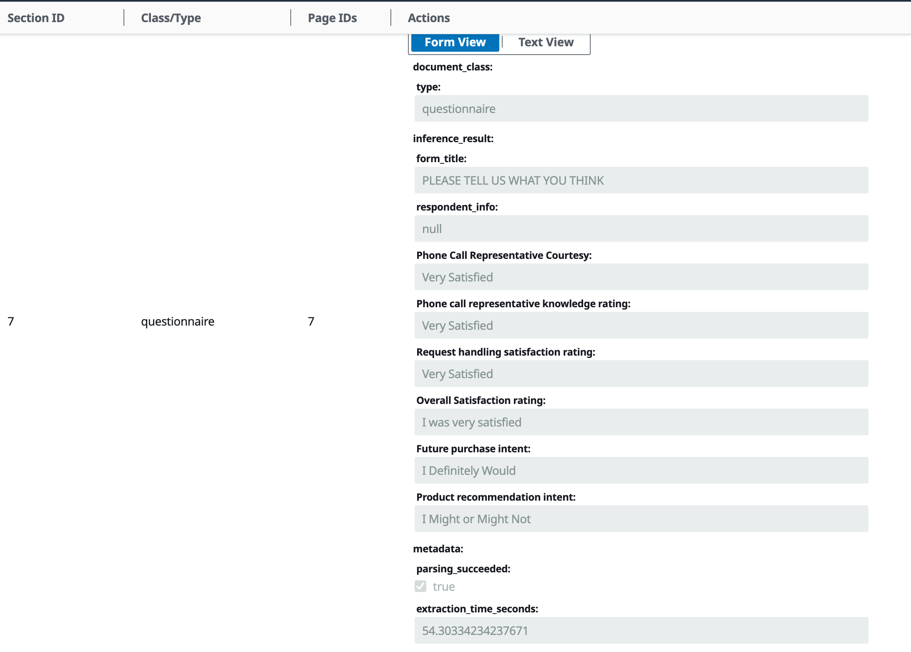

# Checkboxed Attributes Extraction Configuration

This directory contains a specialized configuration for information extraction for attributes with checkboxes using the GenAI IDP Accelerator. This configuration is designed to accurately extract information from documents containing checkbox-based attributes, such as satisfaction surveys, questionnaires, and forms with multiple-choice selections.

## Pattern Association

**Pattern**: Pattern-2 - Uses Textract for OCR and Amazon Bedrock for both page classification/grouping and information extraction

## Validation Level

**Level**: 1 - Basic Testing

- **Testing Evidence**: This configuration has been tested on a limited set of documents, including page 7 of ["samples/rvl_cdip_package.pdf"](../../../samples/rvl_cdip_package.pdf) which is a questionnaire with multiple choice questions. Overall, the configuration has shown significant improvement in extraction accuracy for checkboxed attributes compared to the default configuration.

  - **Results on rvl_cdip_package.pdf**: Initially, using the default JSON configuration, "TABLES" and "LAYOUT" for OCR and Nova Pro (default hyperparameters) for extraction, the solution struggled to correctly identify selected options for checkbox attributes. After optimizing the attribute descriptions and extract task prompt, while maintaining all other settings, we achieved 100% extraction accuracy, as is evident from the images shown below.

[Input document with checkboxes (Page 7 of rvl_cdip_package.pdf)](images/rvl_cdip_pack_pg_7.png)

  <figure>
    
    <figcaption>Before</figcaption>
  </figure>
  <figure>
    
    <figcaption>After</figcaption>
  </figure>

| **Before** | **After** |
|:----------:|:---------:|
|  |  |

- **Known Limitations**: 
  - May require further testing on a wider variety of document types and checkbox formats
  - Performance may vary depending on the quality of the document scan, checkbox visibility, hand marked vs digitally marked checkboxes

## Overview

The Checkboxed Attributes Extraction configuration is designed to accurately extract information from documents containing checkbox-based attributes, such as satisfaction surveys, questionnaires, and forms with multiple-choice selections. This configuration addresses the challenge of correctly identifying which checkboxes are selected in a document. This solution provides zero-shot optimized task guidelines for checkboxes that is document-agnostic, and attribute descriptions for accurate checkbox detection and data extraction.

## Key Differences from Default Configuration

### 1. Optimized Checkbox Attribute Descriptions

The configuration includes carefully crafted descriptions for checkbox attributes that help the model understand the context and format of checkbox selections. For example:

- "Measures the perceived politeness and professionalism of the customer service representative during the phone interaction. Checkbox selection on the satisfaction scale with options like 'Very Satisfied', 'Somewhat Satisfied' etc."

These descriptions explicitly mention that the attribute is a "Checkbox selection" and provide examples of the possible options, which helps the model correctly identify and extract the selected values.

### 2. Document-Agnostic Guidelines

The checkbox extraction guidelines have been kept generic enough to work across different document types, while the attribute descriptions provide document-specific context. This balance allows the configuration to be adaptable to various checkbox formats while still providing enough context for accurate extraction. The newly added extraction-task guidelines include following visual cues to identify selected options, ways to disambiguate overlapping tick marks.

## Customization Guidance

1. (Required) Modify the attribute descriptions in the config.json file to match the specific checkbox formats and options.

  - Maintain the "Checkbox selection" indicator in the descriptions to help the model identify these as checkbox attributes

2. (Optional) If zero-shot prompting with the supplied guidelines for checkboxes doesn't yield the desired extraction accuracy, incorporate few-shot examples of text or images with corresponding ground truth in the extraction task prompt. Be mindful of input token limits when adding few-shot examples.

3. (Optional) For even higher extraction accuracy, consider using:

  - more advanced Textract features such as "FORMS", or a combination of "TABLES" and "FORMS",

  - more sophisticated LLMs. 
  
  **Note** that while these can potentially improve accuracy, they will also increase costs.

## Sample Documents

We recommend testing this configuration on page 7 of ["samples/rvl_cdip_package.pdf"](../../samples/rvl_cdip_package.pdf). This document features a questionnaire with a tabular-like layout of sections, each containing multiple-choice questions with checkboxes. The prompt-optimized configuration, together with "TABLES" and "LAYOUT" for OCR and Nova Pro (default hyperparameters) for extraction, achieved 100% extraction accuracy for checkbox attributes. This marks a significant improvement over the default configuration, which struggled to correctly identify selected options.

## Contributors
Priyashree Roy (@priyalex)

Nivedha Balakrishnan (@nivibkr)