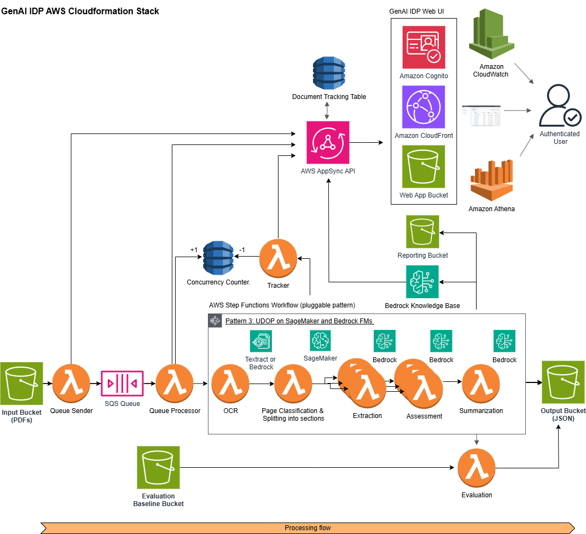
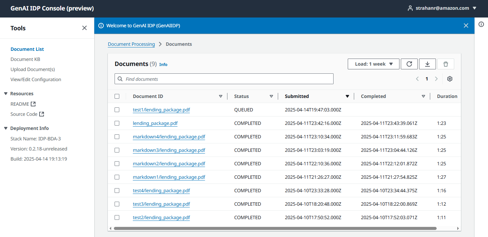

Copyright Amazon.com, Inc. or its affiliates. All Rights Reserved.
SPDX-License-Identifier: MIT-0

# GenAIIDP Architecture

## Flow Overview

1. Documents uploaded to Input S3 bucket trigger EventBridge events
2. Queue Sender Lambda records event in tracking table and sends to SQS
3. Queue Processor Lambda:
   - Picks up messages in batches
   - Manages workflow concurrency using DynamoDB counter
   - Starts Step Functions executions
4. Step Functions workflow runs the steps defined in the selected pattern to process the document and generate output in the Output S3 bucket
5. Workflow completion events update tracking and metrics


## Components

- **Storage**: S3 buckets for input documents and JSON output
- **Message Queue**: Standard SQS queue for high throughput
- **Functions**: Lambda functions for queue operations
- **Step Functions**: Document processing workflow orchestration
- **DynamoDB**: Tracking and concurrency management
- **CloudWatch**: Comprehensive monitoring and logging
- **Web UI**: Browser-based interface for document management and visualization
  - CloudFront distribution for global availability
  - Cognito user authentication
  - GraphQL API for UI-backend interactions
- **Evaluation**: Document processing accuracy assessment system
- **Document Knowledge Base**: Optional Bedrock Knowledge Base for document querying

## Modular Design Overview

The solution uses a modular architecture with nested CloudFormation stacks to support multiple document processing patterns while maintaining a common infrastructure for queueing, tracking, and monitoring. This design enables:

- Support for multiple processing patterns without duplicating core infrastructure
- Easy addition of new processing patterns without modifying existing code
- Centralized monitoring and management across all patterns
- Pattern-specific optimizations and configurations
- Optional features that can be enabled across all patterns:
  - Document summarization (controlled by `IsSummarizationEnabled` parameter)
    - This feature also enables the "Chat with Document" functionality
    - This feature does not use the Bedrock Knowledge Base but stores a full-text text file in S3
  - Document Knowledge Base (using Amazon Bedrock)
  - Automated accuracy evaluation against baseline data

## Stack Structure

### Main Stack (template.yaml)

The main template handles all pattern-agnostic resources and infrastructure:

- S3 Buckets (Input, Output, Working, Configuration, Evaluation Baseline)
- SQS Queues and Dead Letter Queues
- DynamoDB Tables (Execution Tracking, Concurrency, Configuration)
- Lambda Functions for:
  - Queue Processing
  - Queue Sending
  - Workflow Tracking
  - Document Status Lookup
  - Evaluation
  - UI Integration and API Resolvers
- CloudWatch Alarms and Dashboard
- SNS Topics for Alerts
- Web UI Infrastructure:
  - CloudFront Distribution
  - S3 Bucket for static web assets
  - CodeBuild project for UI deployment
- Authentication:
  - Cognito User Pool and Client
  - Identity Pool for secure AWS resource access
- AppSync GraphQL API for UI-backend communication

### Pattern Stacks (patterns/*)

Each pattern is implemented as a nested stack that contains pattern-specific resources:

- Step Functions State Machine
- Pattern-specific Lambda Functions:
  - OCR Processing
  - Classification
  - Extraction
- Pattern-specific CloudWatch Dashboard
- Model Endpoints and Configurations

For detailed information about configuration capabilities, see [configuration.md](./configuration.md).

## Current Patterns

### Pattern 1: Bedrock Data Automation (BDA)
Packet or Media processing with Bedrock Data Automation (BDA)


*Pattern 1 uses AWS Bedrock Data Automation for end-to-end document processing, including OCR, classification, and extraction.*

For detailed information about Pattern 1, see [pattern-1.md](./pattern-1.md).

### Pattern 2: Textract + Bedrock
OCR → Bedrock Classification (page-level or holistic) → Bedrock Extraction


*Pattern 2 combines Amazon Textract for OCR and AWS Bedrock for classification and extraction tasks, supporting both page-level and holistic classification methods.*

For detailed information about Pattern 2, see [pattern-2.md](./pattern-2.md). 

This pattern also supports few-shot examples for classification and extraction. For details on implementing few-shot examples, see [few-shot-examples.md](./few-shot-examples.md).

### Pattern 3: Textract + UDOP + Bedrock
OCR → UDOP Classification (SageMaker) → Bedrock Extraction


*Pattern 3 uses Amazon Textract for OCR, a UDOP model deployed on Amazon SageMaker for classification, and AWS Bedrock for extraction tasks.*

For detailed information about Pattern 3, see [pattern-3.md](./pattern-3.md).

## Pattern Selection and Deployment

For detailed information on deploying this solution, see [deployment.md](./deployment.md).

The pattern is selected at deployment time using the `IDPPattern` parameter:

```yaml
IDPPattern:
  Type: String
  Default: Pattern1 - Packet or Media processing with Bedrock Data Automation (BDA)
  AllowedValues:
    - Pattern1 - Packet or Media processing with Bedrock Data Automation (BDA)
    - Pattern2 - Packet processing with Textract and Bedrock
    - Pattern3 - Packet processing with Textract, SageMaker(UDOP), and Bedrock
  Description: Choose from built-in IDP workflow patterns
```

When deployed, the main stack uses conditions to create the appropriate nested stack:

```yaml
Conditions:
  IsPattern1: !Equals [!Ref IDPPattern, "Pattern1"]
  IsPattern2: !Equals [!Ref IDPPattern, "Pattern2"]
  IsPattern3: !Equals [!Ref IDPPattern, "Pattern3"]

Resources:
  PATTERN1STACK:
    Type: AWS::CloudFormation::Stack
    Condition: IsPattern1
    Properties:
      TemplateURL: ./patterns/pattern-1/.aws-sam/packaged.yaml
      Parameters:
        # Pattern-specific parameters...
```

## Integrated Monitoring

The solution creates an integrated CloudWatch dashboard that combines metrics from both the main stack and the selected pattern stack:

1. The main stack creates a dashboard with core metrics:
   - Queue performance
   - Overall workflow statistics
   - General error tracking
   - Resource utilization

2. Each pattern stack creates its own dashboard with pattern-specific metrics:
   - OCR performance
   - Classification accuracy
   - Extraction stats
   - Model-specific metrics

3. The `DashboardMerger` Lambda function combines these dashboards

For detailed information about monitoring capabilities, see [monitoring.md](./monitoring.md).

## Adding New Patterns

To add a new processing pattern:

1. Create a new directory under `patterns/`
2. Implement the pattern-specific resources in a CloudFormation template
3. Add the pattern to the `IDPPattern` parameter's allowed values
4. Add pattern-specific parameters to the main template
5. Create a new condition and nested stack resource for the pattern

The new pattern will automatically inherit all the core infrastructure and monitoring capabilities while maintaining its own specific processing logic and metrics.

## Web UI Architecture

The solution includes a React-based web user interface for document management and visualization:



For detailed information about the Web UI, its features, and usage, see [web-ui.md](./web-ui.md).

1. **Authentication**: Amazon Cognito provides secure user authentication and authorization
   - Admin users are created during deployment
   - Optional self-signup can be enabled with domain restrictions
   - Identity pools provide secure, temporary AWS credentials

2. **Content Delivery**: CloudFront distribution serves the static web assets
   - Global availability and low latency
   - WAF integration for added security (optional)
   - Geographical restrictions can be applied

3. **API Layer**: AppSync GraphQL API connects the UI to backend services
   - Real-time data with subscriptions
   - Secure access control through Cognito and IAM
   - Lambda resolvers for complex operations

4. **Document Operations**: The UI supports:
   - Document upload and S3 presigned URL generation
   - Status tracking and results visualization
   - Configuration management
   - Knowledge base querying (when enabled)

## Optional Features

### Document Summarization

When enabled via the `IsSummarizationEnabled` parameter (default: true), the solution provides document summarization across all patterns:

- All patterns use a dedicated summarization step with Bedrock models
- Summarization provides a concise overview of the document content
- Results can be viewed in the Web UI and downloaded or printed
- Configuration settings control summarization behavior per pattern

### Document Knowledge Base

The solution optionally integrates with Amazon Bedrock Knowledge Base:

- Processed documents are indexed in a knowledge base
- Enables natural language querying of document content
- Supports various Bedrock models (Amazon Nova, Anthropic Claude)
- GraphQL API integration allows querying from the UI

For detailed information about the Knowledge Base integration, see [knowledge-base.md](./knowledge-base.md).

### Accuracy Evaluation

The solution includes a comprehensive evaluation system:

1. **Baseline Data**: Ground truth data stored in the evaluation baseline bucket
2. **Automatic Evaluation**: When enabled, each processed document is automatically evaluated against baseline data if available
3. **Metrics**: 
   - Extraction accuracy for key-value pairs
   - Classification accuracy across document types
   - Summarization quality assessment
4. **UI Integration**: Results visualized in the web interface
5. **CloudWatch Metrics**: Aggregated accuracy metrics for monitoring

For detailed information about the evaluation system, see [evaluation.md](./evaluation.md).

### Bedrock Guardrails Integration

The solution supports optional Amazon Bedrock Guardrails integration:

- Define content boundaries for Bedrock model outputs
- Apply guardrails to all Bedrock model interactions across all patterns
- Support for both DRAFT and versioned guardrails
- Configuration parameters:
  - `BedrockGuardrailId` - ID of an existing Bedrock Guardrail
  - `BedrockGuardrailVersion` - Version of the guardrail to use (e.g., DRAFT, 1, 2)
- Guardrails can be applied to:
  - Extraction operations
  - Summarization (when enabled)
  - Knowledge Base interactions (when enabled)

### Post-Processing Lambda Hook

The solution supports an optional post-processing Lambda hook integration:

- Automatically triggered via EventBridge after a document is successfully processed
- Configured via the `PostProcessingLambdaHookFunctionArn` parameter
- Enables custom downstream processing of document extraction results
- Can be used for integration with other systems such as:
  - Enterprise document management systems
  - Business process workflows
  - Data analytics pipelines
  - Custom notification systems
- Receives the document processing details and output location

## Additional Documentation

- [classification.md](./classification.md) - Details on document classification capabilities
- [extraction.md](./extraction.md) - Details on data extraction capabilities
- [troubleshooting.md](./troubleshooting.md) - Troubleshooting guidance and common issues
