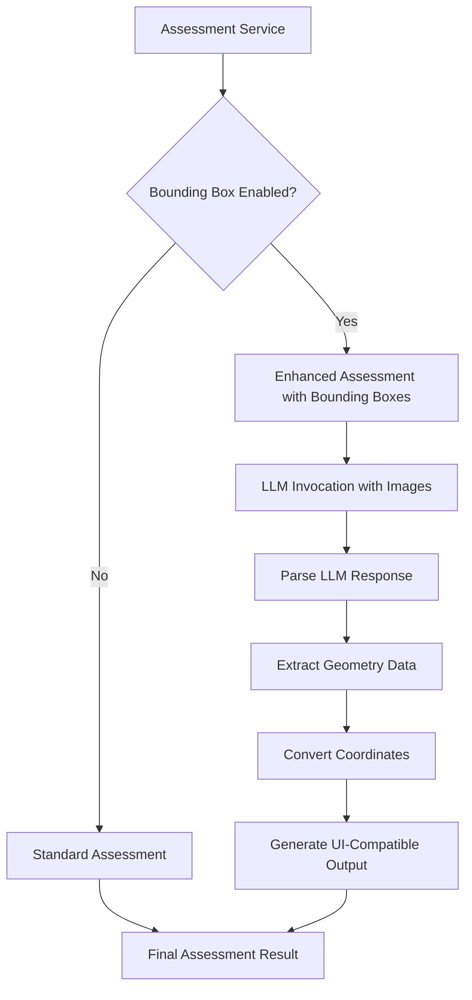

# Bounding Box Integration in Assessment Service

This document describes the bounding box functionality integrated into the IDP Assessment Service, enabling spatial localization of extracted data fields within document images.

## Overview

The Assessment Service now supports **optional bounding box extraction** as part of its confidence assessment workflow. When enabled, the service can:

- Extract bounding box coordinates for each assessed field
- Convert coordinates to UI-compatible geometry format
- Provide spatial localization alongside confidence scores
- Maintain full backward compatibility when disabled

## Features

### Core Capabilities

- **Optional Feature**: Disabled by default, enabled via configuration
- **UI Compatible**: Outputs geometry format compatible with existing pattern-1 UI
- **Multi-page Support**: Handles bounding boxes across multiple document pages
- **Error Resilient**: Gracefully handles invalid or incomplete bounding box data
- **Coordinate Normalization**: Converts from 0-1000 scale to 0-1 normalized coordinates

### Output Format

When bounding boxes are enabled, the assessment output includes `geometry` arrays for all attribute types:

**Simple Attributes:**
```json
{
  "account_number": {
    "confidence": 0.95,
    "confidence_reason": "Clear text with high OCR confidence",
    "confidence_threshold": 0.9,
    "geometry": [
      {
        "boundingBox": {
          "top": 0.375,
          "left": 0.447,
          "width": 0.059,
          "height": 0.010
        },
        "page": 1
      }
    ]
  }
}
```

**Group Attributes (Nested):**
```json
{
  "CompanyAddress": {
    "State": {
      "confidence": 0.99,
      "confidence_reason": "Clear text with high OCR confidence",
      "confidence_threshold": 0.9,
      "geometry": [
        {
          "boundingBox": {
            "top": 0.116,
            "left": 0.23,
            "width": 0.029,
            "height": 0.01
          },
          "page": 1
        }
      ]
    },
    "ZipCode": {
      "confidence": 0.99,
      "confidence_reason": "Clear text with high OCR confidence", 
      "confidence_threshold": 0.9,
      "geometry": [
        {
          "boundingBox": {
            "top": 0.116,
            "left": 0.261,
            "width": 0.037,
            "height": 0.01
          },
          "page": 1
        }
      ]
    }
  }
}
```

**List Attributes:**
```json
{
  "Transactions": [
    {
      "Date": {
        "confidence": 0.95,
        "confidence_reason": "Clear date format",
        "confidence_threshold": 0.9,
        "geometry": [
          {
            "boundingBox": {
              "top": 0.2,
              "left": 0.1,
              "width": 0.05,
              "height": 0.02
            },
            "page": 1
          }
        ]
      },
      "Amount": {
        "confidence": 0.88,
        "confidence_reason": "Good number format",
        "confidence_threshold": 0.9,
        "geometry": [
          {
            "boundingBox": {
              "top": 0.2,
              "left": 0.2,
              "width": 0.05,
              "height": 0.02
            },
            "page": 1
          }
        ]
      }
    }
  ]
}
```

## Configuration

### Basic Configuration

Add the `bounding_boxes` section to your assessment configuration and enhance your existing prompt template:

```yaml
assessment:
  enabled: true
  model: us.amazon.nova-pro-v1:0
  temperature: 0.0
  
  # Enable bounding box extraction
  bounding_boxes:
    enabled: true
  
  # Enhanced prompt template extending existing assessment sophistication
  task_prompt: |
    <background>
    You are an expert document analysis assessment system. Your task is to evaluate the confidence of extraction results for a document of class {DOCUMENT_CLASS} and provide precise spatial localization for each field.
    </background>

    <task>
    Analyze the extraction results against the source document and provide confidence assessments AND bounding box coordinates for each extracted attribute. Consider factors such as:
    1. Text clarity and OCR quality in the source regions 
    2. Alignment between extracted values and document content 
    3. Presence of clear evidence supporting the extraction 
    4. Potential ambiguity or uncertainty in the source material 
    5. Completeness and accuracy of the extracted information
    6. Precise spatial location of each field in the document
    </task>

    <assessment-guidelines>
    For each attribute, provide: 
    - A confidence score between 0.0 and 1.0 where:
       - 1.0 = Very high confidence, clear and unambiguous evidence
       - 0.8-0.9 = High confidence, strong evidence with minor uncertainty
       - 0.6-0.7 = Medium confidence, reasonable evidence but some ambiguity
       - 0.4-0.5 = Low confidence, weak or unclear evidence
       - 0.0-0.3 = Very low confidence, little to no supporting evidence
    - A clear explanation of the confidence reasoning
    - Precise spatial coordinates where the field appears in the document
    </assessment-guidelines>

    <spatial-localization-guidelines>
    For each field, provide bounding box coordinates:
    - bbox: [x1, y1, x2, y2] coordinates in normalized 0-1000 scale
    - page: Page number where the field appears (starting from 1)
    
    Coordinate system:
    - Use normalized scale 0-1000 for both x and y axes
    - x1, y1 = top-left corner of bounding box  
    - x2, y2 = bottom-right corner of bounding box
    - Ensure x2 > x1 and y2 > y1
    - Make bounding boxes tight around the actual text content
    </spatial-localization-guidelines>

    # ... (rest of comprehensive prompt structure)
```

### Configuration Options

| Option | Type | Default | Description |
|--------|------|---------|-------------|
| `bounding_boxes.enabled` | boolean | `false` | Enable/disable bounding box extraction |

## LLM Prompt Requirements

### Expected LLM Response Format

The LLM must return assessment data in this format when bounding boxes are enabled:

```json
{
  "field_name": {
    "confidence": 0.95,
    "confidence_reason": "Clear, readable text with high OCR confidence",
    "bbox": [100, 200, 300, 250],
    "page": 1
  }
}
```

### Coordinate System

- **Scale**: 0-1000 normalized coordinates
- **Format**: `[x1, y1, x2, y2]` (top-left to bottom-right corners)
- **Validation**: x2 > x1 and y2 > y1 (automatically corrected if reversed)
- **Page Numbers**: Start from 1 (not 0-indexed)

### Prompt Template Guidelines

1. **Include `{DOCUMENT_IMAGE}` placeholder** for multimodal analysis
2. **Request both confidence and bbox data** in the prompt
3. **Specify coordinate system clearly** (0-1000 scale)
4. **Provide clear JSON format examples**
5. **Include page number requirements**

## Technical Implementation

### Architecture



### Core Methods

#### `_is_bounding_box_enabled()`
Checks configuration to determine if bounding box extraction is enabled.

#### `_convert_bbox_to_geometry(bbox_coords, page_num)`
Converts `[x1, y1, x2, y2]` coordinates to geometry format:
- Normalizes from 0-1000 scale to 0-1
- Converts corner coordinates to position + dimensions
- Ensures proper coordinate ordering

#### `_extract_geometry_from_assessment(assessment_data)`
Processes LLM response to extract and convert bounding box data:
- Validates bbox and page data completeness
- Handles error cases gracefully
- Removes raw bbox data from final output

### Error Handling

The implementation includes comprehensive error handling:

1. **Invalid Coordinates**: Logs warning and removes invalid data
2. **Missing Page Numbers**: Removes incomplete bounding box data
3. **Malformed Responses**: Continues with confidence assessment only
4. **Coordinate Validation**: Automatically corrects reversed coordinates

## Usage Examples

### Basic Usage

```python
from idp_common.assessment.service import AssessmentService

# Configuration with bounding boxes enabled
config = {
    "assessment": {
        "model": "us.amazon.nova-pro-v1:0",
        "bounding_boxes": {
            "enabled": True
        },
        "task_prompt": "... enhanced prompt template ..."
    }
}

# Initialize service
assessment_service = AssessmentService(config=config)

# Process document section
document = assessment_service.process_document_section(document, section_id)
```

### Checking Results

```python
# Check if geometry data was generated
extraction_data = s3.get_json_content(section.extraction_result_uri)
explainability_info = extraction_data.get("explainability_info", [])

if explainability_info:
    assessment_result = explainability_info[0]
    
    for field_name, field_assessment in assessment_result.items():
        if "geometry" in field_assessment:
            geometry = field_assessment["geometry"][0]
            bbox = geometry["boundingBox"]
            page = geometry["page"]
            
            print(f"{field_name} found on page {page}")
            print(f"Location: top={bbox['top']}, left={bbox['left']}")
            print(f"Size: width={bbox['width']}, height={bbox['height']}")
```

## Integration with UI

The geometry format is fully compatible with the existing pattern-1 UI:

- **Coordinate System**: Normalized 0-1 coordinates
- **Bounding Box Format**: `{top, left, width, height}`
- **Page Support**: Page numbers for multi-page documents
- **Array Structure**: Supports multiple bounding boxes per field

The UI can immediately render bounding box overlays without additional processing.

## Testing

### Unit Tests

Comprehensive unit tests are provided in:
`lib/idp_common_pkg/tests/unit/assessment/test_bounding_box_integration.py`

Test coverage includes:
- Configuration validation
- Coordinate conversion accuracy
- Error handling for invalid data
- Edge cases (reversed coordinates, missing data)
- Integration with existing assessment workflow

### Running Tests

```bash
cd lib/idp_common_pkg
python -m pytest tests/unit/assessment/test_bounding_box_integration.py -v
```

## Performance Considerations

### Impact on Processing Time

- **Minimal Overhead**: When disabled, no performance impact
- **LLM Processing**: When enabled, may slightly increase inference time due to additional coordinate generation
- **Coordinate Conversion**: Negligible computational overhead

### Memory Usage

- **Geometry Data**: Small additional memory footprint for coordinate storage
- **Error Handling**: Graceful degradation prevents memory issues with invalid data

## Migration and Compatibility

### Backward Compatibility

- **Default Behavior**: Feature is disabled by default
- **Existing Workflows**: No changes required to existing assessment configurations  
- **Output Format**: Standard assessment results unchanged when feature is disabled

### Migration Steps

1. **Update Configuration**: Add `bounding_boxes.enabled: true` to assessment config
2. **Enhance Prompts**: Update prompt templates to request bounding box data
3. **Test Integration**: Verify bounding box extraction with sample documents
4. **Monitor Performance**: Validate processing time and accuracy

## Troubleshooting

### Common Issues

#### No Bounding Boxes Generated
- **Check Configuration**: Ensure `bounding_boxes.enabled: true`
- **Verify Prompt**: Confirm prompt requests bbox data
- **Check Logs**: Look for geometry extraction warnings

#### Invalid Coordinates
- **LLM Response**: Verify LLM returns valid `[x1, y1, x2, y2]` format
- **Scale Validation**: Ensure coordinates are in 0-1000 range
- **Page Numbers**: Confirm page numbers start from 1

#### UI Display Issues
- **Coordinate Format**: Verify geometry format matches UI expectations
- **Page Mapping**: Ensure page numbers align with UI page indexing

### Debug Logging

Enable debug logging to trace bounding box processing:

```python
import logging
logging.getLogger('idp_common.assessment.service').setLevel(logging.DEBUG)
```

## Future Enhancements

Potential future improvements include:

1. **Multiple Bounding Boxes**: Support for fields spanning multiple locations
2. **Confidence-Based Filtering**: Only generate bounding boxes for high-confidence fields
3. **Coordinate Validation**: Enhanced validation against document dimensions
4. **Performance Optimization**: Caching and batch processing improvements

## Conclusion

The bounding box integration provides powerful spatial localization capabilities while maintaining the robustness and reliability of the existing Assessment Service. The feature is designed to be:

- **Optional and Non-Intrusive**
- **UI-Compatible**
- **Error-Resilient**
- **Easy to Configure**

This enhancement enables rich document annotation and visualization capabilities while preserving all existing functionality.
