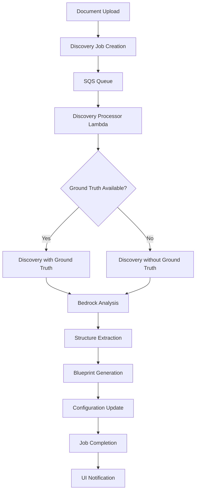

Copyright Amazon.com, Inc. or its affiliates. All Rights Reserved.
SPDX-License-Identifier: MIT-0

# Discovery Module

The Discovery module is an intelligent document analysis system that automatically identifies document structures, field types, and organizational patterns to create document processing blueprints. This module helps bootstrap document processing workflows by analyzing sample documents and generating configuration templates that can be used across all processing patterns.

## Table of Contents

- [Overview](#overview)
  - [What is Discovery](#what-is-discovery)
  - [Key Features](#key-features)
  - [Use Cases](#use-cases)
- [Architecture](#architecture)
  - [Components](#components)
  - [Processing Flow](#processing-flow)
  - [Integration Points](#integration-points)
- [Discovery Methods](#discovery-methods)
  - [Discovery Without Ground Truth](#discovery-without-ground-truth)
  - [Discovery With Ground Truth](#discovery-with-ground-truth)
  - [Choosing the Right Method](#choosing-the-right-method)
- [Configuration](#configuration)
  - [Model Configuration](#model-configuration)
  - [Prompt Customization](#prompt-customization)
  - [Output Format Configuration](#output-format-configuration)
- [Using the Discovery Module](#using-the-discovery-module)
  - [Web UI Interface](#web-ui-interface)
  - [API Integration](#api-integration)
  - [Processing Results](#processing-results)
- [Configuration Management](#configuration-management)
  - [Schema Definition](#schema-definition)
  - [Default Configuration](#default-configuration)
  - [Customization Options](#customization-options)
- [Best Practices](#best-practices)
  - [Document Selection](#document-selection)
  - [Ground Truth Preparation](#ground-truth-preparation)
  - [Configuration Tuning](#configuration-tuning)
- [Troubleshooting](#troubleshooting)
  - [Common Issues](#common-issues)
  - [Error Handling](#error-handling)
  - [Performance Optimization](#performance-optimization)

## Overview

### What is Discovery

The Discovery module analyzes document samples to automatically identify:

- **Document Structure**: Logical groupings of fields and sections
- **Field Types**: Data types (string, number, date, etc.) for each field
- **Field Descriptions**: Contextual information about field purpose and location
- **Document Classes**: Categorization and naming of document types
- **Organizational Patterns**: How fields are grouped and related

This analysis produces structured configuration templates that can be used to configure document processing workflows in any of the supported patterns (Pattern 1, 2, or 3).

### Key Features

- **🤖 Automated Analysis**: Uses advanced LLMs to analyze document structure without manual intervention
- **📋 Blueprint Generation**: Creates ready-to-use configuration templates for document processing
- **🎯 Ground Truth Support**: Leverages existing labeled data to improve discovery accuracy
- **🔧 Configurable Models**: Supports multiple Bedrock models with customizable parameters
- **📝 Custom Prompts**: Allows fine-tuning of analysis behavior through prompt engineering
- **🔄 Iterative Refinement**: Enables progressive improvement of document understanding
- **🌐 Multi-Format Support**: Handles PDF documents and various image formats
- **⚡ Real-Time Processing**: Provides immediate feedback through the web interface

### Use Cases

**New Document Type Onboarding:**
- Analyze sample documents to understand structure
- Generate initial processing configuration
- Reduce time-to-production for new document types

**Configuration Optimization:**
- Improve existing document processing accuracy
- Identify missing fields or incorrect field types
- Refine field descriptions and groupings

**Document Understanding:**
- Explore unknown document formats
- Understand complex document structures
- Document field relationships and dependencies

**Rapid Prototyping:**
- Quickly bootstrap new document processing workflows
- Test processing approaches with minimal setup
- Validate document processing concepts

## Architecture

### Components

**Discovery Processor Lambda (`src/lambda/discovery_processor/index.py`):**
- Processes discovery jobs from SQS queue
- Orchestrates document analysis workflow
- Manages job status and error handling
- Updates configuration based on discovery results

**Classes Discovery Service (`lib/idp_common_pkg/idp_common/discovery/classes_discovery.py`):**
- Core discovery logic and document analysis
- Bedrock model integration for document understanding
- Configuration management and blueprint generation
- Ground truth processing and optimization

**Discovery Panel UI (`src/ui/src/components/discovery/DiscoveryPanel.jsx`):**
- Web interface for initiating discovery jobs
- Real-time job status monitoring
- Results visualization and review
- Configuration export and integration

**Discovery Tracking Table:**
- DynamoDB table for job status tracking
- Stores discovery job metadata and progress
- Enables real-time status updates via GraphQL subscriptions

### Processing Flow



### Integration Points

**S3 Integration:**
- Document storage and retrieval
- Ground truth file processing
- Result artifact storage

**DynamoDB Integration:**
- Job tracking and status management
- Configuration storage and retrieval
- Metadata persistence

**Bedrock Integration:**
- LLM-powered document analysis
- Configurable model selection
- Prompt-based structure extraction

**GraphQL/AppSync Integration:**
- Real-time job status updates
- UI synchronization and notifications
- Configuration management APIs

## Discovery Methods

### Discovery Without Ground Truth

This method analyzes documents from scratch without any prior knowledge or labeled examples.

**How it Works:**
1. Document is processed through OCR or direct text extraction
2. LLM analyzes the document structure and content
3. Fields are identified based on visual layout and text patterns
4. Document class and description are generated automatically
5. Field groupings and relationships are determined

**Best For:**
- Completely new document types
- Exploratory analysis of unknown formats
- Initial document understanding
- Rapid prototyping scenarios

**Configuration Example:**
```yaml
discovery:
  without_ground_truth:
    model_id: "us.amazon.nova-pro-v1:0"
    temperature: 1.0
    top_p: 0.1
    max_tokens: 10000
    system_prompt: >-
      You are an expert in processing forms. Analyze forms line by line to identify 
      field names, data types, and organizational structure. Focus on creating 
      comprehensive blueprints for document processing without extracting actual values.
    user_prompt: >-
      This image contains forms data. Analyze the form line by line...
```

**Output Structure:**
```json
{
  "document_class": "W4-Form",
  "document_description": "Employee withholding allowance certificate",
  "groups": [
    {
      "name": "EmployeeInformation",
      "description": "Personal details of the employee",
      "attributeType": "group",
      "groupType": "normal",
      "groupAttributes": [
        {
          "name": "FirstName",
          "dataType": "string",
          "description": "Employee's first name from line 1"
        }
      ]
    }
  ]
}
```

### Discovery With Ground Truth

This method uses existing labeled data or known field definitions to optimize the discovery process.

**How it Works:**
1. Ground truth data is loaded from S3 (JSON format)
2. Document is analyzed with reference to expected fields
3. LLM matches document structure to ground truth patterns
4. Field descriptions and types are refined based on known data
5. Missing or additional fields are identified and documented

**Best For:**
- Improving existing configurations
- Leveraging known document structures
- Ensuring consistency with established patterns
- Optimizing field extraction accuracy

**Ground Truth Format:**
```json
{
  "document_class": "W4Form",
  "employee_name": "John Smith",
  "ssn": "123-45-6789",
  "address": "123 Main Street",
  "filing_status": "Single",
  "dependents": 0
}
```

**Configuration Example:**
```yaml
discovery:
  with_ground_truth:
    model_id: "us.amazon.nova-pro-v1:0"
    temperature: 1.0
    top_p: 0.1
    max_tokens: 10000
    system_prompt: >-
      You are an expert in processing forms. Use provided ground truth data as 
      reference to optimize field extraction and ensure consistency with expected 
      document structure and field definitions.
    user_prompt: >-
      This image contains unstructured data. Analyze the data line by line using 
      the provided ground truth as reference...
      <GROUND_TRUTH_REFERENCE>
      {ground_truth_json}
      </GROUND_TRUTH_REFERENCE>
```

### Choosing the Right Method

| Factor | Without Ground Truth | With Ground Truth |
|--------|---------------------|-------------------|
| **Use Case** | New document exploration | Configuration optimization |
| **Accuracy** | Good for structure discovery | Higher accuracy for known patterns |
| **Speed** | Fast, single-pass analysis | Optimized based on reference data |
| **Consistency** | May vary between runs | Consistent with reference patterns |
| **Setup Effort** | Minimal - just upload document | Requires ground truth preparation |
| **Best For** | Unknown document types | Improving existing workflows |

## Configuration

The Discovery module supports comprehensive configuration through the Pattern 1 template and configuration files. All settings can be customized through the web UI or configuration files.

### Model Configuration

**Supported Models:**
- `us.amazon.nova-lite-v1:0` - Fast, cost-effective for simple documents
- `us.amazon.nova-pro-v1:0` - Balanced performance and accuracy (recommended)
- `us.amazon.nova-premier-v1:0` - Highest accuracy for complex documents
- `us.anthropic.claude-3-haiku-20240307-v1:0` - Fast processing
- `us.anthropic.claude-3-5-sonnet-20241022-v2:0` - High accuracy
- `us.anthropic.claude-3-7-sonnet-20250219-v1:0` - Latest capabilities

**Model Parameters:**
```yaml
discovery:
  without_ground_truth:
    model_id: "us.amazon.nova-pro-v1:0"
    temperature: 1.0        # Creativity level (0.0-1.0)
    top_p: 0.1             # Nucleus sampling (0.0-1.0)
    max_tokens: 10000      # Maximum response length
```

**Parameter Guidelines:**
- **Temperature**: Use 1.0 for creative structure discovery, 0.0 for consistent results
- **Top P**: Lower values (0.1) for focused analysis, higher for diverse interpretations
- **Max Tokens**: 10000+ recommended for complex documents with many fields

### Prompt Customization

**System Prompt Configuration:**
```yaml
discovery:
  without_ground_truth:
    system_prompt: >-
      You are an expert in processing forms. Extracting data from images and documents. 
      Analyze forms line by line to identify field names, data types, and organizational 
      structure. Focus on creating comprehensive blueprints for document processing 
      without extracting actual values.
```

**User Prompt Configuration:**
```yaml
discovery:
  without_ground_truth:
    user_prompt: >-
      This image contains forms data. Analyze the form line by line.
      Image may contains multiple pages, process all the pages. 
      Form may contain multiple name value pair in one line. 
      Extract all the names in the form including the name value pair which doesn't have value. 
      Organize them into groups, extract field_name, data_type and field description.
      Field_name should be less than 60 characters, should not have space use '-' instead of space.
      field_description is a brief description of the field and the location of the field 
      like box number or line number in the form and section of the form.
      Field_name should be unique within the group.
      Add two fields document_class and document_description. 
      For document_class generate a short name based on the document content like W4, I-9, Paystub. 
      For document_description generate a description about the document in less than 50 words. 
      Group the fields based on the section they are grouped in the form. 
      Group should have attributeType as "group".
      If the group repeats, add an additional field groupType and set the value as "Table".
      Do not extract the values.
      Return the extracted data in JSON format.
```

**Ground Truth Prompt Features:**
- **Placeholder Support**: Use `{ground_truth_json}` for dynamic ground truth injection
- **Reference Integration**: Automatically includes ground truth data in analysis context
- **Consistency Enforcement**: Ensures field names and types match reference patterns

### Output Format Configuration

**Sample JSON Structure:**
```yaml
discovery:
  output_format:
    sample_json: >-
      {
        "document_class": "Form-1040",
        "document_description": "Brief summary of the document",
        "groups": [
          {
            "name": "PersonalInformation",
            "description": "Personal information of Tax payer",
            "attributeType": "group",
            "groupType": "normal",
            "groupAttributes": [
              {
                "name": "FirstName",
                "dataType": "string",
                "description": "First Name of Taxpayer"
              },
              {
                "name": "Age",
                "dataType": "number",
                "description": "Age of Taxpayer"
              }
            ]
          }
        ]
      }
```

**Field Types Supported:**
- `string` - Text fields, names, addresses
- `number` - Numeric values, amounts, quantities
- `date` - Date fields in various formats
- `boolean` - Yes/no, checkbox fields
- `array` - Lists or repeated elements

**Group Types:**
- `normal` - Standard field groupings
- `Table` - Repeating tabular data structures

## Using the Discovery Module

### Web UI Interface

**Accessing Discovery:**
1. Navigate to the main application dashboard
2. Click on the "Discovery" tab or panel
3. Upload document(s) for analysis
4. Optionally upload ground truth file (JSON format)
5. Click "Start Discovery" to begin analysis

**Monitoring Progress:**
- Real-time job status updates via GraphQL subscriptions
- Progress indicators and status messages
- Error notifications and troubleshooting guidance
- Estimated completion times

**Reviewing Results:**
- Interactive preview of discovered structure
- Field-by-field review and validation
- Export options for configuration integration
- Comparison with existing configurations

### API Integration

**GraphQL Mutations:**
```graphql
mutation StartDiscoveryJob($input: DiscoveryJobInput!) {
  startDiscoveryJob(input: $input) {
    jobId
    status
    message
  }
}
```

**Job Status Subscription:**
```graphql
subscription OnDiscoveryJobStatusChange($jobId: ID!) {
  onDiscoveryJobStatusChange(jobId: $jobId) {
    jobId
    status
    progress
    errorMessage
    result
  }
}
```

**Direct API Usage:**
```python
from idp_common.discovery.classes_discovery import ClassesDiscovery

# Initialize with configuration
discovery = ClassesDiscovery(
    input_bucket="my-documents",
    input_prefix="sample-form.pdf",
    config=my_discovery_config,
    region="us-west-2"
)

# Run discovery without ground truth
result = discovery.discovery_classes_with_document(
    input_bucket="my-documents",
    input_prefix="sample-form.pdf"
)

# Run discovery with ground truth
result = discovery.discovery_classes_with_document_and_ground_truth(
    input_bucket="my-documents",
    input_prefix="sample-form.pdf",
    ground_truth_key="ground-truth.json"
)
```

### Processing Results

**Result Structure:**
```json
{
  "status": "SUCCESS",
  "jobId": "discovery-job-12345",
  "message": "Discovery completed successfully",
  "configuration": {
    "document_class": "W4Form",
    "document_description": "Employee withholding certificate",
    "groups": [...],
    "metadata": {
      "processing_time": "45.2s",
      "model_used": "us.amazon.nova-pro-v1:0",
      "confidence_score": 0.92
    }
  }
}
```

**Integration Options:**
- **Direct Configuration Update**: Automatically update existing configuration
- **Export for Review**: Download configuration for manual review and editing
- **Merge with Existing**: Combine with current document class definitions
- **Create New Class**: Add as new document type to existing configuration

## Configuration Management

### Schema Definition

The Discovery module configuration is defined in the Pattern 1 CloudFormation template with comprehensive UI schema support:

**Schema Structure:**
```yaml
UpdateSchemaConfig:
  Type: AWS::CloudFormation::CustomResource
  Properties:
    ServiceToken: !Ref UpdateConfigurationFunctionArn
    Schema:
      type: object
      properties:
        discovery:
          order: 5
          type: object
          sectionLabel: Discovery Configuration
          description: Configuration for document class discovery functionality
          properties:
            without_ground_truth:
              order: 0
              type: object
              sectionLabel: Discovery Without Ground Truth
              # ... detailed field definitions
```

**UI Integration Features:**
- **Dropdown Model Selection**: Predefined list of supported Bedrock models
- **Range Validation**: Temperature, top_p with proper min/max values
- **Textarea Prompts**: Multi-line editing for system and user prompts
- **Real-time Validation**: Immediate feedback on configuration changes
- **Help Text**: Contextual descriptions for each configuration option

### Default Configuration

**Pattern 1 Default Settings:**
```yaml
discovery:
  without_ground_truth:
    model_id: "us.amazon.nova-pro-v1:0"
    temperature: 1.0
    top_p: 0.1
    max_tokens: 10000
    system_prompt: "You are an expert in processing forms..."
    user_prompt: "This image contains forms data..."
  with_ground_truth:
    model_id: "us.amazon.nova-pro-v1:0"
    temperature: 1.0
    top_p: 0.1
    max_tokens: 10000
    system_prompt: "You are an expert in processing forms..."
    user_prompt: "This image contains unstructured data..."
  output_format:
    sample_json: "{...}"
```

**Configuration Loading Priority:**
1. Custom configuration from DynamoDB (if available)
2. Pattern-specific configuration file
3. Built-in default configuration
4. Environment variable fallbacks

### Customization Options

**Model Selection:**
- Choose models based on document complexity and processing requirements
- Balance accuracy vs. cost vs. speed
- Consider context window limits for large documents

**Prompt Engineering:**
- Customize system prompts for domain-specific terminology
- Adjust user prompts for specific document layouts
- Include examples or constraints in prompts

**Parameter Tuning:**
- Adjust temperature for consistency vs. creativity
- Modify top_p for focused vs. diverse analysis
- Set appropriate max_tokens for document complexity

**Output Customization:**
- Define custom field naming conventions
- Specify required field types and formats
- Configure grouping and organizational patterns

## Best Practices

### Document Selection

**Choose Representative Samples:**
- Select documents that represent typical variations
- Include both simple and complex examples
- Ensure all important sections are represented
- Use high-quality, clear document images

**Document Quality Guidelines:**
- **Resolution**: Minimum 150 DPI for text clarity
- **Format**: PDF preferred, high-quality images acceptable
- **Completeness**: Include all pages of multi-page documents
- **Legibility**: Ensure text is readable and not corrupted

**Sample Size Recommendations:**
- **Single Document**: Good for initial exploration
- **2-3 Documents**: Better for understanding variations
- **5+ Documents**: Optimal for comprehensive analysis
- **Different Layouts**: Include various form versions if available

### Ground Truth Preparation

**JSON Format Requirements:**
```json
{
  "document_class": "FormName",
  "field_name_1": "expected_value_1",
  "field_name_2": "expected_value_2",
  "nested_object": {
    "sub_field": "sub_value"
  },
  "array_field": ["item1", "item2"]
}
```

**Best Practices:**
- **Field Names**: Use descriptive, consistent naming conventions
- **Data Types**: Include examples of all expected data types
- **Completeness**: Cover all important fields in the document
- **Accuracy**: Ensure ground truth data is correct and validated
- **Structure**: Reflect the logical organization of document fields

**Ground Truth Sources:**
- Existing database schemas or data models
- Manual annotation of sample documents
- Previous extraction results (validated)
- Domain expert knowledge and requirements

### Configuration Tuning

**Model Selection Guidelines:**
- **Nova Lite**: Simple forms with clear structure
- **Nova Pro**: Most document types (recommended default)
- **Nova Premier**: Complex layouts, handwritten content
- **Claude Models**: Alternative for specific use cases

**Parameter Optimization:**
```yaml
# For consistent, structured output
discovery:
  without_ground_truth:
    temperature: 0.0    # Low creativity
    top_p: 0.1         # Focused sampling
    
# For creative structure discovery
discovery:
  without_ground_truth:
    temperature: 1.0    # High creativity
    top_p: 0.3         # Diverse sampling
```

**Prompt Engineering Tips:**
- **Be Specific**: Clearly define expected field types and formats
- **Include Examples**: Show desired output structure in prompts
- **Set Constraints**: Specify field naming conventions and limitations
- **Domain Context**: Include relevant domain knowledge and terminology

**Iterative Improvement:**
1. Start with default configuration
2. Run discovery on sample documents
3. Review and validate results
4. Adjust prompts and parameters based on findings
5. Re-run discovery to validate improvements
6. Repeat until satisfactory results are achieved

## Troubleshooting

### Common Issues

**Issue: Discovery Job Fails to Start**
```
Symptoms: Job status remains "PENDING" or shows "FAILED" immediately
Causes: 
- Invalid document format or corrupted file
- Insufficient permissions for S3 access
- Missing or invalid configuration

Solutions:
- Verify document is valid PDF or supported image format
- Check S3 bucket permissions and access policies
- Validate configuration syntax and required fields
- Review CloudWatch logs for specific error messages
```

**Issue: Poor Field Detection Quality**
```
Symptoms: Missing fields, incorrect field types, poor grouping
Causes:
- Document quality issues (low resolution, poor scan)
- Inappropriate model selection for document complexity
- Generic prompts not suited for document type

Solutions:
- Use higher resolution documents (minimum 150 DPI)
- Try different models (Nova Premier for complex documents)
- Customize prompts with domain-specific terminology
- Provide ground truth data for better guidance
```

**Issue: Inconsistent Results Between Runs**
```
Symptoms: Different field structures on repeated analysis
Causes:
- High temperature setting causing creative variation
- Ambiguous document structure or layout
- Insufficient prompt constraints

Solutions:
- Reduce temperature to 0.0 for consistent results
- Add more specific constraints in user prompts
- Use ground truth data to establish expected patterns
- Include examples in prompts for guidance
```

**Issue: Timeout or Performance Problems**
```
Symptoms: Jobs taking too long or timing out
Causes:
- Large documents exceeding processing limits
- Complex layouts requiring extensive analysis
- Model capacity or throttling issues

Solutions:
- Split large documents into smaller sections
- Use faster models (Nova Lite) for initial analysis
- Implement retry logic with exponential backoff
- Consider preprocessing to simplify document structure
```

### Error Handling

**Configuration Validation:**
```python
def validate_discovery_config(config):
    """Validate discovery configuration before processing."""
    required_fields = ['model_id', 'system_prompt', 'user_prompt']
    
    for scenario in ['without_ground_truth', 'with_ground_truth']:
        scenario_config = config.get('discovery', {}).get(scenario, {})
        for field in required_fields:
            if not scenario_config.get(field):
                raise ValueError(f"Missing required field: {field} in {scenario}")
    
    # Validate model ID
    supported_models = [
        'us.amazon.nova-lite-v1:0',
        'us.amazon.nova-pro-v1:0',
        'us.amazon.nova-premier-v1:0',
        # ... other supported models
    ]
    
    model_id = scenario_config.get('model_id')
    if model_id not in supported_models:
        raise ValueError(f"Unsupported model: {model_id}")
```

**Graceful Degradation:**
```python
def discovery_with_fallback(discovery_service, document_key, ground_truth_key=None):
    """Attempt discovery with fallback strategies."""
    try:
        # Try with ground truth if available
        if ground_truth_key:
            return discovery_service.discovery_classes_with_document_and_ground_truth(
                input_bucket, document_key, ground_truth_key
            )
        else:
            return discovery_service.discovery_classes_with_document(
                input_bucket, document_key
            )
    except Exception as e:
        logger.warning(f"Discovery failed with error: {e}")
        
        # Fallback to simpler model or configuration
        fallback_config = get_fallback_config()
        fallback_service = ClassesDiscovery(
            input_bucket=input_bucket,
            input_prefix=document_key,
            config=fallback_config
        )
        
        return fallback_service.discovery_classes_with_document(
            input_bucket, document_key
        )
```

### Performance Optimization

**Document Preprocessing:**
```python
def optimize_document_for_discovery(document_path):
    """Optimize document for better discovery performance."""
    # Resize images to optimal dimensions
    if document_path.lower().endswith(('.jpg', '.jpeg', '.png')):
        optimize_image_resolution(document_path, target_dpi=150)
    
    # Split large PDFs into manageable sections
    elif document_path.lower().endswith('.pdf'):
        page_count = get_pdf_page_count(document_path)
        if page_count > 10:
            return split_pdf_into_sections(document_path, max_pages=10)
    
    return [document_path]
```

**Batch Processing:**
```python
def batch_discovery_processing(document_list, batch_size=5):
    """Process multiple documents efficiently."""
    results = []
    
    for i in range(0, len(document_list), batch_size):
        batch = document_list[i:i + batch_size]
        
        # Process batch concurrently
        with ThreadPoolExecutor(max_workers=batch_size) as executor:
            futures = [
                executor.submit(process_single_document, doc)
                for doc in batch
            ]
            
            batch_results = [
                future.result() for future in as_completed(futures)
            ]
            
        results.extend(batch_results)
        
        # Rate limiting between batches
        time.sleep(1)
    
    return results
```

**Caching and Reuse:**
```python
def cached_discovery_analysis(document_hash, config_hash):
    """Cache discovery results for reuse."""
    cache_key = f"discovery:{document_hash}:{config_hash}"
    
    # Check cache first
    cached_result = get_from_cache(cache_key)
    if cached_result:
        return cached_result
    
    # Perform discovery if not cached
    result = perform_discovery_analysis()
    
    # Cache result for future use
    set_cache(cache_key, result, ttl=3600)  # 1 hour TTL
    
    return result
```

**Monitoring and Metrics:**
```python
def track_discovery_metrics(job_id, start_time, result):
    """Track discovery performance metrics."""
    processing_time = time.time() - start_time
    
    metrics = {
        'job_id': job_id,
        'processing_time_seconds': processing_time,
        'fields_discovered': count_discovered_fields(result),
        'groups_identified': count_groups(result),
        'model_used': result.get('metadata', {}).get('model_id'),
        'success': result.get('status') == 'SUCCESS'
    }
    
    # Send to CloudWatch or monitoring system
    publish_metrics(metrics)
```

The Discovery module provides a powerful foundation for understanding and processing new document types. By following these guidelines and best practices, you can effectively leverage the module to bootstrap document processing workflows and continuously improve their accuracy and coverage.