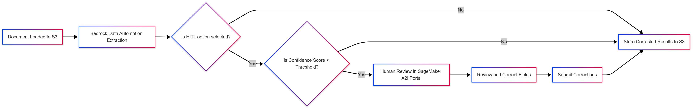

# Human-in-the-Loop (HITL) Review

Copyright Amazon.com, Inc. or its affiliates. All Rights Reserved.
SPDX-License-Identifier: MIT-0

## Table of Contents

- [Overview](#overview)
- [Architecture](#architecture)
- [Workflow](#workflow)
- [Configuration](#configuration)
- [Review Portal](#review-portal)
- [Best Practices](#best-practices)
- [Troubleshooting](#troubleshooting)
- [Known Limitations](#known-limitations)

## Overview

The GenAI-IDP solution supports Human-in-the-Loop (HITL) review capabilities using Amazon SageMaker Augmented AI (A2I). This feature enables human reviewers to validate and correct extracted information when the system's confidence falls below a specified threshold, ensuring accuracy for critical document processing workflows.

**Supported Patterns:**
- Pattern 1: BDA processing with HITL review
- Pattern 2: Textract + Bedrock processing with HITL review

https://github.com/user-attachments/assets/126c9a70-6811-46f3-9166-ef71397ea4bc

## Architecture

The HITL system integrates with the document processing workflow through:

- **Amazon SageMaker A2I**: Manages human review tasks and workflows
- **Private Workforce**: Secure reviewer access with existing credentials
- **Review Portal**: Web interface for validation and correction
- **Confidence Assessment**: Automated triggering based on extraction confidence scores

## Workflow

### 1. Automatic Triggering

HITL review is automatically triggered when:
- HITL feature is enabled in your configuration
- Extraction confidence score falls below the configured threshold
- The system creates a human review task in SageMaker A2I

### 2. Review Process

**Access:**
- Reviewers access the SageMaker A2I Review Portal (URL available in CloudFormation output `SageMakerA2IReviewPortalURL`)
- Login credentials are the same as those used for the GenAI IDP portal

**Review Tasks:**
- Extracted key-value pairs are presented for validation and correction
- Reviewers can validate correct extractions or make necessary corrections
- Submit corrections using the "Submit" button

### 3. Result Integration

- Corrected key-value pairs automatically update the source results
- The document processing workflow continues with the human-verified data
- Processing status is updated to reflect human review completion

## Configuration

### Deployment Parameters

**Pattern 1:**
- `EnableHITL`: Boolean parameter to enable/disable the HITL feature
- `Pattern1 - Existing Private Workforce ARN`: parameter to use existing private workforce (reuse existing private workteam ARN due to AWS account limits)

**Pattern 2:**
- `EnableHITL`: Boolean parameter to enable/disable the HITL feature  
- `Pattern2 - Existing Private Workforce ARN`: parameter to use existing private workforce (reuse existing private workteam ARN due to AWS account limits)

### Confidence Threshold Configuration

The confidence threshold determines when human review is triggered:

1. **Access the Web UI**: Open the Web UI URL from your CloudFormation stack outputs
2. **Navigate to Configuration**: Click on the "Configuration" tab in the navigation menu
3. **Find Assessment & HITL Section**: Scroll to the "Assessment & HITL Configuration" section
4. **Set Confidence Threshold**: 
   - Enter a value between 0.0-1.0 (e.g., 0.8 for 80% confidence threshold)
   - Fields with confidence scores below this threshold will trigger HITL review
5. **Save Configuration**: Click "Save" to apply the changes

The confidence threshold is stored as a configuration parameter and automatically applied to new document processing without requiring stack redeployment.

## Review Portal

### Accessing the Portal

The SageMaker A2I Review Portal URL is available in your CloudFormation stack outputs as `SageMakerA2IReviewPortalURL`.

### Portal Features

- **Task Queue**: View all pending review tasks
- **Document Preview**: Visual representation of the document being reviewed
- **Key-Value Editor**: Interface for validating and correcting extracted data
- **Submission Controls**: Submit approved or corrected extractions

### Reviewer Credentials

- Use the same credentials as the GenAI IDP Web UI portal
- If using an existing private workforce, provide the workforce ARN during deployment

## Best Practices

### Review Management
- **Regular Monitoring**: Check the Review Portal regularly for pending tasks to avoid processing delays
- **Consistent Guidelines**: Establish consistent correction guidelines if multiple reviewers are involved
- **Quality Assurance**: Implement review quality checks for critical document types

### Threshold Optimization
- **Start Conservative**: Begin with higher confidence thresholds (0.8-0.9) and adjust based on accuracy needs
- **Monitor Performance**: Track review frequency and accuracy improvements to optimize thresholds
- **Document-Specific**: Consider different thresholds for different document types based on complexity

### Workflow Integration
- **Training**: Ensure reviewers understand the document types and expected extraction fields
- **Escalation**: Define processes for complex cases that require additional expertise
- **Feedback Loop**: Use review corrections to improve extraction prompts and configurations

## Troubleshooting

### Common Issues

**No Review Tasks Appearing:**
- Verify HITL is enabled in deployment parameters
- Check confidence threshold settings in Web UI configuration
- Ensure documents are triggering confidence scores below threshold

**Portal Access Issues:**
- Verify reviewer credentials match GenAI IDP Web UI credentials
- Check private workforce configuration if using existing workforce
- Confirm portal URL from CloudFormation outputs

**Review Submissions Not Processing:**
- Check Step Functions execution for error details
- Verify A2I workflow definition is properly configured
- Review CloudWatch logs for processing errors

### Monitoring

Monitor HITL performance through:
- **CloudWatch Metrics**: Track review task creation and completion rates
- **Step Functions**: Monitor workflow execution and HITL integration points
- **Web UI Dashboard**: View document processing status including HITL stages

## Known Limitations

### Current Limitations

- **Task Navigation**: Current version of SageMaker A2I cannot provide direct hyperlink to specific document tasks. When reviewers click on review document URL, the portal displays all review tasks without task-specific navigation.

- **Template Updates**: Updating SageMaker A2I Template and workflow performs deletion on A2I flow definition and custom template, then recreates resources via Lambda function. Direct updates to A2I resources through Python SDK are not supported.

- **Private Workforce Cognito Limitation**: AWS SageMaker Ground Truth allows only **one private workforce per Cognito User Pool** per AWS account. This creates a critical dependency when deploying multiple GenAI-IDP stacks with HITL enabled:
  - Each private workforce must be mapped to a unique Cognito client
  - Multiple stacks cannot create separate private workforces if they use the same Cognito User Pool
  - **Risk**: If the first stack (that created the private workforce) is deleted, it will break the private workteam for all other stacks using the same workforce
  - **Recommendation**: Always reuse existing private workteam ARNs when deploying additional patterns or stacks with HITL enabled
  - Use the `ExistingPrivateWorkforceArn` parameter to reference the workforce created by your first HITL-enabled deployment

### Workarounds

- **Task Management**: Reviewers should process tasks in chronological order or use task identifiers to track specific documents
- **Configuration Changes**: Plan A2I template updates during maintenance windows to minimize disruption
- **Multi-Stack HITL Deployment**: 
  1. Deploy your first HITL-enabled stack and note the `PrivateWorkteamArn` from CloudFormation outputs
  2. For subsequent stacks, provide this ARN in the `ExistingPrivateWorkforceArn` parameter
  3. Never delete the original stack that created the private workforce without first migrating the workforce to another stack
  4. Consider creating a dedicated "HITL infrastructure" stack to manage the private workforce independently
