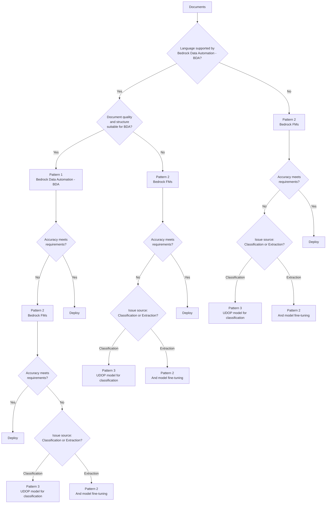
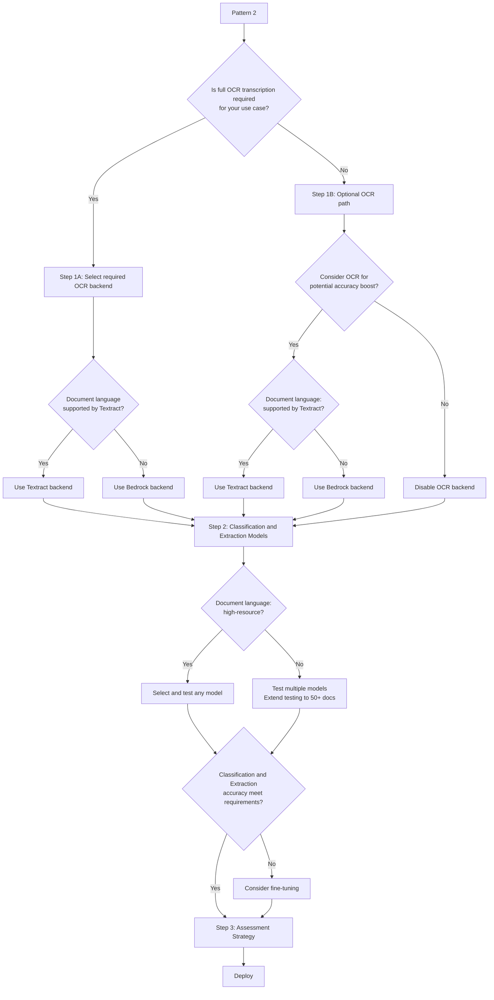

Copyright Amazon.com, Inc. or its affiliates. All Rights Reserved.
SPDX-License-Identifier: MIT-0

# Language Support

When implementing Intelligent Document Processing solutions, language support is a crucial factor to consider. The approach you take depends on whether the language of your documents is supported by the components leveraged in the workflow, such as Amazon Bedrock Data Automation (BDA) or LLMs.

## Decision Process

Below is the decision tree illustrating the suggested decision process:

## Pattern 1

> Pattern 1: Packet or Media processing with Bedrock Data Automation (BDA)

First, verify if your documents' language is supported by Amazon Bedrock Data Automation (BDA). If your language is supported by BDA, begin with Pattern 1 (BDA).

At the time of writing (Sep 19, 2025) BDA supports the following languages:

- English
- Portuguese
- French
- Italian
- Spanish
- German

> Important Note: BDA currently does not support vertical text orientation (commonly found in Japanese and Chinese documents). For the most up-to-date information, please consult the [BDA documentation](https://docs.aws.amazon.com/bedrock/latest/userguide/bda-limits.html).

If BDA's accuracy doesn't meet your requirements for your specific scenario or language, proceed to Pattern 2.

## Pattern 2

> Pattern 2: OCR → Bedrock Classification (page-level or holistic) → Bedrock Extraction

For this pattern, follow this structured implementation approach:

While comprehensive model selection guidance for different languages could constitute an entire documentation suite, understanding the fundamental challenges is essential for production deployments. The reality of modern language models presents a significant transparency gap where providers rarely publish detailed statements about language-specific performance characteristics or training data distribution across their model portfolio.

### The High-Resource vs Low-Resource Language Divide

The concept of language resources refers to the availability of training data, linguistic tools, and computational research investment for a given language. This divide creates a performance gap that persists across virtually all foundation models, regardless of their stated multilingual capabilities.

**High-resource languages** such as English, Mandarin Chinese, Spanish, French, and German typically benefit from extensive training data representation, resulting in more reliable extraction accuracy, better understanding of domain-specific terminology, and stronger performance on complex document structures.

**Low-resource languages** encompass a broad spectrum of languages with limited digital representation in training corpora. These languages require significantly more extensive testing and validation to achieve production-ready accuracy levels. The performance degradation can manifest in several ways: reduced accuracy in named entity recognition, challenges with domain-specific terminology, difficulty processing complex document layouts, and inconsistent handling of linguistic nuances such as morphological complexity or non-Latin scripts.

### Practical Implementation Approach

The absence of public performance statements from model providers necessitates an empirical approach to model selection. For high-resource languages, initial testing with 50-100 representative documents typically provides sufficient confidence in model performance. However, low-resource languages require substantially more comprehensive validation, often demanding 5-10 times the testing volume to achieve comparable confidence levels.

When working with low-resource languages, consider implementing a cascade approach where multiple models are evaluated in parallel during the pilot phase. This strategy helps identify which foundation models demonstrate the most consistent performance for your specific document types and linguistic characteristics. Additionally, establishing clear performance thresholds early in the process prevents costly iteration cycles later in deployment.

### OCR Backend Considerations for Language Support

The choice of OCR backend significantly impacts performance for different languages, particularly when working with low-resource languages or specialized document types. The IDP Accelerator supports three distinct OCR approaches, each with specific language capabilities and use cases.

#### Textract Backend Language Limitations

Amazon Textract provides robust OCR capabilities with confidence scoring, but has explicit language constraints that must be considered during backend selection. Textract can detect printed text and handwriting from the Standard English alphabet and ASCII symbols.
At the time of writing (Sep 19, 2025) Textract supports English, German, French, Spanish, Italian, and Portuguese.

For languages outside this supported set, Textract's accuracy degrades significantly, making it unsuitable for production workloads.

#### Bedrock Backend for Low-Resource Languages

When working with languages not supported by Textract, the Bedrock OCR backend offers a compelling alternative using foundation models for text extraction. This approach leverages the multilingual capabilities of models like Claude and Nova, which can process text in hundreds of languages with varying degrees of accuracy.

The Bedrock backend demonstrates particular value when the extracted text will be included alongside document images in subsequent classification and extraction prompts. This multi-turn approach often compensates for OCR inaccuracies by allowing the downstream models to cross-reference the text transcription against the visual content.

#### Strategic OCR Disabling

In scenarios where full text transcription provides minimal value to downstream processing, disabling OCR entirely can improve cost efficiency. This approach works particularly well when document images contain sufficient visual information for direct image-based only processing, or when the document structure is highly standardized and predictable.

The decision to disable OCR should be based on empirical testing with representative document samples. If classification and extraction accuracy remains acceptable using only document images, the elimination of OCR processing can significantly reduce both latency and operational costs.

### Model Families Mixing

Using different model families for OCR versus classification and extraction can yield significant performance improvements, particularly for challenging language scenarios. For example, a deployment might use Claude for OCR text extraction while employing Nova models for subsequent classification and extraction tasks, optimizing for each model's particular strengths.

This approach allows teams to leverage the best multilingual OCR capabilities for text transcription while utilizing different models optimized for reasoning and structured data extraction. The key consideration is ensuring that the combined approach maintains acceptable accuracy while managing the complexity of multi-model workflows.

Other considerations:

- For documents with poor quality (e.g., handwritten text) consider alternative Bedrock Backend instead of Textract
- If accuracy requirements aren't met, explore model fine-tuning options

## Pattern 3

> Pattern 3: OCR → UDOP Classification (SageMaker) → Bedrock Extraction

If Bedrock-based classification doesn't meet your requirements, implement Pattern 3 using Unified Document Processing (UDOP) classification.
