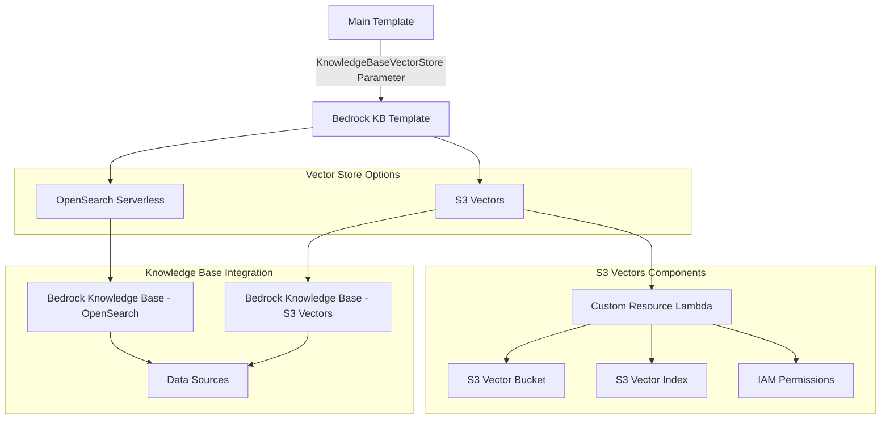

# S3 Vectors Integration with Bedrock Knowledge Base

This document describes the enhanced S3 Vectors support for the GenAI IDP Accelerator's Bedrock Knowledge Base feature.

## Overview

The GenAI IDP Accelerator now supports both **OpenSearch Serverless** and **S3 Vectors** as vector storage backends for Amazon Bedrock Knowledge Bases. This provides users with flexibility to choose the optimal vector storage solution based on their performance and cost requirements.

## Vector Store Options

### OpenSearch Serverless (Default)
- **Performance**: Sub-millisecond query latency
- **Use Cases**: Real-time applications requiring ultra-fast retrieval
- **Cost**: Higher storage costs for large datasets
- **Features**: Full-text search capabilities, advanced filtering

### S3 Vectors (New)
- **Performance**: Sub-second query latency 
- **Use Cases**: Cost-sensitive applications with acceptable latency
- **Cost**: 40-60% lower storage costs than OpenSearch Serverless
- **Features**: Native S3 integration, excellent for large-scale vector storage

## Implementation Architecture



## Configuration Parameters

### Main Template Parameters

The main `template.yaml` now includes:

- **KnowledgeBaseVectorStore**: Choose between `OPENSEARCH_SERVERLESS` or `S3_VECTORS`

### Bedrock Knowledge Base Template Parameters

The `options/bedrockkb/template.yaml` includes additional parameters:

- **pVectorStoreType**: Vector store type selection
- **pS3VectorBucketName**: Custom S3 vector bucket name (optional)
- **pS3VectorIndexName**: S3 vector index name (default: "bedrock-kb-index")

## Implementation Details

### Custom Resource Implementation

Since S3 Vectors is not yet supported by CloudFormation, the solution implements custom resources using AWS Lambda functions:

#### S3 Vectors Manager Lambda (`options/bedrockkb/src/s3_vectors_manager/handler.py`)
- **CREATE**: Creates S3 vector bucket and index using boto3 s3vectors client
- **UPDATE**: Handles bucket/index name changes by recreating resources
- **DELETE**: Properly cleans up vector index and bucket

#### Key API Operations Used
```python
# Create S3 vector bucket
s3vectors_client.create_vector_bucket(Bucket=bucket_name)

# Create vector index with embedding model
s3vectors_client.create_vector_index(
    Bucket=bucket_name,
    IndexName=index_name,
    EmbeddingConfig={
        'EmbeddingModelArn': f"arn:aws:bedrock:*::foundation-model/{embedding_model}"
    }
)
```

### IAM Permissions

The solution implements comprehensive IAM permissions for both vector store types:

#### For S3 Vectors Custom Resource:
```yaml
- s3vectors:CreateVectorBucket
- s3vectors:DeleteVectorBucket
- s3vectors:GetVectorBucket
- s3vectors:CreateVectorIndex
- s3vectors:DeleteVectorIndex
- s3vectors:DescribeVectorIndex
- s3vectors:PutVectors
- s3vectors:GetVectors
- s3vectors:QueryVectors
- s3vectors:DeleteVectors
```

#### For Bedrock Knowledge Base Service Role:
- **OpenSearch**: `aoss:APIAccessAll` permissions
- **S3 Vectors**: `s3vectors:GetVectors`, `s3vectors:PutVectors`, etc.

### Conditional Resource Creation

The template uses CloudFormation conditions to create resources only when needed:

```yaml
Conditions:
  UseS3Vectors: !Equals [!Ref pVectorStoreType, "S3_VECTORS"]
  UseOpenSearchServerless: !Equals [!Ref pVectorStoreType, "OPENSEARCH_SERVERLESS"]
```

Resources are conditionally created:
- **S3 Vectors**: Custom resource Lambda, S3 vector bucket/index, specific Knowledge Base
- **OpenSearch**: OpenSearch collection, security policies, index initialization, specific Knowledge Base

## Usage Examples

### Deploy with S3 Vectors (Cost-Optimized)

```bash
aws cloudformation deploy \
  --template-file packaged-template.yaml \
  --stack-name my-idp-stack \
  --parameter-overrides \
    AdminEmail=admin@example.com \
    DocumentKnowledgeBase="BEDROCK_KNOWLEDGE_BASE (Create)" \
    KnowledgeBaseVectorStore=S3_VECTORS \
  --capabilities CAPABILITY_IAM
```

### Deploy with OpenSearch Serverless (Performance-Optimized)

```bash
aws cloudformation deploy \
  --template-file packaged-template.yaml \
  --stack-name my-idp-stack \
  --parameter-overrides \
    AdminEmail=admin@example.com \
    DocumentKnowledgeBase="BEDROCK_KNOWLEDGE_BASE (Create)" \
    KnowledgeBaseVectorStore=OPENSEARCH_SERVERLESS \
  --capabilities CAPABILITY_IAM
```

## Supported Embedding Models

Both vector store types support the same embedding models:

- `amazon.titan-embed-text-v2:0` (recommended)
- `amazon.titan-embed-image-v1` 
- `cohere.embed-english-v3`
- `cohere.embed-multilingual-v3`

## Limitations and Considerations

### S3 Vectors Limitations
- **Preview Service**: S3 Vectors is currently in preview
- **CloudFormation Support**: Not yet native - requires custom resources
- **Query Performance**: Sub-second latency (vs sub-millisecond for OpenSearch)

### Migration Between Vector Stores
- **Not Supported**: Cannot migrate existing Knowledge Base between vector store types
- **Recommendation**: Choose vector store type at initial deployment
- **Workaround**: Create new Knowledge Base with different vector store if needed

### Cost Considerations
- **S3 Vectors**: Lower storage costs, pay-per-query pricing
- **OpenSearch Serverless**: Higher storage costs, consistent performance pricing
- **Data Transfer**: Consider data transfer costs for large datasets

## Monitoring and Troubleshooting

### CloudWatch Logs
- **S3 Vectors**: Custom resource Lambda logs show bucket/index creation status
- **OpenSearch**: Collection and index creation logs
- **Knowledge Base**: Bedrock service logs for ingestion and queries

### Common Issues
1. **S3 Vectors API Errors**: Check IAM permissions and service availability in region
2. **Bucket Name Conflicts**: S3 vector bucket names must be globally unique
3. **Embedding Model Access**: Ensure Bedrock model access is enabled

## Security Best Practices

### Encryption
- **S3 Vectors**: Inherits S3 encryption capabilities
- **OpenSearch**: Uses AWS-owned keys by default
- **Data in Transit**: All communications use TLS/SSL

### IAM Least Privilege
- Custom resource Lambda has minimal required S3 Vectors permissions
- Bedrock service role has vector store-specific permissions only
- No cross-vector-store permissions granted

### Network Security
- OpenSearch collections use public access with IAM-based security
- S3 Vectors leverage existing AWS network security controls

## Performance Benchmarks

| Metric | OpenSearch Serverless | S3 Vectors |
|--------|----------------------|------------|
| Query Latency | < 1ms | < 1s |
| Storage Cost | High | 40-60% lower |
| Concurrent Queries | Very High | High |
| Data Durability | 99.999999999% | 99.999999999% |
| Availability | 99.9% | 99.9% |

## Future Enhancements

### Planned Improvements
- **CloudFormation Support**: When S3 Vectors gains native CloudFormation support
- **Migration Tools**: Utilities to migrate between vector store types
- **Hybrid Deployment**: Support for multiple Knowledge Bases with different vector stores

### Community Contributions
- Performance optimization suggestions
- Additional embedding model support
- Enhanced monitoring and alerting

## Support and Resources

### Documentation Links
- [AWS S3 Vectors Documentation](https://docs.aws.amazon.com/AmazonS3/latest/userguide/s3-vectors-bedrock-kb.html)
- [Bedrock Knowledge Bases User Guide](https://docs.aws.amazon.com/bedrock/latest/userguide/knowledge-base.html)
- [S3 Vectors API Reference](https://boto3.amazonaws.com/v1/documentation/api/latest/reference/services/s3vectors.html)

### Getting Help
- GitHub Issues: Report bugs or request features
- AWS Support: For service-level support and troubleshooting
- Community: AWS Developer Forums and Discord

---

*This enhancement maintains full backward compatibility with existing deployments while adding powerful new cost optimization capabilities through S3 Vectors integration.*
