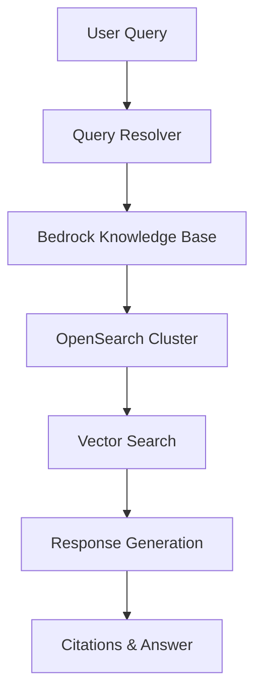
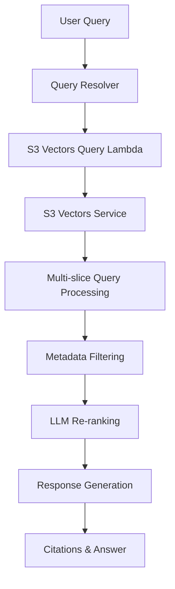

# Knowledge Base Backend Options

## Overview

The Intelligent Document Processing (IDP) solution provides **flexible knowledge base backend options**, allowing you to choose the storage and retrieval architecture that best fits your requirements:

- **OpenSearch**: Traditional knowledge base using Amazon OpenSearch Service with Bedrock Knowledge Base integration
- **S3 Vectors**: New serverless knowledge base using AWS S3 Vectors service with Lambda-based processing
- **Disabled**: No knowledge base functionality (document processing only)

This flexibility enables you to select the appropriate backend based on your specific use case, operational preferences, and requirements.

## Backend Options Comparison

### OpenSearch Backend
- **Architecture**: Amazon OpenSearch Service cluster with Bedrock Knowledge Base integration
- **Infrastructure**: Always-on OpenSearch cluster
- **Query Processing**: Bedrock Knowledge Base APIs with OpenSearch vector search
- **Best For**: Established workflows, integration with existing OpenSearch infrastructure

### S3 Vectors Backend  
- **Architecture**: AWS S3 Vectors service with serverless Lambda functions
- **Infrastructure**: Serverless, automatically scaling components
- **Query Processing**: Custom Lambda functions with S3 Vectors API
- **Best For**: Serverless architectures, cost optimization for variable workloads

### Disabled
- **Architecture**: No knowledge base components deployed
- **Functionality**: Document processing and analysis only
- **Best For**: Use cases that don't require document querying capabilities

## Deployment Configuration

### CloudFormation Parameters

When deploying the solution, you configure the knowledge base backend through these parameters:

#### Primary Configuration

| Parameter | Values | Description |
|-----------|--------|-------------|
| `DocumentKnowledgeBase` | `OpenSearch` \| `S3 Vectors` \| `Disabled` | Selects knowledge base backend or disables it entirely |
| `KnowledgeBaseModelId` | Model ARN | Foundational model for knowledge base chat (when enabled) |
| `DocumentAnalysisAgentModelId` | Model ARN | Model for document analytics queries (only for OpenSearch) |

#### S3 Vectors Specific Parameters

These parameters only appear when S3 Vectors is selected:

| Parameter | Default | Description |
|-----------|---------|-------------|
| `VectorSimilarityMeasure` | `cosine` | Distance metric (`cosine` \| `euclidean`) |
| `KnowledgeBaseEmbeddingModelId` | `amazon.titan-embed-text-v2:0` | Embedding model for vectorization |
| `KnowledgeBaseVectorIndexName` | `idp-vectors-index` | Name for the vector index |
| `S3VectorsIngestionScheduleExpression` | `rate(30 minutes)` | Automated ingestion frequency |

## S3 Vectors Configuration

### Embedding Models and Dimensions

The S3 Vectors backend supports multiple embedding models with automatic dimension configuration:

| Embedding Model | Dimensions | Use Case |
|-----------------|------------|----------|
| `amazon.titan-embed-text-v1:0` | 1536 | General purpose, English |
| `amazon.titan-embed-text-v2:0` | 1024 | Improved efficiency, multilingual |
| `cohere.embed-english-v3` | 1024 | High-quality English embeddings |
| `cohere.embed-multilingual-v3` | 1024 | Multilingual support |

### Vector Similarity Measures

Choose the appropriate similarity measure for your use case:

- **Cosine Similarity** (Recommended): Measures angle between vectors, normalized for document length
- **Euclidean Distance**: Measures absolute distance, sensitive to vector magnitude

### Filterable Metadata Configuration

S3 Vectors supports custom metadata filtering for improved search precision. You can specify up to 6 additional filterable metadata keys beyond the built-in fields:

#### Built-in Metadata Fields
- `document_id`: Unique document identifier
- `confidence`: Processing confidence score

#### Configuration Example
```json
{
  "s3Vectors": {
    "filterableMetadataKeys": [
      "department",
      "document_date",
      "priority_level",
      "category",
      "author",
      "region"
    ]
  }
}
```

## Architecture Details

### OpenSearch Backend Architecture



### S3 Vectors Backend Architecture



### Disabled Backend
When knowledge base is disabled:
- No knowledge base infrastructure is deployed
- Query resolver returns appropriate "not enabled" responses
- Document processing and analysis remain fully functional
- UI hides knowledge base related features

## Ingestion Process

### OpenSearch Ingestion
1. Documents uploaded to S3 trigger processing
2. Bedrock Knowledge Base handles text extraction and chunking
3. Vectors generated using Bedrock's embedding models
4. Content indexed to OpenSearch cluster via Bedrock APIs
5. Available for querying through Bedrock Knowledge Base

### S3 Vectors Ingestion
1. Documents uploaded to S3 trigger processing
2. Custom Lambda functions perform text extraction and chunking
3. Metadata classification and filtering configuration
4. Vectors generated using specified embedding model
5. Vectors stored in S3 Vectors service with metadata
6. DynamoDB catalog updated for tracking
7. Scheduled ingestion runs based on configuration

## Query Processing

### OpenSearch Query Flow
1. User submits query via GraphQL
2. Query resolver routes to Bedrock Knowledge Base
3. Bedrock processes query and searches OpenSearch
4. Results returned with citations and confidence scores
5. Response formatted for UI display

### S3 Vectors Query Flow
1. User submits query via GraphQL
2. Query resolver invokes S3 Vectors Query Lambda
3. Lambda performs multi-slice vector search
4. Intelligent metadata filtering applied  ( Only enabled if a Filterable Metadata Field is Set )
5. Results re-ranked using LLM for relevance
6. Response generated with contextual citations
7. Session context maintained for follow-up queries

### S3 Vectors Advanced Features

#### Multi-slice Query Processing
S3 Vectors implements sophisticated query processing:
1. **Initial Query**: Broad similarity search across vector space
2. **Metadata Enhancement**: Context-aware filtering based on query analysis  ( Only enabled if a Filterable Metadata Field is Set )
3. **Multi-slice Retrieval**: Multiple focused queries for comprehensive coverage
4. **LLM Re-ranking**: Foundational model ranking for improved relevance
5. **Response Generation**: Contextual responses with proper citations

#### Session-aware Conversations
- Maintains conversation history across queries
- Tracks document references and context
- Enables natural follow-up questions
- Preserves user preferences within sessions

#### Intelligent Metadata Filtering
Automatic metadata analysis system:
- Samples document corpus for metadata patterns
- Generates filter examples using LLMs
- Updates query processing with dynamic capabilities
- Provides context-aware filtering suggestions

## UI Configuration

### Dynamic Interface
The web interface adapts based on the selected knowledge base backend:

- **Knowledge Base Status Component**: Shows active backend type and status
- **Configuration Sections**: S3 Vectors settings only appear when S3 Vectors is selected
- **Status Indicators**: Real-time display of knowledge base availability

### Configuration Management
- Backend selection persists across sessions
- Settings automatically sync with CloudFormation parameters
- Real-time validation of configuration changes
- Clear indication of feature availability

## Migration Between Backends

### Changing Backend Types

**Note**: Changing backends or embedding models requires re-ingestion of all documents as the vector formats and storage mechanisms differ between backends.  This feature is a work in progress and will change in the future.

## Monitoring and Observability

### CloudWatch Metrics

All backends provide monitoring through CloudWatch:

#### OpenSearch Backend
- Bedrock Knowledge Base query metrics
- OpenSearch cluster health and performance
- Document ingestion success/failure rates

#### S3 Vectors Backend
- Lambda function execution metrics
- S3 Vectors query performance
- DynamoDB catalog operation metrics
- Ingestion job completion status

#### Disabled Backend
- No knowledge base specific metrics
- Document processing metrics remain available

### Logging Configuration
- Query processing logs available in CloudWatch
- Error tracking and debugging information
- Performance insights for optimization

## Troubleshooting

### Common Issues

#### Backend Selection Issues
**Issue**: Knowledge base features not appearing in UI
- **Check**: CloudFormation parameter `DocumentKnowledgeBase` value
- **Verify**: Stack update completed successfully
- **Solution**: Refresh browser and verify parameter settings

#### S3 Vectors Specific Issues
**Issue**: Documents not available in search results
- **Check**: Ingestion schedule has run since document upload
- **Verify**: DynamoDB catalog contains document entries
- **Solution**: Trigger manual ingestion or check ingestion Lambda logs

**Issue**: Metadata filtering not working as expected
- **Check**: Filterable metadata keys configuration
- **Verify**: Metadata analyzer has processed recent documents
- **Solution**: Review metadata configuration and re-run analysis

#### OpenSearch Specific Issues
**Issue**: Bedrock Knowledge Base queries failing
- **Check**: OpenSearch cluster health status
- **Verify**: Bedrock Knowledge Base sync status
- **Solution**: Check IAM permissions and service limits

## Best Practices

### Backend Selection Guidelines

#### Choose OpenSearch When:
- You have existing OpenSearch expertise and infrastructure
- You need established Bedrock Knowledge Base features
- Your workflow integrates with other OpenSearch services
- You prefer AWS-managed vector search capabilities

#### Choose S3 Vectors When:
- You prefer serverless architectures
- You need custom metadata filtering capabilities
- You want fine-grained control over embedding models
- You have variable or unpredictable query patterns

#### Choose Disabled When:
- You only need document processing capabilities
- Knowledge base querying is not required for your use case
- You want to minimize infrastructure costs
- You plan to integrate with external knowledge base systems

### Configuration Best Practices
- Test both backends with your document corpus before deciding
- Configure appropriate metadata fields for S3 Vectors filtering
- Monitor resource utilization after deployment
- Use appropriate embedding models for your content language and type


## Support and Resources

### Documentation References
- [AWS S3 Vectors Documentation](https://docs.aws.amazon.com/s3/latest/userguide/s3-vectors.html)
- [Amazon OpenSearch Service Documentation](https://docs.aws.amazon.com/opensearch-service/)
- [Amazon Bedrock Knowledge Base Documentation](https://docs.aws.amazon.com/bedrock/latest/userguide/knowledge-base.html)

### Community Resources
- [AWS Solutions Library](https://aws.amazon.com/solutions/)
- [AWS Architecture Center](https://aws.amazon.com/architecture/)

For additional support, please refer to the main project documentation or open an issue in the repository.