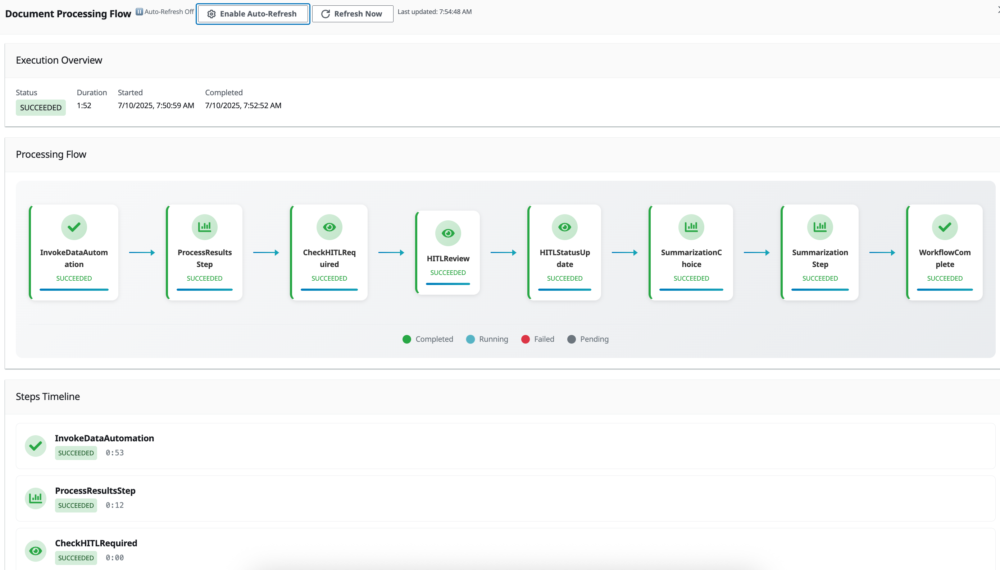

Copyright Amazon.com, Inc. or its affiliates. All Rights Reserved.
SPDX-License-Identifier: MIT-0

# GenAIIDP Web User Interface

The solution includes a responsive web-based user interface built with React that provides comprehensive document management and monitoring capabilities.


*The GenAIIDP Web Interface showing the document tracking dashboard with status information, classification results, and extracted data.*

## Features

- Document tracking and monitoring capabilities
- Real-time status updates of document processing
- Secure authentication using Amazon Cognito
- Searchable document history
- Detailed document processing metrics and status information
- Inspection of processing outputs for section classification and information extraction
- Accuracy evaluation reports when baseline data is provided
- View and edit pattern configuration, including document classes, prompt engineering, and model settings
- **Confidence threshold configuration** for HITL (Human-in-the-Loop) triggering through the Assessment & HITL Configuration section
- Document upload from local computer
- Knowledge base querying for document collections
- "Chat with document" from the detailed view of the document
- **Document Process Flow visualization** for detailed workflow execution monitoring and troubleshooting
- **Document Analytics** for querying and visualizing processed document data

## Document Analytics

The Document Analytics feature allows users to query their processed documents using natural language and receive results in various formats including charts, tables, and text responses.

### Key Capabilities

- **Natural Language Queries**: Ask questions about your processed documents in plain English
- **Multiple Response Types**: Results can be displayed as:
  - Interactive charts and graphs (using Chart.js)
  - Structured data tables with pagination and sorting
  - Text-based responses and summaries
- **Real-time Processing**: Query processing status updates with visual indicators
- **Query History**: Track and review previous analytics queries

### Technical Implementation Notes

The analytics feature uses a combination of real-time subscriptions and polling for status updates:

- **Primary Method**: GraphQL subscriptions via AWS AppSync for immediate notifications when queries complete
- **Fallback Method**: Polling every 5 seconds to ensure status updates are received even if subscriptions fail
- **Current Limitation**: The AppSync subscription currently returns a Boolean completion status rather than full job details, requiring a separate query to fetch results when notified

**TODO**: Implement proper AppSync subscriptions that return complete AnalyticsJob objects to eliminate the need for additional queries and improve real-time user experience.

### How to Use

1. Navigate to the "Document Analytics" section in the web UI
2. Enter your question in natural language (e.g., "How many documents were processed last week?")
3. Click "Submit Query" to start processing
4. Monitor the status indicator as your query is processed
5. View results in the appropriate format (chart, table, or text)
6. Use the debug information toggle to inspect raw response data if needed

## Document Process Flow Visualization

The Document Process Flow feature provides a visual representation of the Step Functions workflow execution for each document:



*The Document Process Flow visualization showing the execution steps, status, and details.*

### Key Capabilities

- **Interactive Flow Diagram**: Visual representation of the document processing workflow with color-coded status indicators
- **Step Details**: Detailed information about each processing step including inputs, outputs, and execution time
- **Error Diagnostics**: Clear visualization of failed steps with detailed error messages for troubleshooting
- **Timeline View**: Chronological view of all processing steps with duration information
- **Auto-Refresh**: Option to automatically refresh the flow data for active executions
- **Map State Support**: Visualization of Map state iterations for parallel processing workflows

### How to Use

1. Navigate to a document's detail page
2. Click the "View Processing Flow" button in the document details header
3. The flow diagram will display all steps in the document's processing workflow
4. Click on any step to view its detailed information including:
   - Input/output data
   - Execution duration
   - Error messages (if applicable)
   - Start and completion times
5. For active executions, toggle the auto-refresh option to monitor progress in real-time

### Troubleshooting with Process Flow

The Document Process Flow visualization is particularly useful for troubleshooting processing issues:

- Quickly identify which step in the workflow failed
- View detailed error messages and stack traces
- Understand the sequence of processing steps
- Analyze execution times to identify performance bottlenecks
- Inspect the input and output of each step to verify data transformation

## Chat with Document

The "Chat with Document" feature is available at the bottom of the Document Detail view. This feature uses the same model that's configured to do the summarization to provide a RAG interface to the document that's the details are displayed for. No other document is taken in to account except the document you're viewing the details of.

## Authentication Features

The web UI uses Amazon Cognito for secure user authentication and authorization:

### User Management

- Admin users can be created during stack deployment
- Optional self-service sign-up with email domain restrictions
- Automatic email verification
- Password policies and account recovery

### Security Controls

- Multi-factor authentication (MFA) support
- Temporary credentials and automatic token refresh
- Role-based access control using Cognito user groups
- Secure session management

## Deploying the Web UI

The web UI is automatically deployed as part of the CloudFormation stack. The deployment:

1. Creates required Cognito resources (User Pool, Identity Pool)
2. Builds and deploys the React application to S3
3. Sets up CloudFront distribution for content delivery
4. Configures necessary IAM roles and permissions

## Accessing the Web UI

Once the stack is deployed:

1. Navigate to the `ApplicationWebURL` provided in the stack outputs
2. For first-time access:
   - Use the admin email address specified during stack deployment
   - Check your email for temporary credentials
   - You will be prompted to change your password on first login

## Running the UI Locally

To run the web UI locally for development:

1. Navigate to the `/ui` directory
2. Create a `.env` file using the `WebUITestEnvFile` output from the CloudFormation stack:
```
REACT_APP_USER_POOL_ID=<value>
REACT_APP_USER_POOL_CLIENT_ID=<value>
REACT_APP_IDENTITY_POOL_ID=<value>
REACT_APP_APPSYNC_GRAPHQL_URL=<value>
REACT_APP_AWS_REGION=<value>
REACT_APP_SETTINGS_PARAMETER=<value>
```
3. Install dependencies: `npm install`
4. Start the development server: `npm run start`
5. Open [http://localhost:3000](http://localhost:3000) in your browser

## Configuration Options

The following parameters are configured during stack deployment:

- `AdminEmail`: Email address for the admin user
- `AllowedSignUpEmailDomain`: Optional comma-separated list of allowed email domains for self-service signup

## Security Considerations

The web UI implementation includes several security features:

- All communication is encrypted using HTTPS
- Authentication tokens are automatically rotated
- Session timeouts are enforced
- CloudFront distribution uses secure configuration
- S3 buckets are configured with appropriate security policies
- API access is controlled through IAM and Cognito
- Web Application Firewall (WAF) protection for AppSync API

### Web Application Firewall (WAF)

The solution includes AWS WAF integration to protect your AppSync API:

- **IP-based access control**: Restrict API access to specific IP ranges
- **Default behavior**: By default (`0.0.0.0/0`), WAF is disabled and all IPs are allowed
- **Configuration**: Use the `WAFAllowedIPv4Ranges` parameter to specify allowed IP ranges
  - Example: `"192.168.1.0/24,10.0.0.0/16"` (comma-separated list of CIDR blocks)
- **Security benefit**: When properly configured, WAF blocks all traffic except from your trusted IP ranges and AWS Lambda service IP ranges
- **Lambda service access**: The solution automatically maintains a WAF IPSet with current AWS Lambda service IP ranges to ensure Lambda functions can always access the AppSync API even when IP restrictions are enabled

When configuring the WAF:
- IP ranges must be in valid CIDR notation (e.g., `192.168.1.0/24`)
- Multiple ranges should be comma-separated
- The WAF is only enabled when the parameter is set to something other than the default `0.0.0.0/0`
- Lambda functions within your account will automatically have access to the AppSync API regardless of IP restrictions

## Monitoring and Troubleshooting

The web UI includes built-in monitoring:

- CloudWatch metrics for API and authentication activity
- Access logs in CloudWatch Logs
- CloudFront distribution logs
- Error tracking and reporting
- Performance monitoring

To troubleshoot issues:

1. Check CloudWatch Logs for application errors
2. Verify Cognito user status in the AWS Console
3. Check CloudFront distribution status
4. Verify API endpoints are accessible
5. Review browser console for client-side errors
