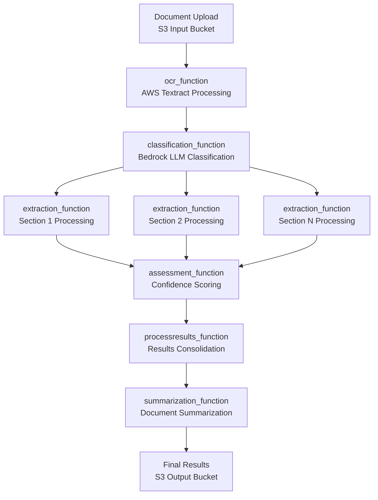

<include the awesome module description in detail that you want to implement>

# GenAI IDP Accelerator - Module Integration Project Brief

## Overview

The GenAI Intelligent Document Processing (GenAI IDP) Accelerator is a comprehensive document processing solution that uses a modular, 6-step pipeline architecture. Each module is designed to work independently while seamlessly integrating with others to provide end-to-end document processing capabilities including OCR, classification, extraction, summarization, evaluation, and assessment.

## Directory Structure

```
Directory structure:
└── aws-solutions-library-samples-accelerated-intelligent-document-processing-on-aws/
    ├── README.md
    ├── AmazonQ.md
    ├── CHANGELOG.md
    ├── CONTRIBUTING.md
    ├── genaiic-idp-accelerator.code-workspace
    ├── LICENSE
    ├── Makefile
    ├── NOTICE
    ├── publish.sh
    ├── ruff.toml
    ├── template.yaml
    ├── VERSION
    ├── .gitlab-ci.yml
    ├── config_library/
    │   ├── README.md
    │   ├── TEMPLATE_README.md
    │   ├── pattern-1/
    │   │   ├── README.md
    │   │   └── default/
    │   │       ├── README.md
    │   │       └── config.yaml
    │   ├── pattern-2/
    │   │   ├── README.md
    │   │   ├── bank-statement-sample/
    │   │   │   ├── README.md
    │   │   │   └── config.yaml
    │   │   ├── checkboxed_attributes_extraction/
    │   │   │   ├── README.md
    │   │   │   └── config.yaml
    │   │   ├── default/
    │   │   │   ├── README.md
    │   │   │   └── config.yaml
    │   │   ├── few_shot_example_with_multimodal_page_classification/
    │   │   │   ├── README.md
    │   │   │   └── config.yaml
    │   │   └── medical_records_summarization/
    │   │       ├── README.md
    │   │       └── config.yaml
    │   └── pattern-3/
    │       ├── README.md
    │       └── default/
    │           ├── README.md
    │           └── config.yaml
    ├── docs/
    │   ├── README.md
    │   ├── architecture.md
    │   ├── assessment.md
    │   ├── aws-services-and-roles.md
    │   ├── classification.md
    │   ├── configuration.md
    │   ├── cost-calculator.md
    │   ├── deployment.md
    │   ├── evaluation.md
    │   ├── extraction.md
    │   ├── few-shot-examples.md
    │   ├── knowledge-base.md
    │   ├── monitoring.md
    │   ├── nova-finetuning.md
    │   ├── pattern-1.md
    │   ├── pattern-2.md
    │   ├── pattern-3.md
    │   ├── reporting-database.md
    │   ├── troubleshooting.md
    │   ├── using-notebooks-with-idp-common.md
    │   ├── web-ui.md
    │   └── well-architected.md
    ├── images/
    │   └── IDP.drawio
    ├── lib/
    │   └── idp_common_pkg/
    │       ├── README.md
    │       ├── clean_build.sh
    │       ├── Makefile
    │       ├── MANIFEST.in
    │       ├── pyproject.toml
    │       ├── pytest.ini
    │       ├── setup.cfg
    │       ├── setup.py
    │       ├── uv.lock
    │       ├── idp_common/
    │       │   ├── README.md
    │       │   ├── __init__.py
    │       │   ├── document_testing_plan.md
    │       │   ├── document_todo.md
    │       │   ├── models.py
    │       │   ├── appsync/
    │       │   │   ├── README.md
    │       │   │   ├── __init__.py
    │       │   │   ├── client.py
    │       │   │   ├── mutations.py
    │       │   │   └── service.py
    │       │   ├── assessment/
    │       │   │   ├── README.md
    │       │   │   ├── __init__.py
    │       │   │   ├── models.py
    │       │   │   └── service.py
    │       │   ├── bda/
    │       │   │   ├── README.md
    │       │   │   ├── __init__.py
    │       │   │   ├── bda_invocation.py
    │       │   │   └── bda_service.py
    │       │   ├── bedrock/
    │       │   │   ├── README.md
    │       │   │   ├── __init__.py
    │       │   │   └── client.py
    │       │   ├── classification/
    │       │   │   ├── README.md
    │       │   │   ├── __init__.py
    │       │   │   ├── models.py
    │       │   │   └── service.py
    │       │   ├── config/
    │       │   │   └── __init__.py
    │       │   ├── evaluation/
    │       │   │   ├── README.md
    │       │   │   ├── __init__.py
    │       │   │   ├── comparator.py
    │       │   │   ├── metrics.py
    │       │   │   ├── models.py
    │       │   │   └── service.py
    │       │   ├── extraction/
    │       │   │   ├── README.md
    │       │   │   ├── __init__.py
    │       │   │   ├── models.py
    │       │   │   └── service.py
    │       │   ├── image/
    │       │   │   └── __init__.py
    │       │   ├── metrics/
    │       │   │   └── __init__.py
    │       │   ├── model_finetuning/
    │       │   │   ├── README.md
    │       │   │   ├── __init__.py
    │       │   │   ├── create_finetuning_job.py
    │       │   │   ├── create_provisioned_throughput.py
    │       │   │   ├── inference_example.py
    │       │   │   ├── models.py
    │       │   │   ├── prepare_nova_finetuning_data.py
    │       │   │   └── service.py
    │       │   ├── ocr/
    │       │   │   ├── README.md
    │       │   │   ├── __init__.py
    │       │   │   ├── results.py
    │       │   │   └── service.py
    │       │   ├── reporting/
    │       │   │   ├── README.md
    │       │   │   ├── __init__.py
    │       │   │   └── save_reporting_data.py
    │       │   ├── s3/
    │       │   │   └── __init__.py
    │       │   ├── summarization/
    │       │   │   ├── README.md
    │       │   │   ├── __init__.py
    │       │   │   ├── markdown_formatter.py
    │       │   │   ├── models.py
    │       │   │   └── service.py
    │       │   └── utils/
    │       │       ├── __init__.py
    │       │       └── s3util.py
    │       └── tests/
    │           ├── README.md
    │           ├── __init__.py
    │           ├── conftest.py
    │           ├── pytest.ini
    │           ├── integration/
    │           │   ├── __init__.py
    │           │   └── test_placeholder.py
    │           └── unit/
    │               ├── __init__.py
    │               ├── appsync/
    │               │   ├── __init__.py
    │               │   ├── test_appsync_client.py
    │               │   ├── test_appsync_mutations.py
    │               │   └── test_appsync_service.py
    │               ├── assessment/
    │               │   ├── __init__.py
    │               │   └── test_assessment_service.py
    │               ├── bda/
    │               │   ├── __init__.py
    │               │   ├── test_bda_invocation.py
    │               │   ├── test_bda_service.py
    │               │   └── test_bda_service_part2.py
    │               ├── classification/
    │               │   ├── __init__.py
    │               │   ├── test_classification_models.py
    │               │   └── test_classification_service.py
    │               ├── evaluation/
    │               │   ├── __init__.py
    │               │   └── test_evaluation_service.py
    │               ├── extraction/
    │               │   ├── __init__.py
    │               │   ├── test_extraction_models.py
    │               │   └── test_extraction_service.py
    │               ├── ocr/
    │               │   ├── __init__.py
    │               │   ├── test_ocr_results.py
    │               │   └── test_ocr_service.py
    │               ├── reporting/
    │               │   ├── __init__.py
    │               │   └── test_save_reporting_data.py
    │               └── summarization/
    │                   ├── __init__.py
    │                   ├── test_summarization_models.py
    │                   └── test_summarization_service.py
    ├── notebooks/
    │   ├── examples/
    │   │   ├── README.md
    │   │   ├── step0_setup.ipynb
    │   │   ├── step1_ocr.ipynb
    │   │   ├── step2_classification.ipynb
    │   │   ├── step3_extraction.ipynb
    │   │   ├── step4_assessment.ipynb
    │   │   ├── step5_summarization.ipynb
    │   │   ├── step6_evaluation.ipynb
    │   │   └── config/
    │   │       ├── assessment.yaml
    │   │       ├── classes.yaml
    │   │       ├── classification.yaml
    │   │       ├── evaluation.yaml
    │   │       ├── extraction.yaml
    │   │       ├── ocr.yaml
    │   │       └── summarization.yaml
    │   ├── misc/
    │   │   ├── bedrock_client_cachepoint_test.ipynb
    │   │   ├── bedrock_client_test.ipynb
    │   │   ├── config.yml
    │   │   ├── e2e-example-with-assessment.ipynb
    │   │   ├── e2e-example-with-multimodal-page-classification-few-shot-prompting.ipynb
    │   │   ├── e2e-example-with-multimodal-page-classification.ipynb
    │   │   ├── e2e-holistic-packet-classification-summarization.ipynb
    │   │   ├── e2e-holistic-packet-classification.ipynb
    │   │   ├── evaluation_methods_demo.ipynb
    │   │   ├── evaluation_reporting_analytics.ipynb
    │   │   ├── finetuning_dataset_prep.ipynb
    │   │   ├── finetuning_model_document_classification_evaluation.ipynb
    │   │   ├── finetuning_model_service_demo.ipynb
    │   │   ├── test_few_shot_classification.ipynb
    │   │   ├── test_few_shot_extraction.ipynb
    │   │   ├── .env.example
    │   │   └── bda/
    │   │       ├── kie-bda-happy-path.ipynb
    │   │       └── cfn/
    │   │           ├── README.md
    │   │           ├── bda-project.yml
    │   │           └── Makefile
    │   └── usecase-specific-examples/
    │       └── multi-page-bank-statement/
    │           ├── README.md
    │           ├── step0_setup.ipynb
    │           ├── step1_ocr.ipynb
    │           ├── step2_classification.ipynb
    │           ├── step3_extraction.ipynb
    │           ├── step4_assessment.ipynb
    │           ├── step5_summarization.ipynb
    │           ├── step6_evaluation.ipynb
    │           └── config/
    │               ├── assessment.yaml
    │               ├── classes.yaml
    │               ├── classification.yaml
    │               ├── evaluation.yaml
    │               ├── extraction.yaml
    │               ├── ocr.yaml
    │               └── summarization.yaml
  
```

## Module Relationship



## Core Architecture

### 6-Step Modular Pipeline

The solution follows a sequential processing pipeline where each step enriches the Document object:

```
Step 0: Setup → Step 1: OCR → Step 2: Classification → Step 3: Extraction → Step 4: Assessment → Step 5: Summarization → Step 6: Evaluation
```

### Central Data Model

All modules operate on a shared `Document` class that maintains state throughout the pipeline:

```python
@dataclass
class Document:
    # Core identifiers
    id: Optional[str] = None
    input_bucket: Optional[str] = None
    input_key: Optional[str] = None
    output_bucket: Optional[str] = None
    
    # Processing state
    status: Status = Status.QUEUED
    num_pages: int = 0
    pages: Dict[str, Page] = field(default_factory=dict)
    sections: List[Section] = field(default_factory=list)
    
    # Processing results
    evaluation_result: Any = None
    summarization_result: Any = None
    metering: Dict[str, Any] = field(default_factory=dict)
```

## Module Directory Structure

**Location: `genaiic-idp-accelerator/lib/idp_common_pkg/idp_common/`**

```
idp_common/
├── __init__.py                    # Main package initialization with lazy loading
├── README.md                      # Comprehensive module documentation
├── models.py                      # Core Document, Page, Section, Status classes
├── appsync/                       # Document storage/retrieval via AWS AppSync
├── assessment/                    # Confidence evaluation and explainability
├── bda/                          # Bedrock Data Automation integration
├── bedrock/                      # LLM utilities and prompt management
├── classification/               # Document type identification services
├── config/                       # Configuration management utilities
├── criteria_validation/          # Document criteria validation
├── evaluation/                   # Accuracy assessment against baselines
├── extraction/                   # Structured data extraction services
├── image/                        # Image processing and optimization
├── metrics/                      # Performance tracking and monitoring
├── model_finetuning/            # Fine-tuning services for models
├── ocr/                         # Amazon Textract OCR integration
├── reporting/                   # Analytics and metrics storage
├── s3/                          # S3 operations and utilities
├── summarization/               # Document summarization services
└── utils/                       # Common utilities and helpers
```

## Task-Specific Module Integration

### 1. OCR Processing (Step 1)

**Primary Module:** `ocr/`
**Service Class:** `OcrService`

**Purpose:** Converts PDF documents to machine-readable text using Amazon Textract

**Configuration Example:**
```yaml
ocr:
  features:
    - name: "LAYOUT"    # Document structure analysis
    - name: "TABLES"    # Table extraction
    - name: "SIGNATURES" # Signature detection
```

**Integration Process:**
1. Takes input PDF from S3
2. Converts pages to images with configurable DPI
3. Processes with Textract using specified features
4. Creates `Page` objects with multiple URI types:
   - `image_uri`: Page image (JPG format)
   - `raw_text_uri`: Full Textract JSON response
   - `parsed_text_uri`: Markdown-formatted text
   - `text_confidence_uri`: Condensed confidence data for assessment

**Dependencies:** 
- `s3/` for file operations
- `image/` for image processing
- `utils/` for common operations

### 2. Classification (Step 2)

**Primary Module:** `classification/`
**Service Class:** `ClassificationService`

**Purpose:** Identifies document types and creates logical document boundaries

**Configuration Example:**
```yaml
classification:
  model: us.amazon.nova-pro-v1:0
  temperature: 0.0
  classificationMethod: textbasedHolisticClassification  # or multimodalPageLevelClassification
  system_prompt: "You are a document classification expert..."
  task_prompt: |
    <document-types>
    {CLASS_NAMES_AND_DESCRIPTIONS}
    </document-types>
    
    <<CACHEPOINT>>
    
    <document-text>
    {DOCUMENT_TEXT}
    </document-text>
```

**Integration Process:**
1. Receives `Document` with OCR results from Step 1
2. Analyzes document structure to identify boundaries
3. Creates `Section` objects grouping related pages
4. Two methods available:
   - **Holistic:** Analyzes entire document package for logical boundaries
   - **Page-level:** Classifies individual pages independently

**Dependencies:**
- `bedrock/` for LLM interactions
- `config/` for document class definitions
- `s3/` for retrieving OCR results

### 3. Extraction (Step 3)

**Primary Module:** `extraction/`
**Service Class:** `ExtractionService`

**Purpose:** Extracts structured data fields specific to each document class

**Configuration Example:**
```yaml
extraction:
  model: us.amazon.nova-pro-v1:0
  temperature: 0.0
  system_prompt: "You are a document assistant. Respond only with JSON..."
  task_prompt: |
    Extract the following attributes from this {DOCUMENT_CLASS} document:
    
    {ATTRIBUTE_NAMES_AND_DESCRIPTIONS}
    
    <<CACHEPOINT>>
    
    <document-text>
    {DOCUMENT_TEXT}
    </document-text>
    
    <document_image>
    {DOCUMENT_IMAGE}
    </document_image>
```

**Attribute Types Supported:**
```yaml
classes:
  - name: Bank Statement
    attributes:
      # Simple attribute
      - name: Account Number
        attributeType: simple
        
      # Group attribute (nested structure)
      - name: Account Holder Address
        attributeType: group
        groupAttributes:
          - name: Street Number
          - name: City
          
      # List attribute (arrays)
      - name: Transactions
        attributeType: list
        listItemTemplate:
          itemAttributes:
            - name: Date
            - name: Amount
```

**Integration Process:**
1. Processes each `Section` from classification results
2. Applies class-specific extraction templates
3. Supports multimodal analysis (text + images)
4. Stores results in `Section.extraction_result_uri`
5. Updates `Section.attributes` with extracted data

**Dependencies:**
- `bedrock/` for LLM interactions
- `config/` for attribute definitions
- `image/` for multimodal processing

### 4. Assessment (Step 4)

**Primary Module:** `assessment/`
**Service Class:** `AssessmentService`

**Purpose:** Evaluates confidence of extraction results using LLMs

**Configuration Example:**
```yaml
assessment:
  model: us.anthropic.claude-3-7-sonnet-20250219-v1:0
  temperature: 0.0
  default_confidence_threshold: 0.9
  system_prompt: "You are a document analysis assessment expert..."
  task_prompt: |
    <extraction-results>
    {EXTRACTION_RESULTS}
    </extraction-results>
    
    <document-image>
    {DOCUMENT_IMAGE}
    </document-image>
    
    <ocr-text-confidence-results>
    {OCR_TEXT_CONFIDENCE}
    </ocr-text-confidence-results>
```

**Assessment Output Formats:**
```json
{
  "simple_attribute": {
    "confidence": 0.85,
    "confidence_reason": "Clear text match with high OCR confidence"
  },
  "group_attribute": {
    "sub_attribute_1": {"confidence": 0.90},
    "sub_attribute_2": {"confidence": 0.75}
  },
  "list_attribute": [
    {"item_attr_1": {"confidence": 0.95}},
    {"item_attr_2": {"confidence": 0.88}}
  ]
}
```

**Integration Process:**
1. Analyzes extraction results against source documents
2. Provides per-attribute confidence scores (0.0-1.0)
3. Includes explanatory reasoning for confidence levels
4. Supports multimodal analysis for visual verification
5. Integrates with evaluation module for quality metrics

**Dependencies:**
- `bedrock/` for LLM interactions
- `extraction/` results for assessment
- `ocr/` confidence data for analysis

### 5. Summarization (Step 5)

**Primary Module:** `summarization/`
**Service Class:** `SummarizationService`

**Purpose:** Creates human-readable summaries of processed documents

**Configuration Example:**
```yaml
summarization:
  model: us.anthropic.claude-3-7-sonnet-20250219-v1:0
  temperature: 0.0
  system_prompt: "You are a document summarization expert..."
  task_prompt: |
    <document-text>
    {DOCUMENT_TEXT}
    </document-text>
    
    Create a comprehensive summary with:
    1. Key information and main points
    2. Markdown formatting for readability
    3. Citations with page references [Cite-X, Page-Y]
    4. References section with exact text
```

**Output Format:**
```json
{
  "summary": "## Executive Summary\n\nThis bank statement for account [12345](#cite-1-page-1) covers the period...\n\n### References\n[Cite-1, Page-1]: Account Number: 12345"
}
```

**Integration Process:**
1. Synthesizes all processing results into consumable summaries
2. Maintains document structure with proper formatting
3. Includes citations with page references
4. Supports multiple output formats (JSON, Markdown, HTML)
5. Updates `Document.summary_report_uri`

**Dependencies:**
- `bedrock/` for LLM interactions
- All previous processing results
- `s3/` for storing summary reports

### 6. Evaluation (Step 6)

**Primary Module:** `evaluation/`
**Service Class:** `EvaluationService`

**Purpose:** Compares processing results against ground truth for accuracy assessment

**Configuration Example:**
```yaml
evaluation:
  llm_method:
    model: us.anthropic.claude-3-haiku-20240307-v1:0
    temperature: 0.0
    system_prompt: "You are an evaluator that helps determine if predicted and expected values match..."
    task_prompt: |
      For attribute "{ATTRIBUTE_NAME}":
      - Expected: {EXPECTED_VALUE}
      - Actual: {ACTUAL_VALUE}
      
      Provide assessment as JSON:
      {
        "match": true/false,
        "score": 0.0-1.0,
        "reason": "explanation"
      }
```

**Evaluation Methods:**
- **EXACT:** Character-by-character comparison
- **FUZZY:** Similarity matching with thresholds
- **SEMANTIC:** Embedding-based semantic comparison
- **NUMERIC_EXACT:** Numeric value comparison
- **LLM:** AI-powered semantic equivalence

**Attribute Type Processing:**
```yaml
# Simple attributes
- name: Account Number
  evaluation_method: EXACT
  
# Group attributes  
- name: Account Holder Address
  attributeType: group
  groupAttributes:
    - name: City
      evaluation_method: FUZZY
      evaluation_threshold: 0.9
      
# List attributes
- name: Transactions
  attributeType: list
  listItemTemplate:
    itemAttributes:
      - name: Amount
        evaluation_method: NUMERIC_EXACT
```

**Integration Process:**
1. Compares extraction results against baseline data
2. Generates document, section, and attribute-level metrics
3. Creates comprehensive evaluation reports with visual indicators
4. Supports nested data structures (groups and lists)
5. Integrates with assessment confidence scores

**Dependencies:**
- `bedrock/` for LLM-based evaluation
- `extraction/` results for comparison
- `assessment/` confidence data
- `reporting/` for metrics storage

## Cross-Module Integration Features

### Configuration Management (`config/`)

**Modular Configuration System:**
```
config/
├── main.yaml           # Overall pipeline settings
├── classes.yaml        # Document class definitions
├── ocr.yaml           # OCR service configuration
├── classification.yaml # Classification configuration
├── extraction.yaml     # Extraction configuration
├── assessment.yaml     # Assessment configuration
├── summarization.yaml  # Summarization configuration
└── evaluation.yaml     # Evaluation configuration
```

**Configuration Loading:**
```python
from idp_common.config import get_config
config = get_config()  # Automatically merges all YAML files
```

### Data Persistence

**S3 Integration (`s3/`):**
- Handles all file operations across modules
- Provides utilities for JSON content retrieval
- Manages S3 URI construction and parsing

**Document State Management:**
- Each module updates the central `Document` object
- State persisted between processing steps
- Full serialization/deserialization support

### Performance Monitoring (`metrics/`)

**Comprehensive Tracking:**
- Processing time per module
- Token usage for LLM operations
- Memory usage and resource utilization
- Error rates and retry patterns

### Image Processing (`image/`)

**Shared Image Operations:**
- Configurable image resizing and optimization
- Aspect ratio preservation
- Multi-format support (JPG, PNG, PDF)
- Quality vs. performance optimization

## Service Class Integration Patterns

### Common Service Interface

All service classes follow a consistent pattern:

```python
class ServiceExample:
    def __init__(self, region: str, config: Dict[str, Any]):
        self.config = config
        self.region = region
    
    def process_document(self, document: Document) -> Document:
        """Process document and return updated Document object"""
        # Service-specific processing
        return document
```

### Service Dependencies

**Dependency Chain:**
```
OcrService → ClassificationService → ExtractionService → AssessmentService → SummarizationService → EvaluationService
```

**Shared Dependencies:**
- `bedrock/` - Used by Classification, Extraction, Assessment, Summarization, Evaluation
- `s3/` - Used by all services for file operations
- `config/` - Used by all services for configuration
- `metrics/` - Used by all services for performance tracking

## Real-World Usage Example: Bank Statement Processing

### Complete Workflow

```python
from idp_common import Document
from idp_common.ocr.service import OcrService
from idp_common.classification.service import ClassificationService
from idp_common.extraction.service import ExtractionService
from idp_common.assessment.service import AssessmentService
from idp_common.summarization.service import SummarizationService
from idp_common.evaluation.service import EvaluationService

# Step 1: OCR
ocr_service = OcrService(region="us-east-1", config=config)
document = ocr_service.process_document(document)

# Step 2: Classification
classification_service = ClassificationService(region="us-east-1", config=config)
document = classification_service.classify_document(document)

# Step 3: Extraction
extraction_service = ExtractionService(region="us-east-1", config=config)
for section in document.sections:
    document = extraction_service.process_document_section(document, section.section_id)

# Step 4: Assessment
assessment_service = AssessmentService(region="us-east-1", config=config)
document = assessment_service.assess_document(document)

# Step 5: Summarization
summarization_service = SummarizationService(region="us-east-1", config=config)
document = summarization_service.process_document(document)

# Step 6: Evaluation (if baseline available)
evaluation_service = EvaluationService(region="us-east-1", config=config)
document = evaluation_service.evaluate_document(document, expected_document)
```

### Document Class Definitions

```yaml
classes:
  - name: Bank Statement
    description: Monthly bank account statement
    attributes:
      - name: Account Number
        description: Primary account identifier
        attributeType: simple
        evaluation_method: EXACT
        
      - name: Account Holder Address
        description: Complete address information
        attributeType: group
        groupAttributes:
          - name: Street Number
            evaluation_method: FUZZY
            evaluation_threshold: 0.9
          - name: City
            evaluation_method: FUZZY
            evaluation_threshold: 0.9
          - name: State
            evaluation_method: EXACT
            
      - name: Transactions
        description: List of all transactions
        attributeType: list
        listItemTemplate:
          itemAttributes:
            - name: Date
              description: Transaction date (MM/DD/YYYY)
              evaluation_method: FUZZY
              evaluation_threshold: 0.9
            - name: Description
              description: Transaction description
              evaluation_method: SEMANTIC
              evaluation_threshold: 0.7
            - name: Amount
              description: Transaction amount
              evaluation_method: NUMERIC_EXACT
```

## Development Best Practices

### Module Development

1. **Follow Service Pattern:** Implement consistent service class interfaces
2. **Update Document Object:** Always enrich the central Document object
3. **Configuration-Driven:** Make behavior configurable through YAML
4. **Error Handling:** Implement comprehensive error handling and logging
5. **Resource Management:** Clean up resources and handle S3 operations efficiently

### Integration Testing

1. **End-to-End Testing:** Test complete pipeline with real documents
2. **Module Isolation:** Test individual modules independently
3. **Configuration Validation:** Validate all configuration combinations
4. **Performance Testing:** Monitor resource usage and processing times

