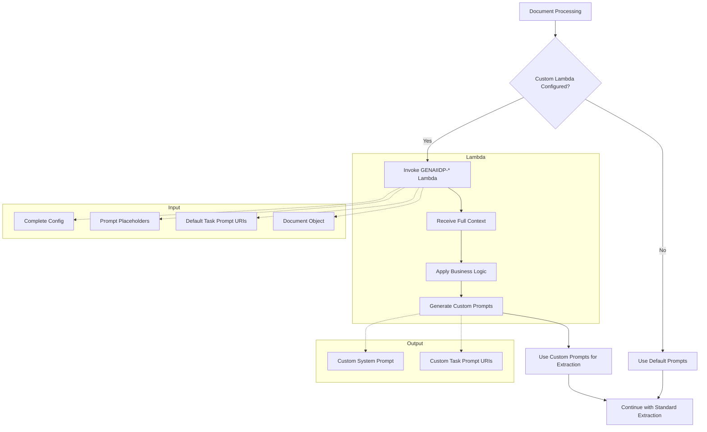

# Custom Prompt Generator Lambda - Complete Guide

This directory contains the **complete implementation and demonstration** of the custom prompt generator Lambda feature for GenAI IDP Accelerator. This feature enables users to inject custom business logic into extraction processing for Patterns 2 and 3.

## 🎯 Overview

The custom prompt generator Lambda feature allows you to:

- **Customize extraction prompts** based on document type, content, or business rules  
- **Implement domain-specific logic** for specialized document processing
- **Integrate with external systems** to retrieve customer-specific configurations
- **Apply conditional processing** based on document characteristics
- **Maintain full control** over prompt generation while leveraging IDP infrastructure

## 📁 Files in This Directory

- **`GENAIIDP-notebook-demo-extractor.py`** - Demo Lambda function with educational business logic
- **`template.yml`** - CloudFormation SAM template to deploy the demo function
- **`README.md`** - This comprehensive documentation and guide

## 🏗️ Architecture



## Quick Start

### Step 1: Deploy the Demo Lambda Function

```bash
# Navigate to the demo-lambda directory
cd notebooks/examples/demo-lambda

# Deploy using AWS SAM
sam deploy --guided


### Step 2: Get the Lambda ARN

After deployment, get the ARN from CloudFormation outputs:

```bash
aws cloudformation describe-stacks \
    --stack-name genaiidp-custom-lambda-demo \
    --query 'Stacks[0].Outputs[?OutputKey==`DemoLambdaFunctionArn`].OutputValue' \
    --output text
```

### Step 3: Run the Demo Notebook

0. Run `notebooks/examples` steps 0, 1, 2
1. Open `notebooks/examples/step3_extraction_with_custom_lambda.ipynb`
2. Run all cells to see the comparison

## Demo Lambda Function Features

### Business Logic Demonstrations

The demo Lambda shows three different customization scenarios:

#### 1. Bank Statement Processing
```python
# Detects business vs personal accounts
business_indicators = ["llc", "inc", "corp", "business", "company", "dba"]
is_business = any(indicator in document_text.lower() for indicator in business_indicators)

# Applies different prompts based on account type
if is_business:
    # Business banking specialized prompts
else:
    # Personal banking specialized prompts
```

#### 2. Invoice Processing
```python
# Detects international vs domestic invoices
international_indicators = ["vat", "gst", "euro", "€", "£", "currency", "exchange rate"]
is_international = any(indicator in document_text.lower() for indicator in international_indicators)

# Applies different prompts based on invoice type
if is_international:
    # International invoice processing
else:
    # Domestic invoice processing
```

#### 3. Generic Document Enhancement
```python
# Adds demo context to any other document type
enhanced_system_prompt = f"{default_system_prompt}\n\nNote: This extraction is powered by a custom Lambda function..."
```

### Educational Logging

The demo function includes comprehensive logging for learning purposes:

```python
logger.info("=== DEMO LAMBDA INVOKED ===")
logger.info(f"Processing document ID: {document_id}")
logger.info(f"Document class: {document_class}")
logger.info("DEMO LOGIC: Applying bank statement customization")
logger.info(f"DEMO ANALYSIS: Business account detected: {is_business}")
logger.info("DEMO RESULT: Generated specialized bank statement prompts")
```

## Lambda Interface

### Input Payload Structure
```json
{
  "config": {
    "extraction": {...},
    "classes": [...],
    ...
  },
  "prompt_placeholders": {
    "DOCUMENT_TEXT": "Full OCR text from all pages",
    "DOCUMENT_CLASS": "Bank Statement", 
    "ATTRIBUTE_NAMES_AND_DESCRIPTIONS": "Account Number\t[Primary account identifier]..."
  },
  "default_task_prompt_content": [
    {"text": "Resolved default task prompt..."},
    {"image": {...}}, // if images present
    {"cachePoint": true} // if cache points present
  ],
  "serialized_document": {
    "id": "document-123",
    "input_bucket": "my-bucket",
    "pages": {...},
    "sections": [...],
    ...
  }
}
```

### Output Payload Structure
```json
{
  "system_prompt": "Custom system prompt text",
  "task_prompt_content": [
    {"text": "Custom task prompt with business logic applied"},
    {"image": {...}}, // optional
    {"cachePoint": true} // optional
  ]
}
```

## Monitoring and Troubleshooting

### CloudWatch Logs

Monitor these log groups:
- `/aws/lambda/GENAIIDP-notebook-demo-extractor` - Demo Lambda logs
- Your IDP stack extraction function logs - IDP system logs

### Key Log Messages

**Successful Operation:**
```
=== DEMO LAMBDA INVOKED ===
DEMO LOGIC: Applying [document type] customization
DEMO ANALYSIS: [Business logic decisions]
DEMO RESULT: Generated specialized [type] prompts
```

**From IDP System:**
```
Using custom prompt Lambda: arn:aws:lambda:...
Custom prompt Lambda invoked successfully
Successfully applied custom prompt from Lambda function
```

### Performance Monitoring

The notebook measures and reports:
- **Processing Time Comparison**: Default vs custom Lambda
- **Lambda Overhead**: Additional time added by Lambda invocation
- **Success Rates**: Whether Lambda processing completed successfully

## Educational Value

This demo demonstrates:

1. **Integration Points**: How Lambda integrates with existing IDP processing
2. **Business Logic Examples**: Real-world customization scenarios
3. **Error Handling**: What happens when Lambda fails
4. **Performance Impact**: Overhead of custom Lambda processing
5. **Monitoring Approaches**: How to observe and troubleshoot Lambda behavior

## Production Adaptation

To adapt this for production:

### 1. Business Logic Customization
Replace the demo logic with your specific requirements:
- Industry-specific processing rules
- Customer-specific configurations
- External system integrations
- Compliance requirements

### 2. Enhanced Error Handling
```python
try:
    # Your business logic
    return custom_prompts
except SpecificBusinessError as e:
    logger.error(f"Business logic error: {e}")
    raise Exception(f"Custom extraction failed: {e}")
except Exception as e:
    logger.error(f"Unexpected error: {e}")
    raise
```

### 3. Performance Optimization
- Cache frequently accessed data
- Minimize external API calls
- Use appropriate Lambda memory/timeout settings
- Consider async processing for non-critical operations

### 4. Security Considerations
- Validate all inputs from IDP system
- Implement proper error messages without exposing sensitive data
- Use appropriate IAM permissions for any external resource access
- Log security-relevant events for audit purposes

## Deployment Options

### Option 1: AWS SAM (Recommended)
```bash
sam build
sam deploy --guided
```

### Option 2: AWS CLI
```bash
# Package the function
zip -r demo-function.zip GENAIIDP-notebook-demo-extractor.py

# Deploy
aws cloudformation create-stack \
    --stack-name genaiidp-custom-lambda-demo \
    --template-body file://deploy-demo-lambda.yaml \
    --capabilities CAPABILITY_IAM
```

### Option 3: AWS Console
1. Upload the `GENAIIDP-notebook-demo-extractor.py` file to Lambda console
2. Set function name to `GENAIIDP-notebook-demo-extractor`
3. Configure runtime as Python 3.13
4. Set handler to `GENAIIDP-notebook-demo-extractor.lambda_handler`

## Cleanup

To remove the demo resources:

```bash
# Using CloudFormation
aws cloudformation delete-stack --stack-name genaiidp-custom-lambda-demo

# Using AWS Lambda console directly
aws lambda delete-function --function-name GENAIIDP-notebook-demo-extractor
```

## Next Steps

After running the demo:

1. **Examine the notebook output** to understand Lambda integration
2. **Check CloudWatch logs** to see Lambda decision making
3. **Modify the demo Lambda** to test your own business logic
4. **Create production Lambda functions** based on your requirements
5. **Integrate with your IDP deployment** using the production Lambda ARNs

The demo provides a foundation for understanding how to implement powerful custom business logic while leveraging the robust IDP infrastructure.
