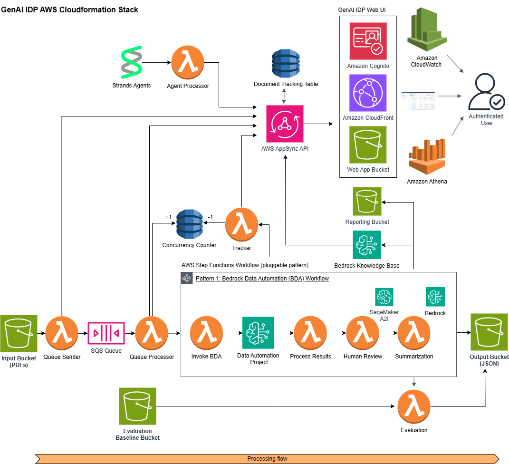

# Pattern 1: Bedrock Data Automation (BDA) Workflow

This pattern implements an intelligent document processing workflow using Amazon Bedrock Data Automation (BDA) for orchestrating ML-powered document processing tasks. It leverages BDA's ability to extract insights from documents using pre-configured templates and workflows.



## Table of Contents

- [Architecture Overview](#architecture-overview)
  - [Flow Overview](#flow-overview)
  - [Components](#components)
  - [State Machine Workflow](#state-machine-workflow)
- [Deployment](#deployment)
  - [Prerequisites](#prerequisites)
  - [Stack Parameters](#stack-parameters)
- [Monitoring and Metrics](#monitoring-and-metrics)
  - [CloudWatch Metrics](#cloudwatch-metrics)
  - [Dashboard Components](#dashboard-components)
  - [Error Tracking](#error-tracking)
- [Concurrency and Throttling](#concurrency-and-throttling)
  - [BDA API Throttling](#bda-api-throttling)
  - [Error Handling](#error-handling)
- [Workflow Details](#workflow-details)
  - [Invocation Step](#invocation-step)
  - [Processing Step](#processing-step)
  - [Results Processing](#results-processing)

## Architecture Overview

### Flow Overview
1. Document events from S3 trigger workflow execution
2. BDA Invoke Lambda starts BDA job asynchronously with a task token
3. BDA Completion Lambda processes job completion events from EventBridge
4. Completion Lambda sends task success/failure to Step Functions using the stored token
5. Process Results Lambda copies output files to designated location

### Components
- **Main Functions**:
  - BDA Invoke Function (bda_invoke_function): Initiates BDA jobs and stores task tokens
  - BDA Completion Function (bda_completion_function): Handles job completion events
  - Process Results Function (processresults_function): Copies and organizes output files
- **State Machine**: Coordinates workflow execution using waitForTaskToken pattern
- **EventBridge**: Routes BDA job completion events to the Completion Function
- **DynamoDB**: Tracks task tokens for asynchronous callback
- **S3 Buckets**: Input, Working, and Output storage

### State Machine Workflow
```
InvokeDataAutomation (with waitForTaskToken)
    |
    ├── Success -> ProcessResultsStep
    |
    └── Failure -> FailState
```

## Deployment

### Prerequisites
- Bedrock Data Automation project already set up and configured
- Required AWS permissions for Bedrock, Lambda, Step Functions, and S3
- S3 buckets created for input, working, and output storage

### Stack Parameters

Required parameters:
- `BDAProjectArn`: ARN of your Bedrock Data Automation project
- `InputBucket`: S3 bucket for input documents
- `WorkingBucket`: S3 bucket for temporary BDA job output
- `OutputBucket`: S3 bucket for final processed results
- `TrackingTable`: DynamoDB table for task token tracking
- `CustomerManagedEncryptionKeyArn`: KMS key ARN for encryption
- `LogRetentionDays`: CloudWatch log retention period
- `ExecutionTimeThresholdMs`: Latency threshold for alerts

## Monitoring and Metrics

### CloudWatch Metrics
The pattern publishes detailed metrics to CloudWatch:

- **BDA API Metrics**:
  - `BDARequestsTotal`: Total number of API requests
  - `BDARequestsSucceeded`: Successful API requests
  - `BDARequestsFailed`: Failed API requests
  - `BDARequestsThrottles`: API throttling events
  - `BDARequestsRetrySuccess`: Successful retries after throttling
  - `BDARequestsMaxRetriesExceeded`: Cases where max retries were exhausted
  - `BDARequestsLatency`: API request duration in milliseconds
  - `BDARequestsTotalLatency`: Total duration including retries

- **BDA Job Metrics**:
  - `BDAJobsTotal`: Total number of BDA jobs
  - `BDAJobsSucceeded`: Successfully completed jobs
  - `BDAJobsFailed`: Failed job executions

### Dashboard Components
The included CloudWatch dashboard provides visibility into the workflow:

- **API Request Panels**:
  - API request success/failure rates per minute
  - API throttling and retry metrics
  - Job execution success/failure trends

- **Lambda Performance**:
  - Function duration for all Lambda functions
  - Long-running invocation tracking
  - Memory utilization metrics

- **Error Tracking**:
  - Log-based panels for API throttling events
  - Job execution failures with detailed error messages
  - Lambda function errors and timeouts

## Concurrency and Throttling

### BDA API Throttling
Implements exponential backoff with retry handling for transient errors:
```python
MAX_RETRIES = 8
INITIAL_BACKOFF = 2  # seconds
MAX_BACKOFF = 300   # 5 minutes

# Retryable error codes
retryable_errors = [
    'ThrottlingException',
    'ServiceQuotaExceededException',
    'RequestLimitExceeded',
    'TooManyRequestsException',
    'InternalServerException'
]
```

### Error Handling
- Retries on transient failures with exponential backoff
- Clear distinction between retryable and non-retryable errors
- Detailed metrics for tracking throttling events and retries
- Dead Letter Queue for EventBridge target to capture unprocessed events
- Comprehensive error logging with cause and stack traces

## Workflow Details

### Invocation Step
```python
# Example BDA invocation payload
payload = {
    "inputConfiguration": {
        "s3Uri": input_s3_uri
    },
    "outputConfiguration": {
        "s3Uri": output_s3_uri
    },
    "dataAutomationConfiguration": {
        "dataAutomationProjectArn": data_project_arn,
        "stage": "LIVE"
    },
    "dataAutomationProfileArn": f"arn:aws:bedrock:{region}:{account_id}:data-automation-profile/us.data-automation-v1",
    "notificationConfiguration": {
        "eventBridgeConfiguration": {
            "eventBridgeEnabled": True
        }
    }
}
```

### Processing Step
- Tracks execution task tokens in DynamoDB with expiration time
- Listens for EventBridge events from BDA job completion
- Retrieves task token from DynamoDB when job completes
- Sends success or failure to Step Functions workflow
- Publishes detailed metrics for monitoring

### Results Processing
- Copies BDA output files from working bucket to final output location
- Organizes results in the same directory structure as input
- Produces standardized output format for UI consumption
- Updates execution status with job result information

## Best Practices
1. Monitor BDA service quotas and adjust concurrency as needed
2. Implement exponential backoff with jitter for API throttling
3. Set up EventBridge rules to capture all job status events
4. Include DLQ for EventBridge targets to capture unprocessed events
5. Ensure token storage has appropriate TTL to avoid stale tokens
6. Handle partial successes appropriately in the results processor
7. Maintain comprehensive logging for troubleshooting
8. Use CloudWatch dashboards to monitor performance metrics
9. Enable detailed CloudWatch metrics for API requests and job executions
10. Configure alerts for unusual throttling or error patterns