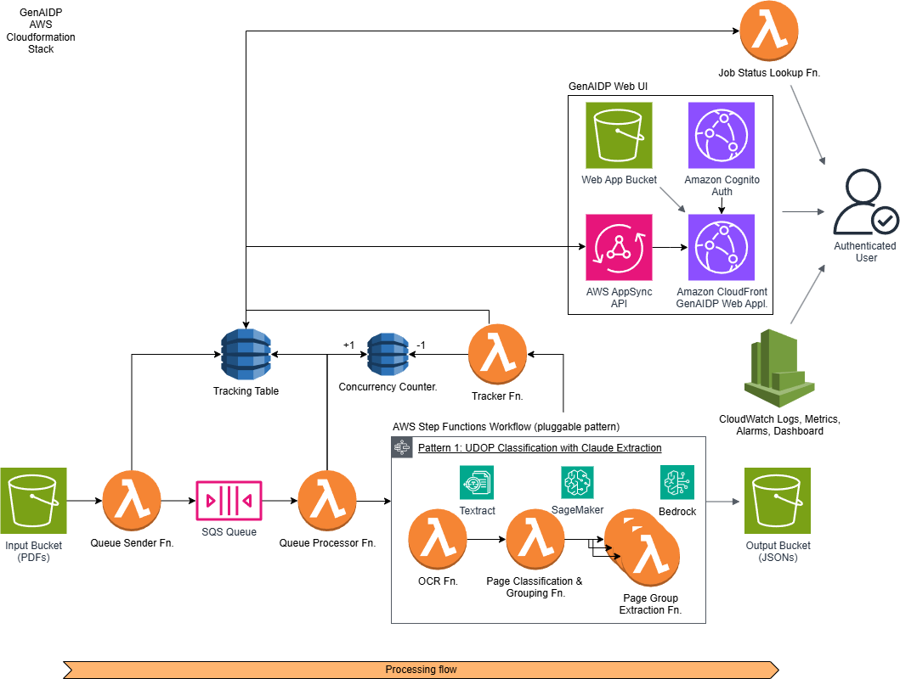

# Pattern 1: UDOP Classification with Claude Extraction

This pattern implements an intelligent document processing workflow that uses UDOP (Unified Document Processing) for page classification and grouping, followed by Claude for information extraction.




## Table of Contents

- [Fine tuning a UDOP model](#fine-tuning-a-udop-model-for-classification)
- [Architecture Overview](#architecture-overview)
  - [State Machine Workflow](#state-machine-workflow)
  - [Lambda Functions](#lambda-functions)
    - [OCR Function](#ocr-function)
    - [Classification Function](#classification-function)
    - [Extraction Function](#extraction-function)
    - [ProcessResults Function](#processresults-function)
  - [UDOP Model on SageMaker](#udop-model-on-sagemaker)
  - [Monitoring and Metrics](#monitoring-and-metrics)
    - [Performance Metrics](#performance-metrics)
    - [Error Tracking](#error-tracking)
    - [Lambda Function Metrics](#lambda-function-metrics)
  - [Template Outputs](#template-outputs)
  - [Configuration](#configuration)
- [Testing](#testing)
- [Best Practices](#best-practices)

## Fine tuning a UDOP model for classification

See [Fine-Tuning Models on SageMaker](./fine-tune-sm-udop-classification/README.md) 

Once you have trained the model, deploy the GenAIIDP stack for Pattern1 using the path for your new fine tuned model.


## Architecture Overview

The workflow consists of three main processing steps:
1. OCR processing using Amazon Textract
2. Page classification and grouping using a UDOP model deployed on SageMaker
3. Field extraction using Claude via Amazon Bedrock

### State Machine Workflow

The Step Functions state machine (`workflow.asl.json`) orchestrates the following flow:

```
OCRStep → ClassificationStep → ProcessPageGroups (Map State for Extraction)
```

Each step includes comprehensive retry logic for handling transient errors:
- Initial retry after 2 seconds
- Exponential backoff with rate of 2
- Maximum of 10 retry attempts

### Lambda Functions

#### OCR Function
- **Purpose**: Processes input PDFs using Amazon Textract
- **Input**:
  ```json
  {
    "execution_arn": "<ARN>",
    "output_bucket": "<BUCKET>",
    "input": {
      "detail": {
        "bucket": { "name": "<BUCKET>" },
        "object": { "key": "<KEY>" }
      }
    }
  }
  ```
- **Output**:
  ```json
  {
    "metadata": {
      "input_bucket": "<BUCKET>",
      "object_key": "<KEY>",
      "output_bucket": "<BUCKET>",
      "output_prefix": "<PREFIX>",
      "num_pages": "<NUMBER OF PAGES>"
    },
    "pages": {
      "<PAGE_NUMBER>": {
        "rawTextUri": "<S3_URI>",
        "parsedTextUri": "<S3_URI>",
        "imageUri": "<S3_URI>"
      }
    }
  }
  ```

#### Classification Function 
- **Purpose**: Classifies pages using UDOP model on SageMaker, and segments into sections using class boundaries
- **Input**: Output from OCR function plus output bucket
- **Output**: 
  ```json
  {
    "metadata": "<FROM_OCR>",
    "sections": [
      {
        "id": "<GROUP_ID>",
        "class": "<CLASS>",
        "pages": [...]
      }
    ]
  }
  ```

#### Extraction Function
- **Purpose**: Extracts fields using Claude via Amazon Bedrock
- **Input**: Individual section from Classification output
- **Output**:
  ```json
    {
        "section": {
            "id": <ID>,
            "class": <CLASS>,
            "page_ids": [<PAGEID>, ...],
            "outputJSONUri": <S3_URI>,
        },
        "pages": [
            {
                "Id": <ID>,
                "Class": <CLASS>,
                "RawTextUri": <S3_URI>,
                "ParsedTextUri": <S3_URI>,
                "ImageUri": <S3_URI>
            }
        ]
    }
  ```

#### ProcessResults Function

- **Purpose**: Aggregates results for all sections
- **Input**: Extraction output from each section extraction
- **Output**: Consumed by the GenAIIDP parent stack workflow tracker to update job status/UI etc
  ```json
        {
            'Sections': [
                {
                    "Id": <ID>,
                    "PageIds": [<PAGEID>, ...],
                    "Class": <CLASS>,
                    "OutputJSONUri": <S3_URI>
                }
            ],
            'Pages': [
                "Id": <ID>,
                "Class": <CLASS>,
                "RawTextUri": <S3_URI>,
                "ParsedTextUri": <S3_URI>,
                "ImageUri": <S3_URI>
            ],
            'PageCount': <NUMBER OF PAGES IN ORIGINAL INPUT DOC>
        }
```

### UDOP Model on SageMaker

The pattern includes a complete UDOP model deployment:

- **SageMaker Endpoint**: `sagemaker_classifier_endpoint.yaml` provisions:
  - SageMaker model 
  - Endpoint configuration
  - Endpoint with auto-scaling
  - IAM roles and permissions

To create a new UDOP model fine tuned for your data, see [Fine tuning a UDOP model](#fine-tuning-a-udop-model-for-classification).

### Monitoring and Metrics

The pattern includes a dedicated CloudWatch dashboard with:

#### Performance Metrics
- Document and page counts
- Token usage (input/output/total)
- Bedrock request statistics
- Processing latencies

#### Error Tracking
- Lambda function errors
- Long-running invocations
- Classification/extraction failures

#### Lambda Function Metrics
- Duration
- Memory usage
- Error rates

### Template Outputs

The pattern exports these outputs to the parent stack:

- `StateMachineName`: Name of Step Functions state machine
- `StateMachineArn`: ARN of Step Functions state machine
- `StateMachineLogGroup`: CloudWatch log group for state machine
- `DashboardName`: Name of pattern-specific dashboard
- `DashboardArn`: ARN of pattern-specific dashboard

### Configuration

Key configurable parameters:

- `UDOPModelArtifactPath`: S3 path to UDOP model artifacts (see [Fine tuning a UDOP model](#fine-tuning-a-udop-model-for-classification))
- `ExtractionModel`: Bedrock model ID for extraction (Claude)
- `MaxConcurrentWorkflows`: Workflow concurrency limit
- `LogRetentionDays`: CloudWatch log retention period
- `ExecutionTimeThresholdMs`: Latency threshold for alerts

## Customizing Extraction

The system uses a combination of prompt engineering and predefined attributes to extract information from documents. You can customize both to match your specific document types and extraction needs.

### Extraction Prompts

The main extraction prompts are defined in `src/bedrock_function/prompt_catalog.py`. An AI generated sample is provided, with the structure below:

```python
DEFAULT_SYSTEM_PROMPT = "You are a document assistant. Respond only with JSON..."
BASELINE_PROMPT = """
<background>
You are an expert in business document analysis and information extraction. You can understand and extract key information from various types of business documents including letters, memos, financial documents, scientific papers, news articles, advertisements, emails, forms, handwritten notes, invoices, purchase orders, questionnaires, resumes, scientific publications, and specifications...
</background>
...
```
To modify the extraction behavior:

1. Edit the `DEFAULT_SYSTEM_PROMPT` to change the AI assistant's basic behavior
1. Customize the BASELINE_PROMPT to:
- Provide domain expertise for your document types
- Add specific instructions for handling edge cases
- Modify output formatting requirements


### Extraction Attributes
Attributes to be extracted are defined in `src/extraction_function/attributes.json`. An AI generated sample is provided, with the structure below:

Example attribute definition:
```json
    {
        "document_class_attributes": {
            "letter": {
                "sender_name": ["from", "sender", "authored by", "written by"],
                "sender_address": ["address", "location", "from address"],
                "recipient_name": ["to", "recipient", "addressee"],
                "recipient_address": ["to address", "delivery address"],
                "date": ["date", "written on", "dated"],
                "subject": ["subject", "re:", "regarding"],
                "letter_type": ["type", "category"],
                "signature": ["signed by", "signature"],
                "cc": ["cc", "carbon copy", "copy to"],
                "reference_number": ["ref", "reference", "our ref"]
            },
            "form": {
                "form_type": ["form name", "document type", "form category"],
                "form_id": ["form number", "id", "reference number"],
                "submission_date": ["date", "submitted on", "filed on"],
                "submitter_name": ["name", "submitted by", "filed by"],
                "submitter_id": ["id number", "identification", "reference"],
                "approval_status": ["status", "approved", "pending"],
                "processed_by": ["processor", "handled by", "approved by"],
                "processing_date": ["processed on", "completion date"],
                "department": ["dept", "department", "division"],
                "comments": ["notes", "remarks", "comments"]
            }
        }
    }
```
To customize attributes:
1. Add, remove, or modify attributes in attributes.json
2. For each attribute, provide clear descriptions and comprehensive aliases
3. Deploy the updated function to apply changes

Note: Changes to prompts or attributes require redeployment of the Bedrock Lambda function.


## Local Testing

Use the provided test events in `testing/`:

```bash
# Test OCR function
sam local invoke OCRFunction -e testing/OCRFunction-event.json

# Test classification
sam local invoke ClassificationFunction -e testing/ClassificationFunction-event.json

# Test extraction
sam local invoke ExtractionFunction -e testing/ExtractionFunction-event.json
```

## Best Practices

1. **Retry Handling**: All functions implement exponential backoff with jitter
2. **Metrics**: Comprehensive CloudWatch metrics for monitoring
3. **Error Tracking**: Detailed error logging with context
4. **Resource Management**: Efficient handling of memory and connections
5. **Security**: KMS encryption and least privilege IAM roles