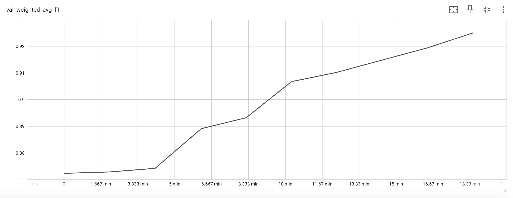

# Fine-Tuning and Deploying Models on SageMaker

This guide provides step-by-step instructions for fine-tuning a model on SageMaker, deploying it as an endpoint, and running inference.

## 1. Create a Fine-Tuning Job on SageMaker


### 1.1. Prerequisite:
Set up `awscli` before running the command:
```
aws configure
```

To create a training job, you need to prepare your dataset in an S3 bucket with the following structure:

```
bucket
    ├── dataset/
        ├── validation/
            ├── images/
            ├── labels/  # Label data: {"label": "letter"}
            ├── textract/  # Textract results
            ├── metadata.json
        ├── training/
            ├── images/
            ├── labels/  # Label data: {"label": "letter"}
            ├── textract/  # Textract results
            ├── metadata.json
```

Metadata Format (`metadata.json`)
```
{
    "labels": [<label-1>, <label-2>, ...],
    "size": <dataset size>,
    "name": <dataset name>
}
```

### 1.1.1 Using the sample dataset:
Use the sample rvl-cdip dataset provided (in the assets folder) if you're not yet ready to train a model with your own data:
```
sh upload-dataset.sh \
   --zip-file rvl-cdip.zip          # Zipfile with dataset
   --bucket <your-dataset-bucket>   # uses existing bucket, or creates a new one 
   --bucket-prefix <prefix>         # root prefix for dataset in bucket
```
#### Example:
Upload sample dataset to bucket `udop-finetuning/rvl-cdip` 
```
./upload-dataset.sh \
    --zip-file assets/rvl-cdip.zip \
    --bucket udop-finetuning \
    --bucket-prefix rvl-cdip
```


### 1.2. Launching a Training Job
Run the following command to start fine-tuning:

```
python sagemaker_train.py \
    --job-name <job name> \
    --bucket <bucket>             # S3 bucket to save the training results \
    --bucket-prefix <prefix>      # Optional - results are saved under this prefix \
    --role <role ARN> \           # Optional (if not provided, a new role will be created) \
    --max-epochs <max epochs>     # Optional \
    --base-model <base model>     # Optional \
    --data-bucket <data bucket>   # Optional, read dataset from a different bucket. Defaults to <bucket> \
    --data-bucket-prefix <prefix> # Optional - read training and validation data under this prefix.
```

#### Examples:

Read data from and save results to `udop-finetuning/rvl-cdip`
```
python sagemaker_train.py \
    --bucket udop-finetuning \
    --bucket-prefix rvl-cdip/  \
    --job-name rvl-cdip-1 
```

#### Results Location
The fine-tuned model will be stored at:
```
s3://<bucket>/<prefix>/models/<job_name>/output/model.tar.gz
```
E.g.
```
s3://udop-finetuning/rvl-cdip/models/rvl-cdip-3/output/model.tar.gz
```

### 1.3. Training Logs
Training logs are saved in:
```
s3://<bucket>/tensorboard/<job_name>/tensorboard-output/training_logs/
```
To monitor logs in real-time during training:
```
tensorboard --logdir=s3://<bucket>/tensorboard/<job_name>/tensorboard-output/training_logs/
```

#### Example:
```
tensorboard --logdir=s3://udop-finetuning/tensorboard/rvl-cdip/tensorboard-output/training_logs/
```

For logs stored in a different AWS region:
```
AWS_REGION=<region> tensorboard --logdir s3://<bucket>/tensorboard/<job_name>/tensorboard-output/training_logs/
```

At the end of training, final performance metrics are stored in:
```
s3://<bucket>/models/<job_name>/output/output.tar.gz
```

### 1.4. Max Epochs
According to [1], the model has already been pre-trained on the RVL-CDIP dataset. The following chart shows the weighted average F1 score over 10 additional fine-tuning epochs:




## 2. Deploy a Fine-Tuned Model to a SageMaker Endpoint

To deploy the trained model to a SageMaker endpoint, run:
```
python sagemaker_deploy.py \
    --role <role ARN>    # Optional (if not provided, a new role will be created with access to the model artifact bucket) \
    --model-artifact <S3 model_path output by sagemaker_train.py> \
    --endpoint-name <endpoint name> \
    --base-model <model name>  # Optional
```

#### Example:
```
python sagemaker_deploy.py \
    --model-artifact s3://udop-finetuning/models/rvl-cdip/output/model.tar.gz \
    --endpoint-name udop-inference
```

## 3. Running Inference
To run inference on the deployed model, execute `inference_example.py`:
```
python inference_example.py \
    --input-image <S3 URI of the image file> \
    --input-textract <S3 URI of the textract file> \
    --endpoint-name <endpoint name> \
    --prompt <prompt>  # Optional \
    --debug <debug>  # Optional, set 1 for debug info
```

#### Example:
```
python inference_example.py \
    --input-image s3://udop-finetuning/dataset/inference/image/0.png \
    --input-textract s3://udop-finetuning/dataset/inference/textract/0.json \
    --endpoint-name udop-inference \
    --prompt "Document Classification on RVLCDIP." \
    --debug 1
```

## 4. Additional Notes
- Fine-tuning requires `sagemaker_train.py` and the `code` folder.
- Deployment only requires `sagemaker_deploy.py`.

## 5. Reference
[1] Tang, Z., Yang, Z., Wang, G., Fang, Y., Liu, Y., Zhu, C., Zeng, M., Zhang, C. and Bansal, M., 2023. "Unifying vision, text, and layout for universal document processing." *Proceedings of the IEEE/CVF Conference on Computer Vision and Pattern Recognition*, pp. 19254-19264.
