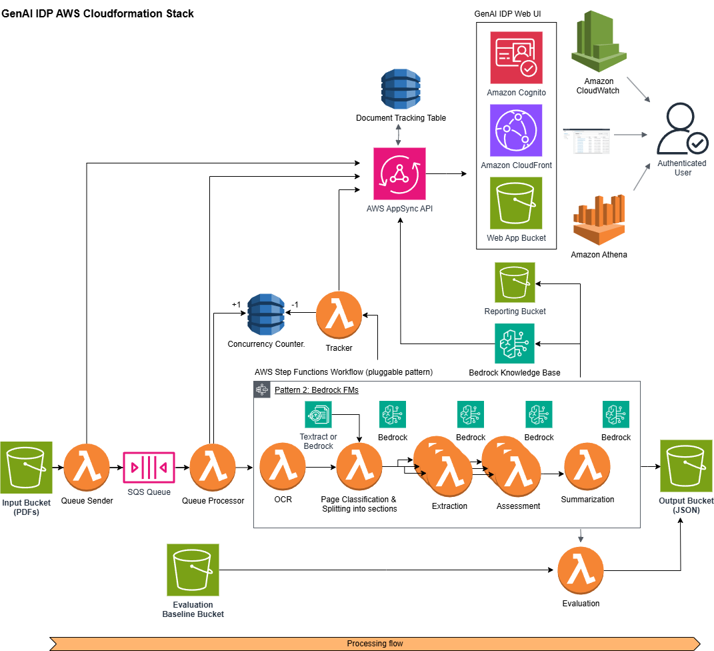

# Pattern 2: Bedrock Classification and Extraction

This pattern implements an intelligent document processing workflow that uses Amazon Bedrock with Nova or Claude models for both page classification/grouping and information extraction.



## Table of Contents

- [Architecture Overview](#architecture-overview)
  - [State Machine Workflow](#state-machine-workflow)
  - [Lambda Functions](#lambda-functions)
    - [OCR Function](#ocr-function)
    - [Classification Function](#classification-function)
    - [Extraction Function](#extraction-function)
    - [ProcessResults Function](#processresults-function)
  - [Monitoring and Metrics](#monitoring-and-metrics)
    - [Performance Metrics](#performance-metrics)
    - [Error Tracking](#error-tracking)
    - [Lambda Function Metrics](#lambda-function-metrics)
  - [Template Outputs](#template-outputs)
  - [Configuration](#configuration)
- [Customizing Classification](#customizing-classification)
- [Customizing Extraction](#customizing-extraction)
- [Testing](#testing)
- [Best Practices](#best-practices)

## Architecture Overview

The workflow consists of three main processing steps:
1. OCR processing using Amazon Textract
2. Page classification and grouping using Claude via Amazon Bedrock
3. Field extraction using Claude via Amazon Bedrock

### State Machine Workflow

The Step Functions state machine (`workflow.asl.json`) orchestrates the following flow:

```
OCRStep → ClassificationStep → ProcessPageGroups (Map State for Extraction) → ProcessResultsStep
```

Each step includes comprehensive retry logic for handling transient errors:
- Initial retry after 2 seconds
- Exponential backoff with rate of 2
- Maximum of 8-10 retry attempts depending on the step

### Lambda Functions

#### OCR Function
- **Purpose**: Processes input PDFs using Amazon Textract
- **Key Features**:
  - Concurrent page processing with ThreadPoolExecutor
  - Image preprocessing and optimization
  - Comprehensive error handling and retries
  - Detailed metrics tracking
- **Input**:
  ```json
  {
    "execution_arn": "<ARN>",
    "output_bucket": "<BUCKET>",
    "input": {
      "detail": {
        "bucket": { "name": "<BUCKET>" },
        "object": { "key": "<KEY>" }
      }
    }
  }
  ```
- **Output**:
  ```json
  {
    "metadata": {
      "input_bucket": "<BUCKET>",
      "object_key": "<KEY>",
      "output_bucket": "<BUCKET>",
      "output_prefix": "<PREFIX>",
      "num_pages": "<NUMBER OF PAGES>"
    },
    "pages": {
      "<PAGE_NUMBER>": {
        "rawTextUri": "<S3_URI>",
        "parsedTextUri": "<S3_URI>",
        "imageUri": "<S3_URI>"
      }
    }
  }
  ```

#### Classification Function
- **Purpose**: Classifies pages using Claude via Bedrock and segments into sections
- **Key Features**:
  - RVL-CDIP dataset categories for classification
  - Concurrent page processing
  - Automatic image resizing and optimization
  - Robust error handling with exponential backoff
- **Input**: Output from OCR function
- **Output**:
  ```json
  {
    "metadata": "<FROM_OCR>",
    "sections": [
      {
        "id": "<GROUP_ID>",
        "class": "<CLASS>",
        "pages": [...]
      }
    ]
  }
  ```

#### Extraction Function
- **Purpose**: Extracts fields using Claude via Bedrock
- **Key Features**:
  - Document class-specific attribute extraction
  - Configurable extraction attributes
  - Comprehensive error handling
  - Token usage tracking
- **Input**: Individual section from Classification output
- **Output**:
  ```json
  {
    "section": {
      "id": "<ID>",
      "class": "<CLASS>",
      "page_ids": ["<PAGEID>", ...],
      "outputJSONUri": "<S3_URI>"
    },
    "pages": [...]
  }
  ```

#### ProcessResults Function
- **Purpose**: Consolidates results from all sections
- **Output**: Standardized format for GenAIIDP parent stack:
  ```json
  {
    "Sections": [{
      "Id": "<ID>",
      "PageIds": ["<PAGEID>", ...],
      "Class": "<CLASS>",
      "OutputJSONUri": "<S3_URI>"
    }],
    "Pages": [{
      "Id": "<ID>",
      "Class": "<CLASS>",
      "TextUri": "<S3_URI>",
      "ImageUri": "<S3_URI>"
    }],
    "PageCount": "<TOTAL_PAGES>"
  }
  ```

### Monitoring and Metrics

The pattern includes a comprehensive CloudWatch dashboard with:

#### Performance Metrics
- Document and page throughput
- Token usage (input/output/total)
- Bedrock request statistics
- Processing latencies
- Throttling and retry metrics

#### Error Tracking
- Lambda function errors
- Long-running invocations
- Classification/extraction failures
- Throttling events

#### Lambda Function Metrics
- Duration
- Memory usage
- Error rates
- Concurrent executions

### Template Outputs

The pattern exports these outputs to the parent stack:

- `StateMachineName`: Name of Step Functions state machine
- `StateMachineArn`: ARN of Step Functions state machine
- `StateMachineLogGroup`: CloudWatch log group for state machine
- `DashboardName`: Name of pattern-specific dashboard
- `DashboardArn`: ARN of pattern-specific dashboard

### Configuration

Key configurable parameters:

- `ClassificationModel`: Bedrock model ID for classification
- `ExtractionModel`: Bedrock model ID for extraction
- `MaxConcurrentWorkflows`: Workflow concurrency limit
- `LogRetentionDays`: CloudWatch log retention period
- `ExecutionTimeThresholdMs`: Latency threshold for alerts

## Customizing Classification

The classification system uses RVL-CDIP dataset categories and can be customized through prompts in `src/classification_function/prompt_catalog.py`:

```python
SYSTEM_PROMPT = """You are a document classification system..."""
CLASSIFICATION_PROMPT = """Classify this document into exactly one of these RVL-CDIP categories..."""
```

Available categories:
- letter
- form
- email
- handwritten
- advertisement
- scientific_report
- scientific_publication
- specification
- file_folder
- news_article
- budget
- invoice
- presentation
- questionnaire
- resume
- memo

## Customizing Extraction

The extraction system can be customized through:

1. **Attribute Definitions** (`src/extraction_function/attributes.json`):
   - Define attributes per document class
   - Specify aliases and descriptions
   - Configure validation rules

2. **Extraction Prompts** (`src/extraction_function/prompt_catalog.py`):
   - Customize system behavior
   - Add domain expertise
   - Modify output formatting

Example attribute definition:
```json
{
  "document_class_attributes": {
    "invoice": {
      "invoice_number": ["invoice no", "invoice #"],
      "invoice_date": ["date", "invoice date"],
      "total_amount": ["total", "grand total"]
    }
  }
}
```

## Testing

Modify and use the provided test events and env files:

```bash
# Test OCR function
sam local invoke OCRFunction --env-vars testing/env.json -e testing/events/ocr-event.json

# Test classification
sam local invoke ClassificationFunction --env-vars testing/env.json -e testing/events/classification-event.json

# Test extraction
sam local invoke ExtractionFunction --env-vars testing/env.json -e testing/events/extraction-event.json
```

## Best Practices

1. **Throttling Management**:
   - Implement exponential backoff with jitter
   - Configure appropriate retry limits
   - Monitor throttling metrics

2. **Error Handling**:
   - Comprehensive error logging
   - Graceful degradation
   - Clear error messages

3. **Performance Optimization**:
   - Concurrent processing where appropriate
   - Image optimization
   - Resource pooling

4. **Monitoring**:
   - Detailed CloudWatch metrics
   - Performance dashboards
   - Error tracking

5. **Security**:
   - KMS encryption
   - Least privilege IAM roles
   - Secure configuration management