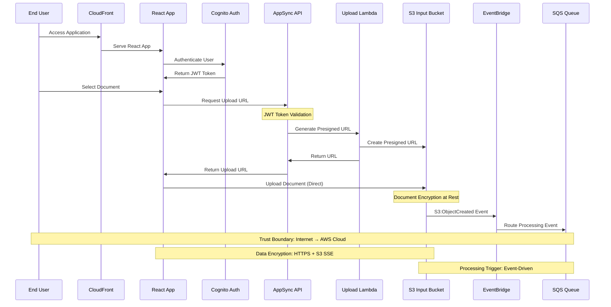
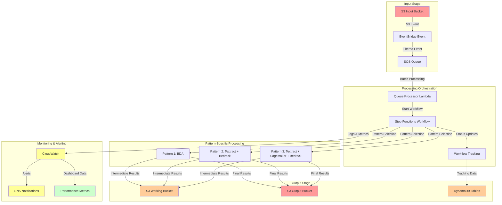
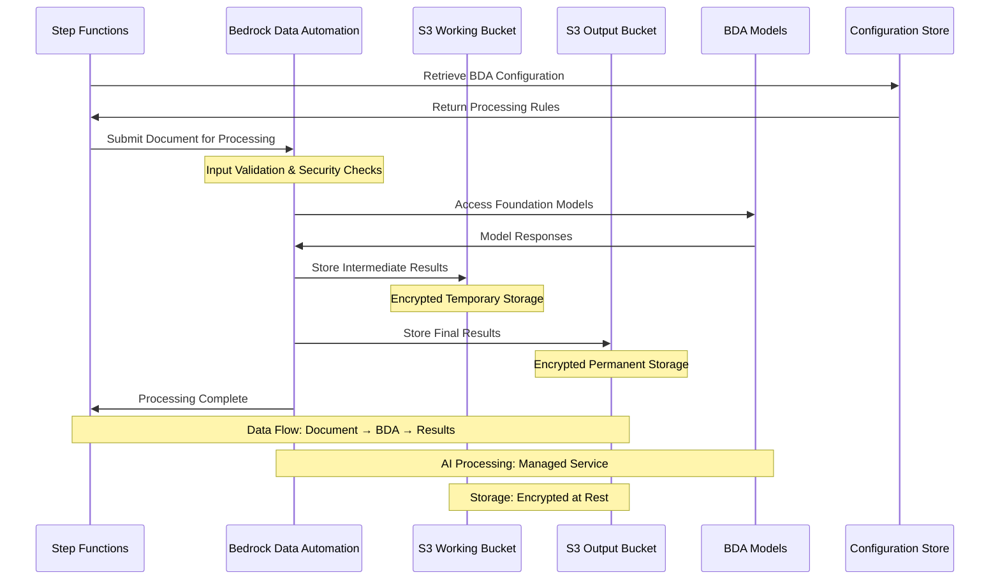
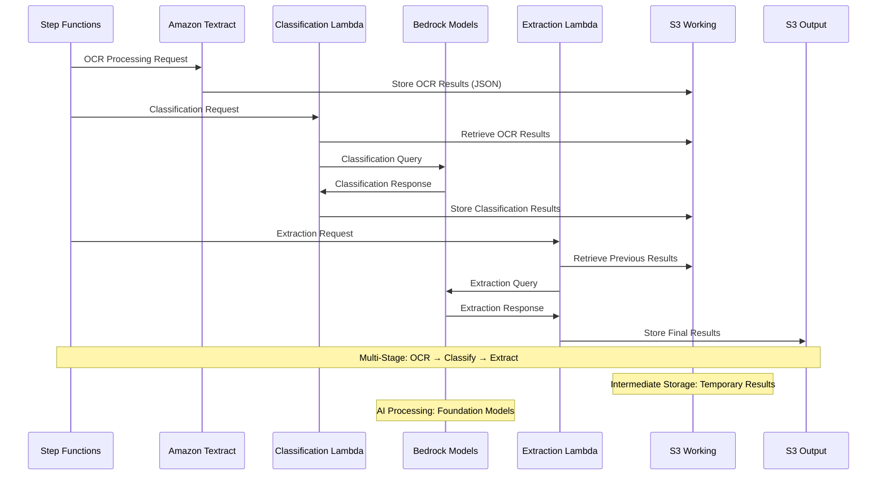
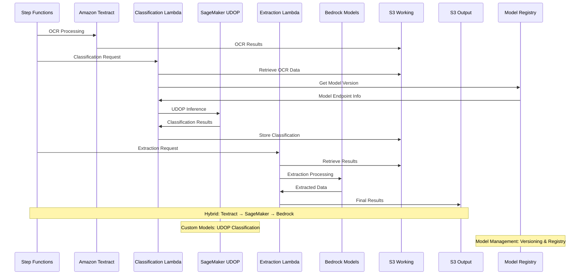
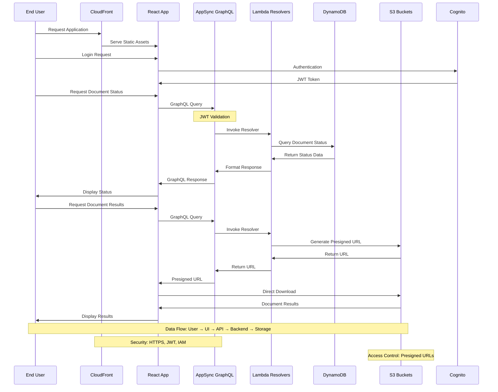
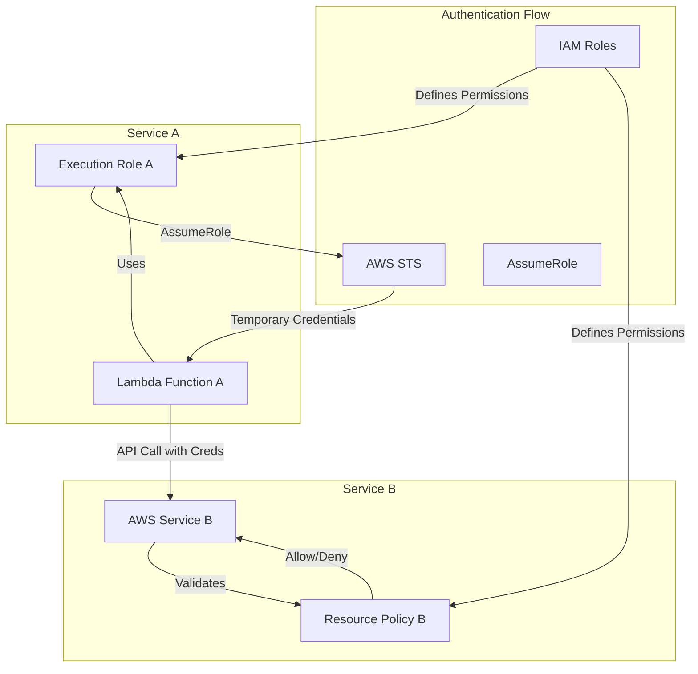
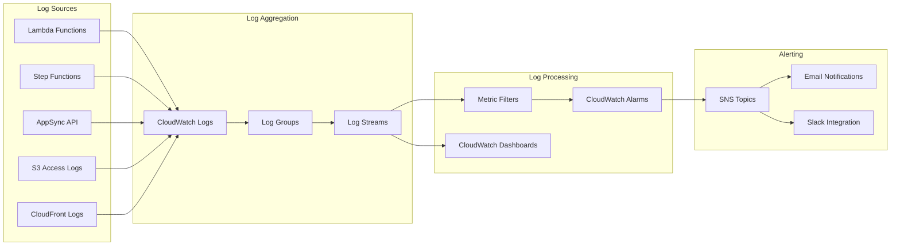

# GenAI IDP Accelerator - Data Flow Analysis

## Overview
This document provides a comprehensive analysis of data flows across the GenAI IDP Accelerator, identifying critical data paths, trust boundaries, and potential security vulnerabilities in data movement and transformation processes.

## Data Classification Framework

### Sensitivity Levels

```mermaid
graph TB
    subgraph "Data Sensitivity Classification"
        CRITICAL[Critical Sensitivity]
        HIGH[High Sensitivity]
        MEDIUM[Medium Sensitivity]
        LOW[Low Sensitivity]
        PUBLIC[Public Data]
    end
    
    subgraph "Critical Data"
        CRITICAL --- HEALTHCARE[Medical Records]
        CRITICAL --- FINANCIAL[Financial Documents]
        CRITICAL --- PII[Personal Identifiable Information]
        CRITICAL --- LEGAL[Legal Documents]
    end
    
    subgraph "High Data"
        HIGH --- BUSINESS[Business Documents]
        HIGH --- CONTRACTS[Contracts & Agreements]
        HIGH --- CREDENTIALS[User Credentials]
        HIGH --- PROMPTS[AI Model Prompts]
    end
    
    subgraph "Medium Data"
        MEDIUM --- METADATA[Processing Metadata]
        MEDIUM --- CONFIGS[Configuration Data]
        MEDIUM --- METRICS[Performance Metrics]
        MEDIUM --- LOGS[Application Logs]
    end
    
    subgraph "Low Data"
        LOW --- SYSTEM[System Status]
        LOW --- HEALTH[Health Checks]
        LOW --- GENERAL[General Statistics]
    end
    
    subgraph "Public Data"
        PUBLIC --- UI[UI Assets]
        PUBLIC --- DOCS[Documentation]
        PUBLIC --- HELP[Help Content]
    end
```


## Primary Data Flows

### 1. Document Upload and Ingestion Flow



#### Security Considerations
- **Encryption in Transit**: HTTPS for all web communications, TLS for S3 uploads
- **Authentication**: JWT token validation at AppSync layer
- **Authorization**: Presigned URLs with time-based expiration
- **Data Validation**: File type and size validation before processing
- **Event Security**: EventBridge rules filter legitimate document events

#### Potential Vulnerabilities
- **Presigned URL Abuse**: Leaked URLs allowing unauthorized uploads
- **Document Malware**: Malicious documents uploaded to input bucket
- **Event Injection**: Malicious S3 events triggering processing
- **Authentication Bypass**: JWT token manipulation or replay attacks

### 2. Document Processing Flow (Pattern-Agnostic)



#### Trust Boundaries in Processing
1. **SQS → Lambda**: Message authentication and IAM role validation
2. **Lambda → Step Functions**: IAM role-based service invocation
3. **Step Functions → AI/ML Services**: Service-to-service authentication
4. **Processing → Storage**: Encrypted data storage with access controls

### 3. Pattern-Specific Data Flows

#### Pattern 1: BDA Processing Flow


#### Pattern 2: Multi-Stage Processing Flow


#### Pattern 3: Hybrid AI/ML Processing Flow


### 4. User Interface Data Flows



## Data Storage and Encryption

### Storage Security Matrix

| Storage Component | Data Type | Encryption at Rest | Encryption in Transit | Access Control | Data Classification |
|------------------|-----------|-------------------|---------------------|----------------|-------------------|
| **S3 Input Bucket** | Raw Documents | AES-256 (SSE-S3/KMS) | TLS 1.2+ | IAM + Bucket Policies | Critical |
| **S3 Output Bucket** | Processed Results | AES-256 (SSE-S3/KMS) | TLS 1.2+ | IAM + Bucket Policies | Critical |
| **S3 Working Bucket** | Intermediate Data | AES-256 (SSE-S3/KMS) | TLS 1.2+ | IAM + Bucket Policies | High |
| **DynamoDB Tables** | Metadata/Status | AES-256 (SSE) | TLS 1.2+ | IAM + Resource Policies | Medium |
| **CloudWatch Logs** | Application Logs | AES-256 | TLS 1.2+ | IAM | Medium |
| **SQS Queues** | Processing Events | AES-256 (SSE-SQS) | TLS 1.2+ | IAM | Medium |

### Key Management
- **Customer Managed Keys**: For critical data (input/output documents)
- **AWS Managed Keys**: For operational data (logs, metrics)
- **Key Rotation**: Automatic annual rotation for customer-managed keys
- **Access Logging**: All key usage logged in CloudTrail

## Cross-Service Data Flow Security

### Service-to-Service Authentication


### Data Integrity Controls
1. **Checksums**: MD5/SHA-256 hashes for all stored objects
2. **Versioning**: S3 object versioning for change tracking
3. **Audit Trails**: Complete audit logs for all data access
4. **Validation**: Input/output validation at each processing stage

## Monitoring and Observability Data Flows

### Logging Architecture


### Metrics Collection
- **Application Metrics**: Processing time, success/failure rates, document counts
- **Performance Metrics**: Memory usage, CPU utilization, network I/O
- **Security Metrics**: Authentication failures, unauthorized access attempts
- **Cost Metrics**: Service usage, token consumption, storage costs

## Data Retention and Lifecycle

### Data Lifecycle Policies
```yaml
Data_Lifecycle:
  input_documents:
    retention_period: "7 years"
    lifecycle_transitions:
      - days: 30
        storage_class: "STANDARD_IA"
      - days: 365
        storage_class: "GLACIER"
      - days: 2555  # 7 years
        action: "DELETE"
  
  processing_results:
    retention_period: "10 years"
    lifecycle_transitions:
      - days: 90
        storage_class: "STANDARD_IA"
      - days: 365
        storage_class: "GLACIER"
      - days: 3650  # 10 years
        action: "DELETE"
  
  temporary_data:
    retention_period: "30 days"
    lifecycle_transitions:
      - days: 7
        storage_class: "STANDARD_IA"
      - days: 30
        action: "DELETE"
  
  log_data:
    retention_period: "1 year"
    lifecycle_transitions:
      - days: 90
        storage_class: "STANDARD_IA"
      - days: 365
        action: "DELETE"
```

## Data Flow Security Threats

### High-Risk Data Flow Vulnerabilities

#### DF.1: Data in Transit Interception
- **Description**: Unauthorized interception of data during transmission between services
- **Impact**: Data confidentiality breach, sensitive information exposure
- **Mitigations**: TLS 1.2+ enforcement, certificate validation, network monitoring

#### DF.2: Cross-Service Data Leakage
- **Description**: Data leakage between different processing stages or customers
- **Impact**: Privacy violations, regulatory compliance issues
- **Mitigations**: Service isolation, data sanitization, access controls

#### DF.3: Storage Access Control Bypass
- **Description**: Unauthorized access to S3 buckets or DynamoDB tables
- **Impact**: Data exfiltration, data manipulation, compliance violations
- **Mitigations**: IAM policies, bucket policies, access logging, monitoring

#### DF.4: Processing Pipeline Injection
- **Description**: Injection of malicious data into the processing pipeline
- **Impact**: Data corruption, processing manipulation, downstream compromise
- **Mitigations**: Input validation, sanitization, integrity checks

### Medium-Risk Data Flow Vulnerabilities

#### DF.5: Event Stream Manipulation
- **Description**: Manipulation of EventBridge or SQS events to trigger unauthorized processing
- **Impact**: Resource abuse, incorrect processing, cost amplification
- **Mitigations**: Event validation, source verification, rate limiting

#### DF.6: Logging Information Disclosure
- **Description**: Sensitive information exposure through application logs
- **Impact**: Information disclosure, privacy violations
- **Mitigations**: Log sanitization, access controls, retention policies

#### DF.7: Metadata Leakage
- **Description**: Sensitive information exposure through processing metadata
- **Impact**: Information disclosure, system fingerprinting
- **Mitigations**: Metadata sanitization, access controls, monitoring

## Data Flow Recommendations

### Immediate Improvements
1. **Implement comprehensive data classification** across all storage components
2. **Deploy data loss prevention (DLP)** controls for sensitive data identification
3. **Establish data flow monitoring** with anomaly detection
4. **Implement zero-trust data access** policies

### Medium-term Enhancements
1. **Deploy advanced encryption** with customer-managed keys for all critical data
2. **Implement data lineage tracking** across the entire processing pipeline
3. **Establish automated data retention** and deletion policies
4. **Create data breach response** procedures specific to data flows

### Long-term Strategic Improvements
1. **Implement homomorphic encryption** for processing sensitive data
2. **Deploy confidential computing** for high-sensitivity document processing
3. **Establish data sovereignty** controls for multi-region deployments
4. **Create advanced data analytics** for security and compliance monitoring

This comprehensive data flow analysis provides the foundation for understanding how data moves through the system and where security controls must be implemented to protect against threats at each stage of the processing pipeline.
