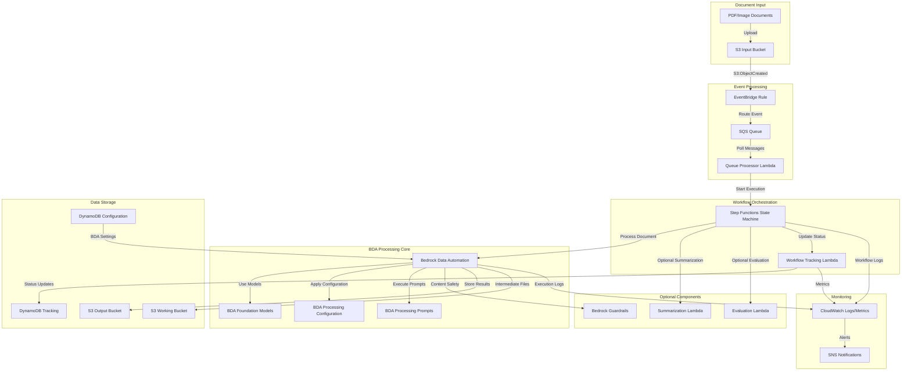
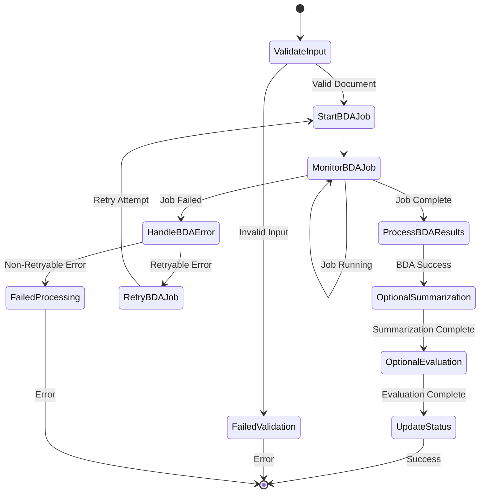

# Pattern 1: Bedrock Data Automation (BDA) Architecture

## Overview
Pattern 1 leverages Amazon Bedrock Data Automation (BDA) to provide end-to-end document processing capabilities. This pattern simplifies the architecture by using BDA's managed service to handle OCR, classification, and extraction in a single integrated workflow, reducing the number of custom Lambda functions while introducing unique security considerations.

## Pattern 1 Architecture Diagram



## BDA Processing Workflow

### Detailed Step Functions State Machine



## Component Security Analysis

### 1. Bedrock Data Automation Service

#### Capabilities & Features
- **End-to-End Processing**: Single service handles OCR, classification, and extraction
- **Managed Infrastructure**: AWS manages the underlying compute and storage
- **Foundation Model Integration**: Access to multiple Bedrock models (Claude, Nova, etc.)
- **Custom Configuration**: Configurable processing workflows and prompts
- **Batch Processing**: Supports high-volume document processing

#### Security Characteristics
- **Trust Level**: Managed AWS service (high trust)
- **Data Handling**: Processes customer documents with AWS-managed encryption
- **Model Access**: Uses customer's Bedrock model permissions
- **Logging**: AWS CloudTrail logs for API calls, CloudWatch for execution logs

#### Threat Vectors
1. **Service Abuse**
   - Quota exhaustion attacks via excessive job submissions
   - Resource consumption attacks through large document uploads
   - Cost amplification via expensive model usage

2. **Data Manipulation**
   - BDA configuration tampering to alter processing logic
   - Prompt injection through document content affecting model responses
   - Processing workflow manipulation to bypass security controls

3. **Information Disclosure**
   - Unauthorized access to BDA job results
   - Logging of sensitive information in CloudWatch
   - Cross-tenant data leakage (theoretical AWS service risk)

### 2. BDA Configuration Management

#### Configuration Elements
```yaml
BDA_Configuration:
  models:
    - id: "us.anthropic.claude-3-sonnet-20240229-v1:0"
      max_tokens: 4096
    - id: "us.amazon.nova-pro-v1:0"
      max_tokens: 2048
  
  processing_steps:
    - type: "document_analysis"
      model: "claude-3-sonnet"
      prompts:
        system: "You are a document analysis expert..."
        task: "Extract key information from this document..."
    
    - type: "classification"
      model: "nova-pro"
      classes: ["invoice", "contract", "bank_statement"]
    
    - type: "extraction"
      model: "claude-3-sonnet"
      schema: "custom_extraction_schema.json"
```

#### Security Concerns
- **Configuration Tampering**: Unauthorized changes to processing logic
- **Prompt Injection**: Malicious prompts affecting model behavior
- **Model Selection**: Unauthorized use of expensive or inappropriate models
- **Schema Manipulation**: Extraction schema tampering for data exfiltration

### 3. BDA Job Management

#### Job Lifecycle
1. **Job Creation**: Submit document and configuration to BDA
2. **Job Execution**: BDA processes document using specified models
3. **Job Monitoring**: Polling for job completion status
4. **Result Retrieval**: Download processed results from BDA
5. **Job Cleanup**: Clean up temporary resources and logs

#### Security Controls
- **IAM Permissions**: Strict IAM policies for BDA service access
- **Job Isolation**: Each job runs in isolated environment
- **Result Encryption**: Results encrypted in transit and at rest
- **Audit Logging**: Comprehensive logging of all BDA operations

## Pattern 1 Specific Threats

### High Severity Threats

#### T1.1: BDA Service Quota Exhaustion
- **Description**: Attacker submits numerous large documents to exhaust BDA service quotas
- **Impact**: Service unavailability, legitimate processing blocked
- **Likelihood**: Medium (requires knowledge of service limits)
- **Mitigations**: Rate limiting, queue throttling, monitoring quotas

#### T1.2: BDA Configuration Manipulation
- **Description**: Unauthorized modification of BDA processing configuration
- **Impact**: Data corruption, processing logic bypass, information disclosure
- **Likelihood**: Low (requires DynamoDB access)
- **Mitigations**: Configuration encryption, change detection, access controls

#### T1.3: Prompt Injection via Document Content
- **Description**: Malicious content in documents affects BDA model responses
- **Impact**: Extracted data manipulation, system instruction bypass
- **Likelihood**: High (direct document input)
- **Mitigations**: Input sanitization, Bedrock Guardrails, output validation

### Medium Severity Threats

#### T1.4: BDA Job Result Tampering
- **Description**: Manipulation of BDA job results before processing completion
- **Impact**: Incorrect processing outcomes, data integrity issues
- **Likelihood**: Low (requires S3 access during processing)
- **Mitigations**: Result validation, integrity checks, access logging

#### T1.5: Model Selection Abuse
- **Description**: Configuration changes to use expensive or inappropriate models
- **Impact**: Cost amplification, reduced performance, inappropriate processing
- **Likelihood**: Medium (configuration-dependent)
- **Mitigations**: Model usage policies, cost monitoring, configuration validation

#### T1.6: BDA Processing Logic Bypass
- **Description**: Manipulation of workflow to skip security-critical processing steps
- **Impact**: Incomplete processing, security control bypass
- **Likelihood**: Low (requires deep system knowledge)
- **Mitigations**: Workflow validation, step verification, audit trails

### Low Severity Threats

#### T1.7: BDA Logging Information Disclosure
- **Description**: Sensitive information exposure through BDA execution logs
- **Impact**: Information disclosure, privacy violations
- **Likelihood**: Medium (depends on logging configuration)
- **Mitigations**: Log sanitization, access controls, retention policies

#### T1.8: Cross-Job Data Leakage
- **Description**: Information from one BDA job affecting another job's processing
- **Impact**: Data contamination, privacy violations
- **Likelihood**: Very Low (AWS service isolation)
- **Mitigations**: AWS service trust, job isolation verification

## Pattern 1 Security Controls

### Preventive Controls

1. **Input Validation**
   - Document format validation before BDA submission
   - File size and content type restrictions
   - Malware scanning for uploaded documents

2. **Access Controls**
   - IAM roles with least privilege for BDA access
   - S3 bucket policies restricting BDA service access
   - DynamoDB access controls for configuration data

3. **Configuration Management**
   - Encrypted storage of BDA configurations
   - Version control for configuration changes
   - Validation of configuration parameters

### Detective Controls

1. **Monitoring & Logging**
   - CloudWatch metrics for BDA job execution
   - CloudTrail logging for BDA API calls
   - Anomaly detection for unusual processing patterns

2. **Audit & Compliance**
   - Regular review of BDA configurations
   - Processing result validation and verification
   - Cost and usage monitoring

### Responsive Controls

1. **Incident Response**
   - Automated alerts for BDA failures or anomalies
   - Job cancellation capabilities for suspicious processing
   - Quarantine procedures for problematic documents

2. **Recovery Procedures**
   - Backup and restore for BDA configurations
   - Document reprocessing capabilities
   - Service quota increase procedures

## Pattern 1 Advantages & Disadvantages

### Security Advantages
- **Reduced Attack Surface**: Fewer custom Lambda functions to secure
- **Managed Service Security**: AWS handles underlying infrastructure security
- **Integrated Processing**: Single service reduces integration vulnerabilities
- **Built-in Monitoring**: AWS provides comprehensive logging and monitoring

### Security Disadvantages
- **Limited Customization**: Less control over internal processing logic
- **Service Dependency**: Single point of failure for document processing
- **Opaque Processing**: Limited visibility into internal BDA operations
- **Configuration Complexity**: Complex configuration increases misconfiguration risks

## Compliance Considerations

### Data Residency
- BDA processing occurs within the selected AWS region
- No cross-region data transfer without explicit configuration
- Customer data remains under AWS customer control

### Audit Requirements
- All BDA API calls logged in CloudTrail
- Processing results stored with timestamps and metadata
- Configuration changes tracked and auditable

### Privacy Controls
- BDA supports customer-managed encryption keys
- No data retention by BDA service after job completion
- Customer controls all input and output data

## Pattern 1 Recommendations

### Immediate Security Improvements
1. Implement strict input validation for BDA submissions
2. Configure Bedrock Guardrails for all BDA model interactions
3. Set up comprehensive monitoring for BDA job execution
4. Implement configuration change detection and alerting

### Medium-term Enhancements
1. Develop custom validation for BDA processing results
2. Implement cost controls and quota monitoring
3. Create automated incident response for BDA anomalies
4. Establish regular security review processes for BDA configurations

### Long-term Strategic Improvements
1. Consider hybrid processing approach for high-sensitivity documents
2. Implement advanced anomaly detection for BDA processing patterns
3. Develop custom security controls for document content analysis
4. Establish comprehensive disaster recovery procedures for BDA processing

This Pattern 1 analysis provides the foundation for detailed threat modeling specific to Bedrock Data Automation workflows.
