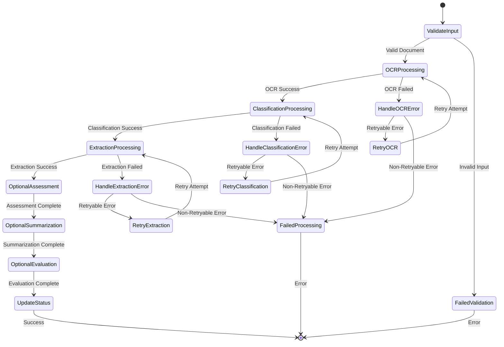

# Pattern 2: Textract + Bedrock Architecture

## Overview
Pattern 2 combines Amazon Textract for OCR processing with AWS Bedrock foundation models for classification and extraction. This pattern provides more granular control over each processing step compared to Pattern 1, allowing for custom logic and optimizations at each stage while introducing additional integration complexity and potential attack vectors.

## Pattern 2 Architecture Diagram

```mermaid
graph TB
    subgraph "Document Input"
        S3_INPUT[S3 Input Bucket]
        DOC[PDF/Image Documents]
    end
    
    subgraph "Event Processing"
        EB[EventBridge Rule]
        SQS[SQS Queue]
        LAMBDA_QUEUE[Queue Processor Lambda]
    end
    
    subgraph "Workflow Orchestration"
        SFN[Step Functions State Machine]
        LAMBDA_TRACK[Workflow Tracking Lambda]
    end
    
    subgraph "OCR Processing"
        LAMBDA_OCR[OCR Lambda Function]
        TEXTRACT[Amazon Textract]
        OCR_CONFIG[OCR Configuration]
    end
    
    subgraph "Classification Processing"
        LAMBDA_CLASS[Classification Lambda]
        BEDROCK_CLASS[Bedrock Models - Classification]
        CLASS_CONFIG[Classification Configuration]
        CLASS_PROMPTS[Classification Prompts]
        FEW_SHOT[Few-Shot Examples - Optional]
    end
    
    subgraph "Extraction Processing"
        LAMBDA_EXTRACT[Extraction Lambda]
        BEDROCK_EXTRACT[Bedrock Models - Extraction]
        EXTRACT_CONFIG[Extraction Configuration]
        EXTRACT_PROMPTS[Extraction Prompts]
        EXTRACT_SCHEMA[Extraction Schema]
    end
    
    subgraph "Optional Components"
        GUARDRAILS[Bedrock Guardrails]
        SUMMARIZATION[Summarization Lambda]
        EVALUATION[Evaluation Lambda]
        ASSESSMENT[Assessment Lambda]
    end
    
    subgraph "Data Storage"
        S3_OUTPUT[S3 Output Bucket]
        S3_WORK[S3 Working Bucket]
        DDB_TRACK[DynamoDB Tracking]
        DDB_CONFIG[DynamoDB Configuration]
    end
    
    subgraph "Monitoring"
        CW[CloudWatch Logs/Metrics]
        SNS[SNS Notifications]
    end

    %% Data Flow
    DOC -->|Upload| S3_INPUT
    S3_INPUT -->|S3:ObjectCreated| EB
    EB -->|Route Event| SQS
    SQS -->|Poll Messages| LAMBDA_QUEUE
    LAMBDA_QUEUE -->|Start Execution| SFN
    
    SFN -->|OCR Step| LAMBDA_OCR
    LAMBDA_OCR -->|Process Document| TEXTRACT
    TEXTRACT -->|OCR Results| S3_WORK
    LAMBDA_OCR -->|Configuration| OCR_CONFIG
    
    SFN -->|Classification Step| LAMBDA_CLASS
    LAMBDA_CLASS -->|Classify Content| BEDROCK_CLASS
    LAMBDA_CLASS -->|Apply Prompts| CLASS_PROMPTS
    LAMBDA_CLASS -->|Use Examples| FEW_SHOT
    LAMBDA_CLASS -->|Configuration| CLASS_CONFIG
    BEDROCK_CLASS -->|Content Safety| GUARDRAILS
    
    SFN -->|Extraction Step| LAMBDA_EXTRACT
    LAMBDA_EXTRACT -->|Extract Data| BEDROCK_EXTRACT
    LAMBDA_EXTRACT -->|Apply Schema| EXTRACT_SCHEMA
    LAMBDA_EXTRACT -->|Use Prompts| EXTRACT_PROMPTS
    LAMBDA_EXTRACT -->|Configuration| EXTRACT_CONFIG
    BEDROCK_EXTRACT -->|Content Safety| GUARDRAILS
    
    SFN -->|Optional Assessment| ASSESSMENT
    SFN -->|Optional Summarization| SUMMARIZATION
    SFN -->|Optional Evaluation| EVALUATION
    SFN -->|Update Status| LAMBDA_TRACK
    
    LAMBDA_EXTRACT -->|Store Results| S3_OUTPUT
    LAMBDA_TRACK -->|Status Updates| DDB_TRACK
    LAMBDA_TRACK -->|Metrics| CW
    
    %% Configuration flows
    DDB_CONFIG -->|Settings| OCR_CONFIG
    DDB_CONFIG -->|Settings| CLASS_CONFIG
    DDB_CONFIG -->|Settings| EXTRACT_CONFIG
    
    %% Monitoring flows
    LAMBDA_OCR -->|Execution Logs| CW
    LAMBDA_CLASS -->|Execution Logs| CW
    LAMBDA_EXTRACT -->|Execution Logs| CW
    SFN -->|Workflow Logs| CW
    CW -->|Alerts| SNS
```



## Pattern 2 Processing Workflow

### Detailed Step Functions State Machine



## Component Security Analysis

### 1. Amazon Textract Integration

#### OCR Processing Lambda Function
- **Purpose**: Orchestrates Textract API calls and result processing
- **Input**: PDF/Image documents from S3 Input Bucket
- **Output**: Structured OCR results (JSON format) to S3 Working Bucket
- **Configuration**: Textract features (LAYOUT, TABLES, FORMS, SIGNATURES)

#### Security Characteristics
- **IAM Permissions**: `textract:AnalyzeDocument`, `textract:DetectDocumentText`
- **Data Handling**: Processes potentially sensitive document content
- **Resource Limits**: Configurable timeout and memory allocation
- **Error Handling**: Retry logic for transient failures

#### Threat Vectors
1. **Malicious Document Processing**
   - PDF exploits targeting Textract service
   - Oversized documents causing resource exhaustion
   - Polyglot files with embedded malicious content

2. **OCR Result Manipulation**
   - Tampering with OCR results in S3 Working Bucket
   - Injection of malicious content into OCR JSON output
   - OCR confidence score manipulation

3. **Resource Abuse**
   - Lambda function timeout exploitation
   - Memory exhaustion through large documents
   - Textract API quota exhaustion

### 2. Bedrock Classification Integration

#### Classification Lambda Function
- **Purpose**: Uses Bedrock models to classify document types and create sections
- **Models**: Claude, Nova, or custom fine-tuned models
- **Methods**: 
  - **Holistic Classification**: Analyzes entire document package
  - **Page-Level Classification**: Classifies individual pages
- **Few-Shot Learning**: Optional use of example documents for improved accuracy

#### Classification Configuration
```yaml
classification:
  model: "us.anthropic.claude-3-sonnet-20240229-v1:0"
  temperature: 0.0
  classificationMethod: "textbasedHolisticClassification"
  system_prompt: "You are a document classification expert..."
  task_prompt: |
    <document-types>
    {CLASS_NAMES_AND_DESCRIPTIONS}
    </document-types>
    
    <<CACHEPOINT>>
    
    <document-text>
    {DOCUMENT_TEXT}
    </document-text>
  
  few_shot_examples:
    enabled: true
    max_examples: 3
    selection_method: "similarity_based"
```

#### Threat Vectors
1. **Prompt Injection Attacks**
   - Malicious content in documents affecting classification prompts
   - System prompt manipulation through configuration tampering
   - Few-shot example poisoning

2. **Classification Bypass**
   - Document structure manipulation to evade classification
   - Model evasion techniques using adversarial content
   - Classification confidence manipulation

3. **Model Abuse**
   - Excessive token usage for cost amplification
   - Model switching to expensive alternatives
   - Prompt template injection

### 3. Bedrock Extraction Integration

#### Extraction Lambda Function
- **Purpose**: Extracts structured data using Bedrock models and predefined schemas
- **Capabilities**: 
  - Simple attribute extraction
  - Group attribute extraction (nested structures)
  - List attribute extraction (arrays)
  - Multimodal extraction (text + images)

#### Extraction Schema Example
```yaml
classes:
  - name: "Bank Statement"
    attributes:
      - name: "Account Number"
        attributeType: "simple"
        description: "Primary account identifier"
        
      - name: "Account Holder Address"
        attributeType: "group"
        groupAttributes:
          - name: "Street Number"
          - name: "City"
          - name: "State"
          - name: "ZIP Code"
          
      - name: "Transactions"
        attributeType: "list"
        listItemTemplate:
          itemAttributes:
            - name: "Date"
            - name: "Description"
            - name: "Amount"
            - name: "Balance"
```

#### Threat Vectors
1. **Schema Manipulation**
   - Unauthorized changes to extraction schemas
   - Addition of malicious extraction attributes
   - Schema injection for data exfiltration

2. **Extraction Result Tampering**
   - Modification of extracted data before storage
   - Injection of malicious content into extraction results
   - Data type manipulation (e.g., changing numbers to text)

3. **Multimodal Exploitation**
   - Image-based prompt injection
   - Visual confusion attacks on document images
   - Steganographic content in document images

### 4. Few-Shot Learning Integration

#### Few-Shot Example Management
- **Storage**: Examples stored in DynamoDB configuration tables
- **Selection**: Similarity-based or random selection of examples
- **Validation**: Example content validation and sanitization
- **Updates**: Dynamic updating of few-shot examples

#### Security Concerns
1. **Example Poisoning**
   - Injection of malicious few-shot examples
   - Biased examples affecting model behavior
   - Example content manipulation

2. **Data Leakage**
   - Sensitive information in few-shot examples
   - Cross-customer example contamination
   - Example storage security

## Pattern 2 Specific Threats

### High Severity Threats

#### T2.1: Textract Document Exploit
- **Description**: Malicious PDF/image files targeting Textract service vulnerabilities
- **Impact**: Service disruption, potential code execution, data corruption
- **Likelihood**: Low (requires AWS service vulnerability)
- **Mitigations**: Document validation, file type restrictions, service monitoring

#### T2.2: Multi-Stage Prompt Injection
- **Description**: Coordinated prompt injection across OCR→Classification→Extraction chain
- **Impact**: Complete processing bypass, data manipulation, system compromise
- **Likelihood**: High (multiple injection points)
- **Mitigations**: Input sanitization, Bedrock Guardrails, output validation

#### T2.3: Lambda Function Code Injection
- **Description**: Exploitation of custom Lambda functions through malicious input
- **Impact**: Code execution, privilege escalation, data exfiltration
- **Likelihood**: Medium (depends on code quality)
- **Mitigations**: Input validation, secure coding practices, runtime monitoring

### Medium Severity Threats

#### T2.4: OCR Result Poisoning
- **Description**: Tampering with OCR results to affect downstream processing
- **Impact**: Incorrect classification and extraction, data integrity issues
- **Likelihood**: Low (requires S3 access during processing)
- **Mitigations**: Result integrity checks, access logging, encrypted storage

#### T2.5: Few-Shot Example Manipulation
- **Description**: Poisoning few-shot examples to bias model behavior
- **Impact**: Reduced accuracy, biased processing, potential data leakage
- **Likelihood**: Medium (requires configuration access)
- **Mitigations**: Example validation, access controls, monitoring changes

#### T2.6: Schema Injection Attack
- **Description**: Manipulation of extraction schemas to exfiltrate additional data
- **Impact**: Unauthorized data extraction, privacy violations
- **Likelihood**: Low (requires deep system access)
- **Mitigations**: Schema validation, change detection, access controls

### Low Severity Threats

#### T2.7: Model Token Exhaustion
- **Description**: Attacks designed to exhaust Bedrock model token quotas
- **Impact**: Service unavailability, increased costs
- **Likelihood**: Medium (requires sustained attack)
- **Mitigations**: Rate limiting, quota monitoring, cost controls

#### T2.8: Classification Evasion
- **Description**: Document crafting to evade or confuse classification logic
- **Impact**: Incorrect processing workflow, potential security bypass
- **Likelihood**: Medium (depends on classification robustness)
- **Mitigations**: Multiple classification methods, confidence thresholds, manual review

## Pattern 2 Security Controls

### Preventive Controls

1. **Input Validation & Sanitization**
   - Document format and content validation
   - File size and complexity limits
   - Malware scanning and content filtering
   - OCR result sanitization before downstream processing

2. **Prompt Security**
   - Static prompt templates with parameter substitution
   - Input sanitization for prompt parameters
   - Prompt injection detection and prevention
   - Bedrock Guardrails for content safety

3. **Configuration Security**
   - Encrypted storage of processing configurations
   - Schema validation and integrity checks
   - Few-shot example validation and sanitization
   - Access controls for configuration changes

### Detective Controls

1. **Processing Monitoring**
   - Token usage monitoring for cost and abuse detection
   - Processing time anomaly detection
   - Classification confidence monitoring
   - Extraction result validation

2. **Security Monitoring**
   - Prompt injection attempt detection
   - Unusual processing pattern detection
   - Configuration change monitoring
   - Failed authentication and authorization attempts

### Responsive Controls

1. **Incident Response**
   - Automated quarantine for suspicious documents
   - Processing pipeline shutdown capabilities
   - Malicious content isolation procedures
   - Incident escalation and notification

2. **Recovery Procedures**
   - Document reprocessing capabilities
   - Configuration rollback procedures
   - Data integrity verification and restoration
   - Service recovery and continuation

## Pattern 2 Advantages & Disadvantages

### Security Advantages
- **Granular Control**: Individual control over each processing step
- **Flexible Security**: Custom security controls at each stage
- **Transparent Processing**: Full visibility into processing logic
- **Customizable Validation**: Custom validation rules for each step

### Security Disadvantages
- **Complex Attack Surface**: Multiple integration points and custom code
- **Integration Vulnerabilities**: Potential issues in service-to-service communication
- **Configuration Complexity**: Multiple configuration files and settings
- **Maintenance Overhead**: More components to secure and monitor

## Compliance Considerations

### Data Flow Tracking
- Complete audit trail of document processing stages
- Intermediate result storage for compliance verification
- Processing metadata with timestamps and user context
- Data lineage tracking from input to output

### Privacy Controls
- Configurable data retention policies for intermediate results
- Personal data identification and handling procedures
- Data anonymization capabilities in processing pipeline
- Cross-border data transfer controls

## Pattern 2 Recommendations

### Immediate Security Improvements
1. Implement comprehensive input validation for all processing stages
2. Deploy Bedrock Guardrails for all model interactions
3. Set up monitoring for prompt injection attempts
4. Implement integrity checks for OCR results

### Medium-term Enhancements
1. Develop advanced prompt injection detection
2. Implement anomaly detection for processing patterns
3. Create automated security testing for Lambda functions
4. Establish comprehensive logging correlation

### Long-term Strategic Improvements
1. Implement zero-trust networking for Lambda-to-Lambda communication
2. Develop custom ML models for security threat detection
3. Create advanced configuration drift detection
4. Establish automated security remediation capabilities

This Pattern 2 analysis provides detailed security insights for the Textract + Bedrock processing workflow, highlighting the increased complexity and security considerations compared to Pattern 1.
