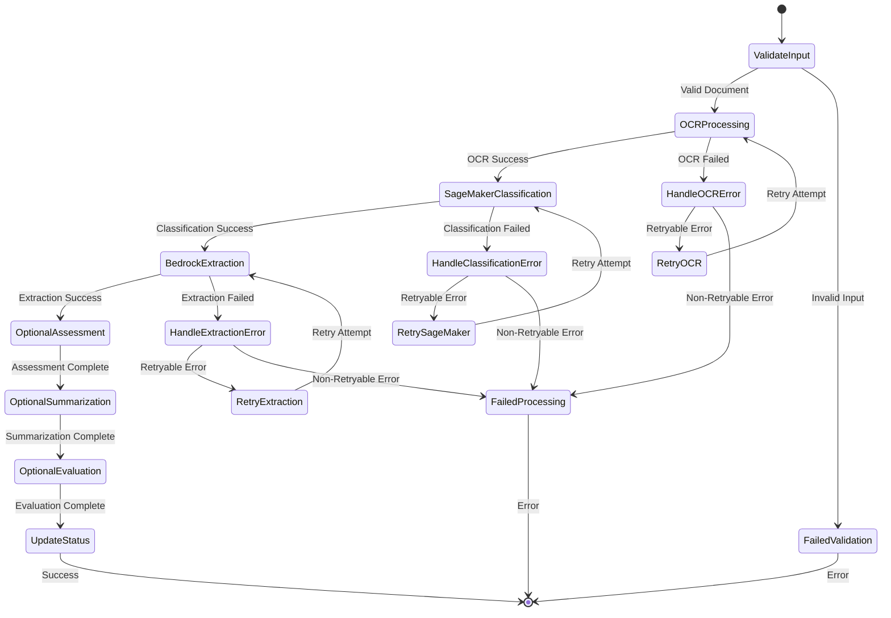
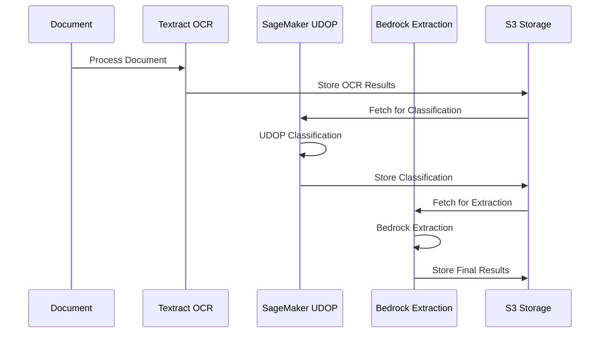

# Pattern 3: Textract + SageMaker + Bedrock Architecture

## Overview
Pattern 3 represents the most complex processing workflow, combining Amazon Textract for OCR, SageMaker-hosted UDOP models for document classification, and AWS Bedrock for data extraction. This pattern provides the highest level of customization and control but introduces the most complex attack surface with multiple AI/ML services, custom model endpoints, and intricate integration points.

## Pattern 3 Architecture Diagram

```mermaid
graph TB
    subgraph "Document Input"
        S3_INPUT[S3 Input Bucket]
        DOC[PDF/Image Documents]
    end
    
    subgraph "Event Processing"
        EB[EventBridge Rule]
        SQS[SQS Queue]
        LAMBDA_QUEUE[Queue Processor Lambda]
    end
    
    subgraph "Workflow Orchestration"
        SFN[Step Functions State Machine]
        LAMBDA_TRACK[Workflow Tracking Lambda]
    end
    
    subgraph "OCR Processing"
        LAMBDA_OCR[OCR Lambda Function]
        TEXTRACT[Amazon Textract]
        OCR_CONFIG[OCR Configuration]
    end
    
    subgraph "Classification Processing - SageMaker"
        LAMBDA_CLASS[Classification Lambda]
        SAGEMAKER_ENDPOINT[SageMaker UDOP Endpoint]
        UDOP_MODEL[UDOP Classification Model]
        CLASS_CONFIG[Classification Configuration]
        MODEL_ARTIFACTS[Model Artifacts S3]
    end
    
    subgraph "Extraction Processing - Bedrock"
        LAMBDA_EXTRACT[Extraction Lambda]
        BEDROCK_EXTRACT[Bedrock Models - Extraction]
        EXTRACT_CONFIG[Extraction Configuration]
        EXTRACT_PROMPTS[Extraction Prompts]
        EXTRACT_SCHEMA[Extraction Schema]
    end
    
    subgraph "Model Management"
        SAGEMAKER_TRAINING[SageMaker Training Jobs]
        MODEL_REGISTRY[SageMaker Model Registry]
        ENDPOINT_CONFIG[SageMaker Endpoint Config]
        AUTO_SCALING[SageMaker Auto Scaling]
    end
    
    subgraph "Optional Components"
        GUARDRAILS[Bedrock Guardrails]
        SUMMARIZATION[Summarization Lambda]
        EVALUATION[Evaluation Lambda]
        ASSESSMENT[Assessment Lambda]
    end
    
    subgraph "Data Storage"
        S3_OUTPUT[S3 Output Bucket]
        S3_WORK[S3 Working Bucket]
        S3_MODEL[S3 Model Storage]
        DDB_TRACK[DynamoDB Tracking]
        DDB_CONFIG[DynamoDB Configuration]
    end
    
    subgraph "Monitoring"
        CW[CloudWatch Logs/Metrics]
        SNS[SNS Notifications]
        SAGEMAKER_METRICS[SageMaker Model Metrics]
    end

    %% Data Flow
    DOC -->|Upload| S3_INPUT
    S3_INPUT -->|S3:ObjectCreated| EB
    EB -->|Route Event| SQS
    SQS -->|Poll Messages| LAMBDA_QUEUE
    LAMBDA_QUEUE -->|Start Execution| SFN
    
    SFN -->|OCR Step| LAMBDA_OCR
    LAMBDA_OCR -->|Process Document| TEXTRACT
    TEXTRACT -->|OCR Results| S3_WORK
    LAMBDA_OCR -->|Configuration| OCR_CONFIG
    
    SFN -->|Classification Step| LAMBDA_CLASS
    LAMBDA_CLASS -->|Invoke Model| SAGEMAKER_ENDPOINT
    SAGEMAKER_ENDPOINT -->|Run Inference| UDOP_MODEL
    LAMBDA_CLASS -->|Configuration| CLASS_CONFIG
    
    SFN -->|Extraction Step| LAMBDA_EXTRACT
    LAMBDA_EXTRACT -->|Extract Data| BEDROCK_EXTRACT
    LAMBDA_EXTRACT -->|Apply Schema| EXTRACT_SCHEMA
    LAMBDA_EXTRACT -->|Use Prompts| EXTRACT_PROMPTS
    LAMBDA_EXTRACT -->|Configuration| EXTRACT_CONFIG
    BEDROCK_EXTRACT -->|Content Safety| GUARDRAILS
    
    SFN -->|Optional Assessment| ASSESSMENT
    SFN -->|Optional Summarization| SUMMARIZATION
    SFN -->|Optional Evaluation| EVALUATION
    SFN -->|Update Status| LAMBDA_TRACK
    
    LAMBDA_EXTRACT -->|Store Results| S3_OUTPUT
    LAMBDA_TRACK -->|Status Updates| DDB_TRACK
    LAMBDA_TRACK -->|Metrics| CW
    
    %% Model Management flows
    S3_MODEL -->|Model Artifacts| SAGEMAKER_ENDPOINT
    MODEL_REGISTRY -->|Model Versions| SAGEMAKER_ENDPOINT
    ENDPOINT_CONFIG -->|Configuration| SAGEMAKER_ENDPOINT
    AUTO_SCALING -->|Scaling| SAGEMAKER_ENDPOINT
    
    %% Configuration flows
    DDB_CONFIG -->|Settings| OCR_CONFIG
    DDB_CONFIG -->|Settings| CLASS_CONFIG
    DDB_CONFIG -->|Settings| EXTRACT_CONFIG
    
    %% Monitoring flows
    LAMBDA_OCR -->|Execution Logs| CW
    LAMBDA_CLASS -->|Execution Logs| CW
    LAMBDA_EXTRACT -->|Execution Logs| CW
    SAGEMAKER_ENDPOINT -->|Model Metrics| SAGEMAKER_METRICS
    SAGEMAKER_METRICS -->|Metrics| CW
    SFN -->|Workflow Logs| CW
    CW -->|Alerts| SNS
```



## Pattern 3 Processing Workflow

### Detailed Step Functions State Machine



## Component Security Analysis

### 1. SageMaker UDOP Integration

#### SageMaker Endpoint Architecture
- **Model**: UDOP (Unified Document Processing) for multimodal document classification
- **Deployment**: Real-time inference endpoint with configurable instance types
- **Scaling**: Auto-scaling based on invocation metrics and custom rules
- **Security**: VPC isolation, IAM role-based access, endpoint encryption

#### UDOP Model Characteristics
```yaml
UDOP_Model_Config:
  framework: "PyTorch"
  model_type: "multimodal_transformer"
  input_types: ["text", "image", "layout"]
  output_type: "classification_probabilities"
  
  endpoint_config:
    instance_type: "ml.g4dn.xlarge"
    initial_instance_count: 1
    min_capacity: 0
    max_capacity: 10
    scaling_policy: "target_tracking"
    
  security_config:
    enable_network_isolation: true
    vpc_config:
      subnets: ["subnet-xxx", "subnet-yyy"]
      security_groups: ["sg-sagemaker-endpoint"]
    kms_key_id: "arn:aws:kms:region:account:key/xxx"
```

#### SageMaker-Specific Threat Vectors
1. **Model Endpoint Exploitation**
   - Direct endpoint access bypass
   - Model inference manipulation
   - Endpoint resource exhaustion
   - Unauthorized model invocation

2. **Model Poisoning Attacks**
   - Training data contamination
   - Adversarial model updates
   - Model artifact tampering
   - Backdoor injection in models

3. **Infrastructure Attacks**
   - VPC network infiltration
   - Instance compromise through vulnerabilities
   - Storage volume attacks
   - Container runtime exploitation

### 2. UDOP Classification Lambda Function

#### Function Architecture
- **Purpose**: Orchestrates SageMaker endpoint invocations for document classification
- **Input Processing**: Converts OCR results to UDOP-compatible format
- **Output Processing**: Converts UDOP probabilities to classification decisions
- **Error Handling**: Comprehensive retry logic with exponential backoff

#### Classification Processing Flow
```python
# Pseudo-code for UDOP classification process
def classify_document(ocr_results, document_images):
    # Prepare multimodal input
    text_features = extract_text_features(ocr_results)
    image_features = preprocess_images(document_images)
    layout_features = extract_layout_features(ocr_results)
    
    # Format for UDOP model
    model_input = {
        "text": text_features,
        "image": image_features,
        "layout": layout_features,
        "attention_mask": generate_attention_mask()
    }
    
    # Invoke SageMaker endpoint
    response = sagemaker_client.invoke_endpoint(
        EndpointName=endpoint_name,
        Body=json.dumps(model_input),
        ContentType="application/json"
    )
    
    # Process classification results
    probabilities = json.loads(response['Body'].read())
    return process_classification_results(probabilities)
```

#### Threat Vectors
1. **Multimodal Input Manipulation**
   - Text feature poisoning
   - Image adversarial attacks
   - Layout structure manipulation
   - Attention mask tampering

2. **Endpoint Communication Attacks**
   - Man-in-the-middle attacks on endpoint communication
   - Payload injection in model requests
   - Response tampering and substitution
   - Communication protocol exploitation

3. **Resource Abuse**
   - Endpoint overload through excessive requests
   - Large payload attacks causing memory exhaustion
   - Concurrent request flooding
   - Cost amplification through expensive inference calls

### 3. Advanced Model Management

#### SageMaker Model Registry Integration
- **Model Versioning**: Automated versioning of trained UDOP models
- **Model Approval**: Multi-stage approval workflow for production deployment
- **Model Monitoring**: Performance and drift monitoring for deployed models
- **A/B Testing**: Canary deployment and testing capabilities

#### Model Lifecycle Security
```yaml
Model_Lifecycle:
  training:
    security_controls:
      - "Training data encryption"
      - "Training job isolation"
      - "Model artifact encryption"
      - "Training metrics monitoring"
  
  registration:
    approval_workflow:
      - "Automated security scanning"
      - "Performance validation"
      - "Manual security review"
      - "Compliance verification"
  
  deployment:
    deployment_controls:
      - "Blue/green deployment"
      - "Canary testing"
      - "Performance monitoring"
      - "Rollback capabilities"
  
  monitoring:
    ongoing_monitoring:
      - "Model drift detection"
      - "Performance degradation alerts"
      - "Security anomaly detection"
      - "Usage pattern analysis"
```

#### Threat Vectors
1. **Model Supply Chain Attacks**
   - Compromised training data sources
   - Malicious model dependencies
   - Contaminated base model artifacts
   - Supply chain injection attacks

2. **Model Registry Manipulation**
   - Unauthorized model version uploads
   - Model approval bypass
   - Metadata tampering
   - Version rollback attacks

3. **Deployment Pipeline Attacks**
   - CI/CD pipeline compromise
   - Model deployment hijacking
   - Configuration tampering
   - Infrastructure-as-code attacks

### 4. Hybrid Processing Integration

#### Multi-Service Orchestration
The combination of Textract, SageMaker, and Bedrock creates complex integration challenges:



#### Integration Security Challenges
1. **Cross-Service Data Integrity**
   - Data tampering between service calls
   - Inconsistent data formats across services
   - Race conditions in multi-service processing
   - Service-specific security control gaps

2. **Complex Attack Chains**
   - Multi-stage attacks across service boundaries
   - Privilege escalation through service integration
   - Complex attack attribution and forensics
   - Coordinated attacks on multiple services

## Pattern 3 Specific Threats

### Critical Severity Threats

#### T3.1: SageMaker Endpoint Compromise
- **Description**: Complete compromise of SageMaker endpoint through infrastructure vulnerabilities
- **Impact**: Model manipulation, data exfiltration, infrastructure control
- **Likelihood**: Low (requires sophisticated attack)
- **Mitigations**: VPC isolation, network monitoring, endpoint encryption, regular security updates

#### T3.2: UDOP Model Poisoning
- **Description**: Injection of backdoors or biases into UDOP classification model
- **Impact**: Systematic classification errors, data manipulation, security bypass
- **Likelihood**: Medium (supply chain risks)
- **Mitigations**: Model validation, secure training pipeline, artifact integrity checks

#### T3.3: Multi-Service Attack Chain
- **Description**: Coordinated attack exploiting vulnerabilities across Textract→SageMaker→Bedrock
- **Impact**: Complete processing pipeline compromise, data exfiltration
- **Likelihood**: Medium (complex but high-value target)
- **Mitigations**: Defense in depth, service isolation, comprehensive monitoring

### High Severity Threats

#### T3.4: Adversarial Document Attacks
- **Description**: Specially crafted documents designed to fool UDOP classification
- **Impact**: Classification bypass, incorrect processing workflow, potential security bypass
- **Likelihood**: High (documented attack methods exist)
- **Mitigations**: Adversarial training, input validation, confidence thresholds

#### T3.5: Inference Endpoint Resource Exhaustion
- **Description**: Resource exhaustion attacks targeting SageMaker endpoint availability
- **Impact**: Service denial, cost amplification, legitimate processing disruption
- **Likelihood**: Medium (requires endpoint access)
- **Mitigations**: Rate limiting, auto-scaling limits, monitoring, cost controls

#### T3.6: Model Extraction Attack
- **Description**: Attempts to reverse-engineer or extract UDOP model through inference queries
- **Impact**: Intellectual property theft, competitive advantage loss
- **Likelihood**: Medium (requires sustained access)
- **Mitigations**: Query rate limiting, output randomization, access monitoring

### Medium Severity Threats

#### T3.7: Cross-Service Data Leakage
- **Description**: Information leakage between processing stages due to insufficient isolation
- **Impact**: Data contamination, privacy violations, incorrect processing
- **Likelihood**: Low (depends on implementation)
- **Mitigations**: Service isolation, data sanitization, access controls

#### T3.8: Model Drift Exploitation
- **Description**: Exploitation of model performance degradation over time
- **Impact**: Reduced accuracy, potential security bypass through classification errors
- **Likelihood**: Medium (natural model degradation)
- **Mitigations**: Model monitoring, automatic retraining, performance alerts

#### T3.9: Configuration Drift Attacks
- **Description**: Gradual modification of SageMaker endpoint or model configurations
- **Impact**: Performance degradation, security control bypass, cost increases
- **Likelihood**: Low (requires sustained access)
- **Mitigations**: Configuration monitoring, change detection, automated remediation

## Pattern 3 Security Controls

### Preventive Controls

1. **Model Security**
   - Secure model training with encrypted data
   - Model artifact integrity verification
   - Secure model registry with approval workflows
   - Adversarial training for robustness

2. **Endpoint Security**
   - VPC isolation for SageMaker endpoints
   - Encryption in transit and at rest
   - IAM role-based access control
   - Network access control lists

3. **Integration Security**
   - Service-to-service authentication
   - Data encryption between services
   - Input validation at each stage
   - Output sanitization and validation

### Detective Controls

1. **Model Monitoring**
   - Model performance monitoring
   - Drift detection and alerting
   - Anomaly detection in inference patterns
   - Cost and usage monitoring

2. **Security Monitoring**
   - Endpoint access monitoring
   - Unusual inference pattern detection
   - Cross-service communication monitoring
   - Failed authentication tracking

3. **Infrastructure Monitoring**
   - VPC flow logs analysis
   - CloudTrail audit logging
   - Resource utilization monitoring
   - Security group change monitoring

### Responsive Controls

1. **Incident Response**
   - Automated endpoint isolation capabilities
   - Model rollback procedures
   - Processing pipeline shutdown
   - Forensic data collection

2. **Recovery Procedures**
   - Model backup and restore
   - Endpoint recreation procedures
   - Data integrity verification
   - Service continuity planning

## Pattern 3 Advantages & Disadvantages

### Security Advantages
- **Advanced Classification**: UDOP provides state-of-the-art document understanding
- **Customizable Models**: Full control over classification model training and deployment
- **Flexible Architecture**: Granular control over each processing component
- **Comprehensive Monitoring**: Deep visibility into model performance and behavior

### Security Disadvantages
- **Complex Attack Surface**: Multiple AI/ML services with unique vulnerabilities
- **Model Management Overhead**: Significant security overhead for model lifecycle
- **Integration Complexity**: Complex service interactions increase risk
- **Operational Complexity**: Requires expertise in multiple AWS services and ML security

## Compliance Considerations

### Model Governance
- Model version control and audit trails
- Training data lineage and governance
- Model approval and deployment controls
- Performance and bias monitoring

### Data Protection
- Multi-service data encryption strategies
- Cross-service data flow monitoring
- Personal data handling across ML pipeline
- Data residency compliance across services

## Pattern 3 Recommendations

### Immediate Security Improvements
1. Implement VPC isolation for all SageMaker endpoints
2. Deploy comprehensive monitoring for model inference patterns
3. Establish secure model deployment pipelines
4. Implement adversarial robustness testing

### Medium-term Enhancements
1. Develop automated model security scanning
2. Implement advanced anomaly detection for multi-service patterns
3. Create model drift monitoring and automatic retraining
4. Establish comprehensive incident response procedures

### Long-term Strategic Improvements
1. Implement zero-trust architecture for ML pipeline
2. Develop custom security controls for UDOP-specific threats
3. Create advanced threat modeling for ML supply chain
4. Establish ML security center of excellence

This Pattern 3 analysis provides comprehensive security insights for the most complex processing workflow, highlighting the unique challenges and security considerations of integrating multiple AI/ML services.
